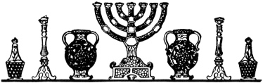

  
[Intangible Textual Heritage](../../index)  [Judaism](../index) 
[Index](index)  [Previous](uh23)  [Next](uh25) 

------------------------------------------------------------------------

[Buy this Book at
Amazon.com](https://www.amazon.com/exec/obidos/ASIN/B000BD19YW/internetsacredte)

------------------------------------------------------------------------

  
*The Union Haggadah*, ed. by The Central Council of American Rabbis
\[1923\], at Intangible Textual Heritage

------------------------------------------------------------------------

p. 139

 

### Preparations for Passover

#### A. TIME OF THE FEAST.

Though the Bible calls for the observance of Passover for seven days,
the changing conditions of Jewish life before the fall of Jerusalem (70
C.E.) produced an eighth day of the Feast. As the calendar was not yet
established, the Sanhedrin, exercising its religious authority,
proclaimed each New Moon ("Rosh Ḥodesh"), and thereby regulated the
dates of the festivals. However, its decisions were not always conveyed
to the distant Jewish settlements in time to celebrate the holy days at
the right season. To obviate this difficulty, the Jewish communities,
outside of Palestine, added an extra day to each festival. When a
permanent calendar was finally framed by Hillel II, in 360 C. E., and
the dates of the holy days were no longer in doubt, the Rabbis of
Babylonia wished to drop the second day of festivals, but they were
advised by the Palestinian authorities not to break an established
custom. Reform Judaism, recognizing that this custom causes needless
hardship to Jewish people, in commercial and industrial centers,
abolished the second day of festivals. Accordingly reform Jews,
following the biblical law, keep Passover seven days, beginning on the
eve of the 15th and ending on the 21st of Nisan. The first and last days
are holy days on which divine services are held in the synagogues. The
intervening days, known as "Ḥol Hamoed" are half-holy days.

p. 140

#### B. MATZO-BAKING.

With the cessation of the sacrificial cult the original distinction
between the feast of Pesaḥ and that of Matzos disappeared to all
practical purposes. The prominent feature of the feast came to be the
eating of matzo. "The eating of matzo during Passover, unlike the
prohibition against eating ḥometz, is not imperative; it is a voluntary
act (‘r’shus’). That is, a Jew may abstain from eating both ḥometz and
matzo, except on the first eve, when the eating of matzo is obligatory
(‘ḥovoh’)". Matzo may be made of flour of wheat, barley, spelt, oats, or
rye. Special care must be exercised in kneading and baking to prevent
the fermentation of the dough. "In the early centuries matzo-baking was
done by the wife daily, for the household use. In the middle ages
preparations were made to bake matzos thirty days before Passover,
except the Matzo Sh’miroh ('observance Matzo', prepared with special
care for use on the Passover eve by men of extreme piety), which was
baked in the afternoon of the 14th of Nisan, at a time when the Passover
lamb was formerly sacrificed. Still later, when the community had a
communal oven, it was incumbent on the lord of the house to superintend
the matzo-baking for his family. . . . About 1875 matzo-baking machinery
was invented in England, and soon after introduced into America", where
it became an important industry. To keep the matzo from rising and
swelling in baking, it was perforated after being rolled into shape, by
means of a 'reidel', or wheel provided with sharp teeth and attached to
a handle. "The perforator, usually a youth, would run his reidel through
the matzo in lines crossed at right angles and about one inch apart. The
matzo-machine

p. 141

has an automatic perforator that makes lines at intervals of a half
inch." [\*](#fn_17)

#### C. REMOVING THE LEAVEN.

While the law regarding unleavened bread is simple, the prohibitions of
the use of leaven, or ḥometz, during the Pesaḥ week, grew exceedingly
complex. Rabbinical law forbids not only the eating of leavened bread
but also the derivation of any benefit from it. Every trace of leaven
has to be removed before the feast sets in. Hence there arose the quaint
ceremony of "b’dikas ḥometz—searching for leaven", still observed by
orthodox Jews. On the eve of the 14th of Nisan, i.e. on the night before
Passover eve, after the evening service, the head of the house deposits
crumbs of bread in conspicuous places, on window sills or open shelves,
and, taking a wooden spoon in one hand and a few feathers in the other,
begins the naive "search for leaven". The children enjoy the privilege
of following him with a lighted taper. Blessing God for the command of
removing the leaven, he proceeds, in strict silence, to sweep the crumbs
into the wooden spoon with the feathers. When the task is done, he makes
this solemn declaration, in Aramaic: "All manner of leaven that is in my
possession, which I have not seen or removed, shall be as naught, and
accounted as the dust of the earth". He then ties the spoon, feathers
and leaven in one bundle and deposits it in a safe place. The following
morning, after breakfast, he proceeds to burn the bundle of ḥometz. This
ceremony, known as "bi‘ur ḥometz—destruction of the leaven", is preceded
by a declaration, similar to that

p. 142

made on the night before, disclaiming responsibility for any leaven that
may still be found on the premises.

The Jewish mystics read a higher meaning into this as into all other
ceremonies. Regarding ḥometz as the symbol of sordidness and corruption,
they beheld in the ceremony of its removal a summons to man to destroy
the evil of his heart.

#### D. "KASHERING" THE UTENSILS.

It is also customary among orthodox Jews to put away, for the period of
the feast, all dishes and kitchen utensils that are used for the ḥometz,
and to replace them with new ones or with such as are especially kept
for Pesaḥ. Some vessels are retained for the holiday after undergoing
the process of "kashering", i.e. of being made fit for Passover use:
glass-ware and porcelain are dipped into boiling water, and iron vessels
are passed through fire and made hot.

Reform Judaism does not consider these practices essential to the proper
observance of the Passover.

------------------------------------------------------------------------

### Footnotes

[141:\*](uh24.htm#fr_17) J. D. Eisenstein art.
"Mazza" in the Jewish Encyclopedia, vol. VIII, pp. 393-396.

------------------------------------------------------------------------

[Next: Survivals of the Ancient Passover](uh25)
