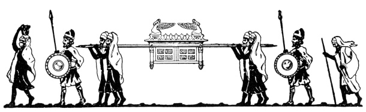

  
[Intangible Textual Heritage](../../index)  [Judaism](../index.md) 
[Index](index)  [Previous](uh26)  [Next](uh28.md) 

------------------------------------------------------------------------

[Buy this Book at
Amazon.com](https://www.amazon.com/exec/obidos/ASIN/B000BD19YW/internetsacredte.md)

------------------------------------------------------------------------

  
*The Union Haggadah*, ed. by The Central Council of American Rabbis
\[1923\], at Intangible Textual Heritage

------------------------------------------------------------------------

p. 151

 

### Reform Judaism and Passover

One thing to me is clear: namely, the urgent present duty of all Liberal
Jews to observe the Passover. And when I say "to observe" it, I mean to
observe it properly with its ancient symbolism and its ancient forms.
This means that Liberal Jews must (a) observe the first and seventh day
of Passover as days of "rest" and worship; (b) observe the old
ceremonial whereby for seven days unleavened bread is eaten at meals. It
is also eminently desirable to retain in some modified form the domestic
service upon the first night of the festival. . . The Passover
celebrates the beginning of the self-consciousness of Israel; the
setting forth of Israel upon its mission.. It is the festival which
commemorates the giving of a charge, the founding of a mission, the
institution of a brotherhood, which were intended to spread the
knowledge of God throughout the world.

Again, the Passover is the festival of liberty—liberty in political
life, liberty in moral life, liberty in religious life. How immense the
range!

But what is Liberty? It is freedom through law. Passover leads on to
Pentecost, the festival which celebrates the giving of the Law.

Claude Montefiore, Outlines of Liberal Judaism, p.
254-6.

p. 152

#### ISRAEL'S JOURNEY.

Long must be thy journey, O Israel, jubilee-crowned, long must it still
continue! But wearied, wearied thou wilt never be! Still in thy native
strength dost thou stand, O incomparable one! Still does the youthful
blood flow lustily in thy veins! Still awaitest thou with the glowing
ardor of battle, the countless hosts thou wilt in the end marshal for
thy God. Nor, having marked the path which thou hast trod, can we ever
doubt thy signal victory at last. Rejoice, then, in thy natal feast, O
Israel, and take from us anew our solemn vows to cling unto thee with
undying love and faith for ever!

David Einhorn, Sinai, vol. 1.

#### FREEDOM.

The high aim sanctified by time and by Judaism is, that all men be free,
all recognize God, all employ their spiritual and material powers with
full and free desire, so that a throne be built for truth and justice on
this earth, a throne which shall adorn the lowliest hut as well as the
most glorious palace.

Samuel Hirsch, The Reform Movement in Judaism, by
David Philipson, p. 487.

Freedom is the indispensable condition of goodness’ virtue, purity and
holiness. . .Take away freedom from human nature and whatever remains of
it is an anomaly, some nameless thing of human form and animal
indifference. "Wisdom and cognition", of which the prophet speaks as
"the stability of thy times and the fort of thy salvation", are the
golden fruits of the free reason, the free-willed man only; they ripen
not in the dark and dismal dungeon of the enslaved soul.

Isaac Mayer Wise, Sermons by American Rabbis, 1896,
p. 181.

p. 153

#### THE SEASON OF JOY.

However burdensome the Passover minutiae, especially in regard to the
prohibition of leaven, became to the Jewish [household](errata.htm#1.md),
the predominant feature was always an exuberance of joy. In the darkest
days of medievalism the synagogue and home resounded with song and
thanksgiving, and the young imbibed the joy and comfort of their elders
through the beautiful symbols of the feast and the richly adorned tale
of the deliverance (the Haggadah). The Passover feast with its "night of
divine watching" endowed the Jew ever anew with endurance during the
dark night of medieval tyranny, and with faith in "the Keeper of Israel
who slumbereth not nor sleepeth". Moreover, as the spring-tide of nature
fills each creature with joy and hope, so Israel's feast of redemption
promises the great day of liberty to those who still chafe under the
yoke of oppression. The modern Jew is beginning to see in the
reawakening of his religious and social life in western lands the token
of the future liberation of all mankind. The Passover feast brings him
the clear and hopeful message of freedom for humanity from all bondage
of body and of spirit.

Kaufman Kohler, Jewish Theology, p. 462.

#### THE SECRET OF THE FEAST.

The great redemption holds us with its fascination, but only to bid our
hearts go out to all the history of our race. This people "saved of the
Lord with an everlasting salvation"—this people that gave the world
Moses and the Prophets and the Saints, that has lived and died for God's
truth—this people, we say, is ours. We are the sharers of its glories
and its humiliations, the heirs to its divine promise and its sublime
ideals. This people, we say moreover, began its life with a

p. 154

protest against wrong. It has lived its life protesting against wrong.
And it has done so by moral force alone. Inherently weak, it has been
made mighty by its cause, so that "no weapon formed against it has
prospered"—neither persecution nor calumny, neither the sword nor the
stake, neither the world's enticements nor the persuasive arts of an
alien priesthood. Powerful nations have tried to destroy it; but they
have perished, while their would-be victim has lived on. We who seemed
"appointed to die" are the living history of the dead nations; for their
annals are written with pen of iron upon the sacred soul of our race.
"This", we cry, "is the finger of God". A people is not thus wondrously
preserved to live aimlessly. Still is God's mighty arm outstretched. "As
in the days of our coming forth out of the land of Egypt God will show
us marvelous things".

Morris Joseph, The Message of Judaism, pp.
101-2.

------------------------------------------------------------------------

[Next: The Haggadah](uh28.md)
