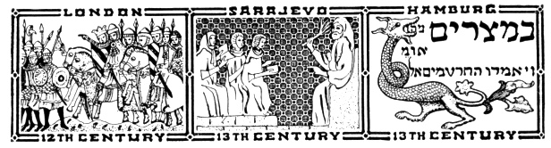
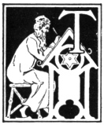
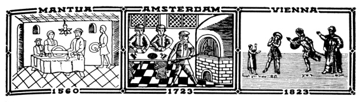
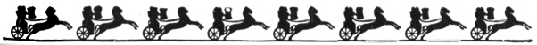

  
[Intangible Textual Heritage](../../index)  [Judaism](../index) 
[Index](index)  [Previous](uh27) 

------------------------------------------------------------------------

[Buy this Book at
Amazon.com](https://www.amazon.com/exec/obidos/ASIN/B000BD19YW/internetsacredte)

------------------------------------------------------------------------

  
*The Union Haggadah*, ed. by The Central Council of American Rabbis
\[1923\], at Intangible Textual Heritage

------------------------------------------------------------------------

p. 155

 

### The Haggadah

#### A. THE GROWTH OF ITS LITERATURE.

|                    |
|--------------------|
|  |

THE Haggadah, like the feast which it celebrates, is the slow growth of
centuries, re-echoing battle-cries of Israel's heroic struggle for life
and for freedom. Its oldest stratum consists of the Hallel [\*](#fn_23) wherein triumphal songs, celebrating the
deliverance from Egypt, mingle with supplications for Israel's future
well-being. These were intoned, at the Temple of Jerusalem, by the
Levitical choirs, during the preparation of the paschal sacrifices and
were subsequently sung at the table after the festive family meal. Of
high antiquity, too, are the blessings over the wine, the Kiddush, the
four questions and their answers, based on Deuteronomy XXVI: 5-9. During
the century that followed the destruction of the Temple (in the year 70
C.E.), important additions were made to the Haggadah, including the
homily of Rabban Gamaliel, the composite prayer of Rabbi Tarfon and
Rabbi Akiba asking for the reestablishment of the sacrificial service,
the complete grace after the meal and the Birkas Hashir. [\*\*](#fn_24)

p. 156

 

As the struggle against the Roman Pharaohs grew in intensity, the Jewish
people welcomed into the Haggadah the mathematical disquisitions of the
Rabbis Jose the [Galilean](errata.htm#2), Eliezer and Akiba regarding
the number of plagues that were visited upon Egypt. As a protest against
their revilers and tormentors, they also embodied into the Pesaḥ ritual
the biblical imprecations against the heathens that know not God and
devour Jacob and lay waste his habitation. [\*](#fn_25)

The character of the Haggadah was further affected by the theological
ideas which Judaism was called upon to combat. An echo of its conflict
with early Christianity is found in the strong emphasis laid in the
Haggadah on the fact that Israel's deliverance was effected by God in
person, without the aid of intermediaries. The further struggle of
Judaism against Karaism left a marked impress upon the very structure of
the book. On the theory that he who dwells at length on the story of the
Passover is praiseworthy, it became customary to include in the
Haggadah, passages from the early Midrashic and the Talmudic writings,
dealing with the Exodus. In the eighth century, when the Karaitic sect,
in its opposition to Rabbinism, excluded these and other passages from
the ritual, the masters of the Babylonian academies (the Geonim) took
steps to standardize the homiletical sections of the Haggadah. While

p. 157

the service retained its elasticity for several more generations (as
evidenced from Saadia Gaon's and Maimonides’ Haggadahs [\*](#fn_26)) the text as drawn up by Ray Amram (about
850 C.E.)was adopted by Spanish Jewry and became the standard for all
Israel.

The subsequent additions to the Haggadah consist of its poetic numbers.
When the Haggadah began to circulate in separate book form (in the 13th
century), it was enriched by Joseph Toy Elem's poem "Ḥasal Siddur Pesaḥ"
(The Order of the Pesaḥ Service is Complete), Jannai's "Vay'hi Ba-ḥatzi
Hallay’lo" (And it Came to Pass at Midnight), and Eliezer Ha-Kalir's
"Va-Amartem Zevaḥ Pesaḥ" (And Ye Shall Say: This is the Passover
Sacrifice), compositions originally written for other purposes. In the
fifteenth century the two anonymous ditties "Addir Hu" and "Ki Lo Noeh"
were added. About the same time the folk-songs "Eḥod Mi Yodea"and "Ḥad
Gadyo" became part of the service, largely under German influence. The
Sephardim have refused to admit them into their ritual. The cumulative
effect of the varied literature of the Haggadah, of "the curious medley
of legends and songs" and prayers, captivated the hearts of many
generations of our people and filled them with a sense of special
privilege of being part of Israel, the champion of God and of liberty.

#### B. REFORM JUDAISM AND THE HAGGADAH.

It was but natural for reform Judaism, which found itself at variance
with a number of passages in the Haggadah, to construct a ritual for
Pesaḥ eve in keeping with its religious principles. Among the German
attempts, in this direction, are Leopold Stein's ritual (1841), David
Einhorn's (in his Gebetbuch "Olas Tomid", 1858) and S. Maybaum's (1893).
An English Haggadah

p. 158

by H.M. Bien, misnamed "Easter Eve", appeared in 1886. The first edition
of the Union Prayerbook (1892) contained a ritual for the Seder, based
on Leopold Stein's German work. After its elimination from the
subsequent editions of the Union Prayerbook, it was published by its
author, I. S. Moses, in separate book form. In 1908, the Central
Conference of American Rabbis issued the Union Haggadah. The work was
executed in a modern spirit, no longer regarding "rites and symbols with
the awe that vested them with mystic meaning, or supernatural sanction",
but treating them rather as "potent object-lessons of great events and
of sublime principles hallowed and intensified in meaning by ages of
devout usage". Among the poetic additions to the Haggadah were Leopold
Stein's "The Festive Cup" and Jannai's poem "Vay’hi Ba-ḥatzi Hallay’lo"
both translated by Rabbi Henry Berkowitz, and Rabbi G. Gottheil's hymn
"God of Might." The volume also contained the familiar Passover music,
as edited by the Society of American Cantors, and the setting for "The
Festive Cup", composed by the Rev. William Lowenberg.

The aim of the present edition of the Union Haggadah is stated in the
introduction. The Committee on Revision reedited both the Hebrew and the
English texts of the Union Haggadah and added the following musical
numbers: "The Springtide of the Year" by Alice Lucas with the
traditional music, as published in the Union Hymnal; "To Thee Above" by
James K. Gutheim, with music specially written for it by Hugo Brandt;
the traditional "Kiddush" melody with an accompaniment supplied by Rabbi
Jacob Singer; traditional settings for Psalms CXIII and CXIV, arranged
by D. M. Davis, and the Sephardic Hallel (Psalm CXVII) from F. L.
Cohen's "Voice of Prayer and Praise"; a variation of the "Addir Hu"

p. 159

melody for Psalm CXVIII: 1-4; F. Halevy's settings for the responses
"Zeh Hayyom" and "Hodu Ladonoi"; and S. Naumbourg's "Ono Adonoi"; also
Alois Kaiser's music for "An Only Kid", from Rabbi William Rosenau's
"Seder Haggadah"; and "America". In addition the committee prepared a
new Appendix. With the original Committee the present Committee on
Revision may lay claim to having been guided by "reverent devotion to
the sanctifying force of tradition and a due recognition of its supreme
value as a bond of union", in its endeavor to present for men and women
of to-day a Haggadah, modern in spirit and social outlook.

#### C. ILLUMINATED HAGGADAHS.

As the principal ritual work for the home, the Haggadah has enjoyed
great popularity. Hundreds of learned scholars delighted to comment on
its content, and innumerable scribes to copy and illuminate its text.
Since the introduction of printing, the Haggadah has appeared in more
than a thousand editions. Of the twenty-five known illuminated
manuscript Haggadahs, the Sarajevo manuscript deserves special
mention. [\*](#fn_27) Israel Abrahams
writes [\*\*](#fn_28) that "the Sarajevo book
must remain supreme as an introduction to Jewish art, so long as it
continues to be the only completely reproduced Hebrew illuminated
manuscript of the Middle Ages." The still unpublished Crawford Haggadah
(now in the Rylands Library, Manchester) rivals the Sarajevo manuscript
in point of age and of artistic excellence. "The beauty of the Crawford
Haggadah consists just in the text, in the beautiful

p. 160

margins, full of spirited grotesques and arabesques, no doubt (like the
Sarajevo manuscript itself) produced in Spain under strong North French
influence." [\*](#fn_29) In the Sarajevo
Haggadah "we have, in the full page drawings, depicted the history of
Israel from the days of the Creation, the patriarchal story, Joseph in
Egypt, the coming of Moses, the Egyptian plagues, the Exodus, the
revelation, the temple that is yet to be.". . . It is noteworthy that in
the revelation picture no attempt is made to depict the Deity. "Into
Moses’ ear a horn conveys the inspired message; but the artist does not
introduce God. . . . Certainly the drawings, sadly though they lack
proportion, are realistic. Especially is this true of the portrayal of
Lot's wife transformed into a pillar of salt. Disproportionate in size,
for she is taller than Sodom's loftiest pinnacles, yet the artist has
succeeded in suggesting the gradual stiffening of her figure: we *see*
her becoming rigid before our eyes."

Rachel Vishnitzer points out the French Gothic style in the
illustrations of the "Two Medieval Haggadahs" of the British
Museum. [\*\*](#fn_30) The one with the
fleur-delis [\*\*\*](#fn_31) exhibits a rich
store of fanciful decorated forms. "There are lions, dogs, peacocks,
salamanders, serpents, herons, griffins, hares and so on. Acorns,
pomegranates and acanthus-leaves appear with the Gothic ivy-leaf as the
prominent floral ornaments; then we can admire on the margins of the
fine vellum sheets amusing fights between beasts, hare-hunting, little
domestic scenes, caricatures of monks and various grotesque subjects
agreeable to the taste of the time, executed with delightful finesse of
design and coloring. It is very interesting,

p. 161

moreover, to observe the skillful master of this unparalleled
decoration, when he paints the human form and to see how helpless he
becomes then."

"The second Haggadah [\*](#fn_32) is quite
different in conception and in the execution of the paintings. We
recognize there an honest attempt at faithfully representing nature and
of graphic interpretation of scenes from Bible history. The paintings
are in keeping with the text of Exodus. Moses at the burning bush, his
miracles, the plagues of Egypt, the Exodus from Egypt by the
Israelites—all the stages of the story—are minutely depicted."

One of the Haggadahs in the Germanic museum at Nuremberg is especially
noteworthy for illustrations of domestic scenes relating to the Seder
service. "The fifteenth century Haggadah in the Bibliotheque Nationale
has initials and domestic and historic scenes; while an elaborate
manuscript in the possession of Baron Edmond de Rothschild has highly
original domestic and biblical scenes executed in quatrocento
style." [\*\*](#fn_33)

Since the introduction of printing, about two hundred illustrated
editions of the Haggadah have made their appearance. Their styles are
for the most part determined by the Prague edition of 1526, of the
Mantua edition of 1560, and of the Venice edition of 1599. Though they
display a "distinct tendency toward monotony", some of them are not
without charm.

The first edition of the Union Haggadah sought "an artistic expression
for the Passover sentiment which shall reflect the present era". To this
end it reproduced Moritz D. Oppenheim's "Seder Eve", the picture

p. 162

of Moses Ezekiel's statue "Religious Liberty" and the "Seder Dish" from
Rosenau's "Jewish Ceremonial Institutions". It was also provided with
pen-and-ink decorations and with pictures of two reliefs by Miss
Katherine M. Cohen. The present edition has retained the three
first-mentioned pictures, and has added G. Doré's "The Exodus" and the
masterly relief of Moses and the Table of the Law, from an Italian
Synagogue, dated 1671, reproduced in the Jewish Encyclopedia, vol. XI,
p. 663. The book has been further enriched by the decorative
frontispiece, borders, and lettering specially prepared for it by Mr.
Isadore Lipton. He has utilized authentic material from the Egyptian
monuments and from ancient Jewish life, for the purpose of making real
to our generation the ever fresh story of our deliverance. In his way,
he sought to accomplish for the twentieth century what the unknown
illustrators of the Sarajevo, the Crawford, the Prague and the Mantua
Haggadahs accomplished for their times.

 

 

 

 

 

 

------------------------------------------------------------------------

### Footnotes

[155:\*](uh28.htm#fr_23) Psalm CXIII-CXVIII and
CXXXVI.

[155:\*\*](uh28.htm#fr_24) Taken to be the
Yehalelucho or the Nishmas. See Pesaḥim X.

[156:\*](uh28.htm#fr_25) Psalm LXXIX: 6-7; LXIX:
26 and Lamentations III: 66.

[157:\*](uh28.htm#fr_26) See A. L. Frumkin's
Siddur Rav Amram, p. 213 ff, and Mishneh Torah, Z’manim, Appendix to
Hilchos Ḥometz u-Matzo.

[159:\*](uh28.htm#fr_27) It was published by
Mueller and Von Schlossar, 1898, and by Stassof and Guenzberg, 1905.

[159:\*\*](uh28.htm#fr_28) By-Paths in Hebraic
Bookland, pp. 91-96.

[160:\*](uh28.htm#fr_29) Mueller and Von
Schlossar describe twenty other extant illustrated manuscripts in their
above-named book.

[160:\*\*](uh28.htm#fr_30) The Jewish Guardian,
April 22, 1921.

[160:\*\*\*](uh28.htm#fr_31) Brit. Mus. Add.
14,761.

[161:\*](uh28.htm#fr_32) Or. 1,404 Brit. Mus.,
exhibiting much similarity with Lord Crawford's manuscript.

[161:\*\*](uh28.htm#fr_33) Joseph Jacobs, Jewish
Encyclopedia, Vol. VI, p. 144.

 
