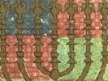

  
[Intangible Textual Heritage](../../index)  [Judaism](../index)  [Wisdom
of the East](../../woe/index)  [Index](index)  [Previous](wois21) 
[Next](wois23) 

------------------------------------------------------------------------

  
*The Wisdom of Israel*, by Edwin Collins, \[1910\], at Intangible
Textual Heritage

------------------------------------------------------------------------

### EQUALITY OF ALL BEFORE GOD: AND THE PARABLE OF A PRINCESS ATTACKED BY ROBBERS.

And the Eternal said unto Moses, "Why dost thou cry unto me?" Here, says
the Midrash, is another saying (Ps. lxv. 2), "Oh, Thou who hearest
prayer, right up to [\*](#fn_10) Thy very
presence all flesh shall come." Rabbi Judah says in the name of Rabbi
Eliezar, "If a poor man approach a human being he will not be listened
to at once, but if a rich man wants to say something he is received and
listened to at once." The Holy One, blessed be He, is not like this, but
before Him ALL are equal; women and men,
slaves and servants, poor and rich. You know that Moses, our teacher,
was the greatest of all the prophets; yet the Scripture puts him and his
prayers on the same level with the prayers of the poorest man. It is
written (Ps. xc. 1), "Prayer of Moses the man of God," and (Ps. cii. 1),
"Prayer of the poor, when his spirit is overwhelmed and he poureth out
his meditation before the All Present One." In each case it is called a
prayer \[heard by God\], to show that in prayer before the Omnipresent
ALL are equal. But the

p. 38

verse from Exodus quoted shows this even more forcibly. When Israel went
forth from Egypt, Pharaoh pursued them, "and Pharaoh drew near," "and
they cried unto the Eternal" (Exod. xiv. 10). Moses also began to pray
unto the Omnipresent, but the Holy One said unto Moses: "Why dost thou
stand and pray? My children have already prayed and I have heard their
prayer. . . ."

But why did the Holy One, blessed be He, lead them into the terrible
position in which they were: the sea in front, the enemy behind, and the
mountains and the wilderness shutting them in? The drawing near of
Pharaoh made them draw near to God [\*](#fn_11)
in repentance and contrition—they even grieved for the death of the
first born of Egypt—and this was what God willed. In love He afflicted
them, and in warm desire for their prayers; to draw them near unto
Himself.

"To what may this be likened?" says Rabbi Joshua ben Levi. "To a certain
king who was on a journey, and he heard the cry of a princess: 'I beg
thee deliver me from the hand of these robbers.' And when the king
heard, he came to her rescue.

"And after many days he thought of her, and wished to marry her, and he
longed for her to speak to him again. But it pleased her not to do so.
What did he? He sent his servants to pretend to be robbers, [†](#fn_12) so that she might

p. 39

remember him and again cry to him for help, and that he might hear the
voice that was so dear to him. And when the supposed robbers came upon
her, she thought of her deliverer and began to call out for the king.
Then the king said unto her, 'Thus, I was longing to hear thy voice.'"

In like manner, when Israel was in Egypt they began to cry out, and they
looked to God, depending on His help. . . . And the Holy One began to
bring them out of Egypt with a strong hand and with an outstretched arm.
But He wished to hear their voice again and draw them near unto Himself
with the same feeling of entire dependence on Him that had made them cry
to Him before. So He caused Pharaoh to pursue after them and to cause
them to draw nigh unto Him. Then "the children of Israel cried unto the
Lord." In that hour the Holy One, blessed be He, said, "Thus I wished to
hear your voice," as it is written (Song of Sol. ii.), "Oh my dove that
art in the clefts of the rock . . . let me hear thy voice,"—a voice, any
voice, is not written, but thy voice; just that same voice that I heard
in Egypt (not the voice of a great prophet interceding for them, but the
voice of the whole people crying out in entire dependence on God and
perfect trust in Him), and when *they* prayed, the Holy One said unto
Moses, "Why dost *thou* stand and pray; their prayer has already
anticipated thy prayers."

*Shemoth Rabbah*, *Parshah Beshalach*.

------------------------------------------------------------------------

### Footnotes

[37:\*](wois22.htm#fr_11) *ad*, the Hebrew word
used in this verse of the Psalm, means "right up to," "into," and the
meaning is weakened if we translate it as if it were *el*, "to," as in
the *A. V.*

[38:\*](wois22.htm#fr_12) There is in the
original a clever play on the word *hikrib*, taken transitively and
intransitively, which can hardly be reproduced in English.

[38:†](wois22.htm#fr_13) There are several
variants of this Parable, and from one of them I take this trait. In the
version from which the remainder is rendered, the king "sends robbers."

------------------------------------------------------------------------

[Next: The Father and his Son: The Bath and the Ocean](wois23)

