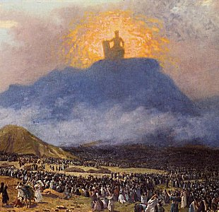

  
[Intangible Textual Heritage](../../index)  [Judaism](../index) 

------------------------------------------------------------------------

<table width="75%">
<colgroup>
<col style="width: 50%" />
<col style="width: 50%" />
</colgroup>
<tbody>
<tr class="odd">
<td width="50%" data-valign="TOP"></td>
<td width="50%" data-valign="CENTER"><h1 id="zohar-bereshith-to-lekh-lekha" data-align="CENTER">Zohar: Bereshith to Lekh Lekha</h1>
<h2 id="by-nurho-de-manhar" data-align="CENTER">by Nurho de Manhar</h2>
<h4 id="section" data-align="CENTER">[1900-14]</h4></td>
</tr>
</tbody>
</table>

------------------------------------------------------------------------

This is the only extensive translation of a portion of the Zohar, the
longest and one of the most important texts of the Kabbalah, in the
public domain.

The Zohar is a Kabbalistic commentary on the Hebrew Bible. Long before
the 'Bible Code,' Jewish scholars were attempting to wring deep meaning
out of every syllable of the text of the Hebrew Bible, using numerology,
gematria, and other techniques. Dozens of pages in this book are devoted
to analyses of the hidden meaning behind first few letters of Genesis!
This might seem ultra-pedantic; however, the Zohar makes the Biblical
text come to life, brimming with mystical significance. Seemingly
unimportant details and turns of phrase, which you may have read long
ago and forgotten, lead to immense vistas of a mysterious world inside
the world.

This is not a critical edition; written by a pseudonymous Theosophist,
probably British, it is laced with out-of-place terminology such as
'Karma' and 'Planes.' It nevertheless lets you wade in the rip current
of one of the most magical of the world's sacred texts, and leaves you
gasping for air and wanting more.

NOTE: there is an extensive set of production notes on the Title Page.

--J.B. Hare 10/18/2005

------------------------------------------------------------------------

[Title Page](zdm000)  
[Preface](zdm001)  

### Introduction

[The Lily](zdm002)  
[The Occult Origin of Alhim](zdm003)  
[The Mysticism of the Alphabet](zdm004)  
[The Initiation of Rabbi Hiya](zdm005)  
[The Mysterious Stranger](zdm006)  
[Abundant Goodness](zdm007)  
[Exposition of Bible Mysteries](zdm008)  
[The Fourteen Precepts](zdm009)  

### Genesis

[Chapter I.](zdm010)  
[Chapter II.](zdm011)  
[Chapter III.](zdm012)  
[Chapter IV.](zdm013)  
[Chapter V. The King's Palaces](zdm014)  
[Chapter VI. On Israel or the Children of Light](zdm015)  
[Chapter VII. The Prayer of Rabbi Simeon](zdm016)  
[Chapter VIII. Previous Worlds and Races](zdm017)  
[Chapter IX.](zdm018)  
[Chapter X. Symbolisms of Man](zdm019)  
[Chapter XI. The Strange Visitor](zdm020)  
[Chapter XII. Symbolism of the Divine Life and Human Destiny](zdm021)  
[Chapter XIII.](zdm022)  
[Chapter XIV. A Kabbalistic Symposium by Rabbi Simeon's
Students](zdm023)  
[Chapter XV.](zdm024)  
[Chapter XVI. A Symposium of Rabbi Simeon's Students](zdm025)  
[Chapter XVII. The Devachanic or Heavenly Spheres](zdm026)  
[Chapter XVIII. Higher Devachanic or Heavenly Spheres](zdm027)  
[Chapter XIX. Rabbi Simeon's Discourse on Prayer](zdm028)  
[Chapter XX. Devachanic Spheres and Mansions.](zdm029)  
[Chapter XXI.](zdm030)  
[Chapter XXII.](zdm031)  
[Chapter XXIII.](zdm032)  
[Chapter XXIV. Further Kabbalistic Expositions of the Six Days Of
Creation](zdm033)  
[Chapter XXV.](zdm034)  
[Chapter XXVI.](zdm035)  
[Chapter XXVII.](zdm036)  
[Chapter XXVIII. Rabbi Simeon's Analogies of the Divine Life in
Man](zdm037)  
[Chapter XXIX.](zdm038)  
[Chapter XXX. The Two Serpents, Astral Fluid and the Animal
Nature](zdm039)  
[Chapter XXXI. A Further Symposium of Rabbi Simeon's Students](zdm040)  
[Chapter XXXII.](zdm041)  
[Chapter XXXIII. Traditions Concerning Adam](zdm042)  
[Chapter XXXIV. Male and Female Created He Them.](zdm043)  
[Chapter XXXV. The Antediluvians and Their Magical Arts](zdm044)  
[Chapter XXXVI.](zdm045)  
[Chapter XXXVII. Of the Patriarch Henoch and the Sin of the
Antediluvians](zdm046)  
[Chapter XXXVIII. The Divine Compassion](zdm047)  
[Chapter XXXIX.](zdm048)  
[Chapter XL. Traditions Concerning Noah](zdm049)  
[Chapter XLI.](zdm050)  
[Chapter XLII.](zdm051)  
[Chapter XLIII.](zdm052)  
[Chapter XLIV.](zdm053)  
[Chapter XLV. Kabbalistic Explanation of the Feast of Tabernacles and
The Loulab](zdm054)  
[Chapter XLVI. The Occultism of Sacrifices](zdm055)  
[Chapter XLVII. A Vexata Questio In Biblical Philology](zdm056)  
[Chapter XLVIII. Kabbalistic Explanation of the Goat Azazel](zdm057)  
[Chapter XLIX. Rabbi Simeon's Reflections on the Supreme and Its Union
with Human Souls](zdm058)  
[Chapter L](zdm059)  
[Chapter LI. The Occult Meaning of the Six Hundred Years of Noah's
Life](zdm060)  
[Chapter LII. Adam Sitting at the Gate of the Garden of Eden](zdm061)  
[Chapter LIII. Remarks on the Destroying Angel and the
Antediluvians](zdm062)  
[Chapter LIV. Kabbalistic Remarks on the Covenant or Union of the Higher
and Lower Self](zdm063)  
[Chapter LV. Various Kabbalistic Expositions of Biblical
Texts](zdm064)  
[Chapter LVI. The Divine Lehaerot On Ezechiel's Visions.](zdm065)  
[Chapter LVII. The Mystery of the Bow in the Cloud](zdm066)  
[Chapter LVIII. Rabbi Jehuda's Discussion with the Merchant, on Jacob's
Pillar](zdm067)  
[Chapter LIX. The Symbolism of the Foundation Stone](zdm068)  
[Chapter LX. Rabbi Simeon on Mysteries and the Higher Life](zdm069)  
[Chapter LXI. Symbolism of the Colors of the Bow in the Cloud](zdm070)  
[Chapter LXII. The Mystery Of The Cursing Of Canaan By Noah](zdm071)  
[Chapter LXIII. Remarks on Predestination](zdm072)  
[Chapter LXIV.](zdm073)  
[Chapter LXV. The Thaumaturgical Erection of Solomon's Temple](zdm074)  
[Chapter LXVI. The Mystery of the Logos](zdm075)  
[Chapter LXVII. The Idolatry Of The Postdiluvians](zdm076)  
[Chapter LXVIII. The Tower of Babel](zdm077)  
[Chapter LXIX. A Comparison Between Noah and Moses](zdm078)  
[Chapter LXX. Why the Animal was Destroyed by the Deluge](zdm079)  
[Chapter LXXI. The Gilgal Or Revolution Animarum](zdm080)  
[Chapter LXXII. And Every Living Substance Was Destroyed. . .](zdm081)  
[Chapter LXXIII. What Two Rabbis Learned From a Youth](zdm082)  
[Chapter LXXIV.](zdm083)  
[Chapter LXXV. Comparison Between Adam and the Postdiluvians](zdm084)  
[Chapter LXXVI. Rabbi Simeon on the Closing of the Sanctuary](zdm085)  
[Chapter LXXVII. The Object of Building the Tower of Babel](zdm086)  
[Chapter LXXVIII. The Primeval Language and the Book of Adam](zdm087)  
[Chapter LXXIX. On Words and the Philosophy of Sound](zdm088)  
[Chapter LXXX. Section Lekh Lekha or the Call of Abram](zdm089)  
[Chapter LXXXI. Interlocutory Explanations](zdm090)  
[Chapter LXXXII. Abraham's First Studies in Occultism](zdm091)  
[Chapter LXXXIII. Abraham's Initiation into the Lesser
Mysteries](zdm092)  
[Chapter LXXXIV. Abraham's Descent into Egypt for Initiation into the
Higher Mysteries](zdm093)  
[Chapter LXXXV.](zdm094)  
[Chapter LXXXVI. Kabbalistic Cosmology](zdm095)  
[Chapter LXXXVII. Kabbalistic Philosophy of the Soul](zdm096)  
[Chapter LXXXVIII. Abraham's Initiatory Probation](zdm097)  
[Chapter LXXXIX. The Esoteric Explanation of Lot's Parting from
Abraham](zdm098)  
[Chapter XC. Remarks on the Schekina](zdm099)  
[Chapter XCI. Rabbi Eleazar and Rabbi Hezekiah, and Their Nocturnal
Studies](zdm100)  
[Chapter XCII. Rabbi Jose on the Seven Heavens or Firmaments](zdm101)  
[Chapter XCIII. Kabbalistic Remarks on Marriage](zdm102)  
[Chapter XCIV. On the Study of the Secret Doctrine](zdm103)  
[Chapter XCV. Rabbi Abba's Visit and What Occurred](zdm104)  
[Chapter XCVI. A Feast of the Circumcision](zdm105)  
[Chapter XCVII.](zdm106)  
[Chapter XCVIII.](zdm107)  
[Chapter XCIX. A Feast of Circumcision (Continued)](zdm108)  
[Chapter C](zdm109)  
[Chapter CI. Rabbi Abba's Punishment](zdm110)  
