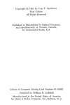

  
[Intangible Textual Heritage](../../index)  [Legendary
Creatures](../index)  [Index](index)  [Next](abs01) 

------------------------------------------------------------------------

[Buy this Book at
Amazon.com](https://www.amazon.com/exec/obidos/ASIN/1931882584/internetsacredte)

------------------------------------------------------------------------

[Buy this Book on
Kindle](https://www.amazon.com/exec/obidos/ASIN/B002G9UG0W/internetsacredte)

------------------------------------------------------------------------

  
*Abominable Snowmen*, by Ivan T. Sanderson, \[1961\], at Intangible
Textual Heritage

------------------------------------------------------------------------

p. i

Abominable Snowmen:  
LEGEND COME TO LIFE

p. ii

OTHER BOOKS BY IVAN T. SANDERSON

Animal Treasure  
Living Treasure  
Caribbean Treasure  
Follow the Whale  
The Continent We Live On  
Animal Tales, an Anthology

*Reference*  
How to Know the North American Mammals  
Living Mammals of the World  
The Monkey Kingdom

*Juveniles*  
Animals Nobody Knows  
The Silver Mink  
John and Juan in the Jungle

p. iii

# Abominable Snowmen:

## LEGEND COME TO LIFE

##### *The Story of Sub-Humans on Five Continents from the Early Ice Age Until Today*

###  

###  

### IVAN T. SANDERSON

###### F.L.S., F.R.G.S., F.Z.S.

####  

####  

##### *Illustrated*

#### CHILTON COMPANY • BOOK DIVISION

#### *Publishers*

#### PHILADELPHIA AND NEW YORK

#### \[1961\]

Scanned, proofed and formatted at Intangible Textual Heritage,
October–November 2008. This text is in the public domain in the US
because its copyright was not renewed in a timely fashion as required by
law at the time.

  [  
Click to enlarge](img/title.jpg)  
Title Page  

 
[  
Click to enlarge](img/verso.jpg)  
Verso  

------------------------------------------------------------------------

[Next: Dedication](abs01)
