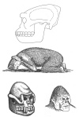

  
[Intangible Textual Heritage](../../index.md)  [Legendary
Creatures](../index)  [Index](index)  [Previous](abs17)  [Next](abs19.md) 

------------------------------------------------------------------------

[Buy this Book at
Amazon.com](https://www.amazon.com/exec/obidos/ASIN/1931882584/internetsacredte.md)

------------------------------------------------------------------------

[Buy this Book on
Kindle](https://www.amazon.com/exec/obidos/ASIN/B002G9UG0W/internetsacredte.md)

------------------------------------------------------------------------

  
*Abominable Snowmen*, by Ivan T. Sanderson, \[1961\], at Intangible
Textual Heritage

------------------------------------------------------------------------

p. 306

**14. The Eastern Horizon**

*Anything marvelous like the compass or gunpowder that came to the West
was once immediately said to have come "from China." This is doubtful on
two counts.*

Russian scientists appear to have been just as stunned as those of the
West about a decade ago when they were confronted with the new turn in
ABSMal events that took place after the Shipton foot-tracks uproar.
Further, despite the fact that their jurisdiction has for a long time
marched with the Great Barrier, and the expansion of their country was
in the past centuries eastward, just as ours was westward, while their
interests in inner Mongolia were multifarious, they don't seem to have
known much more about this huge, truly mysterious subcontinent in upland
eastern Eurasia than any other outsiders did. While the Westerners, led
by the British, had been nibbling away at its southern border via India,
and the Americans had shown some interest via China, neither had really
even penetrated the great triangle. Some travelers considered rather
intrepid had crossed it, and a few naturalists had accomplished bizarre
tasks like unearthing nests of fossil dinosaur eggs therein, but the
accumulated *lack* of knowledge about it mounted steadily. This is not
to say that Europeans had not been traveling through it since very early
times, for some became immortalized for their accomplishments like Marco
Polo and the great Russian explorer Prjewalski in the last century.
There were also lesser known but equally intrepid explorers, such as one
Johann Schiltberger of Bavaria in the years 1396 to 1427. In modern
times there have been men of exceptional perspicacity such as J.
Nicholas Roerich and the

p. 307

\[paragraph continues\] Englishman Peter
Fleming. The list is of course almost endless, and in all this Russians
have played a most prominent part. Yet, despite the fact that a very
high percentage of these travelers throughout the ages seem to have
mentioned ABSMs, and not just casually, the concept of the continued
existence over enormous areas of some of our primitive ancestors, of
sub-men, and possibly even of sub-hominids simply did not penetrate the
collective mind of Russian scholarship any more than it did that of
Westerners. The Russian expedition to the Pamirs went out every bit as
unprepared as the Western expeditions to the Himalayas, with all the
same preconceived notions and misconceptions, and it came back just
about as mystified and empty-handed.

However, the Russians had in the meantime made special investigations in
the Caucasus, and they had sent another party to the northern face of
the Everest Block—which ended in a sad disaster—and they had offered
their Chinese and Mongolian colleagues co-operation in investigating the
whole matter. This intelligent approach was prompted in part by the
growing tumult in the popular press and in scientific circles in the
West about the "Abominable Snowman," and in part by certain historic
discoveries of what may be called a purely bureaucratic nature by Prof.
Porshnev. These prove to be a sad commentary on just about everything,
but somehow make one feel a little better about some things. They
demonstrate that we are not the only dumb clucks, or the only ones to
let our scientific hierarchy obliterate any signs of novel thinking or
unexpected discovery. I would like to tell this story in full not only
for the sake of humanity but because its various facets point up just
about everything that has been wrong with the study of ABSMery during
the past century. Space does not permit and all I can give is the bare
bones.

There lives in Moscow today a scientist by the name of V. A. Khakhlov
who in 1913 submitted a full and detailed report on the east Asiatic
ABSMs to the Russian Imperial Academy of Sciences. This priceless
material was shelved, he was denied funds to continue his field
investigations, and he was frankly told to shut up. Professor Porshnev
happened to

p. 308

stumble on these reports in 1959 and sought out Dr. Khakhlov. He writes
of his first interview: "Here he sits in front of me, this white-haired
man, an emeritus scholar, a Professor of comparative animal anatomy, a
scientist who made valuable contributions in the field of zoology. He
talks about the discoveries he was about to make while he was a young
man; his talk is enthusiastic and bitter at the same time. He is bitter
not only at the general attitude taken by the pre-revolutionary Academy
of Sciences, but at the action of his former advisory professor, P. P.
Suschkin. In 1928, Suschkin came out with a startling, at the time,
hypothesis; namely, that the region where the change from a monkey (sic)
to a man took place was on the high plateaus of Asia … but not one word
about the extensive contributions made by him \[Khakhlov\] or about his
reports of the existence of \`Wild Men' in Central Asia." Need I say
more?

Nor was Khakhlov the only enlightened scholar and enthusiastic field
worker who was rapped over the knuckles and threatened with limbo at
that time for the same reason. There was a young man named B. B.
Baraidin who in 1905-07 specialized in Eastern folklore. He was given a
commission to travel through Mongolia to Tibet on assignment from the
Russian Geographical Society of \[then\] St. Petersburg. While doing so
he encountered an ABSM at close range, while in company with many others
in a caravan, and a young monk pursued the creature, which the locals
called an *Almas*. Baraidin made a full report on this, but his boss,
one S. F. Oldenburg, head of the geographical society and Secretary of
the Academy of Sciences, ordered him to delete all mention of the matter
from his report, stating that "no one will ever believe that, and it may
prove embarrassing." At least, they were direct about it in Imperial
Russia!

Young Baraidin had been befriended by a Mongolian scholar named Z. G.
Jamtzarano, and when he told him of the incident, the latter was
inspired to devote much time to pursuing ABSMs. This he did with the
help of two assistants named A. D. Simukov and a Dr. Rinchen. The latter
is now a Professor at the University at Ulan Bator, Mongolian D.R.,
still

p. 309

most actively engaged in pursuing the matter, and has given a great deal
of information to the Russian Special Commission. It was these
"discoveries" in the attics of Russian science that did more than all
the firsthand reports of tracks and encounters along the entire length
of the Great Barrier to aid Prof. Porshnev in mounting a proper
investigation of ABSMery in Russian territory. Yet there remained a
great skepticism, right up till the time of departure of the expeditions
and investigators. In the previous year (1957) one A. J. Pronin, a
hydrographer from Leningrad University, had made the world press with a
story that he had observed an ABSM twice, for a brief time but at some
distance on the Fedchenko Glacier in the Pamirs. This had at first been
proclaimed by, but then just as violently decried in the Russian press,
to such an extent that the inevitable debunking—which as usual amounted
to nothing more than some "expert" saying that he did not believe
him—was seized on by everybody as final and absolute proof that all
ABSMs have never been anything but myths. I am sincerely sorry for Mr.
Pronin, but I must say that this also makes me feel a little better: for
it is manifest that our press also is not the only muddleheaded group or
the only one that jumps to grovel in abject compliance with the least
pontification on the part of an "expert." Reviewing press reports on the
1958 expedition to the Pamirs, I find an almost similar story—first
considerable enthusiasm and even pride in this open-minded and truly
scientific endeavor, then a sad retrogression to the age-old bolt-hole …
"Sorry to have to do this, dear Readers, but I'm afraid we have finally
to bury the poor Snowman. He turns out to be just a myth after all. We
hate to see a good myth die; we need them in this day and age, but …
etc, etc, etc." I have a whole file on these periodical requiems on
ABSMs, the latest, as of writing, a highly facetious lead editorial in
the *Christian Science* *Monitor* anent Hillary's scalps. They make
amusing reading but are a sad commentary on intelligence in whatever
part of the world.

Nonetheless, although this expedition to the Pamirs did not bring back a
pickled ABSM, it did bring to light a wealth of most fascinating
reports. Not a few of these were from resident

p. 310

\[paragraph continues\] Russians. One of
the most notable only came to light later in a communication to Prof.
Porshnev, who remarks of it in one of his articles: "Not only the
"authority of official science" acts as a hindrance to obtaining more
information about the "snow men." There are other obstacles as well,
which incidentally still remain: lack of co-ordination in gathering data
is the most important \[or most detrimental of all\]. Investigators
working in different regions are not aware that similar data is being
collected in another area and, lacking this most basic tool of
science—comparison—they are unable to accomplish anything. As an example
we can cite a recent communication from a geologist by the name of B. M.
Zdorick. He writes that much to his regret while he was in the Pamirs in
1926-38 he had no information about the Himalayan ABSMs \[called
*yeti*\], and just could not understand all the stories he was told
about furry men, or *even what he had seen himself* (italics mine,
*Author*) ."

"In 1934 Zdorick accompanied by his guide was making his way through a
narrow path among a growth of wild oats on a little alpine plateau at
about 8000 feet altitude between the Darwaz Ridge and the eastern
reaches of the Peter the First Range. Unexpectedly the path leveled off
and one could see how the grass was trampled on, the ground giving
evidence that someone was digging around. There were splotches of blood
on the path and remains of a gopher's skin. Just a little way from
Zdorick and his guide, on a mound of freshly upturned earth, was a
creature, asleep on his belly, fully stretched out. He was about a meter
and a half in length (approximately 4 feet 10 inches). The head and the
forward limbs could not be seen because they were hidden by a growth of
wild oats. The legs, however, could be seen. They had black naked soles,
and were too long and graceful to have belonged to a bear; his back was
also too flat to be a bear's. The whole body of this animal was covered
with fur, more like the fur of a yak, than the rich fur of a bear. The
color of the fur was a grayish-brown, somewhat more prominent brown than
a bear's. One could see the sides of the creature moving rhythmically in
his sleep. The fear that took possession of the guide transmitted

p. 311

itself to Zdorick and they both turned around and ran for their life,
scrambling and falling in the tall, wild grass.

"On the following day Zdorick learned from the local residents, who were
much alarmed by the news, that he came across a sleeping "*dev*". The
local residents used another word in naming the creature, and Zdorick
had the impression that they were using the word "*dev*" just for him,
so that he could understand better. The local residents ventured the
information that in valleys of Talbar and Saffedar there were a few
families of these "*devs*"—men, women and children. They were considered
like beasts, and no supernatural power was ascribed to them. They cause
no harm to the people, or their stock, but meeting them is considered a
bad omen.

"The geologist was very much surprised to hear that the "*dev*" was
listed as an animal, and not a supernatural creature. He was told that
the "*dev*" looked like a short stocky man, walking on two hind legs,
and that his head and body were covered with short grayish fur. In the
Sanglakh region the "*dev*" is seen very rarely, but they do roam about,
either singly, or in pairs—male and female. No one had seen any young
ones, but last summer they caught a grown one at the flour mill, where
he evidently was eating either flour, or grain. This was at the eastern
foothills of Sanglakh, only a few kilometers from Tutkaul. The captive
was chained for about two months by the mill and was fed raw meat and
flour pancakes. After that he broke his chain and escaped. They also
pointed out a man who had a large scar on his head from a wound
supposedly inflicted by the "*dev*". "

The list of encounters with, let alone mere sightings of ABSMs
throughout the Pamirs region generally (as defined above) are literally
endless. The same can be said of the other major areas of the Mongolian
upland triangle. These areas are as follows: first the super-upland
plateau of Tibet with its three principal super mountain ranges, in the
south the Rim with the Karakoram, in the middle the Kunluns that turn
south to the head of Indo-China, and along the north the Altyn Tagh,
that leads into the Nan Shans and on to the Tsin-Lings of China. Second,
north of the Pamirs lie the Alai-Tagh,

p. 312

and from them stretch the Tien Shans to form the northern boundary of
the Tarim Basin of Sinkiang. Next, north of these come the Grand Altai,
forming the southern border of Mongolia proper. North of these are the
Tannu-Ola and the mighty Khangai between Mongolia and Tannu Tuva. Still
north again come the Sayan complexes and the Baikals, lying along the
shore of the great lake of the same name. Then, in the Gobi Desert lie
the Yablonovoi Mountains. Finally there are the Khingans running north
to south between the Gobi and the eastern lowlands of Manchuria. There
is some suspicion that ABSMery may have to be extended still farther
north through the Stanovois, to the Dzhugdzhurs and Gidan Mountains
which border the Sea of Okhotsk. There is also a most important triangle
sandwiched in between the Nan Shans, the eastern end of the Tibet Rim
and the upper end of the Indo-Chinese Peninsula, that has no collective
name, but is filled with immense north to south ranges. This lies in
Sikang, now incorporated into the Chinese Province of Szechwan. \[All
these subareas or natural provinces will be found on [Map
XII](abs17.htm#img_map12.md) with the exception of the penultimate group
which are in far eastern Siberia, and from which we have no definite
ABSMery.\] I cannot stress too forcibly the sheer volume of such reports
and of those of foot-tracks, droppings, and other corollary evidence
that have been found year after year all over all of these subareas
within the great upland Mongolian Triangle. The full record of those
that have been published—some 200, that have been properly investigated
and assessed scientifically by competent specialists—will form the
subject of another book. For now, I shall have to confine myself to a
few samples and some further explanatory remarks about the country,
vegetation, and general background against which they were recorded.

First, in the general Pamirs region, the Russian expedition brought to
light half a dozen most recent and categoric reports. One was supplied
by a man, described as "quite well-to-do," resident in Chesh Teb, who
did a lot of hunting for pleasure. In 1939, in the spring, about 4
o'clock in the afternoon, while he was walking around he saw some man
who actually jumped on him. "They started wrestling. This was a
*Gul*-*Biavan*. The

p. 313

hunter was very strong and tall and heavy and once he was able to lasso
a bear. Now, this hunter wrestled with *Gul-Biavan*. The *Gul-Biavan*
was covered with short, soft wool and the man could not get hold of
anything. On the face of this man there was also short wool and there
was a terrible odor coming from him. Finally, the hunter was able to
throw the *Gul-Biavan* to the ground, but at the same time he lost
consciousness himself. The villagers came upon the man and brought him
home. When he came to, it was late in the evening and he told how he met
the *Gul-Biavan*, and the villagers told him that he was lying on the
ground, and the ground around him bore evidence of this wrestling
match."

In the same area intelligent local people made many sworn statements
such as "A man in Roharv was traveling with two others through the Pass
of Karategin and Vahio, when they saw a naked man covered with short
black hair, who was slightly taller than an average ordinary man, and
which had *a very strong smell*" \[italics mine\]. As elsewhere all over
the world, this matter of a strong stink attached to ABSMs keeps
cropping up throughout the east Eurasian cases. Then, there was the
hunter, Andam Kerimov, from a place called Uskrog between Roharv and
Bodaudi, who called the creature he encountered a *Voita* (just another
local name for an ABSM). It was not much bigger than a man, was covered
with hair but not much on its chest. It had a bare face, and ears
sticking out, the nose was wide, and "over the nose and on the ears he
did not have much hair." Rather pleasantly the report states that "At
the time Andam met the *Voita* he was leading a goat but gave way to
him—the *Voita*." A group of hunters named Alaer, Altibai, Matai,
Beksagir, and Tastambek who were with the reporter and his father one
Abdurahmanov Abdulhamid, when encamped for the night, heard "something
treading lightly on the grass" and running out apparently with a light
saw what they called a *Gul-Biavan* about 6 feet 6 inches tall covered
with hair. "It had a powerful and unpleasant smell." This was in 1951.

Some of the most interesting information collected on east Eurasian
ABSMs comes from Khakhlov's original inquiries at

p. 314

the beginning of this century, mentioned above. Khakhlov obtained most
of this through that group of the Kazakh nation which had moved
northeast and settled along the edge of the Great Barrier, north of
Kirghiz territory and north of Lake Balkhash, in the area lying between
the Abakan Mountains and Tannu Tuva. These people were actually
foreigners to and were not acquainted with the uplands beyond the
Barrier but they penetrated into it via certain lowland basins having
entrances pointing to the west. The most notable of these is called
Dzungaria which is an immense lowland pocket, into which the western
steppes \[i.e. prairies, to us\] penetrate via two great valleys
separated by the Tarbagatai Mountains. Patient inquiry by Khakhlov
elucidated the fact that reports gathered by the Kazakhs from a wide
area seemed all to come from Dzungaria. Khakhlov makes a point of noting
that these reports came from herders, hunters, and those engaged in
other pursuits strictly in that order numerically. His first most
astonishing discovery, which has recently been much confirmed was that
the ABSMs from that region had "been seen, captured, left footprints in
sand, had an odor, resisted capture and yelled, and lived in captivity
for a while."

"One witness, a Kazakh, stated that he was in the mountains of
Iran-Kabirg and once, together with local herders, was taking care of a
herd of horses at night. Toward dawn they saw some man prowling around
and suspecting a thief, they jumped in the saddle taking along long
poles with nooses which are used to catch horses, "arkans" \[lassos\].
Because the "man" was running awkwardly and not too fast, they succeeded
in capturing him. While he was being captured, the "man" was yelling, or
rather screeching "like a hare." Looking the captured creature over, the
herder explained to the visitor that this is a "Wild Creature" not doing
any harm to any one, and that he should be released.

"The "wild man" was a male, below average height, covered with hair
"like a young camel." He had long arms, far below his knees, stooped,
with shoulders hunched forward; his chest was flat and narrow; the
forehead sloping over the eyes with prominently arched brows. Lower jaw
was massive without

p. 315

any chin; nose was small with large nostrils. The ears were large
without any lobes, pointed back \[like fox's\]. On the back of his neck
was a rise \[like a hound's\]. The skin on the forehead, elbows and
knees hard and tough. When he was captured he was standing with his legs
spread, slightly bent in the knees; when he was running he was spreading
his feet wide apart awkwardly swinging his arms. The instep of the "wild
man" resembled a human, but at least twice the size with widely
separated fingers \[toes\]; the large toe being shorter than that of
humans, and widely separated from the others. The arm with long fingers
was like a human arm, and yet different.

"When the "wild man" at the insistence of the herders was allowed to go
free, both Kazakhs followed him and discovered the place into which he
had vanished: an indentation under a hanging rock strewn with high
grass. The local residents offered additional information about these
creatures: that they lived in pairs, seldom seen by people, and not at
all dangerous to humans.

"A second witness found by Khakhlov stated that for several months he
observed a "wild man" in the regions of the River Manass, or Dam. This
creature of female sex was sometimes chained to a small mill but was
also allowed to go free. The general description was the same as of the
male: hairy cover of the skin, stooped, narrow chest, shoulders were
inclined forward, long arms; bent knees, flat insteps, spread out toes
resembling a paw, the contact with the ground flat without the instep.
The head is described in the same fashion—absence of a chin and a rise
in the back.

"This creature seldom issued any sounds and usually was quiet and
silent. Only when approached she bared her teeth and screeched. It
\[sic\] had a peculiar way of lying down, or sleeping—like a camel, by
squatting on the ground on its knees and elbows, resting the forehead on
the ground, and resting the wrists on the back of the head \[see p.
316\]. This position accounts for the unusually hard skin of the elbows
and knees—like camel's soles. When offered food, the female ate only raw
meat, some vegetables and grain. She did not touch cooked

p. 316

  [  
Click to enlarge](img/31600.jpg.md)

(*Top*) Hypothetical skull of the *Ksy-Giik* type of Abominable Snowman
as reconstructed by Russian scientists.

(*Center*) A drawing made by Prof. Khakhlov of the Almas type of
Abominable Snowman from native descriptions.

(*Bottom*, *left*) An ancient mask from the great Mongolian plateau.
(*Bottom*, *right*) Reconstruction of head and face of the creature on
the mask, drawn by Russian scientists.

p. 317

meat, or bread, although later she was getting used to bread. Sometimes
she would catch and eat some insects. She would drink in animal fashion,
by lapping water, or sometimes she would dip her arm in water and lick
the water. When she was allowed to go free, she ran awkwardly swinging
her long arms, to the nearby reeds where she disappeared."

Khakhlov notes that "This creature [\*](#fn_42.md)
has nothing in common with the *Jez-Termak* (\`Copper-Nails'), or with
the *Almas*." This is a most startling statement but one of the utmost
significance, and also one that has been totally overlooked. We find on
analyzing the reports from the general Pamirs area that, despite
variations in coat color, all ABSMs there appear to be of one type. This
is about man-size, and in many respects very manlike with, as is
frequently mentioned, something like a primitive language or at least a
vocal communication system more elaborate than anything known among
animals. Its footprints, while having a very widely separated and
extra-large big toe, are said to be human in form. This type—which
incidentally seems to be the same as the Caucasian *Kaptar*—is most
commonly called by one of the names in the *Guli-avan* group \[due, of
course, to the regionality of the languages in the area\] and extends
north into and along the Tien Shans, and east into the Kunluns and the
Karakorams. Moreover, I do not know of any remarks to the effect that
there are more than one kind of ABSM throughout these three regions. The
larger and more bestial *Meh-Teh* type with *two* semi-apposed toes
begins only east of the Karakorams along the Southern Tibetan Rim and,
possibly, in the Himalayas; though—and this

p. 318

is exceedingly strange—I cannot actually find a single report of this
type from any part of that range.

It would seem that Khakhlov's creatures from around Dzungaria are also
of the *Guli-avan* type and that they extend north to the Grand Altai
and beyond to the Sayans. The descriptions of those from the Nan Shans
\[which is to say the *northern* rim of the Tibetan super-uplands\] seem
also to be similar. This creature, which gives every indication of being
a Neanderthaler-type of sub-man, and whose footprints *exactly* match
those of a Neanderthaler discovered in a cave in Italy, [\*](#fn_43.md) would seem to be a mountain dwelling
form: in fact, they *are* montane forms, for not one single report of
them from down on either the lowlands or even on the Mongolian Plateau
itself have ever been recorded.

From the latter, which is to say Mongolia proper \[with the Khangai
Mountains that arise in its center\] and the vast Gobi Desert, together
with the Ala Shan, the Ordos, Turfan, and even possibly the lowlands of
Dzungaria and the Tarim, we get reports only of the little *Almas*.
These are much smaller and apparently even more human, and seem always
to have been regarded simply as extremely primitive humans; hairy and
without speech understandable to us, but having more or less all the
human qualities such as suckling human infants and even, it has been
alleged, "trading" with normal humans, in that they would leave skins at
appointed places, and take away certain simple basic articles left there
by the nomadic tribesmen in return. There is even a report of a scholar
in a

p. 319

\[paragraph continues\] Mongolian
monastery who was a hall-breed Almas. This report comes from Prof.
Rinchen, mentioned previously, and reads: "There was a lama in the
Lamin-gegen monastery who was famous for his scholarship, and known
under the name of—"a son of an *Almasska*." The father of this lama
supposedly was captured by *Almas* and begot a boy with an *Almas*
woman. Both father and son eventually managed to escape by joining a
passing caravan. The boy was allowed to become a pupil in a monastery
and achieved scholarly fame." The same informant, one Gendul from
Khuremal of the Bainkhongor District, recently told \[Dr. Rinchen\] that
in 1937 he saw in a monastery, Barun-Khure, an entire skin \[or hide\]
of an *Almas* which was fastened to the ceiling of the temple. This skin
was taken off by a cut along the back so that it remained practically
intact and one could see that it had human-like legs and arms. The face
was framed by long hair hanging from the head. The entire skin was
covered with cabalistic signs and painted by the lamas. This *Almas* was
supposedly killed in Gobi and brought as a gift to the monastery by a
famous hunter, Mangal Durekchi."

Although I am getting somewhat ahead of my story, I would like to point
out that the idea of a half-breed Neanderthaler becoming a great scholar
is not to be scoffed at. Those sub-men had relatively large brains,
while there is really no evidence that a large brain is necessary for a
large intellect. One should take to heart the couplet that states:

"Little brain, little wit.  
 Big brain, not a bit"

and note that Anatole France's gray-matter capacity was only 1100 cubic
centimeters while that of a proto-Neanderthaler so lowly as Rhodesian
man was 1280!

Professor Rinchen, already mentioned, reports that a man  by the name of
Anukh, traveling in the South Gobi in 1934  with a companion "noticed in
thick growth of saksaul grass a  4 strange, two-legged creature that
started running away from  them. "*Dzagitmegen"*! \[saksaul
grandmother\] decided both,  and, making lassos out of rawhide, they
started in pursuit of

p. 320

the creature. The fast Gobi camels had no difficulty in overtaking the
creature whose body was covered with short wool. At the sight of people
twirling the lassos, the creature issued such a piercing cry that the
frightened camels would not budge any further and the creature was able
to escape behind a rocky furrow."

Then, again, there is the story of "a caravan on the way to Kuku-khoto
in Inner Mongolia. The caravan was traveling from the region of
Uliasutan in Eastern Mongolia and approaching the southern borders of
Khalkhi when it was decided to stop for rest near a place thickly grown
with saksaul grass. When they were ready to start again the man who was
sent to get together the camels could not be found anywhere. An old
experienced guide told the men that in this location may be some
"*Dzagin* *Almas*," and advised that more than one man should go
searching. After a while the three men who were sent out to search came
to a cave and saw on the ground in front of it signs of struggle between
two people—one having shoes, the other barefoot. The frightened men did
not attempt to enter the cave and, recovering the camels, returned with
their observations to the caravan, insisting that all should go to the
help of their companion. The old guide again cautioned them against such
an act. He stated that the *Almas* never kills people but, having
captured one, will hole up for a while and will not come out of the
cave. He suggested that they should wait till they came by on their way
back and then attempt to free their comrade.

"And so on their way back they came to the same spot and, arming
themselves with a gun, they decided to hide near the cave and wait till
the *Almas* came out. They waited a whole day, and then toward sunset
out of the cave emerged a two-legged creature covered with hair all
over. A shot sounded and the creature fell dead. Reloading the gun, the
men ran into the cave looking for their lost companion. They found him,
but he seemed wild and listless. He never told anyone what occurred in
the cave, he avoided talking to people, and in two months time he died."

p. 321

Reverting to the creatures called *Jez-Termak* [\*](#fn_44.md) which is alleged to mean *Copper-Nails*
\[meaning, of course, "fingernails"\] we should note that this name is
applied to a larger, grosser, and more bestial type of ABSM than the
Dzungarian *Ksy-Giik*, and is alleged to be found on the super-uplands
of Tibet. It is said to be clothed in rather long, shaggy, very dark
gray to black hair, and to have fingernails of copper. The implication
in the folklore on this type and in all undocumented stories about it
asserts that their nails are actually made of copper. This idea is
illogical and as near impossible as anything could be but there could be
a very simple and logical explanation for it. It is that the fingernails
of some primates and notably adult gorillas are quite often bright
copper-colored and even look burnished. The explanation seems to be that
they are stained—as the material of which all nails and claws are made,
known as keratin, so readily is—by the juices of certain fruits, barks,
or berries on which they feed. I have collected monkeys of more than one
species in Africa that displayed remarkable variations from the
described coat-color and pattern by reason of bright red areas in the
inguinal region; sometimes on the lower face, and even on the chest and
inner arms. After preparing skins, it is a custom to wash them in warm
soap and water before drying them for museum preservation. On doing this
to these monkey pelts we were amazed to find that all this bright copper
color washed out and left the fur pure white or yellow. Experiment
elicited the fact that the ingestion of certain fruits, selected for us
by local people, although looking green and otherwise quite innocent,
produced this vivid red stain on the pelt of caged monkeys within a
matter of days by dribbling from the mouth or anus; and, when said
fruits were eliminated from their diets, the color persisted for weeks.
Their fingernails also remained bright copper-colored until they grew
out from the bottom up.

While everybody has for centuries been alluding to Tibet

p. 322

as the real center of ABSMery, there turns out to be surprisingly little
of a concrete nature from that vast land. This may appear astonishing
but should not be regarded as indicating that there are no ABSMs there.
Quite the contrary, it appears to be the true "heartland" of the whole
matter but, as I have been at pains to try and explain above, there is a
deep-seated, proto-religious prejudice against speaking of the matter to
foreigners while, at the same time, the number of foreigners to visit
Tibet throughout the ages has really been extraordinarily small.
However, almost all of those who have visited the country and written
about their travels have mentioned ABSMs.

The American William W. Rockhill wrote in 1891 of hearing many stories
from Tibetans in Pekin, China, and elsewhere of the "Hairy Mountain
People" of their country but he discounted these reports as being merely
cases of mistaken identity; namely, of bears. However, he goes on to
say: "One evening, a Mongol told me of a journey he had once made to the
lakes in the company of a Chinese trader who wished to buy rhubarb from
the Tibetans, who annually visit their shores \[i.e. the lakes of
central Tibet\]. They had seen innumerable herds of yaks, wild asses,
antelopes, and *Gérésun Bamburshé*. This expression means literally
"wild men"; and the speaker insisted that such they were; covered with
long hair, standing erect, and making tracks like men's; but they could
not speak."

W. M. McGovern in his book *To Lhasa in Disguise* (1924) says: "In
nearly all parts of Tibet one finds the tradition of the existence of a
primitive race of men, former inhabitants of the land who have been
driven out of the plains by the Tibetans and who now dwell only in the
passes and in inaccessible mountain crags. My own servant referred to
them as snow men. They are said to be great hairy creatures, huge in
size, and possessed of incredible physical strength. Although having a
certain low cunning, they are deficient in intelligence, and it is the
intellectual superiority of the Tibetans that has enabled them to oust
the primitive snow men from the plains. It has been permitted to no
white man to meet these snow men." He adds at another point that
"Rockhill, who came

p. 323

across this tradition in the extreme eastern part of Tibet \[i.e. the
land of the *Dzu-Teh*\] suggests in his *Land of the Lamas* that the
wild men may be nothing other than bears! For other parts of Tibet this
explanation could scarcely be valid, since in many parts of Tibet, as,
for example, in Kampa Dzong, Pari, and the surrounding districts, bears
are unknown."

This is a rather significant statement in view of the constant
insistence that all kinds of bears \[though all varieties of the
Eurasian Brown Bear\] are found all over Tibet. Actually, it does not
matter a "tuppenny-damn" whether they are so found or not, because the
Tibetans know their local animals and their distribution much better
than any outsiders do, have completely different names for bears and
ABSMs with qualifying terms for the various kinds of each—none of which
for one kind of creature could in any way be confused with those for the
other—and would never for one moment confuse one with the other.
Further, Rockhill himself states in another passage that "Lieutenant Lu
Ming-Yang, when speaking of wild tribes to the north of the Horba
country, assured me that men in a state of primitive savagery were to be
found in Tibet. Some few years ago \[that was before 1890, *Author*\]
there was a forest fire on the flank of Mount Ka-Lo, east of Kanze, and
the flames drove a number of wild men out of the woods. These were seen
by him; they were very hairy; their language was incomprehensible to
Tibetans; and they wore most primitive garments made of skins."

This is a pretty startling statement, for Rockhill was a rather nasty
kind of skeptic, given to debunking anything possible and imbued not
only with the then current pomposity of all Western travelers, but with
an almost modern craze for mediocrity and the disposal of all things
that did not fit the accepted pattern. Having disposed of ABSMs proper
as "bears standing on their hind legs" he then fell with a wallop into a
report on primitive "humans," *with hairy bodies*, in a place where they
"ought not to have been" \[at least by Victorian estimation\], and all
on the say-so of a Chinese lieutenant. It is a strange commentary on the
closed mind of even a famous traveler and at the same time an eye opener
on our subject,

p. 324

for we must not forget that there is still ample room for whole hosts of
mere "primitives" let alone ABSMs all over this vast Triangle. Further,
we must not forget those forlorn people; still, at least until recently,
maintaining a Bear-cult, called the "Hairy Ainu" of the Japanese island
of Hokkaido. They seem to have been Caucasoids of an extremely early
vintage and they certainly were hairy \[and in some cases still are,
despite their persecution!\]. Hairy chaps, wearing skins, running out of
burning Tibetan forests do not quite coincide with then \[1890\] or even
current anthropological beliefs but this is no reason to gainsay their
previous or continued existence. Apparently Tibetans took, and still
take, all this quite complacently.

Just to make matters worse, this same Rockhill must add still another
brief passage that states "Legends concerning wild men in Central Asia
were current in the Middle Ages. King Haithon of Armenia, in the
narrative of his journey to the courts of the Batu and Mangu Khans, in
1254-55 A.D., speaks of naked wild men inhabiting the desert southeast
of the present Urumchi." Almost everybody who has traveled in Tibet both
before and since the date of these statements have reported the same
thing and some have said they have met the creatures. But, I stress
again, these are all foreigners, since the Tibetans themselves just
won't talk about the business. One story that has always fascinated me
is that of a Kirghiz named Saikbaia Karalaein who told the Russian
investigating commission about a Chinese family who had started
wandering during the war and finally settled in Tibet. It appears that
one of their women disappeared and they thought her to be dead. However
"a year later she came back, and told them the story that she was taken,
while gathering wood, by what she called a *Kish-Kiik*, or wild man. He
was comparatively little different from an \[ordinary\] man but was
covered with hair and could not speak. She also said that she was
expecting a child by him. Hearing that, her husband killed her; and he
was taken by the police. The woman also told where the wild man's den
was. They went up there and actually saw wild men and women all covered
with hair."

p. 325

On several occasions Tibetans of higher education have said (see Chapter
12) or have been reported to have stated that they know of three
distinct types of ABSMs in or around the periphery of their super-upland
plateau, while, in addition, they speak of two "animals" with manlike or
super-anthropoid characteristics. These latter they identify as, first a
giant monkey and, secondly, the *Meh-Teh*. Of the other three
"Man-Creatures" they are quite cognizant, affirming that they are first,
the little dwarf *Teh-lma* of the lower valleys; second, the man-sized
hairy one \[i.e. the *Kaptar*, *Guli-avan*, or *Ksy-Giik* type\]; and,
third, something quite else. This is the mighty *Dzu-Teh* type known
elsewhere as the *Gin-Sung*; a real giant, shaggy-coated, and able to
stay for long periods in the ruggedest country; dangerous, a stock
raider, but possessed of an almost exactly human-type foot. This, they
and everybody else, agrees is not found along either the Himalayas or
the Southern Tibetan Rim, nor even in the Nan Shans, but is confined to
the unnamed triangle between these, upper Indo-China, and the Chinese
escarpment. This same type seems to prevail also in the Tapa Shan, the
Tsin-Lings, the ranges between Shensi and the Gobi, and again north
along the mighty Khingans that separate the Gobi from Manchuria, and on
into the Little Khingans that lie athwart the northern edge of that
province. Also, as I said before there are indications that this type of
ABSM may exist still farther north in the Stanovois, Dzhugdzhurs,
Gidans, and even in the Anadyrs. This is of the utmost significance
since it is only a skip from there to Alaska, while this *Dzu-Teh* type
ABSM seems to conform very closely, if not be identical with, our
*Sasquatches* and *Oh-Mahs*.

Here indeed is a strange situation to contemplate. We start out with a
suggestion that there *might* possibly be some one kind of as yet
uncaught and undescribed animal, probably an anthropoid \[or a race of
runaway human delinquents\] in the Himalayas which somehow got
colorfully called "Abominable Snowmen" and we end up with a whole galaxy
of unknowns, spread over five continents, and concentrated in eastern,
upland Eurasia, where, by the word of those people who know most about
the subject locally, speak the local languages, and

p. 326

have devoted the most time to the matter, there appear to be no less
than five very distinct types, each with its own characteristics and
habitat; namely, (1) the Mountain Neanderthalers of the West, (2) the
little *Almas*; also Neanderthalers, or mere primitives, of the hot
deserts, (3) the bestial *Meh-Teh* of the Tibetan upper plateau, (4) the
giant *Dzu-Teh* (*Gigantopithecus?*), *Tok*, or *Sasquatch*-type and (5)
the tiny tropical, forest-dwelling *Teh*-*lma* of the southern valleys.
This may sound fabulous but, the deeper you delve into the reports and
the background, the more obvious and logical this becomes.

The distinctive nature of each of the five is perfectly in accord with
the varying nature of other groups of mammals. Take for instance the
wild sheep of this area. There are distinctive species and/or races in
each of the great mountain blocks, while other hoofed animals replace
these on the lowlands or comparative lowlands; one set on the *hot*
deserts, another on the upland *cold* deserts. Then also, the actual
geographical distribution is also perfectly consistent, in that one kind
inhabits the far west (the Caucasus) and the western fringe of the
plateau; another the comparative lowlands of the middle; a third the
eastern mountainous edge; still another the Tibetan Plateau and its
superimposed mountain ranges; and the last only the warmer valleys of
the extreme southern periphery of the area. These divisions,
furthermore, coincide with the distribution of both vegetation and
vegetational types of growth. For instance, the arrangement of the
latter going north from the Pamirs to the Sayans up the Great Barrier
parallels (but is different botanically from) that going up the eastern
escarpment from Indo-China to the Stanovois in Siberia. The whole
picture, in fact, despite its enormous complexity \[and our gross
over-all lack of knowledge of the area\] is perfectly logical and
consistent with all natural facts and factors.

To reiterate—and I cannot help doing this and for some very real
reasons—we should wipe away our sense of helplessness and hopelessness
on taking our first look at [Map XII](abs17.htm#img_map12.md) and just
remember that this tremendous mishmash may be quite

p. 327

simply divided into five parts: the Great Barrier on the west; the
central desert basins; the Great Barrier and escarpment on the east
fronting Manchuria and China; the Tibetan super-uplands and their
mountains; and, last, the fringe area of the Himalayas. This is eastern
Eurasia in, as it were, a nutshell. The only things left over are the
two enormous masses of uplands and mountains in Siberia, west and east
of the Lena River respectively. These, however, do not at the moment
concern us.

And so we find ourselves ending our world tour in an area that is only
one stage removed from where we started. The animal life and much of the
vegetation of far eastern Siberia is identical to that of our extreme
northwest. What is more, as you go south from the Bering Strait on
either side—down through Siberia on the Asian side, or through Alaska to
the Yukon, and British Columbia on the American, you pass through the
same succession of vegetational belts and mountainous zones at each
latitude. Many large animals, like the Brown or Dish-faced Bears and the
large Red Deer or American Elk, have crossed from one to the other in
comparatively recent times. The Amerinds seem to have done the same too;
and the Arctic or Eskimo-type Mongoloids even later \[unless they were
on both sides all the time\]. As I asked at the outset, what was there
to prevent the Neo-Giants from doing so also, at some time? They are, of
all the ABSMs, apparently the most rugged, surpassing in this respect
the Neanderthaler *Kaptar*-*Guli*- (or *Gulb*) -*avans*, the
desert-dwelling *Almas*, and the little warm-forest *Teh-lmas*. That the
*Meh-Tehs* did not do likewise seems to me fairly reasonable for it
would appear that they are more apes than men and, like all of that ilk,
are neither catholic in their tastes nor so readily adaptable as are the
Hominids. Like the Gorillas in Africa and the Orangs in Indonesia they
got into a special environmental niche and have remained stuck therein.

 

Turning to another aspect of the matter; the Pithecanthropines were
manifestly lowland creatures and had plenty of space. Why should they go
barging off into upper Siberia? Then, although there are Mousterian
(Neanderthal) type

p. 328

stone implements scattered all over Manchuria and eastern Eurasia, the
sub-men who made them—the Neanderthalers—appear to have been essentially
a western species that spread from western Eurasia. The *Teh-lmas* and
little *Sedapas*  on the other hand need hardly be considered as
candidates for emigration to North America; they are tropical types. It
would seem to me that, if the *Dwendi* are just pigmy Amerinds, there
are no ABSMs in the New World other than Neo-Giants except for the
alleged *Shiru* of Colombia. What this might be I certainly don't know,
and a great deal more than is at present on record about it will have to
be established before anybody can hazard even an educated guess. But,
life being what it is, I would not really be a bit surprised if it was
the first ABSM to be collected in the flesh!

------------------------------------------------------------------------

### Footnotes

[317:\*](abs18.htm#fr_43.md) Known locally by the
names grouped around the stems *Ksy* and *Giik*. The latter means "wild"
as in *At-Giik*, Wild Horse.

[318:\*](abs18.htm#fr_44.md) In the spring of 1948
the official caretakers of a cave known as "The Witch's Cave" near
Toirano in Italy \[all caves in Italy are government controlled\]
obtained permission to blast through what proved to be 11 feet of
flowstone forming a blockage to one of the cave's passages, in the
off-tourist season. They had seen bats flying in and out of a small hole
leading into this and had rightly assumed that unexplored areas lay
beyond. On breaking through, extensive passages with clean, smooth, wet,
clay floors were found. On these there were enormous numbers of
foot-tracks of large cave bears, of modern-appearing man, and of what
are obvious Neanderthalers, together with many artifacts and even
evidence of some kind of game played by throwing clay balls at a circle
on the wall. The cave seems to have been finally abandoned and sealed by
the flowstone curtain about 50,000 years ago. An outline tracing of one
of the Neanderthaler footprints found therein is reproduced in Appendix
B.

[321:\*](abs18.htm#fr_45.md) This term actually
means "The Mountain one that scrambles using its hands," as is explained
in the Glossary in Appendix A.

------------------------------------------------------------------------

[Next: 15. Some Obnoxious Items](abs19.md)
