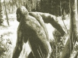

  
[Intangible Textual Heritage](../../index.md)  [Legendary
Creatures](../index)  [Index](index)  [Previous](abs27)  [Next](abs29.md) 

------------------------------------------------------------------------

[Buy this Book at
Amazon.com](https://www.amazon.com/exec/obidos/ASIN/1931882584/internetsacredte.md)

------------------------------------------------------------------------

[Buy this Book on
Kindle](https://www.amazon.com/exec/obidos/ASIN/B002G9UG0W/internetsacredte.md)

------------------------------------------------------------------------

  
*Abominable Snowmen*, by Ivan T. Sanderson, \[1961\], at Intangible
Textual Heritage

------------------------------------------------------------------------

p. 477

**Appendix C**

**Where We Come In**

|               |                |                                |
|---------------|----------------|--------------------------------|
| ANTHROPOIDS   | Hominids       | Modern Man                     |
|               |                | Primitive Men                  |
|               |                | Neanderthalers (Almas?)        |
|               |                | Proto-Pigmies (Sedapas, etc.?) |
|               |                | Neo-Giants (Oh-Mahs?, etc.)    |
|               | Pongids        | Meh-Tehs?                      |
|               |                | Gorillas                       |
|               |                | Mias ("Orang-utans")           |
|               |                | Chimpanzees                    |
|               |                | Siamangs                       |
|               |                | Gibbons                        |
| SIMIOIDS      | Cynopithecoids | Baboons and Drills             |
|               |                | Macaques and Rhesus            |
|               |                | Mangabeys (of Africa)          |
|               | Coloboids      | Guerezas (of Africa)           |
|               |                | Langurs and Leaf-Monkeys       |
|               |                | Nosey-Monkeys                  |
|               | Ceropithecoids | Military Monkeys               |
|               |                | Guenons                        |
|               |                | Swamp Guenons                  |
| PARASIMIOIDS  | Ceboids        | Howler Monkeys                 |
|               |                | Spider-Monkeys                 |
|               |                | Wooly Spider-Monkeys           |
|               |                | Woolly Monkeys                 |
|               |                | Capuchins                      |
|               | Pithecoids     | Squirrel-Monkeys               |
|               |                | Bearded Sakis                  |
|               |                | Sakiwinkis                     |
|               |                | Uacaris                        |
|               |                | Douroucoulis                   |
|               | Hapaloids      | Titis                          |
|               |                | Callimico                      |
|               |                | Lion Marmosets                 |
|               |                | Pinchés                        |
|               |                | Bald Pinchés                   |
|               |                | Marikinas                      |
|               |                | Moustached Tamarins            |
|               |                | Black Tamarins                 |
|               |                | Oustitis                       |
|               |                | Plumed Marmosets               |
|               |                | Pigmy Marmosets                |
| PROTOSIMIOIDS | Tarsioids      | Tarsiers                       |
| LEMURS        | Lemuroids      | Greater Lemurs                 |
|               |                | Lesser Lemurs                  |
|               |                | Dwarf Lemurs                   |
|               |                | Mouse-Lemurs                   |
|               |                | Phaners                        |
|               |                | Weasel-Lemurs                  |
|               |                | Monkey-Lemurs                  |
|               |                | Dog-Lemurs (Avahi)             |
|               |                | Aye-aye                        |
|               | Lorisoids      | Lorises                        |
|               |                | Pottos                         |
|               |                | Angwantibos                    |
|               |                | Galagos                        |
|               |                | Needle-clawed Lemurs           |
|               |                | Pigmy Galagos                  |
| INSECTIVORES  | Tupaioids      | Tree-Shrews                    |
|               |                | Feathertails                   |
|               | Macroscelids   | Elephant-Shrews                |

p. 478

------------------------------------------------------------------------

[Next: Appendix D. Others Involved](abs29.md)
