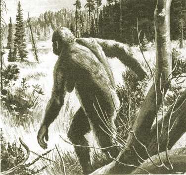

  
[Intangible Textual Heritage](../../index.md)  [Legendary
Creatures](../index.md) 

------------------------------------------------------------------------

[Buy this Book at
Amazon.com](https://www.amazon.com/exec/obidos/ASIN/1931882584/internetsacredte.md)

------------------------------------------------------------------------

[Buy this Book on
Kindle](https://www.amazon.com/exec/obidos/ASIN/B002G9UG0W/internetsacredte.md)

------------------------------------------------------------------------

<table width="75%">
<colgroup>
<col style="width: 50%" />
<col style="width: 50%" />
</colgroup>
<tbody>
<tr class="odd">
<td width="50%" data-valign="TOP"></td>
<td width="50%" data-valign="CENTER"><h1 id="abominable-snowmen-legend-come-to-life" data-align="CENTER">Abominable Snowmen, Legend Come to Life</h1>
<h2 id="by-ivan-t.-sanderson" data-align="CENTER">by Ivan T. Sanderson</h2>
<h4 id="section" data-align="CENTER">[1961]</h4></td>
</tr>
</tbody>
</table>

------------------------------------------------------------------------

[Contents](#contents)    [Start Reading](abs00.md)    [Page
Index](pageidx)    [Text \[Zipped\]](abs.txt.gz.md)

------------------------------------------------------------------------

|                                                                                                                           |
|---------------------------------------------------------------------------------------------------------------------------|
|  |

One day this fall, my sister-in-law visited me. We were exploring the
Santa Cruz mountains when we stumbled on the [Bigfoot
Museum](https://bigfootdiscoveryproject.com/.md), a little two-room tourist
attraction in downtown Boulder Creek. We were being regaled by the
proprietor with his tales of encounters with Bigfoot. I noticed this
book on his shelf and asked him about it. "Oh, that's the Bigfoot
'Bible,'" he said, "Sanderson started it all." The Bigfoot Bible! I knew
at that moment that I had to add it to this site.

Sanderson, (b. January 30, 1911, d. Feb. 19, 1973) was a naturalist and
science writer. He wrote a number of lively books about his adventures
searching for rare and 'exotic' species in Africa and the Caribbean.
Born in Scotland, Sanderson later became a US citizen. He was schooled
at Eton and Cambridge, with degrees in zoology, botany and geology, so
he was hardly an outsider to the field. He admired the works of [Charles
Fort](../../fort/index.md) and coined the word cryptozoology in the early
1940s to describe the study of unknown animals. Sanderson could be
skeptical, though, as befits a Fortean. His speculations on unknown
primates were informed by critical thinking and his years of observation
of animals in the wild.

This book was originally published in hardback in 1961 by Chilton,
(better known for their automobile technical manuals). The Chilton
edition has xv+505 pages, and lacks an index. Abominable Snowmen was
reprinted in heavily abridged form in paperback by Pyramid Books in
1968, as 'Abominable Snowmen, Legend Come to Life,' and the subtitle 'An
Account of Reports on the Existence of Ultra-Primitive Hominids on Five
Contients,' in all 365 pages, including an index. This etext was based
on the extended Chilton version, for copyright reasons.

PRODUCTION NOTES: Most of the map captions in this
book were placed on the facing page, but I have moved them underneath
the maps they describe. The plates, which originally appeared between
page 78 and 79, have been moved after the Contents page.--J. Lelievre,
November 17, 2008.

------------------------------------------------------------------------

 [Title Page](abs00.md)  
[Dedication](abs01.md)  
[Foreword](abs02.md)  
[Contents](abs03.md)  
[Plates](abs04.md)  
[1. A Certain Unpleasantness](abs05.md)  
[2. Ubiquitous Woodsmen](abs06.md)  
[3. Further Sasquatchery](abs07.md)  
[4. The Appearance of Bigfeet](abs08.md)  
[5. Footprints on the Sands of …](abs09.md)  
[6. In Our Own Back Yard](abs10.md)  
[7. Late North Americans](abs11.md)  
[8. On the Tracks of …](abs12.md)  
[9. Africa—the “Darkest”](abs13.md)  
[10. The East—the “Mysterious”](abs14.md)  
[11. The Great Mix-Up](abs15.md)  
[12. Anyone for Everest?](abs16.md)  
[13. The Western Approaches](abs17.md)  
[14. The Eastern Horizon](abs18.md)  
[15. Some Obnoxious Items](abs19.md)  
[16. Our Revered Ancestors](abs20.md)  
[17. In the Beginning …](abs21.md)  
[18. Some Basic Facts](abs22.md)  
[19. Sundry Objectionable Facts](abs23.md)  
[20. Certain Abominable Conclusions](abs24.md)  

### Appendices

[Contents of Appendices](abs25.md)  
[Appendix A. ABSMal Connotations](abs26.md)  
[Appendix B. The Importance of Feet](abs27.md)  
[Appendix C. Where We Come In](abs28.md)  
[Appendix D. Others Involved](abs29.md)  
[Appendix E. Sir Edmund Hillary's Scalp—A News Story from
Nepal](abs30.md)  

 

[Bibliography](abs31.md)  
