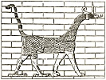

  
[Intangible Textual Heritage](../../index.md)  [Legendary
Creatures](../index)  [Index](index)  [Previous](eod03)  [Next](eod05.md) 

------------------------------------------------------------------------

[Buy this Book at
Amazon.com](https://www.amazon.com/exec/obidos/ASIN/1434685950/internetsacredte.md)

------------------------------------------------------------------------

[Buy this Book on
Kindle](https://www.amazon.com/exec/obidos/ASIN/B002G9UG48/internetsacredte.md)

------------------------------------------------------------------------

  
*Evolution of the Dragon*, by G. Elliot Smith, \[1919\], at Intangible
Textual Heritage

------------------------------------------------------------------------

p. xvi p. xvii

#### LIST OF ILLUSTRATIONS.

|                                                                                                                                                                                                                                                                                                                                                                                                                                                                                                                                                                                                                                                                                                                                                                                                                                                                                                                                                                                                                                                                                                                                                                                                                                                                 |                                        |
|-----------------------------------------------------------------------------------------------------------------------------------------------------------------------------------------------------------------------------------------------------------------------------------------------------------------------------------------------------------------------------------------------------------------------------------------------------------------------------------------------------------------------------------------------------------------------------------------------------------------------------------------------------------------------------------------------------------------------------------------------------------------------------------------------------------------------------------------------------------------------------------------------------------------------------------------------------------------------------------------------------------------------------------------------------------------------------------------------------------------------------------------------------------------------------------------------------------------------------------------------------------------|----------------------------------------|
|                                                                                                                                                                                                                                                                                                                                                                                                                                                                                                                                                                                                                                                                                                                                                                                                                                                                                                                                                                                                                                                                                                                                                                                                                                                                 | FACING PAGE |
| Fig. 1.—The conventional Egyptian representation of the burning of incense and the pouring of libations                                                                                                                                                                                                                                                                                                                                                                                                                                                                                                                                                                                                                                                                                                                                                                                                                                                                                                                                                                                                                                                                                                                                                         | [2](eod05.htm#img_fig01.md)               |
| Fig. 2.—Water-colour sketch by Mrs. Cecil Firth, representing a restoration of the early mummy found at Medûm by Professor Flinders Petrie, now in the Museum of the Royal College of Surgeons in London                                                                                                                                                                                                                                                                                                                                                                                                                                                                                                                                                                                                                                                                                                                                                                                                                                                                                                                                                                                                                                                        | [16](eod08.htm#img_fig02.md)              |
| Fig. 3.—A mould taken from a life-mask found in the Pyramid of Teta by Mr. Quibell.                                                                                                                                                                                                                                                                                                                                                                                                                                                                                                                                                                                                                                                                                                                                                                                                                                                                                                                                                                                                                                                                                                                                                                             | [17](eod08.htm#img_fig03.md)              |
| Fig. 4.—Portrait statue of an Egyptian lady of the Pyramid Age                                                                                                                                                                                                                                                                                                                                                                                                                                                                                                                                                                                                                                                                                                                                                                                                                                                                                                                                                                                                                                                                                                                                                                                                  | [18](eod08.htm#img_fig04.md)              |
| Fig. 5.—Statue of an Egyptian noble of the Pyramid Age to show the technical skill in the representation of life-like eyes                                                                                                                                                                                                                                                                                                                                                                                                                                                                                                                                                                                                                                                                                                                                                                                                                                                                                                                                                                                                                                                                                                                                      | [52](eod13.htm#img_fig05.md)              |
| Fig. 6.—Representation of the ancient Mexican worship of the Sun                                                                                                                                                                                                                                                                                                                                                                                                                                                                                                                                                                                                                                                                                                                                                                                                                                                                                                                                                                                                                                                                                                                                                                                                | [70](eod16.htm#img_fig06.md)              |
| Fig. 7.—A mediæval picture of a Chinese Dragon upon its cloud (after the late Professor W. Anderson)                                                                                                                                                                                                                                                                                                                                                                                                                                                                                                                                                                                                                                                                                                                                                                                                                                                                                                                                                                                                                                                                                                                                                            | [80](eod21.htm#img_fig07.md)              |
| Fig. 8.—A Chinese Dragon (after de Groot)                                                                                                                                                                                                                                                                                                                                                                                                                                                                                                                                                                                                                                                                                                                                                                                                                                                                                                                                                                                                                                                                                                                                                                                                                       | [80](eod21.htm#img_fig08.md)              |
| Fig. 9.—Dragon from the Ishtar Gate of Babylon                                                                                                                                                                                                                                                                                                                                                                                                                                                                                                                                                                                                                                                                                                                                                                                                                                                                                                                                                                                                                                                                                                                                                                                                                  | [81](eod21.htm#img_fig09.md)              |
| Fig. 10.—Babylonian Weather God                                                                                                                                                                                                                                                                                                                                                                                                                                                                                                                                                                                                                                                                                                                                                                                                                                                                                                                                                                                                                                                                                                                                                                                                                                 | [81](eod21.htm#img_fig10.md)              |
| Fig. 11.—Reproduction of a picture in the Maya Codex Troano representing the Rain-god *Chac* treading upon the Serpent's head, which is interposed between the earth and the rain the god is pouring out of a bowl. A Rain-goddess stands upon the Serpent's tail                                                                                                                                                                                                                                                                                                                                                                                                                                                                                                                                                                                                                                                                                                                                                                                                                                                                                                                                                                                               | [84](eod22.htm#img_fig11.md)              |
| Fig. 12.—Another representation of the elephant-headed Rain-god. He is holding thunderbolts, conventionalized in a hand-like form. The serpent is converted into a sac, holding up the rain-waters                                                                                                                                                                                                                                                                                                                                                                                                                                                                                                                                                                                                                                                                                                                                                                                                                                                                                                                                                                                                                                                              | [84](eod22.htm#img_fig12.md)              |
| Fig. 13.—A page (the 36th) of the Dresden Maya Codex                                                                                                                                                                                                                                                                                                                                                                                                                                                                                                                                                                                                                                                                                                                                                                                                                                                                                                                                                                                                                                                                                                                                                                                                            | [86](eod22.htm#img_fig13.md)              |
| Fig. 14.—A. The so-called "sea-goat" of Babylonia, a creature compounded of the antelope and fish of Ea.—B. The "sea-goat" as the vehicle of Ea or Marduk.—C to K—a series of varieties of the *makara* from the Buddhist Rails at Buddha Gaya and Mathura, circa 70 B.C.–70 A.D., after Cunningham ("Archæological Survey of India," Vol. III, 1873, Plates IX and XXIX).—L. The *makara* as the vehicle of Varuna, after Sir George Birdwood. It is not difficult to understand how, in the course of the easterly diffusion of culture, such a picture should develop into the Chinese Dragon or the American elephant-headed god                                                                                                                                                                                                                                                                                                                                                                                                                                                                                                                                                                                                                            | [88](eod22.htm#img_fig14.md)              |
| Fig. 15.—Photograph of a Chinese embroidery in the Manchester School of Art representing the Dragon and the Pearl-Moon Symbol                                                                                                                                                                                                                                                                                                                                                                                                                                                                                                                                                                                                                                                                                                                                                                                                                                                                                                                                                                                                                                                                                                                                   | [98](eod22.htm#img_fig15.md)              |
| p. xviii                                                                                                                                                                                                                                                                                                                                                                                                                                                                                                                                                                                                                                                                                                                                                                                                                                                                                                                                                                                                                                                                                                                                                                                                                           |                                        |
|                                                                                                                                                                                                                                                                                                                                                                                                                                                                                                                                                                                                                                                                                                                                                                                                                                                                                                                                                                                                                                                                                                                                                                                                                                                                 | FACING PAGE |
| Fig. 16.—The God of Thunder (from a Chinese drawing (? 17th Century) in the John Rylands Library)                                                                                                                                                                                                                                                                                                                                                                                                                                                                                                                                                                                                                                                                                                                                                                                                                                                                                                                                                                                                                                                                                                                                                               | [136](eod29.htm#img_fig16.md)             |
| Fig. 17.—From Joannes de Turrecremata's "Meditationes seu Contemplationes" *Rome: Ulrich Han*, 1467                                                                                                                                                                                                                                                                                                                                                                                                                                                                                                                                                                                                                                                                                                                                                                                                                                                                                                                                                                                                                                                                                                                                                             | [137](eod29.htm#img_fig17.md)             |
| Fig. 18.—(*a*) The Archaic Egyptian slate palette of Narmer showing, perhaps, the earliest design of Hathor (at the upper corners of the palette) as a woman with cow's horns and ears (compare Flinders Petrie "The Royal Tombs of the First Dynasty," Part I, 1900, Plate XXVII, Fig., 71). The pharaoh is wearing a belt from which are suspended four cow-headed Hathor figures in place of the cowry-amulets of more primitive peoples. This affords corroboration of the view that Hathor assumed the functions originally attributed to the cowry-shell. (*b*) The king's sporran, where Hathor-heads (*H*) take the place of the cowries of the primitive girdle                                                                                                                                                                                                                                                                                                                                                                                                                                                                                                                                                                                        | [150](eod32.htm#img_fig18.md)             |
| Fig. 19.—The front of Stela B (famous for the realistic representations of the Indian elephant at its upper corners), one of the ancient Maya monuments at Copan, Central America (after Maudslay's photograph and diagram). The girdle of the chief figure is decorated both with shells (*Oliva* or *Conus*) and amulets representing human faces corresponding to the Hathor-heads on the Narmer palette (Fig. 18)                                                                                                                                                                                                                                                                                                                                                                                                                                                                                                                                                                                                                                                                                                                                                                                                                                           | [151](eod32.htm#img_fig19.md)             |
| Fig. 20.—Diagrams illustrating the form of cowry-belts worn in (*a*) East Africa and (*b*) Oceania respectively. (*c*) Ancient Indian girdle (from the figure of Sirima Devata on the Bharat Tope), consisting of strings of pearls and precious stones, and what seem to be (fourth row from the top) models of cowries. (*d*) The Copan girdle (from Fig. 19) in which both shells and heads of deities arc represented. The two objects suspended from the belt between the heads recall Hathor's sistra                                                                                                                                                                                                                                                                                                                                                                                                                                                                                                                                                                                                                                                                                                                                                     | [154](eod32.htm#img_fig20.md)             |
| Fig. 21.—(*a*) A slate triad found by Professor G. A. Reisner in the temple of the Third Pyramid at Giza. It shows the Pharaoh Mycerinus supported on his right side by the goddess Hathor, represented as a woman with the moon and the cow's horns upon her head, and on the left side by a nome goddess, bearing upon her head the jackal-symbol of her nome. (*b*) The Ecuador Aphrodite. Bas-relief from Cerro-Jaboncillo (after Saville, "Antiquities of Manabi, Ecuador," Preliminary Report, 1907, Plate XXXVIII). A grotesque composite monster intended to represent a woman (compare Saville's Plates XXXV, XXXVI, and XXXIX), whose head is a conventionalized Octopus, whose body is a *Loligo*, and whose limbs are human                                                                                                                                                                                                                                                                                                                                                                                                                                                                                                                         | [164](eod35.htm#img_fig21.md)             |
| Fig. 22.—(*a*) *Sepia officinalis*, after Tryon, "Cephalopoda". (*b*) *Loligo vulgaris*, after Tryon. (*c*) The position usually adopted by the resting Octopus, after Tryon                                                                                                                                                                                                                                                                                                                                                                                                                                                                                                                                                                                                                                                                                                                                                                                                                                                                                                                                                                                                                                                                                    | [168](eod36.htm#img_fig22.md)             |
| Fig. 23.—A series of Mycenæan conventionalizations of the Argonaut and the Octopus (after Tümpel), which provided the basis for Houssay's theory of the origin of the triskele (*a*, *c*, and *d*) and swastika (*b* and *e*), and Siret's theory to explain the design of Bes's face (*f* and *g*)                                                                                                                                                                                                                                                                                                                                                                                                                                                                                                                                                                                                                                                                                                                                                                                                                                                                                                                                                             | [172](eod36.htm#img_fig23.md)             |
| Fig. 24.—(*a*) and (*b*) Two Mycenæan pots (after Schliemann). (*a*) The so-called "owl-shaped" vase is really a representation of the Mother-Pot in the form of a conventionalized Octopus (Houssay). (*b*) The other vase represents the Octopus Mother-Pot, with a jar upon her head and another in her hands-a three-fold representation of the Great Mother as a pot. (*c*) A Cretan vase from Gournia in which the Octopus-motive is represented as a decoration                                                                                                                                                                                                                                                                                                                                                                                                                                                                                                                                                                                                                                                                                                                                                                                          |                                        |
| p. xix                                                                                                                                                                                                                                                                                                                                                                                                                                                                                                                                                                                                                                                                                                                                                                                                                                                                                                                                                                                                                                                                                                                                                                                                                               |                                        |
|                                                                                                                                                                                                                                                                                                                                                                                                                                                                                                                                                                                                                                                                                                                                                                                                                                                                                                                                                                                                                                                                                                                                                                                                                                                                 | FACING PAGE |
| upon the pot instead of in its form. (*d*), (*e*), (*f*), (*g*), and (*h*) A series of coins from Central Greece (after Head) showing a series of conventionalizations of the Octopus, with its pot-like body and palm-tree-like arms (*f*). (*i*) Sepia officinalis (after Tryon). (*h*) and (*l*) The so-called "spouting vases" in the hands of the Babylonian god Ea, from a cylinder seal of the time of Gudea, Patesi of Tello, after Ward ("Seal Cylinders, etc.," p. 215)                                                                                                                                                                                                                                                                                                                                                                                                                                                                                                                                                                                                                                                                                                                                                                               | [180](eod38.htm#img_fig24.md)             |
| Fig. 25.—(*a*) Winged Disk from the Temple of Thothmes I. (*b*) Persian design of Winged Disk above the Tree of Life (Ward, "Seal Cylinders of Western Asia," Fig. 1109). (*c*) Assyrian or Syro-Hittite design of the Winged Disk and Tree of Life in an extremely conventionalized form (Ward, Fig. 1310). (*d*) Assyrian conventionalized Winged Disk and Tree of Life, from the design upon the dress of Assurnazipal (Ward, Fig. 670). (*e*) Part of the design from a tablet of the time of Dungi (Ward, Fig. 663). (*f*) Design on a Cretan sarcophagus from Hagia Triada (Blinckenberg, Fig. 9). (*g*) Double axe from a gold signet from Acropolis Treasure, Mycenæ (after Sir Arthur Evans, "Mycenæan Tree and Pillar Cult," p. 10). (*h*) Assyrian Winged Disk (Ward, Fig. 608). (*i*) "Primitive Chaldean Winged Gate" (Ward, Fig. 349). (*k*) Persian Winged Disk (Ward, Fig. 1144). (*l*) An Assyrian Tree of Life and Winged Disk crudely conventionalized (Ward, Fig. 691). (*m*) Assyrian Tree of Life and Winged Disk in which the god is riding in a crescent replacing the Disk (Ward, Fig. 695)                                                                                                                                            | [184](eod39.htm#img_fig25.md)             |
| Fig. 26.—(*a*) An Egyptian picture of Hathor between the mountains of the horizon (on which trees are growing) (after Budge, "Gods of the Egyptians," Vol. II, p. 101). (*b*) The mountains of the horizon supporting a cow's head as a surrogate of Hathor, from a stele found at Teima in Northern Arabia, now in the Louvre (after Sir Arthur Evans, *op. cit.*, p. 39). (*c*) The Mesopotamian sun-god Shamash rising between the Eastern Mountains, the Gates of Dawn (Ward, *op. cit.*, p. 373). (*d*) The familiar Egyptian representation of the sun rising between the Eastern Mountains (the splitting of the mountain giving birth to "the ridiculous mouse"—Smintheus). (*e*) Part of the design from a Mycenæan vase from Old Salamis (after Evans, p. 9). (*f*) Part of the design from a lentoid gem from the Idæan Cave, now in the Candia Museum (after Evans, Fig. 25). (*g*) The Eastern Mountains supporting the pillar-form of the goddess (after Evans, Fig. 66). (*h*) Another Mycenæan design comparable with (*c*). (*i*) Design from a signet-ring from Mycenæ (after Evans, Fig. 34). (*k*) The famous sculpture above the Lion Gate at Mycenæ                                                                                       | [188](eod39.htm#img_fig26.md)             |
|                                                                                                                                                                                                                                                                                                                                                                                                                                                                                                                                                                                                                                                                                                                                                                                                                                                                                                                                                                                                                                                                                                                                                                                                                                                                 |                                        |
| **ILLUSTRATIONS IN THE TEXT.**                                                                                                                                                                                                                                                                                                                                                                                                                                                                                                                                                                                                                                                                                                                                                                                                                                                                                                                                                                                                                                                                                                                                                                                                                                  |                                        |
|                                                                                                                                                                                                                                                                                                                                                                                                                                                                                                                                                                                                                                                                                                                                                                                                                                                                                                                                                                                                                                                                                                                                                                                                                                                                 | PAGE        |
| Fig. 1.—Early representation of a "Dragon" compounded of the forepart of an eagle and the hindpart of a lion (from an Archaic Cylinder seal from Susa, after Jequier)                                                                                                                                                                                                                                                                                                                                                                                                                                                                                                                                                                                                                                                                                                                                                                                                                                                                                                                                                                                                                                                                                           | [79](eod21.htm#img_07900.md)              |
| Fig. 2.—The earliest Babylonian conception of the Dragon Tiamat (from a Cylinder-seal in the British Museum, after L. W. King)                                                                                                                                                                                                                                                                                                                                                                                                                                                                                                                                                                                                                                                                                                                                                                                                                                                                                                                                                                                                                                                                                                                                  | [79](eod21.htm#img_07900.md)              |
| Fig. 3.—Wm. Dennis's drawing of the "Flying Dragon" depicted on the rocks at Piasa, Illinois                                                                                                                                                                                                                                                                                                                                                                                                                                                                                                                                                                                                                                                                                                                                                                                                                                                                                                                                                                                                                                                                                                                                                                    | [94](eod22.htm#img_09400.md)              |
| Fig. 4.—Two representations of Astarte (Qetesh)                                                                                                                                                                                                                                                                                                                                                                                                                                                                                                                                                                                                                                                                                                                                                                                                                                                                                                                                                                                                                                                                                                                                                                                                                 | [155](eod33.htm#img_15500.md)             |
| Pig. 5.—*Pterocera bryonia*, the Red Sea spider-shell 170                                                                                                                                                                                                                                                                                                                                                                                                                                                                                                                                                                                                                                                                                                                                                                                                                                                                                                                                                                                                                                                                                                                                                                                                       |                                        |
| p. xx                                                                                                                                                                                                                                                                                                                                                                                                                                                                                                                                                                                                                                                                                                                                                                                                                                                                                                                                                                                                                                                                                                                                                                                                                                 |                                        |
|                                                                                                                                                                                                                                                                                                                                                                                                                                                                                                                                                                                                                                                                                                                                                                                                                                                                                                                                                                                                                                                                                                                                                                                                                                                                 | PAGE        |
| Fig. 6.—(*a*) Picture of a bowl of water—the hieroglyphic sign equivalent to *hm* (the word *hmt* means "woman"—Griffith, "Beni Hasan," Part III, Plate VI, Fig. 88 and p. 29). (*b*) "A basket of sycamore figs"—Wilkinson's "Ancient Egyptians," Vol. I, p. 323. (*c*) and (*d*) are said by Wilkinson to be hieroglyphic signs meaning "wife" and are apparently taken from (*b*). But (*c*) is identical with (*i*), which, according to Griffith (p. 14), represents a bivalve shell (g, from Plate III, Fig. 3), more usually placed obliquely (*h*). The varying conventionalizations of (*a*) or (*b*) are shown in (*d*), (*e*), and (*f*) (Griffith, Hieroglyphics," p. 34). (*k*) The sign for a lotus leaf, which is a phonetic equivalent of the sign (*h*), and, according to Griffith ("Hieroglyphics," p. 26), "is probably derived from the same root, on account of its shell-like outline". (*l*) The hieroglyphic sign for a pot of water in such words as *Nu* and *Nut*. (in) A "pomegranate" (replacing a bust of Tanit) upon a sacred column at Carthage (Arthur J. Evans, "Mycenæan Tree and Pillar Cult," p. 46). (*n*) The form of the body of an octopus as conventionalized on the coins of Central Greece (compare Fig. 24 (*d*)) | [179](eod38.htm#img_17900.md)             |
| Fig. 7.—(*a*) An Egyptian design representing the sun-god Horus emerging from a lotus, representing his mother Hathor (Isis). (*b*) Papyrus sceptre often carried by goddesses and animistically identified with them either as an instrument of life-giving or destruction. (*c*) Conventionalized lily—the prototype of the trident and the thunder-weapon. (*d*) A water-plant associated with the Nile-gods                                                                                                                                                                                                                                                                                                                                                                                                                                                                                                                                                                                                                                                                                                                                                                                                                                                 | [180](eod38.htm#img_18000.md)             |
| Fig. 8.—(*a*) "Ceremonial forked object," or "magic wand," used in the ceremony of "opening the mouth," possibly connected with (*b*) (a bicornuate uterus), according to Griffith ("Hieroglyphics," p. 60). (*c*) The Egyptian sign for a key. (*d*) The double axe of Crete and Egypt                                                                                                                                                                                                                                                                                                                                                                                                                                                                                                                                                                                                                                                                                                                                                                                                                                                                                                                                                                         | [191](eod39.htm#img_19100.md)             |
| Fig. 9.—The Egyptian emblem for gold, the sign *nub*                                                                                                                                                                                                                                                                                                                                                                                                                                                                                                                                                                                                                                                                                                                                                                                                                                                                                                                                                                                                                                                                                                                                                                                                            | [222](eod44.htm#img_22200.md)             |

------------------------------------------------------------------------

[Next: Introduction](eod05.md)
