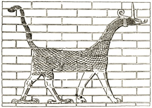

  
[Intangible Textual Heritage](../../index.md)  [Legendary
Creatures](../index.md) 

------------------------------------------------------------------------

[Buy this Book at
Amazon.com](https://www.amazon.com/exec/obidos/ASIN/1434685950/internetsacredte.md)

------------------------------------------------------------------------

[Buy this Book on
Kindle](https://www.amazon.com/exec/obidos/ASIN/B002G9UG48/internetsacredte.md)

------------------------------------------------------------------------

<table width="75%">
<colgroup>
<col style="width: 50%" />
<col style="width: 50%" />
</colgroup>
<tbody>
<tr class="odd">
<td width="50%" data-valign="TOP"> 
The Dragon on Ishtar's Gate</td>
<td width="50%" data-valign="CENTER"><h1 id="the-evolution-of-the-dragon" data-align="CENTER">The Evolution of the Dragon</h1>
<h2 id="by-g.-elliot-smith" data-align="CENTER">by G. Elliot Smith</h2>
<h4 id="section" data-align="CENTER">[1919]</h4></td>
</tr>
</tbody>
</table>

------------------------------------------------------------------------

[Contents](#contents)    [Start Reading](eod00.md)    [Page
Index](pageidx)    [Text \[Zipped\]](eod.txt.gz.md)

------------------------------------------------------------------------

|                                                                                                                           |
|---------------------------------------------------------------------------------------------------------------------------|
|  |

This is a set of three connected essays on the symbolism and development
of the concept of the dragon in world mythology. The author, Grafton
Elliot Smith (b. 1871, d. 1937), was Australian by birth, and an
anatomist by profession. Smith wrote this while a Professor of Anatomy
in Manchester, doing ground-breaking work on the evolution of the
primate brain. He also treated veterans of WWI and did some of the
earliest work on 'shell-shock,' today known as post-traumatic stress
disorder.

His views on the origin of culture have not fared as well. Smith was a
diffusionist, a school of thought popular in the late 19th and early
20th century which attempted to trace diverse cultural phenomena to
unitary geographic points of origin. One example of this is Donnelly's
[Atlantis](../../atl/ataw/index.md), which Donnelly proposed was the mother
of all cultures. Smith, a bit more mainstream, traced the development of
megalithic culture to Egypt, radiating out to distant lands, including
America. Today, we know that megalithic culture preceded ancient
Egyptian civilization, in some places by millennia, and developed
independently in widely spaced geographic locations.

In this book, a compilation of three lecture series which he delivered
shortly after WWI, Smith proposed a theory of how the dragon originated
as a representation of the Mother Goddess, a symbol of the power and
mystery of nature, and later evolved into a symbol of evil, turning into
the prototype for the Christian devil. He uses linguistic, ethnographic,
and biological data to bolster his theory. While in some respects a
difficult book, depending on one's attention span, it is also a
browser's delight. We learn about the origin of clothing, the water of
immortality which [Gilgamesh](../../ane/eog/index.md) sought, and the
symbolism, folklore and biology of the octopus, mandrake, pearls, cowry
shells, etc. In particular, students of comparative mythology will enjoy
this book, even if they reject Smith's hyperdiffusionist views.

------------------------------------------------------------------------

 [Title Page](eod00.md)  
[Corrigenda](eod01.md)  
[Preface](eod02.md)  
[Contents](eod03.md)  
[List of Illustrations](eod04.md)  

### Chapter I. Incense and Libations

[Introduction](eod05.md)  
[The Beginning of Stone-Working](eod06.md)  
[The Origin of Embalming](eod07.md)  
[Early Mummies](eod08.md)  
[The Significance of Libations](eod09.md)  
[Early Biological Theories](eod10.md)  
[Incense](eod11.md)  
[The Breath of Life](eod12.md)  
[The Power of the Eye](eod13.md)  
[The Moon and the Sky-World](eod14.md)  
[The Worship of the Cow](eod15.md)  
[The Diffusion of Culture](eod16.md)  
[Summary](eod17.md)  
[Appendix A](eod18.md)  
[Appendix B](eod19.md)  
[Appendix C](eod20.md)  

### Chapter II. Dragons and Rain Gods

[Introduction](eod21.md)  
[The Dragon in America and Eastern Asia](eod22.md)  
[The Evolution of the Dragon](eod23.md)  
[The Dragon Myth](eod24.md)  
[The Thunder-Weapon](eod25.md)  
[The Deer](eod26.md)  
[The Ram, The Pig](eod27.md)  
[Certain Incidents in the Dragon Myth](eod28.md)  
[The Ethical Aspect](eod29.md)  

### Chapter III. The Birth of Aphrodite

[Introduction](eod30.md)  
[The Search for the Elixir of Life. Blood as Life.](eod31.md)  
[The Cowry as a Giver of Life](eod32.md)  
[The Origin of Clothing](eod33.md)  
[Pearls](eod34.md)  
[Sharks and Dragons](eod35.md)  
[The Octopus](eod36.md)  
[The Swastika](eod37.md)  
[The Mother Pot](eod38.md)  
[Artemis and the Guardian of the Portal](eod39.md)  
[The Mandrake](eod40.md)  
[The Measurement of Time](eod41.md)  
[The Seven-Headed Dragon](eod42.md)  
[The Pig](eod43.md)  
[Gold and the Golden Aphrodite](eod44.md)  
[Aphrodite as the Thunder-Stone](eod45.md)  
[The Serpent and the Lioness](eod46.md)  

 

[Advertisements](eod47.md)  
