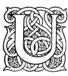

  
[Intangible Textual Heritage](../../index.md)  [Legendary
Creatures](../index)  [Symbolism](../../sym/index)  [Index](index.md) 
[Previous](fsca00)  [Next](fsca02.md) 

------------------------------------------------------------------------

[Buy this Book at
Amazon.com](https://www.amazon.com/exec/obidos/ASIN/B002D48Q8Y/internetsacredte.md)

------------------------------------------------------------------------

  
*Fictitious and Symbolic Creatures in Art*, by John Vinycomb, \[1909\],
at Intangible Textual Heritage

------------------------------------------------------------------------

p. v

### PREFACE

|                     |
|---------------------|
|  |

UNDER the title of this book it is proposed to describe and illustrate
only those fictitious and symbolic creatures which appear in British
Heraldry. The list will include all those beings of whose existence we
have not the direct evidence of our senses, and those exaggerations and
combinations of natural forms which have been adopted in the system of
symbolic heraldry handed down to us from the Middle Ages. Many of the
ideas of the writers of that period were undoubtedly derived from still
earlier sources, namely, classic story, sacred and legendary art, and
the marvellous tales of early travellers; others were the coinage of
their own fancies and their fears.

As these unreal beings are constantly met with in symbolic art, of which
heraldry is the chief exponent, it may be assumed that they have been
adopted in each case with some obvious or latent meaning, as in

p. vi

the case of real animals; they may, therefore, equally lay claim to our
consideration as emblems or types, more especially as less attention has
been devoted to them and the delineation of their forms by competent
artists. The writer has been led into considering and investigating the
subject with some degree of attention, from finding the frequent need of
some reliable authority, both descriptive and artistic, such as would
enable any one to depict with accuracy and true heraldic spirit the
forms and features of these chimerical beings. Books of reference on
heraldry unfortunately give but a meagre description of their shapes,
with scarcely a hint as to their history or meaning, while the
illustrations are usually stiff and awkward, representing a soulless
state of art.

It cannot be said that artists at any period have succeeded, even in a
remote degree, in embodying the highly wrought conceptions of the poets
concerning these terrible creatures of the imagination. Milton seems to
have carried poetic personification to its utmost limits. Who, for
instance, could depict a being like this:

            "Black it stood as night,  
 Fierce as ten furies, terrible as hell!"

Out of the ambiguous and often conflicting accounts

p. vii

of different authors and the vagaries of artists it became no easy task
to arrive at a clear conception of many of the forms of these ideal
monsters. The poet's pen may turn them to shapes, shadowy at the best;
but the artist who follows the poet in endeavouring to realise and give
tangible shape to these ideas finds it beyond his art to give material
form and expression to his personifications with anything like
photographic fidelity Such shadowy beings prefer the dim light of
allegory to the clear sunlight of reason, and shrink from closer
inspection. Like all spectres they are ever most effective in the dark.
In the childhood of the world, from the dawn of history, and all through
the dim and credulous ages past, many such illusions have performed an
important part in influencing the thought and lives of mankind. Over
many lands these inherited ideas still exercise a paramount influence,
but in the enlightenment of the coming time it is probable their power,
like that of an evil dream, will fade entirely away with the dawn of a
brighter day, and the memories of their name and influence alone remain.
At present we are chiefly concerned with them as symbols, and with their
mode of representation, breathing for a brief moment the breath of life
into their old dead skins. These mythical creatures may be gazed upon,
shorn of all

p. viii

their terrors, in the illustrations I have been enabled to make, and if
it is found that from each creature I have not "plucked out the heart of
its mystery" it is probably because there is no mystery whatever about
it, only what to us now appears as an ingenious fiction engendered by a
credulous, imaginative and superstitious past. And so we find the old
horrors and pleasing fictions, after figuring for ages as terrible or
bright realities in the minds of entire peoples, reduced at length to
the dead level of a figure of speech and a symbol merely.

J. Vinycomb.

Holywood,  
     County Down,  
         *April* 1906.

------------------------------------------------------------------------

[Next: Contents](fsca02.md)
