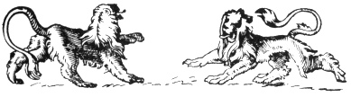

  
[Intangible Textual Heritage](../../index)  [Legendary
Creatures](../index)  [Symbolism](../../sym/index)  [Index](index) 
[Previous](fsca04)  [Next](fsca06) 

------------------------------------------------------------------------

[Buy this Book at
Amazon.com](https://www.amazon.com/exec/obidos/ASIN/B002D48Q8Y/internetsacredte)

------------------------------------------------------------------------

  
*Fictitious and Symbolic Creatures in Art*, by John Vinycomb, \[1909\],
at Intangible Textual Heritage

------------------------------------------------------------------------

p. 13

# Notes on Animated Beings in Heraldic Art

p. 14 p. 15

 

### Notes on Animated Beings in Heraldic Art

"*One chief source of illustration is to be found in the most brilliant,
and in its power on character, hitherto the most effective of the
Arts—HERALDRY*."  
                    Ruskin,  
         "Relation of Wise Art and Wise Science."

|                    |
|--------------------|
|  |

HERALDRY is *par excellence* the science of symbols. A pictorial device
is subject to no exact or regular law, provided it carries its meaning
with it. Heraldry, on the contrary, insists on the observance of certain
definite and easily understood rules constituting it a science, by the
observance of which any one acquainted with heraldic language may, from
a concise written description (or *blazon* as it is termed), reconstruct
at any time the symbol or series of symbols intended, and with perfect
accuracy; for a heraldic emblem once adopted remains unchangeable, no
matter with what amount of naturalness or conventionality it may be
done, or with what quaintness

p. 16

or even grotesqueness it may be treated; the symbol remains intact. "*A
lion rampant*," "*a dragon*," or any other heraldic figure is,
therefore, a fixed and immutable idea, and not to be confounded with any
other, no matter what the style of artistic or decorative treatment it
may receive.

Notwithstanding the evident intention everywhere in heraldry to be
symbolic, in attitude as well as in tinctures, we find the greatest
errors and absurdities constantly perpetrated. To many it seems as if it
was not considered essential to acquire a knowledge of the rudiments of
the science. Heraldry is a living language, and when the attempt is made
to express it without proper knowledge the result can only be
unmitigated nonsense. By inattention to those principles which regulate
the *attitude*, the *tinctures*, and the disposition of every part of an
armorial achievement, discredit is brought upon the subject, which
should fall upon the head of the ignorant designer alone. No matter what
heraldic position of an animal may be blazoned (though it admits of only
one interpretation), we find the most unwarrantable latitude frequently
taken by otherwise skilful artists in depicting it. The designer becomes
a law unto himself, and it is posed and treated in a way to suit the
fancy of the moment. A lion is only a lion to him, and it is nothing
more. To the true herald it is very much more. As a mild instance, see
the unkind treatment meted out to the supporters of the Royal Arms. The
lion and unicorn are both

p. 17

\[paragraph continues\] "rampant," and the
head of the lion is turned towards the spectator (termed guardant). Not
content to be represented in the regulation positions, they will be
found depicted in most strange and fantastic attitudes not recognised in
heraldry—not supporting or guarding the shield, which is their special
function. At the head of the *Times* newspaper they are represented
playing at hide and seek round the shield; elsewhere we see them
capering and prancing, or we find them sitting, like begging dogs, as if
ashamed of themselves and their vocation.

I may here quote from a most admirable work: "That the decorative beauty
of heraldry, far from being that of form and colour alone, was also an
imaginative one depending much on the symbolic meaning of its designs,
there can be no doubt. . . . Early Christian Art was full of symbols,
whose use and meaning were discussed in treatises from the second
century onwards. By the eleventh it had become systemised and ranged
under various heads,—Bestiaria for beasts, Volucaria for birds, and
Lapidaria for stones. It permeated the whole life of the people in its
religious uses, and entered romantically into the half-religious,
half-mystical observances of chivalry, the very armour of the valiant
knight being full of meanings which it was his duty to know." [\*](#fn_0)

------------------------------------------------------------------------

### Footnotes

[17:\*](fsca05.htm#fr_0) "Decorative Heraldry,"
by G. W. Eve.

------------------------------------------------------------------------

[Next: The Symbolism of Attitude or Position](fsca06)
