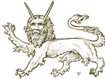

  
[Intangible Textual Heritage](../../index.md)  [Legendary
Creatures](../index)  [Symbolism](../../sym/index)  [Index](index.md) 
[Previous](fsca06)  [Next](fsca08.md) 

------------------------------------------------------------------------

[Buy this Book at
Amazon.com](https://www.amazon.com/exec/obidos/ASIN/B002D48Q8Y/internetsacredte.md)

------------------------------------------------------------------------

  
*Fictitious and Symbolic Creatures in Art*, by John Vinycomb, \[1909\],
at Intangible Textual Heritage

------------------------------------------------------------------------

p. 22

### The Heraldic Spirit—Effective decorative Quality essential in Heraldry

It will be observable that in the hands
of a capable designer imbued with the true heraldic spirit, all objects,
animate and inanimate, conform after their kind to decorative
necessities, and assume shapes more or less conventional, and, as far as
is consistent with effective display of the charge, are made to
accommodate themselves to the space they must occupy. Fierce and savage
beasts are made to look full of energy and angry power, while
gentle-natured creatures are made to retain their harmless traits. In a
monster of the dragon tribe, strong leathern wings add to his terrors;
his jaws are wide, his claws are strong and sharp; he is clothed in
impenetrable armour of plates and scales, his breath is fire and flame,
lightning darts from his eyes, he lashes his tail in fury; and all the
while the artist is most careful so to spread the creature out on shield
or banner that all his powers shall be displayed at once.

Whatever liberty the artist may take in his interpretation of the form
of bird, beast, or monster, there is, however, a limit to his licence
beyond which he may not go. He may not alter the recognised symbolic
attitude, nor change the tincture; he is scarcely at liberty to add a
feature. He may curl the mane of his lion, fancifully develop its tongue

p. 23

and tail, and display its claws in a manner for which there is little or
no authority in nature; but if he add wings, or endow it with a
plurality of heads or tails, it instantly becomes another creature and a
totally different symbol. [\*](#fn_1.md) A wise
reticence in treatment is more to be commended than such fanciful
extravagance.

The early artists and heralds, in their strivings to exaggerate in a
conventional manner the characteristics of animals for their most
effective display, appear to have reached the limits of which their art
was capable, and important lessons may be gained from their works. With
the extended knowledge of natural history, and the advanced state of art
at the present day, decorative and symbolic heraldry should take a
leading place in the twentieth century, as in the words of Ruskin, it
has been "hitherto the most brilliant" and "most effective of the Arts."

------------------------------------------------------------------------

### Footnotes

[23:\*](fsca07.htm#fr_1.md) The above notes on
heraldic treatment are largely adapted from the admirable works on
Decorative Art, by Louis F. Day.

------------------------------------------------------------------------

[Next: Angels](fsca08.md)
