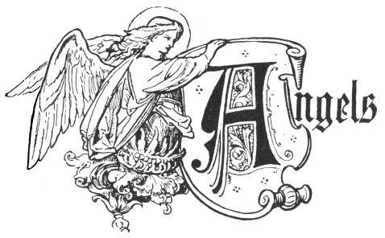
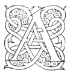

  
[Intangible Textual Heritage](../../index.md)  [Legendary
Creatures](../index)  [Symbolism](../../sym/index)  [Index](index.md) 
[Previous](fsca07)  [Next](fsca09.md) 

------------------------------------------------------------------------

[Buy this Book at
Amazon.com](https://www.amazon.com/exec/obidos/ASIN/B002D48Q8Y/internetsacredte.md)

------------------------------------------------------------------------

  
*Fictitious and Symbolic Creatures in Art*, by John Vinycomb, \[1909\],
at Intangible Textual Heritage

------------------------------------------------------------------------

p. 24 p. 25

# Celestial Beings

p. 26 p. 27

 

### Angels

"They boast ethereal vigour and are form’d  
 From seeds of heavenly birth.—Virgil.

"Down hither prone in flight  
 He speeds, and through the vast ethereal sky  
 Sails between world and world with steady wings:  
 Now on the polar wind, then with quick fan  
 Winnows the buxom air."—Milton.

|                    |
|--------------------|
|  |

ANGELS and Archangels the mind loves to contemplate as the ministers of
God's omnipotence and beneficence, and delights in believing these
celestial beings to be endowed with a higher and purer intelligence, and
as being nearer to the divine nature. In all ages civilised man has
thought of them and represented them in art as of

p. 28

form like to his own, and with attributes of volition and power
suggested by wings. Scripture itself justifies the similitude; the
Almighty is sublimely represented as "walking upon the wings of the
wind." Wings have always been the symbol or attribute of

 

*volition*, of *mind*, or of the *spirit* or *air*. No apter emblem
could be found for a rapid and resistless element than birds or the
wings of birds; and however incongruous such appendages may be, and
anatomically impossible, it is figuratively as the messengers of God's
will to man that we have come to view these celestial habitants.

The idea of adding wings to the human form has existed from remote
antiquity, and for the earliest suggestion of celestial beings of the
winged human type we must look to the art works of Egypt and Assyria. In
Egyptian art, Neith, the goddess of the heavens, was sometimes
represented with wings, and in the marbles of Nineveh we find human
figures displaying four wings. [\*](#fn_2.md) In
classic art wings are

p. 29

given to certain divinities and genii. The Jews probably borrowed the
idea from the Egyptians, and the early Christians adopted—in this as in
many other instances—existing

|                                                                                                                                                                                                                                          |
|------------------------------------------------------------------------------------------------------------------------------------------------------------------------------------------------------------------------------------------|
|  |

ideas in their symbolical art to express the attribute of swiftness and
power, and the sanction of the practice doubtless fixed it for
acceptance through all future epochs of Christian Art.

In holy writ and Jewish tradition angels are usually spoken of as men,
and their wings appear to be implied rather than expressed, as when
Abraham in the plains of Mamré addresses his celestial visitors as "my
lord," when Jacob wrestles with the angel, and more particularly when
the Angel at the Sepulchre is described by St. Matthew, "His countenance
was like the lightning and his raiment white as snow," and by St. Mark
as A young man clothed in a long white garment."

The Seraphim and Cherubim as winged beings are more perfectly described
in the Scriptures.

*The Wings Variously Coloured*.—Not content with a simple departure in
form from all natural wings, the early and Middle Age artists resorted
to many

p. 30

expedients to invest their angels’ wings with unearthly characteristics.
Colour was a fertile field for their ingenuity, and they lavished all
their brilliant hues in accentuating or separating the several orders of
feathers comprising the wings; now rivalling the rainbow, now applying
the startling contrasts of the most gorgeous tropical butterfly; at
other times sprinkling or tipping the richly painted feathers with
burnished gold, or making them appear alive with brilliant eyes.

*Vesture*.—In Early Christian Art the white vesture spoken of by St.
Matthew and St. John, almost invariably adopted, consisted of garments
resembling the classic tunica and pallium, sometimes bound with the
"golden girdle" of Revelation. During the mediæval period they were clad
in every brilliant colour. Angels do not often appear in the works of
art executed during the first six centuries of the Church; and previous
to the fifth century they were invariably represented without the
nimbus—that attribute of divinity with which they were almost always
invested throughout the whole range of Middle Age art.

*Nimbus*.—The nimbi given to all the orders of the angelic hierarchy are
circular in form, with their fields either plain or covered with
numerous radiating lines or rays, sometimes with broad borders of
ornament, but never with the *tri-radiate* form, which was specially
reserved for the persons of the trinity.

p. 31

Lord Bacon ("Advancement of Learning," Book i.) says we find, as far as
credit is to be given to the ecclesiastical hierarchy of the supposed
Dionysius, the Senator of Athens, that the first place or degree is
given to the angels of love, which are termed *Seraphim;* the second to
the angels of light, which are termed *Cherubim;* and the third, and so
following places, to thrones, principalities, and the rest, which are
all angels of power and ministry, so that the angels of knowledge and
illumination are placed before the angels of office and domination.

*Fallen Angels*.—We learn from Tradition that many angels, originally
holy like the rest, fell from their pristine purity, becoming so
transformed in character that all their powers are now used for the
purpose of doing evil instead of doing good. These are to be identified
with the devils so frequently mentioned in holy writ. By the artists of
the Middle Ages they are depicted in as hideous a manner as could be
conceived, more generally of the Satyr form with horns and hoofs and
tail, which last connects them with the Dragon of the Apocalypse, the
impersonation of the Supreme Spirit of evil (*see* Dragon). In Milton's
conception Satan—the fallen Angel—assumes noble and magnificent
proportions.

------------------------------------------------------------------------

### Footnotes

[28:\*](fsca08.htm#fr_2.md) See Audsley's "Glossary
of Architecture," "Angel," p. 101.

------------------------------------------------------------------------

[Next: Mistaken Modern Conception of Angels](fsca09.md)
