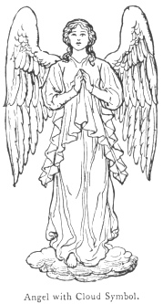
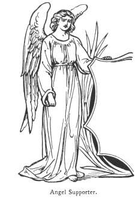
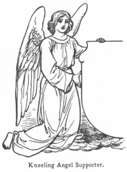
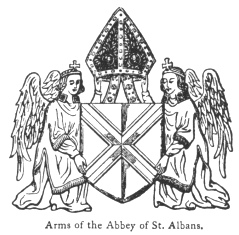
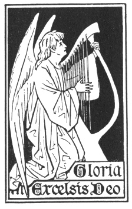

  
[Intangible Textual Heritage](../../index)  [Legendary
Creatures](../index)  [Symbolism](../../sym/index)  [Index](index) 
[Previous](fsca09)  [Next](fsca11) 

------------------------------------------------------------------------

[Buy this Book at
Amazon.com](https://www.amazon.com/exec/obidos/ASIN/B002D48Q8Y/internetsacredte)

------------------------------------------------------------------------

  
*Fictitious and Symbolic Creatures in Art*, by John Vinycomb, \[1909\],
at Intangible Textual Heritage

------------------------------------------------------------------------

### Mediæval Art Treatment of Angels

According to ecclesiastical legend and
tradition there are nine degrees of angelic beings. St. Dionysius
relates that there are three hierarchies of angels and three orders in
each; and by wise allegories each had his special mission, and they were
each depicted

p. 35

with certain insignia by which they were recognised in art
representations, which vary somewhat in examples of different periods.

The nine choirs of angels are classed as follow, with the name of the
chief of each, according to ancient legend:

|            |          |     |             |          |     |                  |         |
|------------|----------|-----|-------------|----------|-----|------------------|---------|
| *Cherubim* | Jophiel  | \|  | *Dominions* | Zadchiel | \|  | *Principalities* | Camiel  |
| *Seraphim* | Uriel    | \|  | *Virtues*   | Haniel   | \|  | *Archangels*     | Michael |
| *Thrones*  | Zaphkiel | \|  | *Powers*    | Raphael  | \|  | *Angels*         | Gabriel |

According to A. Welby Pugin's "Glossary of Architectural Ornament and
Costume," and other authorities, we learn the mediæval conception of
these beings.

The following emblems are borne by angels: Flaming Swords, denoting "the wrath of God";
Trumpets, "the voice of God"; Sceptres, "the power of God"; Thuribles, or censers, the incense being the
prayers of saints; Instruments of Music,
to denote their felicity.

The Apparels, or borders of their robes,
are jewelled with Sapphire for "celestial
contemplation"; Ruby, "divine love";
Crystal, "purity"; Emerald, "unfading youth."

Archangels are the principal or chief
angels, and are extraordinary ambassadors. Among these the name of Gabriel—the angel of the annunciation, the head
of the entire celestial hierarchy—denotes "the power of God"; Michael, "who is like God"; Raphael, "the healing of God"; Uriel, "the fire of God."

p. 36

Angel is the name, not of an order of
beings, but of an office, and means messenger: wherefore angels are
represented young to show their continued
strength, and winged to show their
unweariedness; without sandals, for they
do not belong to the earth; and girt, to
show their readiness to go forth and execute the will of God. Their
garments are either white, to denote
their purity, or golden, to show their
sanctity and glory, or they are of any of the symbolical colours used in
Christian Art.

A writer in the *Ecclesiastical Art Review*, May 1878, I. Lewis André,
architect, says that "we seldom find angels clad in any other
ecclesiastical vestments than the Alb (or
tunic of various colours), and the amice. The Amice is sometimes like a mere loose collar; at
other times it has richly embroidered Apparels (or borders), and is exactly like the
priestly vestment as worn in the Middle Ages. Instead of the amice we
sometimes find a scarf or cloth tied in a knot around the neck, the ends
falling down in front.

"In Anne of Brittany's prayer-book is a beautiful figure of St. Michael.
He has a rayed nimbus, a cross on a circlet round his head, a richly
embroidered *dalmatic* (a long robe with sleeves partly open at the
sides), and holds a sword in his left hand. The emblems of St. Michael
are a crown, a sword, a shield charged with a cross of St. George, or a
spear with the banner of the cross, or else with scales in his hand.

p. 37

\[paragraph continues\] Sometimes, as at
South Leigh, Oxon., he is in complete armour.

"The archangels are often figured with a trumpet in the right hand,
scarfs round neck and loins; six wings, sometimes four at the shoulders
and two at the hips, the legs bare from the thighs. The four archangels
are frequently represented in complete armour and with swords.

The angels in the Benedictional of St. Ethelwold nearly resemble much
later representations; they have wings and the nimbus or aureole, long
hair and girded loins, whilst the feet are bare, as is generally the
case at all periods of Gothic Art; but the characteristic drapery is
loose and flowing as in the Saxon figures of saints; the wings are short
and broad, the nimbus is generally rayed like the spokes of a wheel (a
form seen in the work of Giotto, with whom it seems to have been a
favourite). The alb or vesture has loose sleeves, and at times a mantle
or cope envelops the figure; both sleeves and mantles have embroideries
or apparels."

"The modern taste," says the same writer, "for giving angels pure white
vesture does not appear to be derived from the Middle Ages, and
certainly not from the best period when angels were clad in every
brilliant colour, as a beautiful example at St. Michael's, York, shows.
Here an angel swinging a golden censer has a green tunic covered with a
white cloak or mantle. The nimbus is bright blue, and the wings have the
upper parts yellow, and are tipped

p. 38

with green. At Goodnestowe church, St. Michael has a deep crimson tunic,
a white mantle edged with a rich gold border, green wings, and a light
crimson nimbus," and mention is here made of the white vesture of the
angel at the Sepulchre, and that nowhere else

|                    |
|--------------------|
|  |

does the Gospel mention any angel clad in white but in the narratives of
Our Lord's resurrection.

"Often the angels’ wings are feathered red and blue alternately, as on
the pulpit at Cheddar, Somerset. Sometimes the wings have feathers like
those of a peacock, on the Chapter House, Westminster; round the 'Wall
Arcade, angels have their wings inscribed with a text on every feather.
This corresponds with the French 'hours' of Anne of Brittany, where an
angel (St. Gabriel) wears a mantle with a text running along the
border."

It was not uncommon to represent angels in carving and stained glass in
the latter part of the fifteenth century as feathered all over like
birds.

*Cloud Symbol of the* "Sky" *or* "Air."—Artists of the Mediæval and
Renaissance periods, following classical authority, employed the cloud
symbol of the sky or

p. 39

air in their allegories and sacred pictures of divine persons, saints,
and martyrs, to denote their divine or celestial condition, as
distinguished from beings "of the earth—earthy." The adoption of *the
little cloud* underneath the feet, when the figure is not represented
flying, naturally suggested itself as the most fitting emblem for a
support, and avoided the apparent incongruity of beings in material
human shape *standing* upon *nothing*. The suggestion of the aerial
support here entirely obviates any thought of the outrage on the laws of
gravity.

Another distinguishing attribute is the Nimbus—an emblem of divine power
and glory—placed behind or over the head. The crown is an insignia of
civil power borne by the laity; the nimbus is ecclesiastical and
religious. The pagans were familiar with the use of the nimbus, which
appears upon the coins of some of the Roman Emperors. It was widely
adopted by the Early Christian artists, and up till the fifteenth
century was represented as a circular disc or plate behind the head, of
gold or of various colours, and, according to the shape and
ornamentation of the nimbus, the elevation or the divine degree of the
person was denoted. It was displayed behind the heads of the Persons of
the Trinity and of angels. It is also worn as a mark of honour and
distinction by saints and martyrs. At a later period, when the
traditions of early art were to some extent laid aside, *i.e.*, from the
fifteenth century until towards the end of the seventeenth century, as
M. Dideron informs us,

 

p. 40

a simple unadorned ring, termed a "circle of glory," "takes the place of
the nimbus and is represented as hovering over the head. It became thus
idealised and transparent, showing an outer circle only; the field or
disc is altogether omitted or suppressed, being

|                                    |
|------------------------------------|
|  |

drawn in perspective and formed by a simple thread of light as in the
*Disputer* of Raphael. Sometimes it is only an uncertain wavering line
resembling a circle of light. On the other hand, the circular line often
disappears as if it were unworthy to enclose the divine light emanating
from the head. It is a shadow of flame, circular in form but not
permitting itself to be circumscribed."

Although the forms of angels are of such frequent occurrence in Mediæval
Art they seem to abound more especially in the fifteenth century. Angels
are seen in every possible combination, with ecclesiastical and domestic
architecture, and form the subject of many allusions in heraldry. They
are frequently used as supporters.

Charles Boutell, M.A., "English Heraldry,"

p. 41

p\. 247, says, regarding angels used as supporters to the armorial
shield: "The introduction of angelic figures which might have the
appearance of acting as guardian angels’ in their care of shields of
arms, was in accordance with the feelings of the early days of English
heraldry; and, while it took a part in leading the way to

|                                             |
|---------------------------------------------|
|  |

the systematic use of regular supporters, it served to show the high
esteem and honour in which armorial insignia were held by our ancestors
in those ages." And reference is made to examples sculptured in the
noble timber roof of Westminster Hall and elsewhere. As an example we
give the shield of arms of the Abbey of St. Albans.

Figures of angels holding shields of arms, each figure having a shield
in front of its breast, are frequently sculptured in Gothic churches.
They appear on seals, as on that of Henry of Lancaster about 1350, which
has the figure of an angel on each side of it. The shield of Richard II.
at Westminster Hall, bearing the arms of France ancient and England
quarterly, is supported by angels, which, if not

p. 42

rather ornamental than heraldic, were possibly intended to denote his
claim to the crown of France, being the supporters of the Royal arms of
that kingdom. Upon his Great Seal other supporters are used. There are
also instances of the shield of Henry VI. being supported by angels, but
they are by some

|                                                    |
|----------------------------------------------------|
|  |

authorities considered as purely religious symbols rather than heraldic.

The supporters of the King of France were two angels standing on clouds,
all proper, vested with taberts of the arms, the dexter *France*, the
sinister *Navarre*, each holding a banner of the same arms affixed to a
tilting-spear, and the *cri de guerre* or motto, "Mont-joye et St.
Denis." The shield bears the impaled arms of France and Navarre with
several orders of knighthood, helmet, mantling and other accessories,
all with a pavilion mantle.

Although Francis II., Charles IX., Henry III. and IV. and Louis XIII.
had special supporters of their arms, yet they did not exclude the two
angels of Charles VI., which were considered as the ordinary supporters
of the kingdom of France. Louis XIV., Louis XV. and Louis XVI . never
used any others.

p. 43

Verstegan quaintly says that Egbert was "chiefly moved" to call his
kingdom England "in respect of Pope Gregory changing the name of
Engelisce into Angellyke," and this "may have moved our kings upon their
best gold

|                    |
|--------------------|
|  |

coins to set the image of an angel." [\*](#fn_3)

". . . Shake the bags  
 Of hoarding abbots; their imprisoned *angels*  
 Set them at liberty."  
  Shakespeare,  
   *King John*, iii. 3.

The gold coin was named from the fact that on one side of it was a
representation of the archangel in conflict with the dragon (Rev. xii.
7). The reverse had a ship. It was introduced into England by Edward IV.
in 1456. Between his reign and that of Charles I. it varied in value
from 6s. 8d. to 10s.

------------------------------------------------------------------------

### Footnotes

[43:\*](fsca10.htm#fr_3) "Restit. of Decayed
Intell. in Antiq." p. 147.

------------------------------------------------------------------------

[Next: Cherubim and Seraphim in Heraldry](fsca11)
