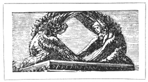
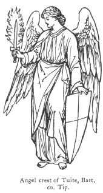
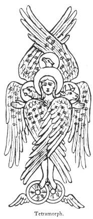

  
[Intangible Textual Heritage](../../index)  [Legendary
Creatures](../index)  [Symbolism](../../sym/index)  [Index](index) 
[Previous](fsca11)  [Next](fsca13) 

------------------------------------------------------------------------

[Buy this Book at
Amazon.com](https://www.amazon.com/exec/obidos/ASIN/B002D48Q8Y/internetsacredte)

------------------------------------------------------------------------

  
*Fictitious and Symbolic Creatures in Art*, by John Vinycomb, \[1909\],
at Intangible Textual Heritage

------------------------------------------------------------------------

 

### Cherubim & Seraphim of Scripture

In Ecclesiastical Art literal renderings
of the descriptions contained in the Old Testament and the Apocalypse
are not of unfrequent use. A more lengthened reference to these great
Hebrew symbolic beings will not be considered out of place, as there is
great doubt and uncertainty as to their forms.

These mystic symbolic beings were familiar to all the patriarchs—from
Adam, who gazed upon them in Paradise, and against whom on his expulsion
they stood with flaming sword, turning every way to bar his return—to
Moses, who trembled before it on Mount Sinai; while to the Priests and
Levites, the custodians of the Ark of the Covenant in the Tabernacle,
the

p. 48

cherubim remained the sacred guardians in the Holy of Holies of the
palladium of the national faith and liberties during the brightest and,
as it has been termed, the most heroic period of Jewish history.

Josephus, the more effectually to excite respect for

|                                                        |
|--------------------------------------------------------|
|  |

the great Hebrew symbol in the minds of his readers, purposely throws
over it the veil of obscurity. He says: "The cherubim are winged
creatures, but the form of them does not resemble that of any living
creature seen by man." In the works of Philo Judæus there is an express
dissertation upon the cherubim. The learned Brochart and many others
have attempted to elucidate the subject to little purpose. The ambiguity
which always accompanies a written description of objects with which we
are imperfectly acquainted applies with greater force to this mysterious
being combining so many apparently conflicting attributes.

To the prophetic vision of Ezekiel, the description of which, in the
opinion of competent critics, excels in grandeur of idea and energy of
expression the most celebrated writers of ancient and modern times, the
reader is referred, as it supplies at first hand

p. 49

almost all that can be known concerning the fearful form of the
cherubim.

The four living creatures that support the throne of God exhibited to
Ezekiel a fourfold aspect; they had each the face of *a man*, the face
of *a lion*, and the face of *an ox;* they also had the face of *an
eagle*. They had each four wings; they had the hands of a man under
their wings. "Two wings of every one were joined one to the other, and
two covered their bodies." They were accompanied by wheels which "went
upon their four sides, and they turned not when they went"; "and their
whole body, and their backs, and their hands, and their wings, and their
wheels were full of eyes"; and the living creatures ran and returned as
the appearance of a flash of lightning." Such is a concise description
of their appearance as set forth in Ezekiel (chap. i.).

"This wonderful and mysterious hieroglyph must be considered as a
striking and expressive emblem of the guardian vigilance of providence,
all-seeing and omniscient; while the number of wings exhibit to us
direct symbols of that powerful, that all-pervading spirit which, while
it darts through nature at a glance, is everywhere present to protect
and defend us" (Dideron).

So attached were the Jews to this celestial symbol that when Solomon
erected that stupendous temple which continued the glory and boast of
the Hebrew nation for so many ages, we are told (1 Kings, vi. 29, viii.
6, 7), he carved all the walls of the house

p. 50

round about with the sculptured figures of the cherubim, and on each
side of the ark was a cherub of gold plated upon olive wood fifteen feet
high, with their faces to the light, their expanded wings embracing the
whole space of the sacred enclosure, serving as a visible sign or symbol
of God's immediate presence, whence the saying of David, "God sitteth
between the cherubim" (Ps. xcix. 1). In this place God perpetually
resided in the form of a bright cloud or shining luminous body, termed
"shechinah," whence the divine oracles were audibly delivered.

Milton gives the following description of the Seraph Raphael:

"At once on the eastern cliff of Paradise  
 He lights, and to his proper shape returns  
 A seraph wing’d; six wings he wore to shade  
 His lineaments divine; the pair that clad  
 Each shoulder broad came mantling o’er his breast  
 With regal ornament: the middle pair  
 Girt like a starry zone his waist, and round  
 Skirted his loins and thighs with downy gold  
 And colours dipped in heaven; the third, his feet  
 Shadows from either heel with feather’d mail  
 Sky tinctured grain. Like Maia's son he stood  
 And shook his plumes, that heavenly fragrance fill’d  
 The circuit wide."  
                                  *Paradise Lost*, Book v.

The *cherub* is traditionally regarded as a celestial spirit which in
the hierarchy is placed next in order

p. 51

to the seraphim. All the several descriptions which the Scripture gives
us of cherubim differ from one another, as they are described in the
shapes of men, eagles, oxen, lions, and in a composition of all these
figures put together. The hieroglyphical representations in the
embroidery upon the curtains of the tabernacle were called by Moses (Ex.
xxvi. 1) "cherubim of cunning work" (Calmet).

The *seraphim* are regarded as an order of angels distinguished for
fervent zeal and religious ardour. The word means burning," *i.e.*, with
Divine Love.

The seraphim are described by Isaiah (vi. 1––3): "I saw also the Lord
sitting upon a throne, high and lifted up, and his train filled the
temple. Above it stood the seraphim: each one had six wings; with twain
he covered his face, and with twain he covered his feet, and with twain
he did fly. And one cried to another and said, Holy, Holy, Holy, is the
Lord of Hosts: the whole earth is full of his glory." And in Revelation
(iv. 6): "Round about the throne were four beasts full of eyes before
and behind, and the first beast was like a lion, and the second beast
like a calf, and the third beast had a face as a man, and the fourth
beast was like a flying eagle. And the four beasts had each of them six
wings about him, and they were full of eyes within." It will be noticed
that these descriptions differ from that of Ezekiel, not only in the
number of wings, but also in the individuality of each beast being
separate and independent, not compounded of the four.

p. 52

Several forms of these mystical creatures, says Audsley, have been
devised by the early mediæval artists; those which display the entire
forms of

|                               |
|-------------------------------|
|  |

*the man*, *the lion*, *the ox*, and *the eagle*, all winged and
invested with the nimbus, appear to have been most frequently made use
of. They are to be met with formed of the *heads of the mystical
creatures* on bodies or half-bodies of *winged human figures;* at other
times we find them comprised in the heads and wings only of the four
symbolic creatures. Sometimes they are found united and forming one
mysterious being called the *Tetramorph* with four heads and numerous
wings covered with eyes, the feet resting on wheels, which are also
winged. The example is taken from a Byzantine mosaic in the convent of
Vatopedi, on Mount Athos.

Pugin's "Glossary of Ecclesiastical Ornament and Costume" says the
cherubim are frequently represented of a bright red colour to set forth
the intensity of divine love, and usually standing upon wheels, in
reference to the vision of the prophet Ezekiel.

p. 53

Cherubim and seraphim seem always vested in the alb or tunic, and a
scarf tied in a knot round the neck.

------------------------------------------------------------------------

[Next: Emblems of the Four Evangelists](fsca13)
