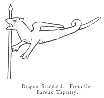
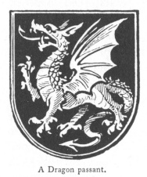

  
[Intangible Textual Heritage](../../index)  [Legendary
Creatures](../index)  [Symbolism](../../sym/index)  [Index](index) 
[Previous](fsca16)  [Next](fsca18) 

------------------------------------------------------------------------

[Buy this Book at
Amazon.com](https://www.amazon.com/exec/obidos/ASIN/B002D48Q8Y/internetsacredte)

------------------------------------------------------------------------

  
*Fictitious and Symbolic Creatures in Art*, by John Vinycomb, \[1909\],
at Intangible Textual Heritage

------------------------------------------------------------------------

### The Dragon in the Royal Heraldry of Britain

"*Advance our standards, set upon our foes,  
 Our ancient word of courage fair Saint George  
 Inspire us with the spleen of fiery dragons*."  
                            "Richard III.," Act v. sc. 3.

"*Come not between the dragon and his wrath*."  
                            "King Lear," Act i. sc. 2.

The dragon does not seem to have been a
native emblem with the Romans, and when they adopted it it was only as a
sort of subordinate emblem—the eagle still holding the first place. It
seems to have been in consequence of their intercourse with other
nations either of Pelasgic or Teutonic race. Amongst all the new races
which overran Europe at the termination of the classical period the
dragon seems to have occupied nearly the same place that it held in the
earlier stages of Greek life. Among the Teutonic tribes which settled in
England the dragon was from the first a principal emblem, and the custom
of

p. 84

carrying the dragon in procession with great jollity on May eve to
Burford is referred to by old historians. The custom is said by Brand
also to have prevailed in Germany, and was probably common in other
parts of England.

Nor was the dragon peculiar to the Teutonic races. Amongst the Celts it
was the symbol of sovereignty, and as such was borne on the sovereign's
crest. Mr. Tennyson's "Idylls" have made us familiar with the dragon of
the great Pendragonship "blazing on Arthur's helmet as he rode forth to
his last battle, and "making all the night a stream of fire." The fiery
dragon or drake and the flying dragon of the air were national phenomena
of which we have frequent accounts in old books.

The Irish *drag* means "fire," and the Welsh *dreigiaw* (silent flashes
of lightning) "fiery meteors"; hence Shakespeare says:

"Swift, swift, ye dragons of the night!—that
dawning  
 May bare the raven's eye."  
                                          *Cymbeline*, ii. 2.

A principal source of the Dragon legends in these countries is the
Celtic use of the word "*dragon*" for "a chief." Hence Pen-dragon
(*sumus rex*), a sort of dictator in times of danger. Those knights who
slew a chief in battle slew a dragon, and the military title soon got
confounded with the fabulous monster. The name or title *Pendragon*
(dragon's head) was among British kings and princes what

p. 85

\[paragraph continues\] Bretwalda was
among the Saxons; and his authority or supremacy over the confederation
was greater or less according to his valour, ability, and good fortune.
Arthur succeeded his father Uther, and was raised to the pendragonship
in the first quarter of the sixth century.

The dragon was a symbol among the heathen. One of the sons of Odin was
thus invoked: "Child of the Dragon, Son of Conquest, arise! grasp thy
silver spear; thy snowy steed prepare and haste thee to the strife of
the shield! Uprise thou Dragon of Onslaught!" And again:

"Wave high the dragon's flaming sign,  
   Roll wide the shout of glee;  
 Ho! conquest ope thy crimson gates  
   This day I give to thee."

"The Dragon of the Shield struck his sounding war-board with his
ponderous spada. The fierce-browed children of Hilda gathered round at
the signal."

Maglocue, a British king who was a great warrior and of a remarkable
stature, whose exploits had rendered him terrible to his foes, as a
surname was called "The Dragon of the Isle," perhaps from his seat in
Anglesey.

Cuthred, King of Wessex, bore a dragon on his banner. A dragon was also
the device of the British King Uther Pendragon, or Dragon's-head, father
or that King Arthur of chivalric memory, who so bravely withstood the
incursions of the Saxons. Two

p. 86

*dragons addorsed*—that is, back to back—are ascribed to Arthur, as well
as several other devices.

Dragon's Hill, Berkshire, is where the legend says St. George killed the
dragon. A bare place is shown on the hill where nothing will grow, and
there the blood ran out. In Saxon annals we are told that Cedric,
founder of the West Saxon kingdom, slew there Naud, the pendragon, with
5000 men. This

|                                                              |
|--------------------------------------------------------------|
|  |

Naud is called Natan-leod, a corruption of Naud-an-ludh; Naud, the
people's refuge. [\*](#fn_6)

"It has sometimes been thought," says Miss Millington, "that the royal
Saxon banner bore a dragon; certain it is, that on the Bayeux tapestry a
dragon raised upon a pole is constantly represented near a figure,
whilst the words 'Hic Harold' prove to be intended for Harold; yet
Matthew of Westminster, in describing a battle fought in the time of
Edward I., says that the place of the king was 'between the dragon and
the standard,' which seems to imply that the standard or banner had some
other device. The dragon was perhaps a kind of standard borne to
indicate the presence of the king. Henry III. carried one at the Battle
of Lewes, fought against Simon de Montfort in 1264:

p. 87

"'Symoun com to the feld,  
   And put up his banere;  
 The king schewed forth his scheld,  
   His dragon full austere.'

\[paragraph continues\] It was not,
however, at that time restricted to the King, for Simon himself in the
same battle

"'Displaied his banere, lift up his dragoun.'

\[paragraph continues\] The English at the
Battle of Crecy carried a 'burning dragon, made of red silk adorned and
beaten with very broad and fair lilies of gold, and broidered about with
gold and vermilion.' This banner," adds Miss Millington, perhaps
resembled that used by the Parthians and Dacians, which is described by
Ammianus Marcellinus as 'a dragon, formed of purple stuff; resplendent
with gold and precious stones fixed on a long pike, and so contrived
that when held in a certain manner, with its mouth to the wind, the
entire body became inflated, and stretched its sinuous length upon the
air.'"

"The dragon," says Mr. Planché, "was the customary standard of the kings
of England from the time of the Conquest. It was borne in the battle
between Canute and Edmund Ironside; it is figured in the Bayeux
tapestry, and there are directions for making one in the reign of Henry
III., but it never formed a portion of their armorial bearings, *i.e.*,
as a charge upon the shield of arms."

Henry VII., first of the Tudor line, assumed as one of his badges the
red dragon of Cadwallader—

p. 88

\[paragraph continues\] "Red dragon
dreadful." Henry claimed an uninterrupted descent from the aboriginal
princes of Britain, Arthur and Uther, Caradoc, Halstan, Pendragon, &c.
His grandfather, Owen Tudor, bore a dragon as his device in proof of his
descent from Cadwallader, the last British prince and first King of
Wales (678 A.D.), the dragon being the ensign of that monarch. At the
Battle of Bosworth Field Henry bore the dragon standard. After the
battle of Bosworth Field Henry went in state to St. Paul's, where he
offered three standards. On one was the image of St. George, on the
other a "red fierce dragon beaten upon green and white sarsenet" (the
livery colours of the House of Tudor); on the third was painted a dun
cow upon yellow tartan,—the dun cow, in token of his descent from Guy
Earl of Warwick, who had slain

"A monstrous wyld and cruelle beaste  
 Called ye dun cow of Dunsmore Heath."

\[paragraph continues\] The dun cow is
still one of the badges of the Guards. This monarch founded the office
of *Rouge dragon pursuivant* on the day before his coronation (October
29, 1485). Henry VII., Henry VIII., Edward V., Mary and Elizabeth all
carried the dragon as a supporter to the royal arms, but varied in
position, and at times superseded by a greyhound. (A greyhound argent,
collared or, the collar charged with a rose gules, was a Lancastrian
badge.) Henry VIII. used for supporters the *red dragon and* 

p. 89

*white greyhound* of his family; *a red dragon* and *a lion gardant
gold*, sometimes crowned; at other times *a silver greyhound* and *a
golden lion*, *an antelope*, *a white bull*, *a cock*, &c. On the union
of Scotland and England under King James, the Scottish unicorn was
substituted for the sinister supporter, while the *lion gardant*, first
adopted by Henry VIII., appears to have permanently superseded the red
dragon of Wales, the white greyhound, &c., as the other supporter of the
royal arms, the dragon being relegated to be the special badge of the
principality of Wales, which position it still retains. The present
royal badges, as settled at the union, 1801, are:

|                                                                           |                                          |
|---------------------------------------------------------------------------|------------------------------------------|
| *A white rose within a red*                                               | England.  |
| *A thistle*                                                               | Scotland. |
| *A harp or, stringed argent, and a trefoil or shamrock vert*              | Ireland.  |
| *Upon a mount vert, a dragon passant, wings expanded and endorsed, gules* | Wales.    |

Richard III. as a badge had a black dragon. "*The bages that he beryth
by the Earldom of Wolsr* (*Ulster*) *ys a blacke dragon*," derived
through his mother from the De Burghs, Earls of Ulster.

Mallet, in his "Northern Antiquities," states "that the thick misshapen
walls winding round a rude fortress at the summit of a rock were called
by a name signifying dragon, and as women of distinction

p. 90

were, during the ages of chivalry, commonly placed in such castles for
security, thence arose the romances of princesses of great beauty being
guarded by dragons, and afterwards delivered by young heroes

|                                     |
|-------------------------------------|
|  |

who could not achieve their rescue until they had overcome their
terrible guardians." The common heraldic signification of a dragon is
one who has successfully overcome such a fortress, or it denotes the
protection afforded to the helpless by him to whom it was granted, and
the terror inspired in his foes by his doughty or warlike bearing. It
was a title of supreme power among the early British.

The dragon has always been an honourable bearing in British armoury, in
some instances to commemorate a triumph over a mighty foe, or merely for
the purpose of inspiring the enemy with terror. This seems to have been
especially the case with the dragon standard—the "red dragon dreadful"
of Wales (*y Ddraig Coch*) described as:

"A dragon grete and grimme  
 Full of fyre and eke venymme."

------------------------------------------------------------------------

### Footnotes

[86:\*](fsca17.htm#fr_6) Brewer's "Dictionary of
Phrase and Fable."

------------------------------------------------------------------------

[Next: The Crocodile as the Prototype of the Dragon](fsca18)
