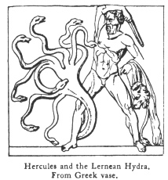
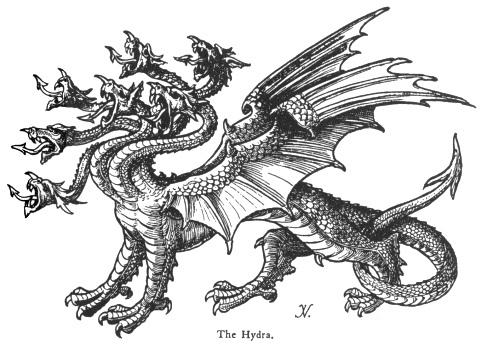

  
[Intangible Textual Heritage](../../index)  [Legendary
Creatures](../index)  [Symbolism](../../sym/index)  [Index](index) 
[Previous](fsca19)  [Next](fsca21) 

------------------------------------------------------------------------

[Buy this Book at
Amazon.com](https://www.amazon.com/exec/obidos/ASIN/B002D48Q8Y/internetsacredte)

------------------------------------------------------------------------

  
*Fictitious and Symbolic Creatures in Art*, by John Vinycomb, \[1909\],
at Intangible Textual Heritage

------------------------------------------------------------------------

### The Hydra

"*Seven great heads out of his body grew,  
 An iron breast, and back of scaly brass;  
 And all imbrued in blood his eyes did shine as glass,  
 His tail was stretched out in wondrous length*."  
          Spenser, "Faerie Queen," Book
i. C. vii.

The hydra is represented in heraldry as a
dragon with seven heads; it is not of frequent occurrence as a bearing
in armory.

|                                                                    |
|--------------------------------------------------------------------|
|  |

The terrible dragon, with one hundred heads, that guarded the golden
apples of the Hesperides, slain by Hercules, was celebrated in classic
mythology; so was the Lernean hydra, a monster of the marshes that
ravaged the country of Lerna in Argolis, destroying both men and beasts.
The number of its heads varies with the poets, though

p. 97

ancient gems usually represent it with seven or nine. Hercules was sent
to kill it as one of his twelve labours. After driving the monster from
its lair with arrows he attacked it with his sword, and in place

 

of each head he struck off two sprang up. Setting fire to a neighbouring
wood with the firebrands he seared the throat of the Hydra until he at
length succeeded in slaying it. The fable is usually referred to in
illustration of a difficulty which goes on increasing as it is combated.
(*See* page [63](fsca14.htm#page_63).)

"Whereon this Hydra son of war is born  
 Whose dangerous eyes may well be charmed asleep."  
                              *Henry IV*. part ii. sc. 2.

p. 98

The Lernean hydra, the watchful dragon of the garden of the Hesperides,
the many-headed Naga or snake of the Hindu religion, are, say learned
writers, only some of the many forms under which the relics of the
ancient serpent-worship exhibited itself.

*A hydra, wings endorsed vert, scaled or*, is the crest of *Barret* of
Avely, Essex. It is also borne by the names *Crespine* and *Downes*.

------------------------------------------------------------------------

[Next: The Wyvern](fsca21)
