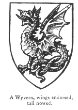
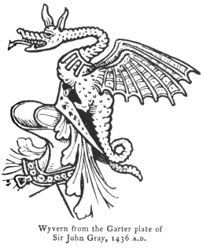
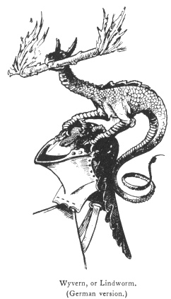

  
[Intangible Textual Heritage](../../index)  [Legendary
Creatures](../index)  [Symbolism](../../sym/index)  [Index](index) 
[Previous](fsca20)  [Next](fsca22) 

------------------------------------------------------------------------

[Buy this Book at
Amazon.com](https://www.amazon.com/exec/obidos/ASIN/B002D48Q8Y/internetsacredte)

------------------------------------------------------------------------

  
*Fictitious and Symbolic Creatures in Art*, by John Vinycomb, \[1909\],
at Intangible Textual Heritage

------------------------------------------------------------------------

 

### The Wyvern

(Saxon, *Wivere*, a serpent) said to
represent a flying serpent, an imaginary creature resembling the dragon,
but having only two legs, which are like an

p. 99

eagle's, and a serpent-like tail, barbed, sometimes represented nowed
after the manner of serpents. It is figured on one of the

|                                                         |
|---------------------------------------------------------|
|  |

standards in the Bayeux tapestry (*see* Dragon, [p.
86](fsca17.htm#page_86)). It is erroneously termed a dragon by some
writers, though perhaps they may both be classed together. Old heralds
say of these imaginary monsters that they are emblems of pestilence, and
are represented as strong and fierce animals covered with invulnerable
mail, and fitly typify viciousness and

|                                                                            |
|----------------------------------------------------------------------------|
|  |

envy. In armory they are properly applied to tyranny or the overthrow of
a vicious enemy.

Occasionally a wyvern is borne with the tail nowed and without wings.

*Lindworm*.—It is not usual to say a wyvern "without wings" or "without
legs," but *sans wings* or *sans legs*, as the

p. 100

case may be. A dragon or wyvern sans wings is termed a lindworm. (*See*
page [80](fsca16.htm#page_80).)

*Argent, a wyvern, wings endorsed gules*, are the arms

|                                                          |
|----------------------------------------------------------|
|  |

of *Drake*, of Ashe, Devon (Bart.), 1600.

The town of Leicester has for crest *a wyvern, wings expanded, sans
legs, strewed with wounds, gules*.

*Argent on a bend sable, between two lions rampant of the last, a wyvern
volant in bend of the field, langued gules*, *Ruddings*.

*Two wyverns, wings endorsed and emitting flames*, are the supporters of
Viscount *Arbuthnot*.

The arms of the King of Portugal are supported by *two wyverns erect on
their tails or*, each holding a banner, the crest is a *demi-wyvern* out
of a ducal coronet.

*Guivre*.—The wyvern or serpent in the arms of the Visconti, Lords of
Milan, *argent a guivre d’azure couronnée d’or, issante de gules* (Guivre is represented as a serpent or wingless
dragon sans feet, with a child's

p. 101

body issuing from its mouth), is said to commemorate the victory of a
lord of that house over a fiery dragon or guivre which inhabited a
cavern under the church of St. Denis in that place. "It is hardly
possible," says Miss Millington, "not to think that the story of the
dragon as well as its adoption in the coat-of-arms

 

bears allusion rather to the dragon of paganism, expelled from the city,
as it might seem, by the church built upon the site of the cave, in
which too, by the rite of Holy Baptism, children especially were
delivered from the power of Satan. Indeed, the innumerable legends of
saints who have fought and overcome dragons sufficiently prove the
symbolic light in which that creature was anciently viewed." (*See* also
Serpent Biscia, [p. 117](fsca27.htm#page_117).)

------------------------------------------------------------------------

[Next: The Chimera](fsca22)
