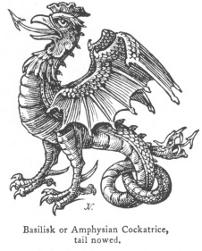

  
[Intangible Textual Heritage](../../index)  [Legendary
Creatures](../index)  [Symbolism](../../sym/index)  [Index](index) 
[Previous](fsca25)  [Next](fsca27) 

------------------------------------------------------------------------

[Buy this Book at
Amazon.com](https://www.amazon.com/exec/obidos/ASIN/B002D48Q8Y/internetsacredte)

------------------------------------------------------------------------

  
*Fictitious and Symbolic Creatures in Art*, by John Vinycomb, \[1909\],
at Intangible Textual Heritage

------------------------------------------------------------------------

### Basilisk, or Amphysian Cockatrice

The amphysian cockatrice or basilisk in
heraldry exactly resembles the cockatrice, but having an additional head
(like that of a dragon) at the end of its tail instead of a barb or
sting.

"With complicated monsters’ head and tail  
 Scorpion and Asp and Amphisbœna dire."  
                                        Milton.

*Amphisbœna*, or *Amphista*, is a creature sometimes referred to by old
writers as having the dragon's body and wings, the head of a serpent,
and the tail ending in a like head. Bossewelle, in "Armorie of Honour,"
folio 63, enlarging upon this idea, describes "a prodigious serpente
called Amphybene, for that he hath a double head, as though one mouth
were too little to custe his venyme."

Earl Howe has for supporters *two cockatrices* (*amphysian*), *wings
elevated, the tails nowed, and ending in a serpent's head or, combed,
wattled and legged gules*.

*Argent, a basilisk, wings endorsed, tail nowed, sable*.—*Langley*,
Rathorpe Hall, Yorks.

p. 107

*Basilisk*, the king of serpents (Greek, *Basileus*, a king), so called
from having on his head a mitre-shaped crest. Old writers give wonderful
accounts of the death-dealing

|                                                                 |
|-----------------------------------------------------------------|
|  |

power of this strange creature. Pliny says, "all other serpents do flee
from and are afraid of it," and tells of the deadly effect of his breath
and glittering eye. The Duke of Alva, the scourge of the Netherlands
(1566–1575), where he left the eternal memory of his cruelties, had for
a device a basilisk drawing out serpents, with the motto: "Tu nomine
tantum" ("Thou dost so much by thy name alone"), a fitting emblem for so
great a monster!

In allusion to its power of "looking any one dead on whom it fixed its
eyes," Dryden makes Clytus say to Alexander, "Nay, frown not so; you
cannot look me dead,"

                          "like a boar  
 Plunging his tusk in mastiff's gore,  
 Or basilisk, when roused, whose breath,  
 Teeth, sting and eyeballs all are death."  
                            King, *Art of
Love*.

King Henry, when he hears of the death of his

p. 108

uncle Humphry, the good Duke of Gloucester, says to Suffolk:

                   "come basilisk  
And kill the innocent gazer with thy sight."  
                     2 *King Henry VI*. Act iii. 2.

\[paragraph continues\] Beaumont and
Fletcher also speak of "the basilisk's death-dealing eye" in "The Woman
Hater."

Its appearance was so dreadful, it was said, that if a mirror was placed
so that it could see itself, it would instantly burst asunder with
horror and fear.

In Christian Art it is the emblem of *deadly sin* and the *spirit of
evil*. St. Basil the Great uses it as the type of a depraved woman.

------------------------------------------------------------------------

[Next: The Mythical Serpent](fsca27)
