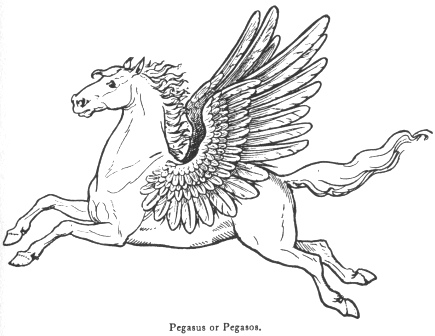
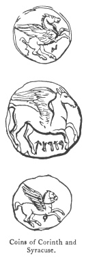
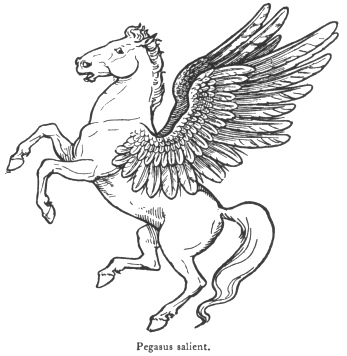

  
[Intangible Textual Heritage](../../index)  [Legendary
Creatures](../index)  [Symbolism](../../sym/index)  [Index](index) 
[Previous](fsca31)  [Next](fsca33) 

------------------------------------------------------------------------

[Buy this Book at
Amazon.com](https://www.amazon.com/exec/obidos/ASIN/B002D48Q8Y/internetsacredte)

------------------------------------------------------------------------

  
*Fictitious and Symbolic Creatures in Art*, by John Vinycomb, \[1909\],
at Intangible Textual Heritage

------------------------------------------------------------------------

p. 137

 

### The Pegasus

"The cheval volant—the pegasus—  
 He bounds from the earth; he treads the air."

A poetic creation of the ancients, a
winged horse captured by Bellerophon, the great hero of Corinthian
legend. In this he was assisted by the goddess Minerva, who also taught
him how to tame and use it. At Corinth there was a temple erected to
Αθηναχαλινίτις (Minerva the Bridler), in allusion to that part of the
myth which describes Minerva as

p. 138

instructing Bellerophon in the mode of placing the bridle on the winged
steed. The legend states that the hero caught this wonderful animal as
it descended at the Acro-Corinthus to drink of the spring of Pirene.
Mounted on his winged steed Pegasus,

|                                                  |
|--------------------------------------------------|
|  |

Bellerophon engaged the dire Chimera, and succeeded in destroying the
monster by rising in the air and shooting it with arrows.

Pegasus is the steed of the Muses, and classic story ascribes to it the
origin of the Castalian fountain "Hippocrene," situated on Mount
Helicon, part of Parnassus, a mountain range in Greece. When the Muses
contended with the daughters of Pieros, "Helicon rose heavenward with
delight"; but Pegasus gave it a kick, stopped its rise, and there gushed
out of the mountain "the soul-inspiring waters of Hippocrene."

The Standard of Corinth was a winged horse, in consequence of the
tradition connecting the fountain called Pirene, near the city, with
Pegasus, the fiery winged steed of Apollo and the Muses. The same device
was the leading type upon the ancient coins of the city of Corinth. The
Corinthians founded the colony of Syracuse, in Sicily, which city
likewise adopted the

p. 139

winged horse and the head of Athena upon its coinage.

Pindar, who grandly relates the feat of the hero Bellerophon, says that
he incurred the enmity of the gods by attempting to fly to heaven on his
winged

 

horse. Zeus sent a gadfly to sting the horse, who thereupon cast its
rider and flew of his own accord to the stables of Zeus, whose
thunder-chariot he has ever since drawn.

The pegasus is of frequent occurrence in heraldry. In its classic
allusions it denotes fame, eloquence, poetic study, contemplation.

p. 140

Some modern heraldic writers, however, discarding its classic
references, regard it merely in the matter-of-fact light as an emblem of
swiftness. But it is impossible to disassociate the old and well-known
ideas respecting the horse of Apollo and the Muses. In fancy the poet
mounts his winged steed to bear his soaring spirit in its wayward flight
through the realms of fancy.

As a type of the perfect horseman, Shakespeare pictures Prince Henry as
able to

"Turn and wind a fiery pegasus  
 And witch the world with noble horsemanship."  
                     1 *King Henry IV*., Act 4, sc. i.

Elsewhere he takes up the later interpretation of the myth, which
connects it with Perseus:

"The strong-ribbed bark through liquid mountains
cut  
 Like Perseus’ horse."  
                       *Troilus and Cressida*, Act i. sc. 3.

Cardinal Bembo, poet and historian, secretary to Pope Leo X., used as
his impress a pegasus and a hand issuing from a cloud holding a wreath
of laurel and palm, with the motto, "Si te fata vocant" ("If the fates
call thee").

*Azure, a pegasus salient, the wings expanded argent*, is borne as the
arms of the Society of the Inner Temple, London.

A very early seal of the Knights Templars exhibits two knights riding
upon one horse.

p. 141

A recent writer remarks upon this strange device that "it is exceedingly
probable that some rude and partially defaced representation of this
device was mistaken by the lawyers of the reign of Queen Elizabeth for a
pegasus. The fact that the Middle Temple adopted the device which
appears upon the other seal of the ancient Knights strongly confirms
this view."

One of the supporters of the arms of Oliver Cromwell is a horse having
the wings and tail of a dragon.

------------------------------------------------------------------------

[Next: Sagittary, Centaur, Sagittarius, Centaurus, Hippocentaur](fsca33)
