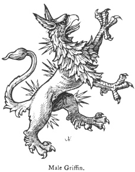

  
[Intangible Textual Heritage](../../index)  [Legendary
Creatures](../index)  [Symbolism](../../sym/index)  [Index](index) 
[Previous](fsca34)  [Next](fsca36) 

------------------------------------------------------------------------

[Buy this Book at
Amazon.com](https://www.amazon.com/exec/obidos/ASIN/B002D48Q8Y/internetsacredte)

------------------------------------------------------------------------

  
*Fictitious and Symbolic Creatures in Art*, by John Vinycomb, \[1909\],
at Intangible Textual Heritage

------------------------------------------------------------------------

### The Male Griffin

The griffin is sometimes borne sans wings
and termed a *male griffin*, as in the supporters to the

p. 161

arms of the Marquis of Ormond, but spikes or rays proceed from various
parts of its body; sometimes it has two long straight

|                                |
|--------------------------------|
|  |

horns.

------------------------------------------------------------------------

[Next: Other Varieties of the Griffin](fsca36)
