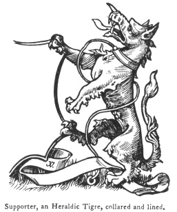
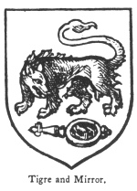

  
[Intangible Textual Heritage](../../index)  [Legendary
Creatures](../index)  [Symbolism](../../sym/index)  [Index](index) 
[Previous](fsca44)  [Next](fsca46) 

------------------------------------------------------------------------

[Buy this Book at
Amazon.com](https://www.amazon.com/exec/obidos/ASIN/B002D48Q8Y/internetsacredte)

------------------------------------------------------------------------

  
*Fictitious and Symbolic Creatures in Art*, by John Vinycomb, \[1909\],
at Intangible Textual Heritage

------------------------------------------------------------------------

p. 190

 

### The Heraldic Tigre or Tyger

"*A savage tygress on her helmet lies;  
 The famous badge Clarinda us’d to wear*."  
                                    Fairfax's "Tasso."

The tigre or tyger of the old heralds
still holds its place in English armory, retaining the ancient name to
distinguish it from the natural tiger, to which it bears but little
resemblance except the name. The early artists probably had no better
authority for the strange creature they depicted than the wild tales of
Eastern travel and their own lively imaginations. The habit of drawing
in a conventional manner may also have assisted in producing such a
monster. This type of wild and ruthless ferocity, approaching the
draconic in its power and destructiveness, was to their minds fitly
suggested

p. 191

by exaggerations of those attributes of savageness and bloodthirstiness
with which it was supposed to be endowed. Shakespeare makes King Henry
V., when urging on his "noblest English" and "good yeomen" to the
assault at Harfleur, declare that

"When the blast of war blows in our ears  
 Then imitate the action of the tiger;  
 Stiffen the sinews, summon up the blood,  
 Disguise fair Nature with hard-favoured rage."

"The tyger," says Bossewell, is a beast wonderful in strength,

|                                                                     |
|---------------------------------------------------------------------|
|  |

and most swift in flight as it were an arrow. For the Persians call an
arrow tygris. He is distinguished with diverse speckes; and of him the
floode Tygris tooke the name. It is said Bacchus used these beastes in
his chariot, for their marveilous swiftness in conveying of the same."

*The heraldic tigre*, the invention of the early heralds, is depicted as
having the body similar to a wolf, but

p. 192

more strong and massive; powerful jaws armed with prominent canine
tusks, and with a short curved horn or spike at the end of his nose. A
row of knotted tufts of hair adorn the back of his neck as a mane; tufts
also on his breast and thighs, and with strong claws; the tail of a lion
completes his equipment. He is a most effective creature in a heraldic
emblazonment, especially when "*armed*" and "*tufted*" of tinctures
differing from his body.

The sinister supporter of the Marquess of Dufferin and Ava is *an
heraldic tigre ermine, gorged with a tressure flory counter flory or*.

*Gules a chevron argent, between three tigres*, &c., *of the
second*.—*Butler*, Calais.

*Vert, a tigre passant or, maned and tufted argent*.—*Love*, Norfolk
(granted 1663).

*Or, a tigre passant gules*.—*Lutwych*, Lutwich, Salop.

Baron Harlech has for dexter supporter, and also for crest, *an heraldic
tigre argent, maned and tufted sable*.

*The tigre and mirror* is an uncommon but very remarkable bearing.
Amongst other remarkable ideas which our ancestors entertained
respecting foreign animals, "some report that those who rob the tigre of
her young use a policy to detaine their damme from following them by
casting sundry looking-glasses in the way, whereat she useth to long to
gaze, whether it be to beholde her owne beauty or because when she seeth
her shape in the glasse

p. 193

she thinketh she seeth one of her young ones; and so they escape the
swiftness of her pursuit." [\*](#fn_20)

"*Argent, a tigre passant regardant looking into a mirror lying
fessways, the handle to the dexter all proper*,"

|                                     |
|-------------------------------------|
|  |

is said to have been the coat of Hadrian de Bardis (probably an
Italian), Prebendary of Oxfordshire. These arms still remain, or were
lately remaining, in a window of Thame Church. Only two other examples
occur, viz.:

"*Argent a tigre and mirror* (as before) *gules*."—*Sibell*, Kent.

------------------------------------------------------------------------

### Footnotes

[193:\*](fsca45.htm#fr_20) Guillam's "Display of
Heraldry." The same is also related in the Latin "Bestiarium," Harl.
MSS. 4751; and by Albertus Magnus, Camerarius, &c.

------------------------------------------------------------------------

[Next: The Royal Tiger](fsca46)
