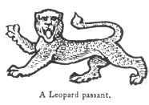
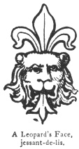

  
[Intangible Textual Heritage](../../index)  [Legendary
Creatures](../index)  [Symbolism](../../sym/index)  [Index](index) 
[Previous](fsca46)  [Next](fsca48) 

------------------------------------------------------------------------

[Buy this Book at
Amazon.com](https://www.amazon.com/exec/obidos/ASIN/B002D48Q8Y/internetsacredte)

------------------------------------------------------------------------

  
*Fictitious and Symbolic Creatures in Art*, by John Vinycomb, \[1909\],
at Intangible Textual Heritage

------------------------------------------------------------------------

### Leopard, or Panther, Felis Pardus, Lybbarde

"*Upon his shoulders a scheld of stele  
 With the lybbardes painted wele*."  
                "The Metrical Romance of Richard Cœur de Lyon."

                    "*Make the libbard stern  
 Leave roaring, when in rage he for revenge did yearn*."  
            Spenser, "Faerie Queen," Book
i. canto vi.

A curious character, partly real and
partly fictitious has been ascribed to the lybbard or leopard of
heraldry. It was said to be the offspring of a lioness and a panther,
the Northmen or Normans, according to some authorities, having adopted
that beast of prey, noted for rashness, as typical of themselves, so
characterised

p. 195

by boldness and impetuosity. The standard of Rollo, first Duke of
Normandy, they say, bore a leopard. A second lion or leopard was added
to the Norman shield when the county of Maine became annexed to the
Duchy of Normandy; and the two lions or leopards—for they

|                                      |
|--------------------------------------|
|  |

are indiscriminately so termed—were thus borne, it is said, upon the
standard of William the Conqueror, and by his descendants. A third lion
was added by Henry II. on his marriage with Eleanor of Aquitain, a lion
being also the arms of that province.

It has been keenly contested whether the three animals in the royal
shield of England were lions or leopards. The subject has been ably
treated by Mr. J. R. Planché in the "Pursuivant of Arms," and also by
Charles Boutell, M.A., in several of his works. The case seems to stand
thus:

In ancient coats the name is believed to be given to the lion in certain
attitudes. The French heralds call a lion passant a *leopard*. Thus
Bertrand du Guesclin, the famous Breton, declared that men "devoyent
bien honorer la noble fleur-de-lis, qu’ils ne faissaient le félon
liépard," and Napoleon, strongly to excite the valour of his soldiers,
exclaimed, "Let us drive these leopards (the English) into the sea!"

"*Lion Léoparde*" is the term used in French

p. 196

heraldry for the lion when borne *passant guardant* as in the royal
shield of England. When *rampant* they call it "léoparde lionné," as if
in this attitude the leopard assumed the position and bold character of
the lion. The attitude *passant guardant* thus denoted the peculiar
stealthy tread and cat-like watchfulness of the leopard and panther.

The Emperor Frederick II. (1235) sent King Henry of England three
leopards as a present in token of his armorial bearings.

It is a great argument in favour of the substitution of the lion for the
leopard, Mr. Boutell thinks, that the latter should have almost
disappeared from

|                                                     |
|-----------------------------------------------------|
|  |

English heraldry, the face and head only retaining their place in modern
coats.

"*A leopard's head*" should show part of the neck, *couped* or *erased*,
as the case may be; *guardant*, *afronté* or front face, is always to be
understood of the leopard, and never in profile.

"*A leopard's face*" shows no part of the neck, and in conjunction with
the term "*jessant-de-lis*," is used with respect to a leopard's face
having a *fleur-de-lis* passing through it.

The insignia of the See of Hereford is: *gules three leopards’ heads
reversed jessant-de-lis, or*.

In heraldry the leopard represents those brave and

p. 197

generous warriors who have performed some bold enterprise with force,
courage, promptitude, and activity. Thus Shakespeare alludes to the
character of the bold soldier

"Full of strange oaths, and bearded like the pard,  
 Jealous in honour, sudden and quick in quarrel,  
 Seeking the bubble reputation  
 Even in the cannon's mouth."

In Christian Art the leopard is employed to represent that beast spoken
of in the Apocalypse, with seven heads and ten horns. Six of the heads
are nimbed, but the seventh, being "wounded to death," has lost its
power, and consequently has no nimbus.

*Three leopards passant guardant or, pelletée*, appear on the arms of
the Marquis of Downshire. It is also the sinister supporter.

The supporters of the town of Aberdeen are leopards.

*Sable three leopards rampant argent spotted sable* are given as the
arms of *Lynch*. It is, however, probable that the *lynx* was the animal
originally blazoned as "arms parlantes" for the name.

*Ermine on a cross patonce sable, a leopard's head, issuing out of a
ducal coronet or, crest, a demi-leopard erect, proper*.—*Dickens*.

*A leopard's face, breaking with his mouth a sword*, is the crest of
*Disne*.

The supporters of the Earl of Northesk are *two leopards reguardant*.

p. 198

The leopard or panther, says Dr. P. M. Duncan, F.R.S., [\*](#fn_21) was the only one of the greater feline
animals, except the lion and tiger, which seems to have been known to
the ancients. It is always represented as drawing the chariot of
Bacchus, and the forlorn Ariadne is sculptured as riding on one of the
spotted steeds of her divine lover. The panther was also constantly used
in the barbarous sports of the amphitheatre, and, in common with the
lion and tiger, has been both executioner and grave to many a
bold-hearted martyr.

The leopard's skin was a favourite mantle in the olden times in Greece.
In the "Iliad," Homer, speaking of Menelaus, says:

"With a pard's spotted hide his shoulders broad  
 He mantled o’er,"

and the leopard, or panther, is given in the "Odyssey" as one of the
forms assumed by Proteus, "the Ancient of the Deep."

A curious ancient superstition about the leopard is embodied in its
name. It was thought not to be actually the same animal as the panther
or pard, but to be a mongrel or hybrid between the male pard and the
lioness, hence it was called the lion-panther, or *leopardus*. This
error, as Archbishop Trench tells us, "has lasted into modern times";
thus Fuller: "Leopards and mules are properly no creatures."

Some writers, says Boutell, describe the leopard as

p. 199

the issue of the pard and lioness, and they assign the unproductiveness
of such hybrids as a reason for its frequent adoption in the arms of
abbots and abbesses. "Mulus et abbates sunt in honore pares."

The leopard and panther are now acknowledged to be but slight varieties
of the same species. In Wood's "Natural History" some slight difference
is mentioned as to the number of spots. "The panther is fawn-coloured
above, white underneath, with six or seven ranges of patches resembling
rosettes—that is to say, each composed of an assemblage of five or six
simple black spots. It very much resembles the leopard, which inhabits
the same region (but has ten rows of spots which are of smaller size),
It is the wildest of the feline tribe, always retaining its fierce
aspect and perpetual growl."

------------------------------------------------------------------------

### Footnotes

[198:\*](fsca47.htm#fr_21) "Cassell's Natural
History."

------------------------------------------------------------------------

[Next: The Panther Incensed](fsca48)
