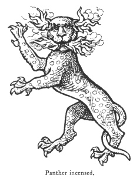

  
[Intangible Textual Heritage](../../index)  [Legendary
Creatures](../index)  [Symbolism](../../sym/index)  [Index](index) 
[Previous](fsca47)  [Next](fsca49) 

------------------------------------------------------------------------

[Buy this Book at
Amazon.com](https://www.amazon.com/exec/obidos/ASIN/B002D48Q8Y/internetsacredte)

------------------------------------------------------------------------

  
*Fictitious and Symbolic Creatures in Art*, by John Vinycomb, \[1909\],
at Intangible Textual Heritage

------------------------------------------------------------------------

### The Panther "Incensed"

"*The panther, knowing that his spotted hide  
 Doth please all beasts, but that his looks them fray,  
 Within a bush his dreadful head doth hide  
 To let them gaze, while he on them doth prey*."  
                                            Spenser, Sonnet.

This beast, like the leopard, has been
the object of much mistaken or fictitious history. Pliny, who is
responsible for many of the errors in natural history since his time,
says of the panther: "It is said that all four-footed beasts are
wonderfully

p. 200

delighted and enticed by the smell of panthers; but their hideous looke
and crabbed countenance which they bewray so soon as they show their
heads skareth them as much again: therefore their manner is to

|                                     |
|-------------------------------------|
|  |

hide their heads, and when they have trained other beasts within their
reach by their sweet savour, they fall upon them and worry them." [\*](#fn_22) And again, Sir William Segar, Garter
King-of-Arms, following the same credulous historian, says: "The panther
is admired of all other beasts for the beauty of his skyn, being spotted
with variable colours, and beloved of them for the sweetness of his
breath that streameth forth of his nostrils and ears like smoke which
our paynters mistaking, corruptly do make fire." [†](#fn_23)

It is, however, more probable that the creature was represented emitting
flame and smoke to denote and give characteristic expression to the
native savagery of the brute when irritated. If one can imagine the
terror inspired by remorseless and unpitying fury,

p. 201

sudden and impetuous, we see its object fairly typified in the panther
incensed." The idea of fire and smoke darting from its mouth, eyes and
ears was doubtless suggested by that habit peculiar to the feline race,
observable even in the domestic cat, to "spit fire" and "swear" when
rudely attacked, and as an emblem in this sense it is extremely well
indicative of sudden fury.

Guillam says: "Some authors are of opinion that there are no panthers
bred in Europe; but in Africa, Lybia and Mauritania they are plentiful.
The panther is a beast of a beautiful aspect, by reason of the manifold
variety of his divers coloured spots wherewith his body is overspread.
As a lion doth in most things resemble the nature of a man, so, after a
sort, doth the panther of a woman; for it is a beautiful beast, and
fierce, yet very loving to their young ones, and will defend them with
the hazard of their own lives; and if they miss them, they bewail their
loss with loud and miserable howling."

The Lancastrian badge "the panther," says Planché, "which is attributed
by Sir William Segar to Henry VI. and blazoned passant guardant argent
spotted of all colours with vapour issuant from her mouth and ears; but
there is no authority quoted for it, and there is no example extant, the
only collateral evidence being the supporters of the Somerset Dukes of
Beaufort, who are supposed to have used it as a token of their
Lancastrian descent." The dexter

p. 202

supporter of the Duke of Beaufort thus is blazoned: *Dexter, a panther
argent, semée of torteaux, hurts and pomies alternately, flames issuant
from the mouth and ears proper, gorged with a plain collar, and chained,
or*.

The heraldic panther, or as it is more frequently termed, a panther
incensed, is always borne guardant, *i.e.*, full-faced; and "incensed,"
that is to say, it is depicted with flames and smoke issuing from its
mouth and ears. Its coat is spotted of various tinctures as the blazon
may state.

Odet de Foix, Sieur de Lautrec, Marshal of France (+ 1528) being
considered a person of fierce appearance, took for device a panther,
with the motto "Allicit ulterius" ("He entices further"), alluding to
the attractive power of that animal notwithstanding its fierce exterior,
"an evidence," remarks a modern writer, "that he had as much vanity as
ambition."

The town of Lucca for arms bears a panther: "*La pantera, che Lucca
abbraccia e onora*."

Gian Giacomo Trivulzio, surnamed the Great (+ 1518), a celebrated
Italian soldier, bore a panther on his standard, with the motto, "Mens
sibi conscia facti" ("The mind conscious to itself of the deed"), the
panther signifying foresight (providence) from the number of eyes in his
coat. Others said he wished to imply that he knew how to manage for
himself in the various changes of his capricious fortune. [\*](#fn_24)

------------------------------------------------------------------------

### Footnotes

[200:\*](fsca48.htm#fr_22) Bk. viii. ch. 17.

[200:†](fsca48.htm#fr_23) Harl. MSS. 6085.

[202:\*](fsca48.htm#fr_24) Hist. Dev. 260.

------------------------------------------------------------------------

[Next: The Lynx](fsca49)
