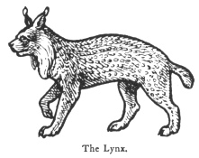

  
[Intangible Textual Heritage](../../index)  [Legendary
Creatures](../index)  [Symbolism](../../sym/index)  [Index](index) 
[Previous](fsca48)  [Next](fsca50) 

------------------------------------------------------------------------

[Buy this Book at
Amazon.com](https://www.amazon.com/exec/obidos/ASIN/B002D48Q8Y/internetsacredte)

------------------------------------------------------------------------

  
*Fictitious and Symbolic Creatures in Art*, by John Vinycomb, \[1909\],
at Intangible Textual Heritage

------------------------------------------------------------------------

p. 203

 

### The Lynx

*Felis Lynx*, or mountain cat, is found in the northern parts of Europe,
Asia and America, and climbs the highest trees. He preys on squirrels,
deer, hares, &c. He is fond of blood and kills great numbers of animals
to satisfy his unconquerable thirst. He is smaller than the panther,
about three feet and a half in length, his tail is much shorter and
black at the extremity. His ears are erect with a pencil of black hair
at the tips. The fur is long and thick, the upper part of the body is a
pale grey, the under parts white.

The sight of the lynx is said to be so piercing that the ancients
attributed to it the faculty of seeing through stone walls: it may,
however, be asserted with truth that it distinguishes its prey at a
greater distance than any other carnivorous quadruped. On this account
it is frequently employed in heraldry,

p. 204

symbolising watchfulness, keenness of vision, and also the ability to
profit by it.

Lynx-eyed, "oculis lynceis," originally referred to Lynceus, the
argonaut, who was famed for the keenness of his vision; then it was
transferred to the lynx and gave rise to the fable that it could see
through a wall (notes to "Philobiblon," by E. C. Thomas).

The Accademia de Lincei, founded in Rome in 1603, with the object of
encouraging a taste for natural history, adopted the name and device of
the lynx because the members should have the eyes of a lynx to penetrate
the secrets of nature. Galileo, Fabio Colonna, and Gianbattista Porta
were among the members of the academy, the latter philosopher and
mathematician, who was the inventor of the camera obscura, bore the
device of the academy, the lynx, and the motto "Aspicit et inspicit"
("Looks at and looks into").

Charles IV. of Luxemburg, Emperor of Germany, adopted the lynx for his
impress, with the motto, "Nullius pavit occursum" ("He fears not meeting
with any one").

The Lizard Lynx is an animal of the lynx
or wild cat kind of a dark brown colour, spotted black; the ears and
tail are short. They are frequent in the woods of Sweden, Denmark and
Norway, where they are usually termed lizards.

------------------------------------------------------------------------

[Next: Cat-a-Mountain—Tiger Cat or Wild Cat](fsca50)
