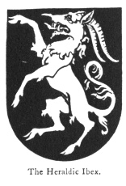

  
[Intangible Textual Heritage](../../index)  [Legendary
Creatures](../index)  [Symbolism](../../sym/index)  [Index](index) 
[Previous](fsca52)  [Next](fsca54) 

------------------------------------------------------------------------

[Buy this Book at
Amazon.com](https://www.amazon.com/exec/obidos/ASIN/B002D48Q8Y/internetsacredte)

------------------------------------------------------------------------

  
*Fictitious and Symbolic Creatures in Art*, by John Vinycomb, \[1909\],
at Intangible Textual Heritage

------------------------------------------------------------------------

### The Heraldic Ibex

is an imaginary beast resembling the heraldic antelope in appearance,
with the exception of the horns projecting from his forehead,

|                                      |
|--------------------------------------|
|  |

which are serrated like a saw. Perhaps it would not be erroneous to
consider it identical with the heraldic antelope.

The real or natural ibex is a native of the Alps, the Pyrenees and the
Grecian mountains, where they abound in defiance of the hunters. It
resembles a goat, but the horns are much larger, bent backwards, and
full of knots, one of which is added every year.

------------------------------------------------------------------------

[Next: Bagwyn](fsca54)
