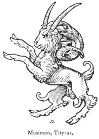

  
[Intangible Textual Heritage](../../index)  [Legendary
Creatures](../index)  [Symbolism](../../sym/index)  [Index](index) 
[Previous](fsca55)  [Next](fsca57) 

------------------------------------------------------------------------

[Buy this Book at
Amazon.com](https://www.amazon.com/exec/obidos/ASIN/B002D48Q8Y/internetsacredte)

------------------------------------------------------------------------

  
*Fictitious and Symbolic Creatures in Art*, by John Vinycomb, \[1909\],
at Intangible Textual Heritage

------------------------------------------------------------------------

p. 217

### Musimon, Tityrus

A fictitious animal mentioned by Guillim
and others. It nearly

|                                     |
|-------------------------------------|
|  |

resembles *a goat, with the head and horns of a ram*, but has besides
the horns of that beast, *a pair of goat's horns*. It is also mentioned
in Guillim's "Display," where it is said to be a bigenerous beast, of
unkindly procreation, engendered between a goat and a ram, like the
Tityrus, the offspring of a sheep and goat, as noted by Upton.

------------------------------------------------------------------------

[Next: The Enfield](fsca57)
