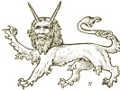

  
[Intangible Textual Heritage](../../index)  [Legendary
Creatures](../index)  [Symbolism](../../sym/index)  [Index](index) 
[Previous](fsca60)  [Next](fsca62) 

------------------------------------------------------------------------

[Buy this Book at
Amazon.com](https://www.amazon.com/exec/obidos/ASIN/B002D48Q8Y/internetsacredte)

------------------------------------------------------------------------

  
*Fictitious and Symbolic Creatures in Art*, by John Vinycomb, \[1909\],
at Intangible Textual Heritage

------------------------------------------------------------------------

### Apres

A fictitious animal resembling a bull,
with a short tail like that of a bear. It is the sinister supporter of
the arms of the Company of Muscovy Merchants.

------------------------------------------------------------------------

[Next: Stelliones](fsca62)
