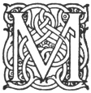

  
[Intangible Textual Heritage](../../index.md)  [Legendary
Creatures](../index)  [Symbolism](../../sym/index)  [Index](index.md) 
[Previous](fsca62)  [Next](fsca64.md) 

------------------------------------------------------------------------

[Buy this Book at
Amazon.com](https://www.amazon.com/exec/obidos/ASIN/B002D48Q8Y/internetsacredte.md)

------------------------------------------------------------------------

  
*Fictitious and Symbolic Creatures in Art*, by John Vinycomb, \[1909\],
at Intangible Textual Heritage

------------------------------------------------------------------------

p. 222 p. 223

# Fictitious Creatures of the Sea

p. 224 p. 225

### INTRODUCTORY NOTES

                   "*The sea, that is  
 A world of waters heapèd up on high,  
 Rolling like mountains in wild wilderness,  
 Horrible, hideous, roaring with hoarse cry!*"  
                                           Spenser.

"*I can call spirits from the vasty deep*."  
                                   Shakespeare.

|                    |
|--------------------|
|  |

MARINERS in all ages, prone to superstitious fears, have peopled the
great deep with beings of the most dreadful kind, all the more wonderful
and indescribable because of the mysterious and unknown regions in the
sea depths which they were supposed to inhabit. Classic mythology in its
wealth of imagery allotted a whole hierarchy of greater and lesser
divinities to the government of the watery element, whose capricious
ruling of the waves man altogether failed to comprehend. Their fancied
terrors, begot in calms and storms, in darkness and in fogs, midst
dangers of the most appalling kind, assumed those monstrous and
fantastic shapes which their own fears created. The active forces of
nature in unusual

p. 226

forms impressed them as the result of supernatural agency, or the
"meddling of the gods," whose favours and protection the mariner, by
prayers and supplications, endeavoured to propitiate; and whilst
tremblingly he skirts the horizon's edge in timid ventures, new dangers
impel him to promises of greater gifts to assuage the wrathful mood of
his angry god or some other equally powerful or more spiteful.

The national god of the Philistines was represented with the face and
hands of a man and the tail of a fish. It was but natural that a
seafaring people should adopt a god of that form.

"Dagon his name; sea-monster, upward man  
 And downward fish: yet had his temple high  
 Reared in Azotus, dreaded through the coast  
 Of Palestine, in Gath and Ascalon,  
 And Accaron and Gaza's frontier bounds."  
                          *Paradise Lost*, Book i. 462.

In the leviathan and behemoth of Scripture are darkly indicated monsters
of the great deep. Scandinavian mythology, like that of all bold
maritime peoples in old times, is rife with legends of certain great
monsters of the sea. The kraken or sea-serpent of popular legend is a
myth not yet laid to rest; there is still a lingering belief in the
existence of the mermaid.

"With a comb and a glass in her hand, her hand, her
hand,  
 With a comb and a glass in her hand."  
                                    Popular sea-song.

p. 227

Chief amongst the Grecian sea-divinities stands *Poseidon*, or *Neptune*
as he was called by the Romans, the potent "ruler of the seas." He
usually dwelt, not in Olympus, but at the bottom of the sea, in a
magnificent golden palace in the neighbourhood of Ægæ. He is always
represented with a trident, sometimes with a rudder—special symbols of
his power over the sea. Accompanied by his wife, fair Amphitrite, he was
frequently pictured in royal state in his chariot, drawn through the
billows by wild sea-horses, attended by "Triton blowing loud his
wreathed horn," Proteus, "the godlike shepherd of the sea," and other
followers—dolphins leaping the waves and showing their high arched backs
in wild gambolings.

*Nereus* and his fifty daughters, the *Nereides*, who dwelt in caves and
grottos of the ocean—beneficent sea-nymphs,—win the hearts of the
sailors, now by their merry sports and dances, now by their timely
assistance in the hour of danger. Whilst Nereus and his lovely daughters
represent the sea under its calm and pleasant aspect, Thaumas, Phorcys,
Ceto present it as the world of wonders, under its more terrible
conditions. The storm winds and all the terrors and dangers of the deep
were typified under various strange and peculiar forms. Not the least
dreaded were the *Sirens*, fatal sisters, who "spread o’er the silver
waves their golden hair," basked near sunlit rocks, and lured all men to
their ruin by their enchanting voices, save only the crafty Ulysses.

p. 228

These and many others of lesser note, Proteus, Glaucus and the rest,
make up the discordant influences that govern the watery element.

Many wonderful stories are told by classic writers concerning these old
myths, and innumerable relics of antique art which embody the
conceptions of the times are extant in our museums, by which we may
judge to what a large extent such ideas influenced the common life and
formed the beliefs of ancient peoples.

It is also worthy of observation to note in what manner the ancients
sought to identify the various sea-deities and other mythical creatures
with the element they lived in. Each was known by his form or the
attributes by which he was accompanied. Modern heraldry repeats many of
these old-world myths as new-coined fables, so that for their proper
understanding and signification it will be necessary briefly to refer to
ancient ideas respecting them. Lakes, rivers and fountains had each
their impersonation peculiar to them, which will be found referred to in
classic story.

Mediæval legend is equally rife with accounts of wonderful creatures of
the sea. The change of one form of superstition for another alters but
little the constitution of the mind to harbour fears, and the
imagination will deceive even the wisest and best so long as Nature's
laws are misunderstood.

Particular whirlpools, rocks and other dangerous places to navigation,
are personated under the forms

p. 229

of monsters of various and awful shapes feared by the mariner, who
dreads

"The loud yell of watery wolves to hear."

Scylla and Charybdis are two rocks which lie between Italy and Sicily.
Ships which tried to avoid one were often wrecked on the other. The
ancients feigned an interesting legend to account for their existence.
It was Circe who changed Scylla into a frightful sea monster, and
Jupiter who changed Charybdis into a whirlpool, the noise of which was
likened to the loud barking of dogs; and the monster was therefore
represented with savage dogs amidst her scaly folds, and loudly baying.

"Far on the right her dogs foul Scylla hides;  
 Charybdis roaring on the left presides,  
 And in her greedy whirlpool sucks the tides,  
 Then spouts them from below; with fury driven  
 The waves mount up, and wash the face of heaven.  
 But Scylla from her den with open jaws  
 The sinking vessel in her eddy draws  
 Then dashes on the rocks. A human face  
 And virgin bosom hides her tail's disgrace;  
 Her parts obscene below the waves descend,  
 With dogs enclosed, and in a dolphin end."  
                                        *Æneid*, Book iii.

Homer gives a vivid description of Ulysses passing the rocks and
whirlpools:

"Now through the rocks, appall’d with deep dismay,  
 We bend our course, and stem the desperate way;

p. 230

\[paragraph
continues\]  Dire Scylla there a scene of horror forms;  
 And here Charybdis fills the deep with storms.  
 When the tide rushes from her rumbling caves,  
 The rough rock roars, tumultuous boil the waves;  
 They toss, they foam, a wild confusion raise,  
 Like water bubbling o’er the fiery blaze;  
 Eternal mists obscure the aërial plain,  
 And high across the rocks she spouts the main:  
 When in her gulfs the rushing sea subsides,  
 She drains the ocean with the refluent tides:  
 The rock rebellows with a thundering sound;  
 Deep, wondrous deep, below appears the ground."  
                                       *Odyssey*, Book xii.

The giants and ogres of romance were never so fearfully armed or clothed
by the wildest fiction with so terrible an aspect as the cephalopods,
the race to which the cuttlefish or octopus belongs. Eminently
carnivorous, voracious and fierce; beneath staring eyes are spread eight
strong fleshy arms furnished with tenacious suckers, which adhere with
unrelenting pertinacity, and the arms are swiftly twined round the
struggling prey, which vainly strives to disengage itself from so
fearful and so fatal embrace. Cephalopods of enormous size are sometimes
found with arms as thick as a man's thigh. Homer refers to its tenacity
of grip in a simile.

The cuttlefish appears upon ancient Greek coins of Coressus, in allusion
to the worship of Neptune, a deity much venerated as the protector of
this island.

Amongst the veritable inhabitants of the ocean there are few more
extraordinary mammals than the

p. 231

sea-unicorn, *Monodon monoceros*, the beaked whale of the Arctic seas,
twenty to thirty feet from stern to snout. His length is increased about
eight feet by his magnificent spirally twisted tusk of the purest ivory,
which in reality is simply the canine tooth growing straight out of the
upper jaw. One of the royal treasures of Denmark is the narwhal throne
of the Castle of Rosenberg. It is the horn of this "strange fish" which
has kept up the belief in the existence of the mythical unicorn.

*Xiphias gladius*, swordfish, is the largest of the thorny fishes, and
belongs to the scombers or mackerel group. The sawfish, *Pristis
antiquorum*, ranks by himself between the rays and sharks. He has the
long body of a shark and the underside gill openings of a ray. His saw,
like the sword of the Xiphias, is a long flattened bony snout, but is
double-edged and serrated. It is well known as a weapon among the
Polynesian islanders, and, like the sword of the Xiphias, is frequently
found buried in the hulls of ocean-going ships.

There are two denizens of the deep which bear the name of sea-horse—one
the tiny Hippocampus, the other the mighty walrus. The hippocampus of
our public aquariums, a bony pipefish some six or eight inches in
length, swimming upright, his favourite position in the water, with the
general resemblance of his head to that of a horse, is very striking;
anchored to the seaweed stems by their tails they dart on their prey
with great quickness.

p. 232

Hippocampus (ἵππος, *hippos*, a horse; κάμπη, *campe*, a bending), the
steed of Neptune, had only the two forelegs of a horse, the hinder
quarter being that of a dolphin. The word means "coiling horse."

The Sea-horse of the North, or walrus—the *Rossmareus* or *Morse* of the
Scandinavians, the *Trichecus rosmarus* of science, is fifteen or twenty
feet long, or even longer, and armed with huge canine teeth, sometimes
measuring thirty inches in length—tusks which furnish no small amount of
our commercial ivory. Many are the thrilling stories of the chase of
these great sea-horses, for the walrus fights for his life as
determinedly as any animal hunted by man. The walrus has had the honour
assigned to it also of being the original of the mermaid, and Scoresby
says the front part of the head of a young one without tusks might
easily be taken at a little distance for a human face, especially as it
has a habit of raising its head straight out of the water to look at
passing ships.

The manatee, or sea-cow, found on the tropical coasts and streams of
Africa and America, is called by the Portuguese and Spaniards the
"woman-fish," from its supposed close resemblance. Its English name
comes from the flipper resembling a human hand—*manus*—with which it
holds its young to its breast. One of this species, which died at the
Royal Aquarium in 1878, was as unlike the typical mermaid as one could
possibly imagine, giving one a very startling idea of the difference
between romance

p. 233

and reality; but if it was observed in its native haunts, and seen at
some little distance, and then only by glimpses, it might possibly, as
some have asserted, present a very striking resemblance to the human
form.

Sir James Emerson Tennent, speaking of the *Dugong*, an herbivorous
cetacean, says its head has a rude approach to the human outline, and
the mother while suckling her young holds it to her breast with one
flipper, as a woman holds an infant in her arm; if disturbed she
suddenly dives under water and throws up her fish-like tail. It is this
creature, he says, which has probably given rise to the tales about
mermaids.

Seals differ from all other animals in having the toes of the feet
included almost to the end in a common integument, converting them into
broad fins armed with strong non-retractile claws. Of the many varieties
of the seal family, from Kamchatka comes the noisy "Sea-lion" (*Otaria jubata*), so called from his
curious mane. In the same neighbourhood we get the "Sea-leopard" (*Leptonyx weddellii*), and the
"Sea-bear" (the *Etocephalus ursinus*),
whose larger and better-developed limbs enable him to stand and walk on
shore. But the most important of the seals, in a commercial sense, are
the "Harp Seal" (*Phoca Grœnlandica*) and
the Common Seal, or "Sea-dog" (*Phoca vitulina*), which yield the
skins so valuable to the furrier. There are several other species, of
which the most known are the Crested
Seal, or *Neistsersoak* (*Stemmatopus cristatus*), and the Bearded Seal (*Phoca barbata*).

p. 234

Apart from the seal having possibly given rise to legends of the
mermaid, it has a distinguished position in superstition and mythology
on its own account. In Shetland it is the "haff-fish," or selkie, a
fallen spirit. Evil is sure to follow the unfortunate destroyer of one
of these creatures. In the Faroe Islands there is a superstition that
the seals cast off their skins every ninth night and appear as mortals,
dancing until daybreak on the sands. Sometimes they are induced to
marry, but if ever they recover their skins they betake themselves again
to the water.

Stephen of Byzantium relates that the ships of certain Greek colonists
were on their expeditions followed by an immense number of seals, and it
was probably on this account that the city they founded in Asia received
the name of Phocea, from φώκη (*Phoké*), the Greek name of a seal, and
they also adopted that animal as the type or badge of the city upon
their coinage. The gold pieces of the Phoceans were well known among the
Greek States, and are frequently referred to by ancient writers. "Thus
from a single coin," says Noel Humphreys, [\*](#fn_28.md) "we obtain the corroboration of the
legend of the swarm of seals, of the remote epoch of the emigration in
question, the coin being evidently of the earliest period, most probably
of the middle of the seventh century before the Christian era."

Luigi (+ 1598), brother to the Duke of Mantua, had for device a seal
asleep upon a rock in a troubled

p. 235

sea, with the motto: "Sic quiesco" ("So rest I"). The seal, say the
ancient writers, is never struck by lightning. The Emperor Augustus
always wore a belt of seal-skin. "There is no living creature sleepeth
more soundly," says Pliny, [\*](#fn_29.md)
"therefore when storms arise and the sea is rough the seal goes upon the
rocks where it sleeps in safety unconscious of the storm."

The poet Spenser embodies many of the conceptions of his time in the
description of the crowning adventures of the Knight Guyon. He here
refers to "great sea monsters of all ugly shapes and horrible aspects"
"such as Dame Nature's self might fear to see."

"Spring-headed hydras, and sea-shouldering whales;  
 Great whirlpools, which all fishes make to flee;  
 Bright scolopendras arm’d with silver scales;  
 Mighty monoceroses with unmeasured tails;

 The dreadful fish that hath deserved the name  
 Of death, and like him looks in dreadful hue;  
 The grisly wasserman, that makes his game  
 The flying ships with swiftness to pursue;

 The horrible sea-satyr that doth shew  
 His fearful face in time of greatest storm;  
 Huge Ziffius, whom mariners eschew  
 No less than rocks, as travellers inform;  
 And greedy rose-marines with visages deform;  
 All these, and thousand thousand many more  
 And more deformed monsters, thousandfold."  
                     *Faerie Queen*, Book ii. cant. xii.

p. 236

The early heralds took little account of these dreadful creatures—more
easily imagined by fearful mariners or by poets than depicted by artists
from their vague descriptions. The most imaginative of the tribe rarely
ventured beyond such representations of marine monsters as appealed
strongly and clearly to the universal sense of mankind—compounds of
marine and land animals—either from a belief in the existence of such
creatures, or because they used them as emblems or types of Qualities,
combining for this purpose the attributes of certain inhabitants of the
sea with those of the land or of the air to form the appropriate symbol.

In modern heraldry such bearings are usually adopted with special
allusion to actions performed at sea, or they have reference in some way
to the name or designation of the bearer, and hence termed allusive or
canting heraldry. Some maritime towns bear nautical devices of the
fictitious kind referred to. For instance, the City of Liverpool has for
supporters Neptune with his trident, and a Triton with his horn.
Cambridge and Newcastle-on-Tyne have sea-horses for supporters to their
city's arms. Belfast has the sea-horse for sinister supporter and also
for crest.

Many of the nobility also bear, either as arms or supporters, these
mythical sea creatures, pointing in many instances to memorable events
in their family history; indeed, as islanders and Britons, marine
emblems—real and mythical—enter largely into our national heraldry.

------------------------------------------------------------------------

### Footnotes

[234:\*](fsca63.htm#fr_28.md) "Coin Collector's
Manual," Bohn.

[235:\*](fsca63.htm#fr_29.md) Book ix. ch. 13.

------------------------------------------------------------------------

[Next: Poseidon or Neptune](fsca64.md)
