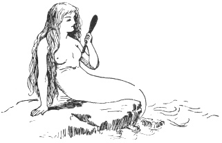
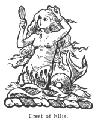
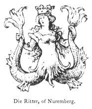

  
[Intangible Textual Heritage](../../index)  [Legendary
Creatures](../index)  [Symbolism](../../sym/index)  [Index](index) 
[Previous](fsca65)  [Next](fsca67) 

------------------------------------------------------------------------

[Buy this Book at
Amazon.com](https://www.amazon.com/exec/obidos/ASIN/B002D48Q8Y/internetsacredte)

------------------------------------------------------------------------

  
*Fictitious and Symbolic Creatures in Art*, by John Vinycomb, \[1909\],
at Intangible Textual Heritage

------------------------------------------------------------------------

p. 243

### The Mermaid or Siren

"*Mermaid shapes that still the waves with ecstasies
of song*."  
                                              T.
Swan,  
                      "The World within the Ocean."

"*And fair Ligea's golden comb,  
 Wherewith she sits on diamond rocks,  
 Sleeking her soft alluring hair*."  
                             Milton,
"Comus."

|                    |
|--------------------|
|  |

This fabulous creature of the sea, well
known in ancient and modern times as the frequent theme of poets and the
subject of numberless legends, has from a very early date been a
favourite device. She is usually represented in heraldry as having the
upper part the head and body of a beautiful young woman, holding a comb
and glass in her hands, the lower part ending in a fish.

Ellis (Glasfryn, Merioneth).—*Argent, a mermaid gules, crined or,
holding a mirror in her right hand and a comb in her left, gold. Crest,
a mermaid as in the arms. Motto*, "Worth ein ffrwythau yn hadna byddir."
Another family of the same name, settled

p. 244

in Lancashire, bears the colours reversed, viz., *gules, a mermaid
argent*.

Sir Josiah Mason.—Crest, *a mermaid, per fess wavy argent and
azure, the upper part guttée de larmes,*

|                    |
|--------------------|
|  |

*in the dexter hand a comb, and in the sinister a mirror, frame and hair
sable*.

Balfour of Burleigh.—*On a rock, a mermaid proper, holding in her dexter
hand an otter's head erased sable, and in the sinister a swan's head,
erased proper*. The supporters of Baron Balfour are an otter and a swan,
which will account for the heads appearing in the hands of the mermaid,
instead of the traditionary comb and mirror. In some other instances the
like occurs, as in the mermaid crest of Cussack, *the mermaid sable
crined or, holds in dexter hand a sword, and in the sinister a sceptre*.

Sir George Francis Bonham, Bart.—*Crest, a mermaid holding in dexter
hand a wreath of coral, and in the sinister a mirror*.

'Wallop, Earl of Portsmouth, bears for crest *a mermaid proper*, with
her usual accompaniments, the comb and mirror. Another family of the
same name and bearing the same arms has for crest *a mermaid with two
tails extended proper, hair gold, holding her tails in her hands
extended wide*.

p. 245

In foreign heraldry the mermaid is generally termed *Mélusine*, and
represented with two fishy extremities.

Die Ritter, of Nuremberg bears *per fess sable and or, a mermaid holding
her two tails, vested gules, crowned or*.

The Austrian family of

|                                             |
|---------------------------------------------|
|  |

Estenberger bears for crest *a mermaid without arms, and having wings*.

A mermaid was the device of Sir William de Brivere, who died in 1226. It
is the badge of the Berkeleys; in the monumental brass of Lord Berkeley,
at Wolton-under-Edge, 1392 A.D., he bears a collar of mermaids over his
camail. The Black Prince, in his will, mentions certain devices that he
appears to have used as badges; among the rest we find "Mermaids of the
Sea." It was the dexter supporter in the coat-of-arms of Sir Walter
Scott, and the crest of Lord Byron. The supporters of Viscount Boyne are
mermaids. Skiffington, Viscount Marsereene, the Earl of Caledon, the
Earl of Howth, Viscount Hood, and many other titled families bear it as
crest or supporters. It is also borne by many untitled families.

The arms of the princely house of Lusignan, kings of Cyprus and
Jerusalem, "Une sirène dans une cuvé," were founded on a curious
mediæval

p. 246

legend of a mermaid or siren, termed Mélusine, a fairy, condemned by
some spell to become on one day of the week only, half woman, half
serpent. The Knight Roimoudin de Forez, meeting her in the forest by
chance, became enamoured and married her, and she became the mother of
several children, but she carefully avoided seeing her husband on the
day of her change; one day, however, his curiosity led him to watch her,
which led to the spell being broken, and the soul with which by her
union with a Christian she hoped to have been endowed, was lost to her
for ever.

This interesting myth is fully examined in Baring Gould's "Curious Myths
of the Middle Ages."

The mermaid is represented as the upper half of a beautiful maiden
joined to the lower half of a fish, and usually holding a comb in the
right hand and a mirror in the left; these articles of the toilet have
reference to the old fable that always when observed by man mermaids are
found to be resting upon the waves, combing out their long yellow hair,
while admiring themselves in the glass: they are also accredited with
wondrous vocal powers, to hear which was death to the listener. It was
long believed such creatures really did exist, and had from time to time
been seen and spoken with; many, we are told, have fatally listened to
"the mermaid's charmed speech," and have blindly followed the beguiling,
deluding creature to her haunts beneath the wave, as did Sidratta, who,
falling in the Ganges, became enamoured

p. 247

of one of these beautiful beings, the Upsaras, the swan-maidens of the
Vedas.

All countries seem to have invented some fairylike story of the waters.
The Finnish Nakki play their silver harps o’ nights; the water imp or
Nixey of Germany sings and dances on land with mortals, and the "Davy"
(Deva), whose "locker" is at the bottom of the deep blue sea, are all
poetical conceptions of the same description. The same may be said of
the Merminne of the Netherlands, the White Lady of Scotland and the
Silver Swan of the German legend, that drew the ship in which the Knight
Lohengrin departed never to return.

In the "Bestiary" of Philip de Thaun he tells us that "Siren lives in
the sea, it sings at the approach of a storm and weeps in fine weather;
such is its nature: and it has the make of a woman down to the waist,
and the feet of h falcon, and the tail of a fish. When it will divert
itself, then it sings loud and clear; if then the steersman who
navigates the sea hears it, he forgets his ship and immediately falls
asleep."

The legendary mermaid still retains her place in popular legends of our
sea coasts, especially in the remoter parts of our islands. The stories
of the Mirrow, or Irish fairy, hold a prominent place among Crofton
Croker's "Fairy Legends of the South of Ireland." Round the shores of
Lough Neagh old people still tell how, in the days of their youth,
mermaids were supposed to reside in the water, and

p. 248

with what fear and trepidation they would, on their homeward way in the
twilight, approach some lonely and sequestered spot on the shore,
expecting every moment to be captured and carried off by the witching
mere-maidens. On the Continent the same idea prevails. Among the
numerous legends of the Rhine many have reference to the same fabled
creature.

As we know, mariners in all ages have delighted in tales of the
marvellous, and in less enlightened times than the present, they were
not unlikely to have found many willing listeners and sound believers.
Early voyagers tell wonderful stories of these "fish-women," or
"women-fish," as they termed them. The ancient chronicles indeed teem
with tales of the capture of "mermaids," "mermen," and similar strange
creatures; stories which now only excite a smile from their utter
absurdity. So late as 1857 there appeared an article in the *Shipping
Gazette*, under intelligence of June 4, signed by some Scotch sailors,
and describing an object seen off the North British coast "in the shape
of a woman, with full breast, dark complexion, comely face" and the
rest. It is probable that some variety of the seal family may be the
prototype of this interesting myth.

The myth of the mermaid is, however, of far older date; Homer and later
Greek and Roman poets have said and sung a great deal about it.

------------------------------------------------------------------------

[Next: The Sirens of Classical Mythology](fsca67)
