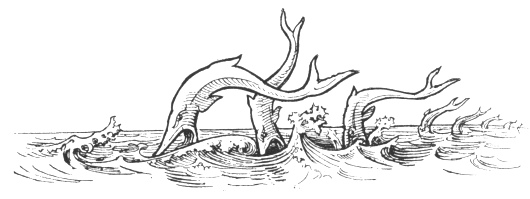

  
[Intangible Textual Heritage](../../index.md)  [Legendary
Creatures](../index)  [Symbolism](../../sym/index)  [Index](index.md) 
[Previous](fsca67)  [Next](fsca69.md) 

------------------------------------------------------------------------

[Buy this Book at
Amazon.com](https://www.amazon.com/exec/obidos/ASIN/B002D48Q8Y/internetsacredte.md)

------------------------------------------------------------------------

  
*Fictitious and Symbolic Creatures in Art*, by John Vinycomb, \[1909\],
at Intangible Textual Heritage

------------------------------------------------------------------------

p. 254

 

### The Dolphin of Legend and of Heraldry

           "*his delights  
 Were dolphin-like; they showed his back above  
 The element they lived in*."  
                 "Anthony and Cleopatra," Act v. sc. 2.

As the Lion is the king of beasts, the
Eagle the king of birds, so in similar heraldic sense the Dolphin is
king of fishes. His position in legend is probably due to his being one
of the biggest and boldest creatures of the sea that passed the Pillars
of Hercules into the Mediterranean Sea. Pliny (Book ix. ch. 8) calls it
"The swiftest of all other living creatures whatsoever, and not of sea
fish only, is the dolphin; quicker than any fowle, swifter than the
arrow shot from a how."

The dolphin, of which there are several varieties,

p. 255

enjoys a pretty wide geographical distribution, being found in the
Arctic seas, the Atlantic Ocean, and indeed of all seas. It was well
known to the ancients and furnished the theme of many a fabulous story.

The common dolphin (*Delphinus Delphis*) the true *hieros ichthus*, is
only rarely met with on the British coast. Its

|                                |
|--------------------------------|
|  |

length is usually seven or eight feet, though some specimens have been
found to measure ten feet. Its back is almost straight, or only slightly
elevated; its colour is dusky black above and whitish beneath. Its
pectorals or flappers, which are placed low in the sides, are well
developed, and a dorsal fin, which is somewhat short, is much elevated,
Its tail is broad and notched in the centre and expanded
horizontally—not vertically as in most other fishes—by the help of which
it makes its peculiar leaps over the surface of the water and at the
same time takes its breath.

Unlike its near relatives the porpoises, who haunt the coast, dolphins
live far out at sea, and are gene-. rally mistaken for porpoises. The
long-snouted dolphin feeds on pelagic fishes. The short-nosed porpoise
likes salmon and mackerel, robs the fishermen's nets, and even burrows
in the sand in search of odds and ends. The dolphin is the sea-goose.

p. 256

\[paragraph continues\] The porpoise is
the sea-pig; he is the *porc-poisson*, the *porc-pois*, or sea-hog.

The convex snout of the dolphin is separated from the forehead by a deep
furrow; the muzzle is greatly extended, compressed, and much attenuated
especially towards the apex, where it terminates in a rather
sharp-pointed beak. The French name *bec d’oie*, from the great
projection of its nose or beak, has led to its adoption in the arms of
English families of the name of Beck. The dolphin is an elegant and
swift swimmer, and capable of overtaking the swiftest of the finny
tribe. Because the creature is noted for its swiftness it has been
adopted in the arms of Fleet.

The dolphin is able to hold his own against nearly all others of his
size and weight, and even some of the larger cetaceans only come off
second best in an encounter with the dolphin. He is voracious,
gluttonous, and ever on the look out for something to turn up, hunting
his prey with great persistency and devouring it with avidity. He has
been not inaptly styled "the plunderer of the deep."

The destructive character of the dolphin amongst the various tribes of
fish is not lessened when we examine its formidable jaws studded with an
immense number of interlocking teeth. Notwithstanding its rapacious
habits and the variety of its diet it was in England formerly regarded
as a royal fish, and its flesh held in high estimation. Old chroniclers
have frequent entries of dolphins being caught in the Thames, thus: "3
Henry V.—Seven dolphins came

p. 257

up the Thames, whereof four were taken." "14th Richard II.—On Christmas
Day one was taken at London Bridge, being ten feet long, and a monstrous
grown fish." (Delalune's "Present State of London," 1681.) The early
fathers of the Church deemed "all fish that swam in the sea"; the
dolphin was therefore eaten in Lent. He is, however, a mammal, not a
fish, and though an air-breathing creature he lives and dies in the
ocean. But one is brought forth at a birth, and between the old and
young of their kind, as in the case of all marine animals, a strong
affection exists.

Travellers’ tales are notoriously hard of belief, and must be taken *cum
grano salis*. We learn from Sir Thomas Herbert, an early voyager, that
when he was on the coast of Sanquehar, a large kingdom on the east side
of the Cape of Good Hope, he "saw there great numbers of dolphins," of
which he says: "They much affect the company of men, and are nourished
like men; they are always constant to their mates, tenderly affected to
their parents, feeding and defending them against hungry fishes when
they are old," and much more information equally astonishing.

A story is related of a man who once went to a mufti and asked him
whether the flesh of the sea-pig (the dolphin) was lawful food. Without
any hesitation the mufti declared that pig's flesh was unlawful at all
times and under all circumstances. Some time after another person
submitted the question to the same authority, whether the *fish* of the
sea, called the sea-pig,

p. 258

was lawful food. The mufti replied: "Fish is lawful food by whatever
name it may be called."

Classic Fable and Mediæval Legend have shed a halo of romantic
interest around the dolphin which cleaves to it even to the present
hour; the rare event of a dolphin being caught in British waters revives
with a thrill all the old-world stories and historic associations of
this famous fish as if it were a veritable relic of the golden age. The
dolphin of fact we have found to be quite a different creature from what
he is pictured by the ancients. The mariner may be engulfed by "the
yawning, dashing, furious sea," but no generous dolphin now watches with
tender eye, solicitous for his safety, nor offers his ready back to
speed him to the shore.

The dolphin of our modern poets and sailors—the swift swimmer that leaps
after the flying-fish and frolics in front of the vessel's prow until he
is caught by the glittering tin—is the *Coryphæna hippurus*, the species
famed for its changing tints when taken from the water. During a calm,
these fishes, when swimming about a ship, appear of a brilliant blue or
purple, shining with a metallic lustre in every change of reflected
light. On being captured and brought on deck, the variety of these tints
is very beautiful. The bright purple and golden yellow hues change to
brilliant silver, varying back again into the original colours, purple
and gold. This alteration of tints continues for some time, diminishing
in intensity, and at last settles down into a dull leaden hue. The
iridescent

p. 259

lines which play along its elegant curves as he lies on deck has
awakened the enthusiasm of many a writer. Byron tells us in a beautiful
simile:

                    "Parting day  
 Dies like the dolphin, whom each pang imbues  
 With a new lustre, as it gasps away,  
 The last still loveliest, till ’tis gone—and all is grey."

It is needless to say that the legendary dolphin is not to be confounded
with the gay and graceful *coryphæna* to whom alone

|                                           |
|-------------------------------------------|
|  |

belong those rainbow flashes of colour in dying. The common dolphin
(*Delphinus delphis*) is dark on the back and satiny white beneath but
not even in the agonies of death does he change colour, though like all
dead things the body becomes slightly phosphorescent during
decomposition. There are two curious fresh water dolphins, the Sooloo of
the Ganges and the Inia of the Amazon, which form the connecting-link
between the herbaceous and carnivorous cetacea.

The dolphin (δελφίν) may be considered an accessory symbol of Apollo,
who, as we read in the Homeric hymns, once took the form of a dolphin
when he guided the Cretan ship to Crissa, whence, after commanding the
crew to burn the ship and erect an altar to him as Apollo Delphinios, he
led them to

p. 260

\[paragraph continues\] Delphi, and
appointed them to be the first priests of his temple.

The dolphin is the most classic of fishes, the favourite of Apollo, and
sacred to that bright divinity, deriving his name from the oracular
Delphi, that mysterious spot, "the earth's umbilicus," the very centre
of the world, Delphi or Delphos, a town in Phocis, famous for its oracle
in the Temple of Apollo, upon the walls of which were sculptured the
*Helios ichthus*, Apollo's fish.

In the legend of Tarento, Phalantus, heading the Patheniæ, was driven
from Sparta and shipwrecked off the coast of Italy, and escaped on a
friendly dolphin's back to Tarentum. We learn from Aristotle that the
youthful figure seated on the dolphin, which is the most common type on
the coins of this city, was intended for Taras, a son of Poseidon, from
whom the city is said to have derived its name.

The dolphins, "the arrows of the sea," were the great carriers of
ancient times. Not only did they bear the Nereides safely on their
backs, but Arion, the sweet singer, when forced to leap into the sea to
escape the mariners who would have murdered him, had previously so
charmed the dolphins by his playing that they gathered round the ship
and one of them bore Arion safely to Tænarus, whilst the musician

              "with harmonious strains  
Requites his bearer for his friendly pains."

\[paragraph continues\] The classic myth
of Arion and the dolphin, like

p. 261

many other pagan fictions, was invested by the early Christians with an
entirely different signification, and in the sculptures and frescoes of
the catacombs and other symbolic representations of the Christian
converts, the frequent introduction of the dolphin "points not to the
deliverer of Arion, but to Him who through the waters of baptism opens
to mankind the paths of deliverance, causing them to so pass the waves
of this troublesome world that finally they may come to the land of
everlasting life."

The poet Licophron says Ulysses bore a dolphin on his shield, on the
pommel of his sword, as well as on his ring, in commemoration of the
extraordinary escape of his son Telemachus, who when young fell into the
sea and was taken up by a dolphin and safely brought on shore. Pliny and
others relate a story of one of these fishes which frequented the Lake
Lucrin: "A boy who went every day to school from Baia to Puzzoli used to
feed this dolphin with bread, and it became at last so familiar with the
boy that it carried him often on its back over the bay."

The dolphins were early symbols on the coins of Ægina, and though
abandoned for a time were afterwards resumed; and they appear upon later
and well-known coins of that State accompanied by the wolf and other
national devices. Argos had anciently two dolphins; Syracuse, a winged
sea-dog, a dolphin, &c.; Teneos (Cyclades) two dolphins and a trident.
The dolphin and trident figures also upon coins of

p. 262

the ancient city of Byzantium, signifying probably the sovereignty of
the seas. It is even figured by the ancients as a constellation in the
heraldry of the

|                                  |
|----------------------------------|
|  |

heavens. In botany it lives in larkspurs called delphiniums, from their
curious petals and the slender segments of their leaves.

The dolphin and anchor is a famous historic symbol. Titus, Emperor of
Rome, took the device of a dolphin twisted round an anchor, to imply,
like the emblem of Augustus, the medium between haste and slowness, the
anchor being the symbol of delay, as it is also of firmness and
security, while the dolphin is the swiftest of fish. This device appears
also upon the coins of Vespasian, the father of Titus. The anchor was
also used as a signet ring by Seleneus, King of Syria. The dolphin and
anchor was also used, with the motto "Festina lente" ("Hasten slowly"),
by the Emperor Adolphus of Nassau, and by Admiral Chabot. The family of
Onslow bear the same for crest and motto.

Aldus Manutius, the celebrated Venetian printer, adopted this well-known
device from a silver medal presented to him by Cardinal Bembo, with the
motto in Greek "hasten slowly." Camerarius describes this sign in his
book of symbols "to represent that maturity in business which is the
medium between too great haste and slowness." "When violent winds
disturb the sea the anchor is cast by seamen, the dolphin

p. 263

winds herself round it out of a particular love for mankind, and directs
it as with a human intellect so that it may more

|                                      |
|--------------------------------------|
|  |

safely take hold of the ground; for dolphins have this peculiar property
that they can, as it were, foretell storms. The anchor then signifies a
stay and security whilst the dolphin is a hieroglyphic for philanthropy
and safety."

This sign was afterwards adopted by William Pickering, a worthy
"Discipulus Aldi" as he styles himself. Sir Egerton Bridges has some
verses upon it, amongst which occur the following:

"Would thou still be safely landed,  
   On the Aldine anchor ride;  
 Never yet was vessel stranded,  
   With the dolphin by its side.

    .       .       .       .       .

"Nor time nor envy shall ever canker,  
   The sign which is my lasting pride;  
 Joy then to the Aldus anchor  
   And the dolphin at its side.

p. 264

"To the dolphin as we're drinking,  
   Life and health and joy we send;  
 A poet once he saved from sinking,  
   And still he lives the poet's friend."

The dolphin was the insignia of the Eastern Empire—the Empire of
Constantinople. The Courteneys, a noble Devonshire family, still bear
the dolphin as crest and badge, and the melancholy motto, "Ubi lapsus?
Quid feci?" ("Whither have I fallen? What have I done?"), a touching
allusion," says Miss Millington ("Heraldry in History and Romance"), "to
the misfortunes of their race, three of whom filled the imperial throne
of Constantinople during the time that city was in possession of the
Latins after the siege of 1204. Expelled at length by the Greeks,
Baldwin, the last of the three, wandered from Court to Court throughout
Europe vainly seeking aid to replace him upon the throne."

A branch of the imperial Courteneys settled in England during the reign
of Henry II., and their descendants were among the principal Barons of
the realm. Three Earls of Courteney perished on the scaffold during the
Wars of the Roses; the family was restored to favour by Henry VII.
Another Courteney, the Marquis of Exeter, became first the favourite,
and subsequently the victim of the brutal tyrant Henry VIII. His son
Edward, after being long a prisoner in the tower, ended his days in
exile, and the family estates passed into other hands.

Sir William Courteney, of Powderham Castle,

p. 265

\[paragraph continues\] Devon (*temp*.
Edw. IV.), bore emblazoned on his standard three dolphins in reference
to the purple of three Emperors.

The Arms of Peter Courteney, Bishop of Exeter, 1478, is still to be seen
in the episcopal palace environed with the dolphins of Constantinople.

------------------------------------------------------------------------

[Next: The Dauphin of France](fsca69.md)
