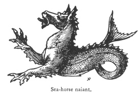
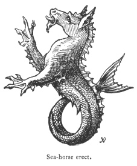

  
[Intangible Textual Heritage](../../index)  [Legendary
Creatures](../index)  [Symbolism](../../sym/index)  [Index](index) 
[Previous](fsca70)  [Next](fsca72) 

------------------------------------------------------------------------

[Buy this Book at
Amazon.com](https://www.amazon.com/exec/obidos/ASIN/B002D48Q8Y/internetsacredte)

------------------------------------------------------------------------

  
*Fictitious and Symbolic Creatures in Art*, by John Vinycomb, \[1909\],
at Intangible Textual Heritage

------------------------------------------------------------------------

p. 270

 

### The Sea-Horse

"*His sea-horses did seem to snort amain  
 And from their nostrils blow the fiery stream  
 That made the sparkling waves to smoke again  
 And flame with gold; but the white foam cream  
 Did shine with silver, and shoot forth his beam*."  
                                 Spenser's *Faerie Queen*.  
                             (Procession of the Sea Divinities.)

The steeds of Neptune are favourite
subjects in ancient poetry and art in the triumphs and processions of
the marine deities, drawing the chariot of the sea-god in its progress
through the waves. The imaginative Greeks pictured to themselves the
horses of Poseidon in the rolling and bounding waves as they pursue each
other in haste towards the shore, "curling their monstrous heads." This
may seem to account for the constant and close connection between the
god and the horse. The origin of the horse is

p. 271

ascribed to the contest between Poseidon and Athenæ as to who should
make to mankind the most useful present; Neptune created the horse,
Minerva the olive-tree.

The city of Lampsacus, in Mysia, founded by the Phoceans, adopted the
winged sea-horse as their monetary type, in

|                                    |
|------------------------------------|
|  |

allusion to the fleetness of their vessels. Others of the maritime
States of Greece also adopted the sea-horse upon their coins.

A coin of the celebrated Pyrrhus, King of Epirus (slain B.C. 272), the
knight-errant of ancient heroes, represents the head of Achilles, the
reputed ancestor of Pyrrhus, on one side, and the Nereid, Thetis, the
mother of Achilles, on the sea-horse on the reverse. Thetis carries the
arms forged by Vulcan for Achilles, in allusion to the succour brought
by Pyrrhus to the Italian Greeks against the barbarians, as the rising
Romans were termed by them.

In Gibbon's "Decline and Fall of the Roman Empire," we find a reference
to a veritable sea-horse, if we may believe our authority. John
Sobieski, the

p. 272

victorious King of Poland, in his letters to his wife, when he raised
the memorable siege of Vienna and delivered Europe for ever from the
incursions of the Turks, describes to her how, in the tent of Mustapha,
he found the great standard of the Turks, "*made of the hair of the
sea-horse* (?) *wrought with a needle and embroidered with Arabic
figures*." It was afterwards hung up by the order of the Emperor in the
Cathedral of St. Stephens, "where," adds the historian, "*I have seen
it*."

The coast of Naples is celebrated for the production of a small fish in
great repute with mothers who nurse their offspring; among its other
virtues it is said to cure the bite of a mad dog. It is about four to
six inches in length, and has a head resembling that of a horse,
terminating in a dragon's tail. This is the tiny hippocampus of our
public aquariums. The Neapolitans call them "cavalli-marini," which was
once ingeniously translated by a learned English traveller as "horse
marines."

This fabulous marine creature in heraldry is compounded of the fore
quarters of a horse with webbed paws, and the hinder part of a fish or
dolphin. A scalloped fin is continued down the neck and back in place of
a mane. It is frequently, though erroneously, to be seen depicted with
the flowing mane of a horse; wings are also sometimes added to it, both
of which, it is needless to say, are wrong, unless specially mentioned
in the blazon.

The Westenras (Baron Rossmore), descended from

p. 273

the family of Van Wassenhaer of Wassenburg, were of great antiquity in
Holland, and they bore the augmentation of the sea-horse in reference to
the valour and intrepidity of an ancestor, who, during the

 

\[paragraph continues\] Duke of Alva's
campaign, was actively employed against the enemies of his country and
undertook at great risk to swim across an arm of the sea with important
despatches to his besieged countrymen.

The Sea-horse is of very frequent use in armory, and usually has
reference to meritorious actions performed at sea. It is also borne by
many seaport towns

p. 274

in allusion to the trade and commerce of the port, as in the arms of the
city of Belfast.

Cromwell, Protector, bore as supporters a lion of England and a
sea-horse, probably to denote his protectorship of the sea, as of the
land.

Bossewell ("Works of Armorie," 1589), in his peculiar mixture of English
and Latin, gives a quaint description of the animal: "This water-horse
of the sea is called a hippotame, for that he is like an horse in back,
mayne, and neying: rostro resupinato a primis dentibus: cauda tortuosa,
ungulis binis. He abideth in the waters on the day, and eateth corn by
night et hunc Nilus gignit." The latter may be classed with those
fantastic ornamental forms frequently employed in fountains and
waterworks, such as the *Ichthyocentaur*, *i.e.*, a combination of man
and horse, or the centaur with a fish's extremity.

------------------------------------------------------------------------

[Next: Sea-lion](fsca72)
