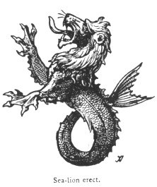

  
[Intangible Textual Heritage](../../index)  [Legendary
Creatures](../index)  [Symbolism](../../sym/index)  [Index](index) 
[Previous](fsca71)  [Next](fsca73) 

------------------------------------------------------------------------

[Buy this Book at
Amazon.com](https://www.amazon.com/exec/obidos/ASIN/B002D48Q8Y/internetsacredte)

------------------------------------------------------------------------

  
*Fictitious and Symbolic Creatures in Art*, by John Vinycomb, \[1909\],
at Intangible Textual Heritage

------------------------------------------------------------------------

### Sea-lion

or *Lion poisson*, a mythical sea-creature, frequently used in heraldry
as an emblem of bold actions achieved on the ocean in the country's
service. It is depicted as the fore part of a lion with webbed feet, the
hinder part ending in a fish's tail.

Two such animals support the arms of Viscount Falmouth.

The Earl of Howth has for supporters *a sea-lion* 

p. 275

*argent*, and a mermaid, proper. The crest also is a sea-lion.

The crest of Duckworth is *a tower, the battlements partly demolished,
from*

|                                   |
|-----------------------------------|
|  |

*the top flames issuant proper; on the sinister side a sea-lion erect
azure, pressing against the tower*.

Silvestre.—*Argent, a sea-lion couchant azure, crowned armed and langued
gules*.

When the sea-lion or other compounded creature of this kind is erect, it
should be clearly blazoned as "a sea-lion erect on his tail," to
distinguish it from naiant, the swimming position natural to it.

------------------------------------------------------------------------

[Next: Sea-dog](fsca73)
