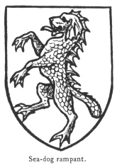

  
[Intangible Textual Heritage](../../index)  [Legendary
Creatures](../index)  [Symbolism](../../sym/index)  [Index](index) 
[Previous](fsca72) 

------------------------------------------------------------------------

[Buy this Book at
Amazon.com](https://www.amazon.com/exec/obidos/ASIN/B002D48Q8Y/internetsacredte)

------------------------------------------------------------------------

  
*Fictitious and Symbolic Creatures in Art*, by John Vinycomb, \[1909\],
at Intangible Textual Heritage

------------------------------------------------------------------------

### Sea-dog

is depicted like a talbot in shape, but with the tail like that of a
beaver, the feet webbed and the whole body scaled like a fish, a
scalloped fin continued along the hack from the head to the tail.

Baron Stourton has two such beasts, sable, scaled or, for his
supporters.

p. 276

The crest of Sir H. Delves Broughton.—*A sea-dog's head gules, eared and
finned argent*.

The Sea-bull, Sea-wolf,

|                                    |
|------------------------------------|
|  |

Sea-bear, Sea-cat, Sea-dragon, etc., when they occur in heraldry,
are all depicted as having the anterior portions of their bodies in the
forms which their several names denote; but, like the sea-lion and
sea-horse, they have fishes tails and webbed paws.

\_\_\_\_\_\_\_\_

In conclusion, having, as far as possible, given the *raison d’être* of
each, and traced the life-history and characteristics of the many
strange and fantastic creatures in our symbolic menagerie, it only
remains to express the hope that the information contained in this
volume may be found both interesting and useful, as without some such
knowledge there can be little or no intelligent understanding of the
proper treatment of the forms of these mythical and symbolic beings. The
suggestive illustrations, while giving the recognised forms of each,
leaves to the artist free scope to adopt his own style of art treatment,
whether purely heraldic or merely decorative.

 

 

 
