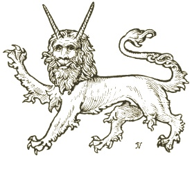

  
[Intangible Textual Heritage](../../index)  [Legendary
Creatures](../index)  [Symbolism](../../sym/index) 

------------------------------------------------------------------------

[Buy this Book at
Amazon.com](https://www.amazon.com/exec/obidos/ASIN/B002D48Q8Y/internetsacredte)

------------------------------------------------------------------------

<table width="75%">
<colgroup>
<col style="width: 50%" />
<col style="width: 50%" />
</colgroup>
<tbody>
<tr class="odd">
<td width="50%" data-valign="TOP"></td>
<td width="50%" data-valign="CENTER"><h1 id="fictitious-and-symbolic-creatures-in-art" data-align="CENTER">Fictitious and Symbolic Creatures in Art</h1>
<h2 id="by-john-vinycomb" data-align="CENTER">by John Vinycomb</h2>
<h4 id="section" data-align="CENTER">[1909]</h4></td>
</tr>
</tbody>
</table>

------------------------------------------------------------------------

[Contents](#contents)    [Start Reading](fsca00)    [Page
Index](pageidx)    [Text \[Zipped\]](fsca.txt.gz)

------------------------------------------------------------------------

|                                                                                                                           |
|---------------------------------------------------------------------------------------------------------------------------|
|  |

This is a review of the folk-lore of animals, mostly of a legendary or
purely symbolic nature, particularly as appearing in English Heraldry.
It's a gold-mine of lore about such fantastic beasts as the hydra, the
basilisk, the phoenix, as well as angels, dragons, mermaids, sphynxes
and so on. Vinycomb also covers heraldic versions of actual animals,
such as the 'Tyger,' and the Heraldic Pelican and Dolphin. Included are
over a hundred illustrations of fantastic creatures. Overall, a delight
for browsing.--J.B. Hare, May 25, 2009.

------------------------------------------------------------------------

 [Title Page](fsca00)  
[Preface](fsca01)  
[Contents](fsca02)  
[List of Illustrations](fsca03)  
[Introduction](fsca04)  

### Notes on Animated Beings in Heraldic Art

[Introduction](fsca05)  
[The Symbolism of Attitude or Position](fsca06)  
[The Heraldic Spirit—Effective decorative Quality essential in
Heraldry](fsca07)  

### Celestial Beings

[Angels](fsca08)  
[Mistaken Modern Conception of Angels](fsca09)  
[Mediæval Art Treatment of Angels](fsca10)  
[Cherubim and Seraphim in Heraldry](fsca11)  
[Cherubim & Seraphim of Scripture](fsca12)  
[Emblems of the Four Evangelists](fsca13)  

### Chimerical Creatures of the Dragon and Serpent kind

[The Dragon](fsca14)  
[The Dragon in Christian Art](fsca15)  
[St. George and the Dragon](fsca16)  
[The Dragon in the Royal Heraldry of Britain](fsca17)  
[The Crocodile as the Prototype of the Dragon](fsca18)  
[The Heraldic Dragon](fsca19)  
[The Hydra](fsca20)  
[The Wyvern](fsca21)  
[The Chimera](fsca22)  
[The Lion-Dragon](fsca23)  
[The Gorgon](fsca24)  
[The Cockatrice](fsca25)  
[The Basilisk](fsca26)  
[The Mythical Serpent](fsca27)  
[The Scorpion](fsca28)  

### Other Chimerical Creatures and Heraldic Beasts

[The Unicorn](fsca29)  
[Mediaeval Conception of the Unicorn](fsca30)  
[The Horn of the Unicorn](fsca31)  
[The Pegasus](fsca32)  
[Sagittary, Centaur, Sagittarius, Centaurus, Hippocentaur](fsca33)  
[The Griffin](fsca34)  
[The Male Griffin](fsca35)  
[Other Varieties of the Griffin](fsca36)  
[The Opinicus, or Epimacus](fsca37)  
[The Sphynx](fsca38)  
[The Phœnix Bird of the Sun](fsca39)  
[The Harpy](fsca40)  
[The Heraldic Pelican](fsca41)  
[The Martlet](fsca42)  
[The Alerion](fsca43)  
[The Liver (Cormorant)](fsca44)  
[The Heraldic Tigre or Tyger](fsca45)  
[The Royal Tiger](fsca46)  
[Leopard, or Panther, Felis Pardus, Lybbarde](fsca47)  
[The Panther Incensed](fsca48)  
[The Lynx](fsca49)  
[Cat-a-Mountain—Tiger Cat or Wild Cat](fsca50)  
[The Salamander](fsca51)  
[Heraldic Antelope](fsca52)  
[Heraldic Ibex](fsca53)  
[Bagwyn](fsca54)  
[The Camelopard, Camel-leopard](fsca55)  
[Musimon, Tityrus](fsca56)  
[The Enfield](fsca57)  
[Mantiger, Montegre or Manticora Satyral](fsca58)  
[Lamia or Emipusa](fsca59)  
[Baphomet](fsca60)  
[Apres](fsca61)  
[Stelliones](fsca62)  

### Fictitious Creatures of the Sea

[Introductory Notes](fsca63)  
[Poseidon or Neptune](fsca64)  
[Merman or Triton](fsca65)  
[The Mermaid or Siren](fsca66)  
[The Sirens of Classical Mythology](fsca67)  
[The Dolphin of Legend and of Heraldry](fsca68)  
[The Dauphin of France](fsca69)  
[The Heraldic Dolphin](fsca70)  
[The Sea-Horse](fsca71)  
[Sea-lion](fsca72)  
[Sea-dog](fsca73)  
