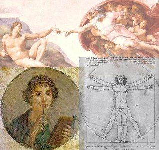

|                                                                                        |                                             |
|----------------------------------------------------------------------------------------|---------------------------------------------|
|  | LGBT Texts |

[*About the collage...*](#aboutcoll.md)

------------------------------------------------------------------------

[Introduction](#intro) [The Ancient World](#ancient.md)
[Hinduism](#hinduism.md)  
[The Hebrew Bible](#bible)  [The New Testament](#NT.md)  
[Gay Marriage in the Bible](#gaymarriage.md)  
[The Qur'an](#quran)  [Other Religions](#otherrel.md)  [Other
Texts](#othertext.md)   
[Modern Texts](#modern)  [For Further Reading](#bibliography.md)

------------------------------------------------------------------------

*NEW!* [Abortion in the Bible](../wmn/abib/index.md)  

------------------------------------------------------------------------

**Did you know?**

\* Of 32,000 verses in the Bible, only five directly mention
homosexuality.  
\* The Qur'an only directly mentions homosexuality once.  
\* Leviticus, the book of the Bible which stipulates death for
homosexuality, requires the same punishment for adultery, pre-marital
sex, disobedient children and blasphemy.  
\* The Biblical Jesus does not condemn homosexuality.  
\* The destruction of the Biblical city of Sodom was due to their
mistreatment of strangers.  
\* The Bible never condemns same sex marriage.  
\* The Biblical David and Jonathan had a formal same-sex union.  
\* 'Traditional marriage' in the Bible includes polygamy.  
\* No known sacred text forbids same sex marriage.  
\* Very few sacred texts even mention homosexuality.  
\* Hindu and other far eastern sacred texts do not condemn
homosexuality.  
\* Homosexuality is not unnatural, it is practised by hundreds of
species of animals.  

This page indexes resources about LGBT (Lesbian, Gay, Bisexual and
Transgender) issues at Intangible Textual Heritage. This page deals
specifically with the subject of LGBT people in sacred texts. For an
overview of the positions of various religions on this topic, including
historical and current beliefs, refer to [this page at the Ontario
Consultants for Religious Tolerance
site](https://www.religioustolerance.org/homosexu.md) \[external site\].

References to the scriptures are being used as the backbone of much of
the heated discussion about gay people in a way that has not been seen
since the Scopes evolution trial. It is thus crucial to examine the
actual texts, and the context in which they were written. This page,
which has taken months of research to write, provides all available
scriptural quotes on this subject, with links into the full texts, also
available at this site. Also included are the [complete text of several
books on the subject](#modern.md), scanned specially to provide background
information for this page.

------------------------------------------------------------------------

### Introduction

The Bible, the Qur'an, and Baha'i and Zoroastrian scriptures have a few
passages which condemn homosexuality. An out of context interpretation
of these passages has been used as justification for persecution of
homosexuals, ranging from ridicule, exclusion, and attempts to alter
behavior, to imprisonment and even execution. Typically these quotes are
employed not because the entire range of scriptural injunctions are
being applied consistently, but because the power structure needs
cherry-picked scriptural justification for their actions.

Colonialism subsequently imposed this prejudice on a number of
non-western societies which did not previously have this sort of
persecution. Other major world religions, particularly Hinduism,
Buddhism, Taoism, and Shinto, don't condemn homosexuals in their sacred
texts, let alone mention the subject except in passing. This doesn't
mean that societies where these religions are dominant or practiced are
(or are not) tolerant of LGBT people; simply that whatever
discrimination or persecution may be present is not based on *religious*
grounds.

Modern studies of the nature of gender have found that human sexual
preference is innate; homosexuality occurs in hundreds of species; and
gender and sexual behavior is a continuum rather than two
compartmentalized poles. Psychologists no longer consider homosexuality
a personality defect or mental illness.

There will always be some that prefer not to accept the findings of
science. For instance, there are a handful of Christians who believe
that the [Earth is flat](../earth/index.md) because the Bible refers to the
'four corners of the Earth'. Some literalist Christians reject the
Copernican solar system for similar scriptural reasons. However, many
religions, even the most conservative, have shown a capability to
incorporate advances in knowledge-- for instance, astronomy, geology and
biology--that were previously contradicted by, or simply unknown to,
scripture and religious tradition. For instance, modern Roman Catholic
doctrine states that scientific theories of cosmology, including the
'Big Bang', are not incompatible with the concept of a creation by the
deity-- this from the church that only recently lifted its *pro forma*
censorship of the works of Galileo.

Values of tolerance and acceptance for others can be found at the core
of all world religions. Many religious groups have not found it
difficult to extend tolerance to LGBT people, even if this does not lead
to acceptance within their religion, or sanctioning of same-sex unions
or homosexual clergy. And most religious groups and people, across the
spectrum, are opposed to violence against gays and other violations of
their human and civil rights, regardless of their other beliefs on the
subject.

We invite readers to review this material with an open mind.

  

------------------------------------------------------------------------

## The Ancient World

The systematic persecution of LGBT people simply did not exist until
comparatively recently in world history. LGBT people played important
roles at all levels of classical Greek and Roman society. Alexander the
Great is well-known to have been bisexual. The Emperor Hadrian attempted
to deify his male life-companion, Antinous. In Greek mythology, we have
the myth of Tiresias, who changed his gender from male to female and
back; Zeus, among his other loves, took Ganymede; the nymph
Hermaphrodite was transformed from a woman into an intersex being.

[Shamanism in Siberia](../sha/sis/index.md) from Aboriginal Siberia, by M.
A. Czaplicka. \[1914\]  
Both male and female Siberian Shamans, healers and spiritual leaders,
took on the roles and dress of the opposite gender to enhance their
magical power. This was also widespread through North America and
Polynesia.

[The Poems of Sappho](../cla/sappho/index.md)  
*English and Transliterated Greek*  
[The Poems of Sappho (Unicode)](../cla/usappho/index.md)  
*English and Greek*  
Sappho, called the 'Tenth Muse' by the ancients, left a huge body of
amazing poetry, of which only fragments escaped the bonfires of the dark
ages. She celebrated Aphrodite, the Goddess of Love, and some of her
love poetry is addressed to women. Through history, her life and works
have been a prism through which each generation has viewed same-gender
love.

 [The Symposium of
Plato](../cla/plato/symposiu.md)  
In this colloquium on the nature of companionship, Plato proposed a
theory of the origin of humanity in which Zeus created three genders:
men, women and androgynes. The androgynes were split into two and since
then each half has been searching for the other. This is actually not an
unusual creation story.

[The Syrian Goddess of Lucian of Samosata](../cla/luc/tsg/index.md)  
This is an account of the worship of Astarte in late antiquity, in what
is now Turkey. It includes an account of her cross-dressing, transgender
priests.

[Mimes of the Courtesans](../cla/luc/motc/index.md)  
This unexpurgated translation of Lucian's comic dialogues about the
Hetaerae includes two pieces which illustrate late classical attitudes
about LGBT people.

------------------------------------------------------------------------

## Hinduism

In contemporary India LGBT people face discrimination and
marginalization. This results from cultural attitudes imposed by the
British during their long occupation of India. There is no condemnation
of homosexuality in the ancient Hindu texts, and no bias against LGBT
people is evident up to the 19th century. In a few Hindu lawbooks,
same-gender sexuality is described as producing a state of impurity, but
it can be expunged by a ritual bath.

The ancient Hindu attitude was that sexuality should be fully integrated
into the fabric of life, and nothing to be ashamed of. For instance, in
the [Brihadaranyaka Upanishad, IV:4](../hin/sbe15/sbe15098.md), there is a
passage about sex magic which was so explicit that Max Müller felt
compelled to translate it into Latin.

Homosexuality is discussed frankly and without condemnation in the
ancient Hindu sexual treatises. In the Kama Sutra, in [Chapter
VI](../sex/kama/kama506.md), lesbianism in harems is described, and in
[Chapter IX](../sex/kama/kama209.md), male and female homosexuality in the
context of a discussion of oral sex. To quote the Kama Sutra, Chapter
IX: "...in all things connected with love, everybody should act
according to the custom of his country and his own inclination."

There are many accounts of beings who transformed their gender by
supernatural means in the ancient Hindu epics and Puranas. One prominent
example occurs in [the Mahabharata](../hin/index.htm#maha.md). A
transgender person, Sikhandin, plays a pivotal role in that ancient
Hindu epic. In [book 5, Chapter 191-5](../hin/m05/m05191.md), the origin of
Sikhandin is related. Sikhandin was born as the daughter of King Drupada
of the Panchalas, who had previously been childless. Druapada begged the
God Mahadeva, to give him a son. He told him that "Thou shalt have a
child who will be a female and male. Desist, O king, it will not be
otherwise."

His wife gives birth to a baby girl, Sikhandin. King Drupada conceals
the gender of his child and proclaims a male heir has been born, and
Sikhandin is raised as a boy. When Sikhandin comes of age, a marriage is
arranged with an unnamed daughter of King Hiranyavarman, of the
Dasrnakas. Hiranyavarman is described as Drupada's brother. The two
women are married, "...and the former soon came to know that that latter
was a women like herself." The daughter of King Hiranyavarman sends word
back to her father about the deception, and he proclaims war as a
result: "Thou hadst, from folly, solicited my daughter for thy
daughter!"

At this juncture, Sikhandin flees into the forest, where she encounters
a Yaksha, a demon, named Sthunakarna. Sthunakarna says that he will
grant one boon to Sikhandin, who asks to become a male, the swap to be
temporary until the situation with King Hiranyavarman is cleared up. So
the princess exchanges gender with the demon; and, now a prince, returns
to the city which the army of King Hiranyavarman is about to besiege.
King Drupada tells his brother, now truthfully, that Sikhandin is a man,
and that he can prove it. King Hiranyavarman sends "a number of young
ladies of great beauty" to Sikhandin, and they report back that he is "a
powerful person of the masculine sex." Unfortunately, the demon, now
female, is placed under a curse by the lord of the Yakshas, and the sex
exchange is permanent. Sikhandin grows into a mighty warrior.

Sikhandin later plays an important role during the cataclysmic battle
which is the central part of the Mahabharata. In the climax of [Book
8](../hin/m08/index.md) of the Mahabharata, Bhishma, one of the chief
protagonists, is killed because he refuses to attack a charge which is
led by Sikhandin, because Sikhandin was born female. This ends up being
the turning point in the battle and the war.

In this story we see what might, hypothetically, be an very old tale of
a same-sex union woven into the vast epic of the Mahabharata. How old
may be indicated by the fact that cousins are being married, which is
typical of tribal societies worldwide. In Ancient Egypt women who
attained positions of power wore male clothing, including false beards,
in order to formally establish their leadership; for such a woman to
marry a woman as a political maneuver would not be inconceivable.

Sikhandin, raised as a boy, is ready and willing to exchange gender
magically. Once having switched to the male gender, he excels at the
role, and becomes a famous and very skilled warrior. Sikhandin is
reconciled with his transformed masculine identity, despite the fatal
display of chivalry by his opponent Bhishma in battle. This brings into
relief the contradictions of ancient Hindu society with regard to gender
roles.

The story of Sikhandin is the classic hero narrative with a transgender
twist.

------------------------------------------------------------------------

## The Bible

There are about half a dozen direct references to what we today term
homosexuality in the Tanach and NT, and a few others which are relevant
but not direct. Two of the most negative passages are found in the book
of Leviticus, alongside a mass of ancient Jewish food and incest taboos,
purification rituals and medical protocols. In the New Testament, there
are several instances in the Epistles where Paul disparages
homosexuality. **Notably, at no point in the Gospel narrative does Jesus
condemn homosexuality**.

Another point to note is that there was no word for homosexuality, in
the sense that we now use the term, in ancient Hebrew or Greek. So the
text of the Tanach and NT uses circumlocutions or eumphemisms in these
passages.

As far as lesbianism goes, the Bible is silent. There is no explicit
mention (or condemnation) of female homosexuality in the Tanach, and it
turns up only once (very tangentially) in the NT.

### The King James Version

King James I, who commissioned the [King James
Version](../bib/kjv/index.md) translation, was undoubtedly homosexual. It
was whispered that "Elizabeth was King: Now James is Queen."

James I was responsible for reaffirming the Buggery Act of 1533, which
criminalized sodomy in the UK. However, James I had several
well-documented homosexual relationships. Although he had eight children
with his wife, Anne of Denmark, they eventually decided to live apart.
In 1607 he met Robert Carr, then age 17, at a joust, and had an on-going
relationship with him for nearly a decade, which ended in a messy
breakup. In 1614, he started a relationship with George Villiers, a
commoner, eventually making him Duke of Buckingham in 1623. In 1624,
James wrote Villiers a letter in which he asked "whether you loved me
now...better than at the time I shall never forget at Farham, where the
bed's head could not be found between the master and his dog."

### Tanach

##### In the beginning...

Some esoteric Jewish traditions hold that God is hermaphroditic in
nature, and that Adam was originally an hermaphrodite. This is based on
a reading of [Genesis 1:27](../bib/kjv/gen001.htm#002.md): "So God created
man in his own image, in the image of God created he him; male and
female created he them." This theme is developed with great detail in
the Kabbalah; For instance see [this passage from the Kabbalah
Unveiled](../jud/tku/tku74.md). Rabbi Samuel-bar-Nachman is quoted by
[Carpenter](itp/itp07.htm#page_73.md) as saying "Adam, when God created
him, was a man-woman (androgyne)". Maimonides (*ibid*.) is quoted
likewise: "Adam and Eve were created together, conjoined by their
backs." This is similar to the [androgyne](#plato_androgyne.md) mentioned
in Plato's *Symposium*.

##### The Sin of Sodom

Then there is the story of the destruction of the city of Sodom,
([Genesis 18:16-19:29](../bib/kjv/gen018.htm#016).md). Sodom has given its
name to the now somewhat quaint-sounding term 'Sodomy', which originally
meant a specific male homosexual sex act. Eventually it was expanded to
mean any form of sexual expression which happened to be illegal,
including things that married heterosexual couples do every day.

However, a close reading reveals the name to be a bit of a misnomer. To
start off, Sodom is described simply as a 'wicked' place. Lot, Abraham's
nephew, goes to live there to see if even one righteous person can be
found there. The sexual theme starts when two disguised angels visit
Lot. A mob, described as consisting of the men of the city, 'both young
and old', attacks Lot's house and demands that Lot allow them to 'know'
(in the language of the KJV) the two men. To 'know' is, of course, the
famous KJV circumlocution for having sexual intercourse.

The next passage bears closer examination. Lot ([Gen
19:8](../bib/kjv/gen019.htm#008).md) asks the mob to *'do' his two virgin
daughters instead*, but not the two guests, 'for ... they came under the
shadow of my roof.' The rest of the story is well-known: divine wrath
ensues, the mob is blinded, the cities of the plain are destroyed by
fire and brimstone while Lot and his family flee, Lot's wife is turned
to a pillar of salt because she looks back, and only Lot and his
daughters escape. In an often ignored coda to this story, Lot's
daughters have incest with him by getting him intoxicated, ([Gen
19:31](../bib/kjv/gen019.htm#031).md), presumably to repopulate the
country; a similar motif is found in the story of Noah. As in other
Biblical narratives, even the heroes end up committing horrendous sins,
driven by circumstances. But many ignore the entire context of the story
in the rush to justify their own bigotry.

The sin of the city of Sodom was the originally considered to be the
violation of the rights of Lot's guests. Defining the 'sin of Sodom' to
be male homosexuality was a later interpretation, which was made by
medieval Jewish and Christian writers, as a reaction to Pagan acceptance
of homosexuality. Near Eastern hospitality, to this day, implies a
responsibility to protect guests under one's roof. The fact that Lot was
ready to make a huge sacrifice by offering up his virgin daughters to
the mob instead of his guests underlines this.

There is abundant *Haggadah*, ancient Jewish folklore, which tells of
the cruelty of Sodom to strangers, and their mistreatment of the poor
and homeless. Among other stories, travelers are given gold but not
food; when they starve to death, everything is stolen including the gold
and the clothes off their backs, and their bodies are left to rot. One
of Lot's unfortunate daughters is burned to death for the crime of
giving a starving man food. Another woman who assists a poor man is
smeared with honey and left to be stung to death by bees. Some of these
stories are suffused with dark comedic twists. A poor man is assaulted
and robbed. Eliezar, a servant of Abraham, is hit on the head when he
intervenes. A judge rules that he must pay his assailant for medical
treatment! (Bleeding was considered a surgical procedure). Eliezar then
hits the judge on the head, drawing blood, and tells the *judge* to pay
his fine. See [Ginzburg's Legends of the
Jews](../jud/loj/loj107.htm#the_cities_of_sin.md) and [Polano's The Talmud:
Selections](../jud/pol/pol05.htm#page_45.md), for many more stories along
the same lines. After reading these, I guarantee you'll be rooting for
the Lord to rain down the brimstone on the cities of the plain...

There are also numerous Biblical passages warning about mistreating
strangers, (with the story of Lot being implied), for instance this one
in the NT: "Be not forgetful to entertain strangers: for thereby some
have entertained angels unawares." \[[Heb.
13:2](../bib/kjv/heb013.htm#001.md)\]

Between the original concept of a violation of the law of hospitality
and the medieval focus on a particular sexual act, there is an
intermediate stage where Sodom was criticized for other reasons
entirely. Where Sodom is mentioned in later books of the Tanach and in
the New Testament, it is used as an example of a city which was
corrupted by luxury, lacking in values such as charity and humility.
Nowhere is this made clearer than in [Ezekiel
16:48-50](../bib/kjv/eze016.htm#049.md), where Ezekiel, speaking for 'the
Lord God', enumerates the sins of Sodom: "Saith the Lord GOD...Behold,
this was the iniquity of ... Sodom, pride, fulness of bread, and
abundance of idleness ... neither did she strengthen the hand of the
poor and needy. And they were haughty and committed abomination before
me: therefore I took them away as I saw good".

Note that in this context 'abomination' means human sacrifice and idol
worship, not shared tax breaks for long-term same-sex couples, or sexual
practices you can see on cable after 10 o'clock. Furthermore,
'abomination' is at the end of the laundry list. The primary sin of
Sodom, by this account, was that their society was **materialistic,
greedy and uncharitable**. Social and economic justice is a thread that
runs through the Hebrew Bible and the New Testament alike, and it is not
difficult to extrapolate this to modern struggles for equality, such as
those of LGBT people. **When governmental and religious institutions and
their leaders perpetuate oppression, it would not be farfetched to say
that they are committing the *actual* sin of Sodom.**

##### Leviticus

The book of Leviticus was probably composed during the Babylonian exile,
from 550 to 500 BCE. Leviticus deals with issues of ritual purity and
proscribed behavior. Traditionally attributed to Moses (it is part of
the Pentateuch, the first five books of the Bible), Leviticus was
probably written by the author modern scholars call 'P'.

Now when one hears the word 'Leviticus,' a red flag (or yellow card)
should go up. Wellhausen, in his [Prolegomena to the History of Ancient
Israel](../bib/cv/phai/index.md) proposed the 'Documentary Hypothesis.'
Among other things, he presented evidence that there were four separate
authors of the Tanach, the Old Testament. In a nutshell, the Levitical
laws were added to the text of the Bible at a very late date, by an
author high in the religious hierarchy, a priest (hence the 'P'). These
are the legalisms that Jesus is constantly deprecating in the New
Testament, and the Talmudic Rabbis delight in picking apart. Given the
force of divine law by fiat, they ruled every aspect of daily life. Once
the ancient Jewish ritual complex was destroyed, many of these laws
simply became impossible to follow. Others were fossilized prohibitions
from the time when Jews were striving to preserve their cultural
identity in a sea of paganism.

[Leviticus 18:22](../bib/kjv/lev018.htm#022.md) and [Leviticus
20:13](../bib/kjv/lev020.htm#013.md) are the two Bible verses which are
most often cited as support for scriptural condemnation of
homosexuality; the latter verse even demands that such behavior be
punished by death. Both verses refer specifically to male homosexuality,
but not female.

There is a condemnation of both male and female cross-dressing in
[Deuteronomy 22:5](../bib/kjv/deu022.htm#005.md) as 'an abomination'.
However, no particular punishment is specified. By contrast, the same
chapter specifies harsh punishments for other transgressions: death by
stoning of [non-virgin brides \[Deu
22:13-21\]](../bib/kjv/deu022.htm#013.md), likewise both participants in an
act of [adultery \[Deu. 22:22\]](../bib/kjv/deu022.htm#022.md), and some
instances of [premarital intercourse \[Deu.
22:23\]](../bib/kjv/deu022.htm#023.md).

The background of the condemnation of homosexuality in Leviticus is a
fascinating subject. The Jews were in conflict with Pagans who also
resided in ancient Palestine. There was a lot of pressure for Jews to
adopt various practices of the Pagans, to become just another religion
in the melting pot. And so scriptural injunctions were developed which
prohibited certain distinctive Pagan beliefs and practices, such as tree
and stone worship and some forms of divination.

Pagan religions of the ancient Near East had male priests who, to honor
a Goddess figure, emulated women. For a late classical description of
this belief system, refer to [The Syrian Goddess](../cla/luc/tsg/index.md).
These priests, called *Kedeshim* in the Tanach, like other
[shamans](../sha/index.md) world-wide, cross-dressed, took on economic and
social roles normally associated with females and in some cases even
castrated themselves. They also enaged in sexual acts as part of their
ceremonies, similar to the [Tantric](../tantra/index.md) practices. This
included sex with other men.

In every case where 'Sodomite' is mentioned in the KJV outside of the
context of the story of the downfall of Sodom in Genesis, this is a
translation of the Hebrew word [*qâdêsh*](../bib/poly/h6945.md), which
refers to the before-mentioned pagan priest. In fact, *qâdêsh* is
derived from a primitive root [*qâdash*](../bib/poly/h6942.md), which
means, among other things, 'consecrate, holy, dedicate, purify,
sanctify.'

For instance, in [1 Kings 14:24](../bib/kjv/kg1014.htm#014.md), the KJV has
'there were also sodomites in the land, and they did according to all
the abominations of the nations which the LORD cast out before the
children of Israel.' In addition, abomination in this instance could
probably be better translated 'idolatry.' Using these mistranslated
verses to condemn homosexuality in general is misleading.

The rules against males cross-dressing and having sex with other men
were based on opposition to this priesthood. However, over time it was
generalized to similar behavior, regardless of whether it was part of a
spiritual practice. The prohibition of homosexuality in Leviticus was
used subsequently for hundreds of years as a precedent for the
persecution of gays, and has been quoted in legal reasoning up to the
present day.

The book of Leviticus contains many harsh commandments and regulations,
and much of it can't be reconciled with modern life or contemporary
standards of justice and human rights. Some other points of interest in
Leviticus include:

[the punishment for blasphemy is death by stoning \[Lev
24:16\]](../bib/kjv/lev024.htm#016.md),  

[likewise, a child who curses their parent will be put to death \[Lev
20:9\]](../bib/kjv/lev020.htm#009.md),  

[locusts, beetles and grasshoppers are permissible food \[Lev.
11:21\]](../bib/kjv/lev011.htm#021.md) but not [shellfish or mollusks
\[Lev. 11:10\]](../bib/kjv/lev011.htm#010.md).  

[Leviticus 25:44-46](../bib/kjv/lev025.htm#044.md) was construed by slavery
apologists to be divine authorization for the buying, holding and
bequeathing of human beings as property.

Most Christian and Jewish groups today hold that many of the rules in
Leviticus and elsewhere in the Hebrew Bible should not be considered
binding, or at worst, minor sins if transgressed, and that the harsh
punishments are obsolete. For instance, there is an extensive debate in
the Talmud ([Sanhedrin, Chapter VIII](../jud/t08/t0811).md). as to whether
putting a 'stubbon and rebellious' child to death is an appropriate
punishment by *reductio ad adsurdum*. And Jesus is quoted ([see
below](#NT).md) as saying that the law should consist of two rules, namely
love for God and love for one's neighbor; this is an implicit criticism
of the complicated and often extreme regulations of Leviticus.

##### David and Jonathan

There is an extensive and very sympathetic description of a same-sex
relationship in the Bible, the story of David and Jonathan, e.g.: [1
Samuel 18:1-5](../bib/kjv/sa1018.htm#001.md), [1 Samuel
19:1-7](../bib/kjv/sa1019.htm#001.md), [1 Samuel
20:30-42](../bib/kjv/sa1020.htm#030.md), [2 Samuel
1:25-6](../bib/kjv/sa2001.htm#025.md). While their bond is described as
non-sexual, it is difficult to characterize it as purely one of
friendship.

Jonathan was the son of Saul, David's nemesis. Their souls are described
as 'knit together'. David and Jonathan 'made a covenant, because he
loved him as his own soul.' The word convenant is significant, because
in the Tanach this word always implies a formal legal agreement. To mark
this convenant, Jonathan literally gives David the clothes off of his
back, as well as other gifts such as weapons.

Later in the narrative, Jonathan successfully intercedes with Saul to
spare David's life. At their last meeing, [1 Samuel
20:41](../bib/kjv/sa1020.htm#030.md), they are described as kissing one
another and weeping together. David's grief at Jonathan's death is
profound and moving. In Davids lament for Jonathan he describes their
friendship as '(sur)passing the love of women'. This elegy, [2 Samuel
1:18-27](../bib/kjv/sa2001.htm#018.md). known as 'the Bow,' is one of the
most beloved passages in the Hebrew Bible.

This narrative far outweighs the two trivial aspersions against same-sex
love in Leviticus. The bigots who use the Bible to assault gays are
apparently blind to it.

### New Testament

##### The Gospels

In the four Gospels, Jesus is portrayed throughout with a message of
love and tolerance. Not once does he condemn homosexuals, demand that
they be put to death, etc., as do some of his modern followers. Such a
pronouncement would be a profound departure from the rest of the text.
For instance, in [Matthew 22:37](../bib/kjv/mat022.htm#037.md), Jesus is
quoted as saying:

> 22:37 ...Thou shalt love the Lord thy God with all thy heart, and with
> all thy soul, and with all thy mind.  
> 22:38 This is the first and great commandment.  
> 22:39 And the second is like unto it, Thou shalt love thy neighbour as
> thyself.  
> 22:40 On these two commandments hang all the law and the prophets.

And in [John 13:34](../bib/kjv/joh013.htm#034.md), he is additionally
quoted as saying:

> 13:34 A new commandment I give unto you, That ye love one another; as
> I have loved you, that ye also love one another.  
> 13:35 By this shall all men know that ye are my disciples, if ye have
> love one to another.

So Jesus turning around and saying 'Hate Gays' would be a bit out of
character.

##### Paul

Not so with the disciple Paul. In [Romans
1:26-7](../bib/kjv/rom001.htm#026.md) Paul condemns both male and female
homosexuality as 'against nature' (hence the term 'unnatural act').
Notably, this is the sole reference to female homosexuality in the
entire Bible. In [1 Corinthians 6:9-11](../bib/kjv/co1006.htm#009.md) Paul
says that the 'effeminate' shall '(not) inherit the Kingdom of God'. In
[1 Timothy 1:8-11](../bib/kjv/ti1001.htm#008.md) Paul brands 'those who
defile themselves with mankind' as criminals, along with thieves and
murderers. These passages in the Epistles are the only three places
where homosexuality is mentioned in the NT. Scholars consider these
passages to be a reaction against Near Eastern Pagan, Hellenistic, and
Roman society, which largely tolerated LGBT people and spirituality.
Later, early Christian writers elaborated on Paul's themes. This led to
centuries of persecution of LGBT people in Europe, often with concealed
agendas related to political infighting or outright extortion. An early
example of this was the Byzantine Emperor Constantine, who put in place
discriminatory laws against homosexuals, and then proceeded to use those
laws to blackmail and marginalize rivals. Refer to the [Secret History
of Procopius](../cla/proc/shp/index.md), *e.g.* [Chapter XVI, p.
163](../cla/proc/shp/shp19.htm#page_163.md).

### Gay Marriage in the Bible

#### The Tanach

Actually this is kind of a trick topic. There is no mention of gay
marriage in the Bible (except, possibly, the [account of the 'covenant'
of David and Jonathan](#davidjonathan).md). But neither is there any
mention of representative democracy, electricity, the Internet, or
polyester clothing. For the vast majority of Christians and Jews (even
those that believe in Biblical inerrancy), just because something
*isn't* mentioned in the Bible doesn't necessarily mean that it is
sinful or forbidden. Unless you are Amish, of course, in which case you
probably shouldn't be reading this in the first place...

The Bible is a smorgasbord for those who need just one out-of-context
quote to justify their personal views on marriage. Depending on which
pinhole you look through, the Bible can be cited as both approving or
forbidding polygamy, monogamy, divorce, and lifelong celibacy. So it is
no wonder that there are quotes that can be manipulated in the same way
to condemn gay marriage. For instance, the often quoted [Genesis
2:23-4](../bib/kjv/gen002.htm#023.md):

2:23 And Adam said, This is now bone of my bones, and flesh of my flesh:
she shall be called Woman, because she was taken out of Man.

2:24 Therefore shall a man leave his father and his mother, and shall
cleave unto his wife: and they shall be one flesh.

Now before you say, "Aha! so the Bible does forbid gay marriage!", take
another look, This passage does *not* say "'Thou shalt not let two men
or two women get married, and get the same tax breaks and hospital
visitation rights as heterosexuals." When a commandment or injunction
occurs in the Bible it is stated explicitly, as throughout
[Leviticus](#leviticus.md).

This passage also has [mystical overtones](#inthebeginning.md) which
literalists are apt to completely miss or ignore. It implies that Adam
was at one time united with Eve in the same body, and the reason that
people seek companionship is because they are searching for their
missing half. (This is similar to Plato's [theory of the
androgyne](#plato_androgyne).md). Also, both in the Tanach and the NT,
**marriage is used as a metaphor for the union of the soul with God**,
which is obviously binary.

In the Tanach, marriage practises such as bigamy, polygamy, concubinage,
arranged and levitrate marriages are described as normal, as in fact
they were at the time. All of these types of marriage are today either
illegal in most western countries or considered highly unusual, much
more so than monogamous same sex unions.

In [Genesis 16](../bib/kjv/gen016.md) Sarah, Abraham's wife, encourages
Abraham to impregnate her handmaid, Hagar, because she is barren
(although Sarah miraculously later gives birth to Isaac). Later
([Genesis 25](../bib/kjv/gen025).md) Abraham takes yet another wife,
Keturah, who is also described as a concubine. 

In [Genesis 29](../bib/kjv/gen029.md) Jacob marries the sisters Rachel and
Leah, who are the daughters of Laban, his maternal uncle. In the [next
chapter](../bib/kjv/gen030.md), Jacob has two sons by Bilhah, Rachel's
handmaid, two sons by Zilpah, Leah's handmaid, then two sons by Leah,
and finally Rachel bears Joseph.

Six wives of David are named in [2 Sam. 3:2](../bib/kjv/sa2003.htm#002.md).

Solomon is described as having [seven hundred wives and three hundred
concubines](../bib/kjv/kg1011.md). However, the Talmud ([Tractate
Sanhedrin](../jud/t08/t0805.htm#page_54).md) states that a king may have no
more than eighteen wives.

Note that out of all of these arrangements, only marrying two sisters is
explicitly forbidden in [Leviticus 18](../bib/kjv/lev018.md); however it is
permitted to [marry a deceased wife's
sister](../bib/kjv/lev018.htm#018.md).

So it is absolutely disingenuous to speak of 'traditional marriage' (as
a codeword for heterosexual monogamy) as biblical. It is even more
absurd when this concept is uttered by members of the clergy, who really
should know better.

#### The New Testament

However, in at least one passage in the NT, marriage is defined as
monogamous. In [Mark 10:2-12](../bib/kjv/mar010.htm#002).md), Jesus is
quoted as saying:

10:2 And the Pharisees came to him, and asked him, Is it lawful for a
man to put away his wife? tempting him.

10:3 And he answered and said unto them, What did Moses command you?

10:4 And they said, Moses suffered to write a bill of divorcement, and
to put her away.

10:5 And Jesus answered and said unto them, For the hardness of your
heart he wrote you this precept.

10:6 But from the beginning of the creation God made them male and
female.

10:7 For this cause shall a man leave his father and mother, and cleave
to his wife;

10:8 And they twain shall be one flesh: so then they are no more twain,
but one flesh.

10:9 What therefore God hath joined together, let not man put asunder.

10:10 And in the house his disciples asked him again of the same matter.

10:11 And he saith unto them, Whosoever shall put away his wife, and
marry another, committeth adultery against her.

10:12 And if a woman shall put away her husband, and be married to
another, she committeth adultery.

One reader commented that this passage proves that Jesus "hated
\[gays\]". but I'm not sure how he came away with that conclusion. If
you take this at face value, it says that remarriage after divorce is
equivalent to adultery. The passage 10:6-9 is just a restatement of the
passage from Genesis, leading up to the conclusion 'let no man put
asunder'. In 10:10-12, Jesus explains the concept again, *just in case
we missed the point the first time around*. As usual, the language
attributed to Jesus is very specific and transparent.

Also of interest is [1 Timothy 4:1](../bib/kjv/ti1004.htm#001.md):

4:1 Now the Spirit speaketh expressly, that in the latter times some
shall depart from the faith, giving heed to seducing spirits, and
doctrines of devils;

4:2 Speaking lies in hypocrisy; having their conscience seared with a
hot iron;

4:3 Forbidding to marry, and commanding to abstain from meats, which God
hath created to be received with thanksgiving of them which believe and
know the truth

4:4 For every creature of God is good, and nothing to be refused, if it
be received with thanksgiving:

4:5 For it is sanctified by the word of God and prayer.

Here Paul disapproves of the prohibition of marriage, as well as the
practise of vegetarianism. This is probably a reference to a
[Gnostic](../gno/index.md) group, some of whom were vegetarians. A few
Gnostics and early Christians were opposed to marriage in **any** form
(including monogamous, heterosexual marriage). Marriage was considered a
grave sin by some of the [early Church fathers](../chr/ecf/index.md), and
the only way into the kingdom of heaven to be the lifelong mortification
of the flesh. This passage by Paul from the Epistles weighs in against
this particular concept. On the other hand, some Gnostics and early
Christians practiced group marriage, taking 'holding all things in
common' to the extreme.

One wonders about Paul's condemnation of vegetarians. Will some future
US President float a constitutional ammendment mandating that
vegetarians eat meat? Will conservative Christians organize abusive
demonstrations at health food stores? *Does God hate tofu?*

The sanctioned form of marriage in Judaism and Christianity has
continued to evolve over the centuries. Policies on divorce have varied
widely. There was a liturgy for same sex unions in one branch of the
Eastern Orthodox church. During the Middle Ages and well into the
renaissance, the vast majority of European marriages were 'common-law,'
and had no religious sanction: church weddings were far too expensive
for most people. Mormons originally practised polygamy, although they
ceased that as a condition for Utah statehood. Today, same sex unions
are consecrated in some liberal Jewish and Christian denominations.

In general, society has changed the definition of marriage widely, and
religion has followed by sanctioning it.

Some interpret the passages above to imply condemnation of gay marriage,
or to justify their prejudices against LGBT people. The reader is
encouraged to look at the entire context and make up their own mind.

------------------------------------------------------------------------

## The Qur'an

Male homosexuality is only implied in the Qur'an, and there is no
mention of lesbians or transexuals.

The story of Lot is repeated numerous times (e.g.,
[26:165-6](../isl/quran/02609.htm#026:165.md),
[27:55](../isl/quran/02704.htm#027:055.md), and
[29:28-9](../isl/quran/02903.htm#029:028).md).

The [Yusuf Ali translation of 26:165](../isl/quran/02609.htm#026:165.md)
runs: "Of all creatures in the world will ye approach males, and leave
those whom God has created to be your mates, Nay ye are a people
transgressing all limits"

The [Palmer translation of 27:55](../isl/sbe09/027.htm#page_104.md) is:
"And Lot ... said to his people: 'Do ye approach an abominable sin while
ye can see? do ye indeed approach men lustfully rather than women? nay!
ye are a people who are ignorant.'"

These passages reflect the post-classical Jewish and Christian
interpretation of the Sodom narrative, as well as Aristotle's widely
accepted (but incorrect) view that animals do not engage in homosexual
acts.

In context, the Qur'an mentions other cities which were destroyed, not
just Sodom; including the legendary cities of 'Ad and Thamud. These have
much different narratives. For instance, in Thamud "there were in the
city nine persons who despoiled the land and did not right."
([27:49](../isl/sbe09/027.htm#page_104).md). In [Surah
11](../isl/sbe06/011.htm#page_208.md) a parallel is drawn between the story
of Lot and the Biblical flood narrative of Noah. This is a constant
theme that runs throughout the Qur'an. It draws freely from Biblical,
Talmundic and traditional Arabic lore of civilizations overwhelmed by
catastrophes brought on by hubris.

The common motif of these stories is that the people of these cities
defy God, and ignore his prophets; not that they engage in particular
sexual practices. God is warning, through the Qur'an, that He is the
creator and destroyer of all things. This is a much larger concern, on a
cosmic scale, than what people do in their bedrooms.

There is a *possible* mention of male homosexuality in Surah 4:16.
[Yusuf Ali translates this as:](../isl/quran/00403.htm#004:016.md). "If two
men among you are guilty of lewdness, punish them both. If they repent
and amend, *Leave them alone*; for God is oft-returning, Most Merciful"
(emphasis inserted). [Palmer's translation of the same passage
is](../isl/sbe06/004.htm#page_74.md): "And if two of you commit
\[adultery\], then hurt them both; but if they turn again and amend,
leave them alone, verily God is easily turned, compassionate". (Adultery
is implied from the previous paragraph). [Palmer
notes](../isl/sbe06/004.htm#fn_174.md): "the commentators are not agreed as
to the nature of the offence here referred to. The punishment to be
inflicted is also the subject of dispute." This stands out here, because
this Surah (The Women) codifies a number of laws and regulations about
sexual behavior, and in each case *except for this*, the text lays out
specific punishments.

There is also a cryptic passage in [Surah
76](../isl/sbe09/076.htm#page_313.md): one of the rewards in Paradise is
described as "eternal boys...\[like\] scattered pearls...and when thou
seest them thou shalt see pleasure and a great estate." (Palmer).
Whether these are supposed to simply be attendants or companions is left
to the imagination.

There is, however, explicit condemnation of homosexuality in the Hadith,
which are traditional sayings from early Islam which have acquired legal
status. For instance, Williams in his anthology Islam, quotes the
following Hadith ([p. 83](../isl/isl/isl13.htm#page_83).md): Bukhārī . . .
from Ibn ‘Abbās: "The Prophet cursed men who act like women and women
who act like men, and said, 'Drive them from your houses.' He expelled
such people, and ‘Umar did it as well."

Islamic societies through history have both tolerated and persecuted
LGBT people, sometimes at the same time. However, there is very little
in the core text of Islam, the Qur'an, which support the harsh
punishments and ostracism which gays are subjected to in contemporary
Islamic society, and the relevant passages are either vague or
tangential.

------------------------------------------------------------------------

## Other Religions

[OCRT: The Baha'i Faith and
Homosexuality](https://www.religioustolerance.org/hom_bah.md)  
[OCRT: The Zorosastrian Faith and
Homosexuality](https://www.religioustolerance.org/hom_zor.md) \[External
Site\] A review of (mostly negative) Baha'i and Zoroastrian views on
homosexuality, including quotes from their sacred texts and other
scriptures.

## Other Texts

[The Talmud: Baba Bathra Chapter IX](../jud/t07/t0718.md)  
This part of the [Talmud](../jud/talmud.md) has a remarkably equitable
discussion of the legal status of transgender people with regards to
inheritance and parental support.

[Kama Sutra of Vatsayayana](../sex/kama/index.md)  
translated by Sir Richard Burton \[1883\]  
This work describes gay and lesbian sexual behavior non-judgementally in
first millenium India, as part of a spectrum of sexual practices.

[The Sufi Poets](../isl/index.htm#sufi.md)  
Rumi, Hafiz and Sa'di, the Sufi poets, had a mystical view of love in
which the relationship between the lover and the beloved mirrored
humanity's relationship with God. This was not limited to heterosexual
love, but was a more universal concept, transcending gender.

## Modern Texts

 [A Problem in Modern
Ethics](pme/index.md) By John Addington
Symonds \[1896\]   One
of the first sympathetic essays on gay rights written in the modern
epoch. Symonds later wrote *A Problem in Greek Ethics* (below).

 [A Problem in Greek
Ethics](pge/index.md) By John Addington
Symonds \[1901\]   A
study of Greek homosexuality. from the romantic and the erotic point of
view, centering on the institutionalized (and idealized) love of
adolescent males by older men. 

 [Love's Coming of
Age](lca/index.md) By Edward Carpenter
\[1906\]   A essay arguing a
comprehensive vision of sexual liberation based on expansion of gender
roles and women's liberation. 

 [Intermediate Types Among Primitive
Folk](itp/index.md) by Edward Carpenter
\[1914\]   Carpenter reviews
the extensive literature of homosexuality in the ancient world, relating
it to anthopological reports about shamans and berdaches
(transgender people) in tribal societies, and to institutionalized male
same-sex relationships in feudal Japan. 

 [Ioläus](iol/index.md) by Edward Carpenter \[1918\]  
An anthology of literary quotes about (primarily) male
friendship, from David and Jonathan to Walt Whitman, particularly those
verging on romantic love. Whether any of these relationships were
actually erotic in nature is left up to the reader's imagination.

------------------------------------------------------------------------

## For Further Reading

Following is a short list of recommended recent books on this topic.
(Links are to Amazon.com).

[Christianity, Social Tolerance and
Homosexuality](https://www.amazon.com/exec/obidos/ASIN/0226067114/internetsacredte.md)
by John Boswell  
A ground-breaking academic study of the history of attitudes towards
homosexuality by Christianity.  
[Same Sex Unions in Premodern
Europe](https://www.amazon.com/exec/obidos/ASIN/0679751645/internetsacredte.md),
by John Boswell  
Did the medieval Catholic and Eastern Orthodox church sanction same-sex
unions? A respected scholar produces the evidence.  
[Myths and Mysteries of Same-Sex
Love](https://www.amazon.com/exec/obidos/ASIN/0826405266/internetsacredte.md),
by Christene Downing  
Includes an extended study of same-sex love in the ancient world.  
[The Invention of Sodomy in Christian
Theology](https://www.amazon.com/exec/obidos/ASIN/0226410404/internetsacredte.md),
by Mark D. Jordan  
An academic study of the emergence of the term 'Sodomy' during the
middle ages; the author found no instance of this usage before the 11th
century.  
[Islamic
Homosexualities](https://www.amazon.com/exec/obidos/ASIN/0814774687/internetsacredte.md),
by Stephen O. Murray and Will Roscoe  
A sociologist and a historian look at homosexuality in practice in the
Islamic world.  
[Homosexuality &
Civilization](https://www.amazon.com/exec/obidos/ASIN/067401197X/internetsacredte.md)
by Louis Compton  
A comprehensive study of gay history. Includes Japan and China.  

------------------------------------------------------------------------

 *About the collage*: Some of the greatest
artists of all time were gay people, including: (top) Michelangelo,
whose depiction of the creation of man in God's image is the keystone of
the Sistene Chapel murals in the Vatican; (bottom right) Leonardo da
Vinci \[drawing of a human body in balance\]; and (bottom left) Sappho,
renowned Greek poet.

------------------------------------------------------------------------

The special contents of this page are © copyright 2004, J.B. Hare, all
rights reserved. This page may not be reproduced without permission of
the copyright holder.
