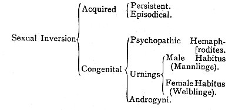

  
[Intangible Textual Heritage](../../index)  [LGBT](../index) 
[Index](index)  [Previous](pme07)  [Next](pme09) 

------------------------------------------------------------------------

p. 29

### V.

### LITERATURE--MEDICINE.

MEDICAL writers upon this subject are comparatively numerous in French
and German literature, and they have been multiplying rapidly of late
years. The phenomenon of sexual inversion is usually regarded in these
books from the point of view of psychopathic or neuropathic derangement,
inherited from morbid ancestors, and developed in the patient by early
habits of self-abuse.

What is the exact distinction between "psychopathic" and "neuropathic" I
do not know. The former term seems intelligible in the theologian's
mouth, the latter in a physician's. But I cannot understand both being
used together to indicate different kinds of pathological diathesis.
What is the soul, what are the nerves? We have probably to take the two
terms as indicating two ways of considering the same phenomenon; the one
subjective, the other objective; "psychopathic" pointing to the
derangement as observed in the mind emotions of its subject;
"neuropathic" to the derangement as observed in anomalies of the nervous
system.

It would be impossible, in an essay of this kind, to

p. 30

review the whole mass of medical observation, inference and speculation
which we have at our command. Nor is a layman, perhaps, well qualified
for the task of criticism and comparison in a matter of delicacy where
doctors differ as to details. I shall therefore content myself with
giving an account of four of the most recent, most authoritative, and,
as it seems to me, upon the whole most sensible studies. Moreau,
Tarnowsky, Krafft-Ebing and Lombroso take very nearly similar views of
the phenomenon; and between them they are gradually forming a theory
which is likely to become widely accepted.

Des Aberrations du Sens Génésique, par le Dr. Paul Moreau, 4th edition,
1887.

Moreau starts with the proposition that there is a sixth sense, "le sens
génital," which, like other senses, can be injured psychically and
physically without the mental functions, whether affective or
intellectual, suffering thereby. His book is therefore a treatise on the
diseases of the sexual sense. These diseases are by no means of recent
origin, he says. They have always and everywhere existed.

He begins with a historical survey, which, so far as antiquity is
concerned, is very defective. Having quoted with approval the following
passage about Greek society:--

"La sodomie se répand dans toute la Grèce, les écoles des philosophes
deviennent des maisons de débauche, et les grands exemples d'amitié
légués par le paganisme ne sont, pour la plupart, qu'une infâme
turpitude voilée par une sainte apparence": having quoted

p. 31

these words of Dr. Descuret, Moreau leaves Greece alone, and goes on to
Rome. The state of morals in Rome under the empire he describes as "une
dépravation maladive, devenue par la force des choses héréditaire,
endémique, épidémique." Then follows a short account of the emperors and
their female relatives. "Cet éréthisme génésique qui, pendant près de
deux siècles, régna à l'état épidémique dans Rome" he ascribes mainly to
heredity. Of Julia, the daughter of Augustus, he says, "Peut-on lutter
contre un état morbide héréditaire? The union of unrestrained debauchery
and ferocity with great mental gifts strikes him as a note of disease;
and he winds up with this sentence: "Parmi les causes les plus
fréquentes des aberrations du sens génital, l'hérédité tient la première
place."

Then he passes to the middle ages, and dwells upon the popular belief in
*incubi* and *succubi*. It is curious to find him placing Leo X.,
François I., Henri IV., Louis XIV., among the neuropathics. When it
comes to this, everybody with strong sexual instincts, and the
opportunity of indulging them, is a nervous invalid. Modern times are
illustrated by the debaucheries of the Regency, the reign of Louis XV.,
Russian ladies, the Marquis de Sade. The House of Orleans seems in truth
to have been tainted with hereditary impudicity of a morbid kind. But if
it was so at the end of the last century, it has since the Revolution
remarkably recovered health--by what miracle?

Moreau now formulates the thesis he wishes to prove: "L'aberration
pathologique des sentiments génésiques doit être assimilée complétement
à une névrose, et,

p. 32

comme telle, son existence est compatible avec les plus hautes
intelligences." He discovers hereditary taint universally present in
these cases. "Hérédité directe, hérédité indirecte, hérédité
transformée, se trouve chez les génésiaques."

Passing to etiology, he rests mainly upon an organism predisposed by
ancestry, and placed in a milieu favourable to its morbid development.
Provocative causes are not sufficient to awake the aberration in healthy
organisms, but the least thing will set a predisposed organism on the
track. This, I may observe, seems to preclude simple imitation, upon
which Moreau afterwards lays considerable stress; for if none but the
already tainted can be influenced by their milieu, none but the tainted
will imitate.

What he calls "General Physical Causes" are (1) Extreme Poverty, (2)
Age, (3) Constitution, (4) Temperament, (5) Seasons of the Year, (6)
Climate, (7) Food.

Extreme poverty leads to indiscriminate vice, incest, sodomy, &c. That
is true, and we know that our city poor and the peasants of some
countries are habitually immoral. Yet Moreau proves too much here. For,
according to his principles, hereditary neurosis ought by this time to
have become chronic, epidemic, endemic, in all the city poor and in all
the peasants of all countries; which is notably not the fact. Puberty
and the approach of senility are pointed out as times when genesiac
symptoms manifest themselves. His observations upon the other points are
commonplace enough; and he repeats the current notion that inhabitants
of hot climates are more lascivious than those of the North.

p. 33

Among "Individual Physical Causes," Moreau treats of malformation of the
sexual organs, diseases of those organs, injuries to the organism by
wounds, blows, poisons, masturbation, excessive indulgence in venery,
and exaggerated continence.

When we come to "General Moral Causes," heredity plays the first part.
This may be direct, *i.e.*, the son of a genesiac will have the same
tastes as his father, or transformed; what is phthisis in one generation
assuming the form of sexual aberration in another. Bad education and
exposure to bad examples, together with imitation, are insisted on more
vaguely.

The "Individual Moral Causes" include impressions received in early
youth, on which I think perhaps Moreau does not lay sufficient stress,
and certain tendencies to subjective preoccupations with ideal ideas,
certain abnormal physical conditions which disturb the whole moral
sensibility.

Passing to Pathological Anatomy, Moreau declares that it is as yet
impossible to localise the sexual sense. The brain, the cerebellum, the
spinal marrow? We do not know. He seems to incline toward the
cerebellum.

It is not necessary to follow Moreau in his otherwise interesting
account of the various manifestations of sexual disease. The greater
part of these have no relation to the subject of my work. But what he
says in passing about "pæderasts, sodomites, saphists," has to be
resumed. He reckons them among "A class of individuals who cannot and
ought not to be confounded either with men enjoying the fulness of their
intellectual faculties, or yet with madmen properly so called. They form
an intermediate class, a mixed class, constituting

a real link of union between reason and madness, the nature and
existence of which can most frequently be explained only by one word:
"Heredity" (p. 159). It is surprising, after this announcement, to
discover that what he has to say about sexual inversion is limited to
Europe and its moral system, "having nothing to do with the morals of
other countries where pæderasty is accepted and admitted" (p. 172,
note). Literally, then, he regards sexual inversion in modern Christian
Europe as a form of hereditary neuropathy, a link between reason and
madness; but in ancient Greece, in modern Persia and Turkey, he regards
the same psychological anomaly from the point of view, not of disease,
but of custom. In other words, an Englishman or a Frenchman who loves
the male sex must be diagnosed as tainted with disease; while Sophocles,
Pindar, Pheidias, Epaminondas, Plato, are credited with yielding to an
instinct which was healthy in their times because society accepted it.
The inefficiency of this distinction in a treatise of analytical science
ought to be indicated. The bare fact that ancient Greece tolerated, and
that modern Europe refuses to tolerate sexual inversion, can have
nothing to do with the etiology, the pathology the psychological
definition of the phenomenon in its essence. What has to be faced is
that a certain type of passion flourished tinder the light of day and
bore good fruits for society in Hellas; that the same type of passion
flourishes in the shade and is the source of misery and shame in Europe.
The passion has not altered; but the way of regarding it morally and
legally is changed. A scientific investigator ought not to take changes
of public opinion into account when he is analysing a psychological
peculiarity.

p. 35

This point on which I am insisting--namely, that it is illogical to
treat sexual inversion among the modem European races as a malady, when
you refer its prevalence among Oriental peoples and the ancient.
Hellenes to custom--is so important that I shall illustrate it by a
passage from one of Dr. W. R. Huggard's Essays. [1](#fn_19) "It may be said that the difference
between the delusion of the overpowering impulse in the Fijian and in
the insane Englishman is that, in the savage, the mental characters are
due to education and surroundings; while, in the lunatic they are due to
disease. In a twofold manner, however, would this explanation fail. On
the one hand, even if in the Fijian there were disease, the question of
insanity could not arise in regard to a matter considered by his society
to be one of indifference. It would be absurd to talk of homicidal
mania, of nymphomania, and of kleptomania, as forms of insanity, where
murder, promiscuous intercourse, and stealing are not condemned. On the
other hand, the assumption that insanity is always due to disease is not
merely an unproved, but an improbable supposition. There must, of
course, be some defect of organism; but there is every reason to think
that, in many cases, the defect is of the nature of a congenital lack of
balance between structures themselves healthy; and that many cases of
insanity might properly be regarded as a kind of 'throwback' to a type
of organisation now common among the lower races of mankind." Substitute
any term to indicate sexual inversion for "nymphomania" in this
paragraph, and the reasoning precisely suits my

p. 36

argument. It is interesting, by the way, to find this writer agreeing
with Ulrichs in his suggestion of a "congenital lack of balance between
structures themselves healthy," and with Lombroso in his supposition of
atavistic reversion to savagery. Lombroso, we shall see, ultimately
identifies congenital criminality (one form of which is sexual
aberration in this theory) with moral insanity; and here Dr. Huggard is,
unconsciously perhaps, in agreement with him; for he defines insanity to
be "any mental defect that renders a person unable (and not capable of
being made able by punishment) to conform to the requirements of
society"--a definition which is no less applicable to the born criminal
than to the madman.

How little Dr. Moreau has weighed the importance of ancient Greece in
his discussion of this topic, appears from the omission of all facts
supplied by Greek literature and history in the introduction to his
Essay. He dilates upon the legends recorded by the Roman Emperors,
because these seem to support his theory of hereditary malady. He uses
Juvenal, Tacitus, Suetonius, and the Augustan Histories to support his
position, although they form part of the annals of a people among whom
"pæderasty was accepted and admitted." He ignores the biographies of the
Spartan kings, the institutions of Crete, the Theban Sacred Band, the
dialogues of Plato, the anecdotes related about Pheidias, Sophocles,
Pindar, Demosthenes, Alcibiades, and so forth. Does he perhaps do so
because they cannot in any way be made to square with his theory of
morbidity? The truth is that ancient Greece offers insuperable
difficulties to theorists who treat

p. 37

sexual inversion exclusively from the points of view of neuropathy,
tainted heredity, and masturbation. And how incompetent Dr. Moreau is to
deal with Greek matters may be seen in the grotesque synonym he has
invented for pæderasty--*philopodie* (p. 173). Properly the word is
compounded of φιλεῖν and πους; but I suppose it is meant to suggest
φιλεῖν, and *podex*.

In a chapter on Legal Medicine, Moreau starts by observing that "The
facts are so monstrous, so tainted with aberration, and yet their agents
offer so strong an appearance of sound reason, occupy such respectable
positions in the world, are reputed to enjoy such probity, such
honourable sentiments, &c., that one hesitates to utter an opinion."
Proceeding further, he considers it sufficiently established that not
unfrequently, under the influence of some vice of organism, generally of
heredity, the moral faculties may undergo alterations, which, if they do
not actually destroy the social relations of the individual, as happens
in cases of declared insanity, yet modify them to a remarkable degree,
and certainly demand to be taken into account, when we have to estimate
the morality of these acts" (p. 301). His conclusion, therefore, is that
the aberrations of the sexual sense, including its inversion, are
matters for the physician rather than the judge, for therapeutics rather
than punishment, and that representatives of the medical faculty ought
to sit upon the bench as advisers or assessors when persons accused of
outrages against decency come to trial. "While we blame and stigmatise
these crimes with reason, the horrified intellect seeks an explanation
and a moral excuse (nothing more) for such odious acts. It insists on
asking what can

p. 38

have brought a man honourably known in society, enjoying (apparently at
least) the fulness of his mental faculties, to these base and shameful
self-indulgences. We answer: Such men for the most part are abnormal
intelligences, veritable candidates for lunacy, and, what is more, they
are the subjects of hereditary maladies. But let us cast a veil over a
subject so humiliating to the honour of humanity!" (p. 177).

As the final result of this analysis, Moreau classifies sexual inversion
with erotomania, nymphomania, satyriasis, bestiality, rape, profanation
of corpses, &c., as the symptom of a grave lesion of the procreative
sense. He seeks to save its victims from the prison by delivering them
over to the asylum. His moral sentiments are so revolted that he does
not even entertain the question whether their instincts are natural and
healthy though abnormal. Lastly, he refuses to face the aspects of this
psychological anomaly which are forced upon the student of ancient
Hellas. He does not even take into account the fact, patent to
experienced observers, that simple folk not unfrequently display no
greater disgust for the abnormalities of sexual appetite than they do
for its normal manifestations. [1](#fn_20)

p. 39

Die krankhaften Erscheinungen des Geschlechtssinnes. *B. Tarnowsky*.
*Berlin, Hirschwald*, 1886.

This is avowedly an attempt to distinguish the morbid kinds of sexual
perversion from the merely vicious, and to enforce the necessity of
treating the former not as criminal but as pathological. "The forensic
physician discerns corruption, oversatiated sensuality, deep-rooted
vice, perverse will, &c., where the clinical observer recognises with
certainty a morbid condition of the patient marked by typical steps of
development and termination. Where the one wishes to punish immorality,
the other pleads for the necessity of methodical therapeutic treatment."

The author is a Russian, whose practice in St. Petersburg has brought
him into close professional relations with the male prostitutes and
habitual pæderasts of that capital.

He is able therefore to speak with authority, on the ground of a quite
exceptional knowledge of the moral and physical disturbances connected
with sodomy. I cannot but think that the very peculiarities of his
experience have led him to form incomplete theories. He is too familiar
with venal pathics, pædicators, and effeminates who prostitute their
bodies in the grossest way, to be able to appreciate the subtler
bearings of the problem.

Tarnowsky makes two broad divisions of sexual inversion. The first kind
is inborn, dependent upon hereditary taint and neuropathic diathesis. He
distinguishes three sorts of inborn perversity. In the most marked of
its forms it is chronic and persistent, appearing

p. 40

with the earliest dawn of puberty, unmodified by education, attaining to
its maximum of intensity in manhood, manifesting, in fact, all the signs
of ordinary sexual inclination. In a second form it is not chronic and
persistent, but periodical. The patient is subject to occasional
disturbances of the nervous centres, which express themselves in violent
and irresistible attacks of the perverted instinct. The third form is
epileptical.

With regard to acquired sexual inversion, he dwells upon the influence
of bad example, the power of imitation, fashion, corrupt literature,
curiosity in. persons jaded with normal excesses. Extraordinary details
are given concerning the state of schools in Russia (pp. 63-65), and a
particular case is mentioned, in which Tarnowsky himself identified
twenty-nine passive pæderasts, between the ages of nine and fifteen, in
a single school. He had been called in to pronounce upon the causes of
an outbreak of syphilis among the pupils. Interesting information is
also communicated regarding the prevalence of abnormal vice in St.
Petersburg, where it appears that bath-men, cab-drivers, caretakers of
houses, and artisans are particularly in request (pp. 98-101). The
Russian people show no repugnance for what they call "gentlemen's
tricks." Tarnowsky calls attention to ships, garrisons, prisons, as
milieux well calculated for the development of this vice, when it had
once been introduced by some one tainted with it. His view about nations
like the Greeks, the Persians, and the Afghans is that, through
imitation, fashion, and social toleration, it has become endemic. But
all the sorts of abnormality included under the title of acquired
Tarnowsky regards as criminal. The individual

p. 41

ought, he thinks, to be punished by the law. He naturally includes under
this category of acquired perversion the vices of old debauchees. At
this point, however, his classification becomes confused; for he shows
how senile tendencies to sodomitic passion are frequently the symptom of
approaching brain disease, to which the reason and the constitution of
the patient will succumb. French physicians call this "la pédérastie des
ramollis."

Returning to what Tarnowsky says about the inborn species of sexual
inversion, I may call attention to an admirable description of the type
in general (pp. 11-15). I think, however, that he lays too great stress
upon the passivity of the emotions in these persons, their effeminacy of
press, habits, inclinations. He is clearly speaking from large
experience. So it must be supposed that he has not come across frequent
instances of men who feel, look, and act like men, the only difference
between them and normal males being that they love their own sex. In
describing a second degree of the aberration (pp. 16, 17), he still
accentuates effeminacy in dress and habits beyond the point which
general observation would justify. Careful study of the cases adduced in
Krafft-Ebing's "Psychopathia" supplies a just measure for the criticism
of Tarnowsky upon this head. From them we learn that effeminacy of
physique and habit is by no means a distinctive mark of the born
pæderast. Next it may be noticed that Tarnowsky believes even innate and
hereditary tendencies can be modified and overcome by proper moral, and
physique discipline in youth, and that the subjects of them will even be
brought to marry in some cases (pp. 17, 18).

p. 42

It would not serve any purpose of utility here to follow Tarnowsky into
further details regarding the particular forms assumed by perverted
appetite. But attention must be directed to his definition of hereditary
predisposition (pp. 33-35). This is extraordinarily wide. He regards
every disturbance o' the nervous system in an ancestor as sufficient;
epilepsy, brain disease, hysteria, insanity. He includes alcoholism,
syphilitic affections, pneumonia, typhus, physical exhaustion, excessive
anæmia, debauchery, "anything in short which is sufficient to enfeeble
the nervous system and the sexual potency of the parent." At this point
he remarks that long residence at high altitudes tends to weaken the
sexual activity and to develope perversity, adducing an old belief of
the Persians that pæderastia originated in the high plateau of Armenia
(p. 35). It need hardly, I think, be said that these theories are
contradicted to the fullest extent by the experience of those who have
lived with the mountaineers of Central Europe. They are indeed capable
of continence to a remarkable degree, but they are also vigorously
procreative and remarkably free from sexual inversion.

Finally, it must be observed that Tarnowsky discusses the physical signs
of active and passive sodomy at some length (108-135). His opportunities
of physical observation in medical practice as the trusted physician of
the St. Petersburg pæderasts gives him the right to speak with
authority. The most decisive thing he says is that Casper, through want
of familiarity with the phenomena, is too contemptuous toward one point
in Tardieu's theory. In short, Tarnowsky feels sure that a habitual
passive pæderast will show something like

p. 43

the sign in question, if examined by an expert in the proper position.
But that is the only deformation of the body on which he relies.

Psychopathia Sexualis, mit besonderer Berücksichtigung der Conträren
Sexualempfindung. *Von Dr. R. v. Krafft-Ebing*. *Stuttgart*, *Enke*,
1889.

Krafft-Ebing took the problem of sexual inversion up when it had been
already investigated by a number of pioneers and predecessors. They
mapped the ground out, and established a kind of psychical chart. We
have seen the medical system growing in the works of Moreau and
Tarnowsky. If anything, Krafft-Ebing's treatment suffers from too much
subdivision and parade of classification. It is only, however, by
following the author in his differentiation of the several species that
we can form a conception of his general theory, and of the extent of the
observations upon which this is based. He starts with (A) Sexual
Inversion as an acquired morbid phenomenon. Then he reviews (B) Sexual
Inversion as an inborn morbid phenomenon.

\(A\) "Sexual feeling and sexual instinct," he begins, "remain latent,
except in obscure foreshadowings and impulses, until the time when the
organs of procreation come to be developed. During the period of
latency, when sex has not arrived at consciousness, is only potentially
existent, and has no powerful organic bias, influences may operate,
injurious to its normal and natural evolution. In that case the
germinating sexual sensibility runs a risk of being both qualitatively
and quantitatively impaired, and under certain circumstances

p. 44

may even be perverted into a false channel. Tarnowsky has already
published this experience. I can thoroughly confirm it, and am prepared
to define the conditions of this acquired, or, in other words, this
cultivated perversion of the sexual instinct in the following terms. The
fundamental or ground predisposition is a neuropathic hereditary bias.
The exciting or efficient cause is sexual abuse, and more particularly
onanism. The etiological centre of gravity has to be sought in
hereditary disease; *and I think it is questionable whether an untainted
individual is capable of homosexual feelings at all*." [1](#fn_21)

Krafft-Ebing's theory seems then to be that all cases of acquired sexual
inversion may be ascribed in the first place to morbid predispositions
inherited by the patient (*Belastung*), and in the second place to
onanism as the exciting cause of the latent neuropathic ailment.

He excludes the hypothesis of a physiological and healthy deflection
from the normal rule of sex. "I think it questionable," he says,
"whether the untainted individual (*das unbelastete Individuum*) is
capable of homosexual feelings at all." The importance of this sentence
will be apparent when we come to deal with Krafft-Ebing's account of
congenital sexual inversion, which he establishes upon a large induction
of cases observed in his own practice.

For the present we have the right to assume that Krafft-Ebing regards
sexual inversion, whether "acquired"

p. 45

or "congenital," as a form of inherited neuropathy (*Belastung*). In
cases where it seems to be "acquired," he lays stress upon the habit of
self-pollution.

This is how he states his theory of onanism as an exciting cause of
inherited neuropathy, resulting in sexual inversion. The habit of
self-abuse prepares the patient for abnormal appetites by weakening his
nervous force, degrading his sexual imagination, and inducing
hyper-sensibility in his sexual apparatus. Partial impotence is not
unfrequently exhibited. In consequence of this sophistication of his
nature, the victim of inherited neuropathy and onanism feels shy with
women, and finds it convenient to frequent persons of his own, sex. In
other words, it is supposed to be easier for an individual thus broken
down at the centres of his life to defy the law and to demand sexual
gratification from men than to consort with venal women in a brothel.

Krafft-Ebing assumes that males who have been born with neuropathic
ailments of an indefinite kind will masturbate, destroy their virility,
and then embark upon a course of vice which offers incalculable dangers,
inconceivable. difficulties, and inexpressible repugnances. That is the
theory. But whence, if not from some overwhelming appetite, do the
demoralised victims of self-abuse derive courage for facing the
obstacles which a career of sexual inversion carries with it in our
civilisation? One would have thought that such people, if they could not
approach a prostitute in a brothel, would have been unable to solicit a
healthy man upon the streets. The theory seems to be constructed

p. 46

in order to elude the fact that the persons designated are driven by a
natural impulse info paths far more beset with difficulties than those
of normal libertines.

Krafft-Ebing gives the details of five cases of "acquired" sexual
inversion. Three of these were the children of afflicted parents. One
had no morbid strain in his ancestry, except pulmonary consumption. The
fifth sprang from a strong father and a healthy mother. Masturbation
entered into the history of all.

It must be observed, in criticising Krafft-Ebing's theory, that it is so
constructed as to render controversy almost impossible. If we point out
that a large percentage of males who practise onanism. in their
adolescence do not acquire sexual inversion, he will answer that these
were not tainted with hereditary disease. The autobiographies of
onanists and passionate woman-lovers (J. J. Rousseau, for example, who
evinced a perfect horror of homosexual indulgence, and J. J. Bouchard,
whose disgusting excentricities were directed toward females even in the
period of his total impotence) will be dismissed with the remark that
the ancestors of these writers must have shown a clean record.

It is difficult to square Krafft-Ebing's theory with the phenomena
presented by schools, both public and private, in all parts of Europe.
In these institutions not only is masturbation practised to a formidable
extent, but it is also everywhere connected with some form of sexual
inversion, either passionately Platonic or grossly sensual.
Nevertheless, we know that few of the boys addicted to these practices
remain abnormal after they have begun to frequent women. The same may be
said about

p. 47

convict establishments, military prisons, and the like. [1](#fn_22) With such a body of facts staring us in
the face, it cannot be contended that "only tainted individuals are
capable of homosexual feelings." Where females are absent or forbidden,
males turn for sexual gratification to males. And in certain conditions
of society sexual inversion may become permanently established,
recognised, all but universal. It would be absurd to maintain that all
the boy-lovers of ancient Greece owed their instincts to hereditary
neuropathy complicated with onanism.

The invocation of heredity in problems of this kind is always hazardous.
We only throw the difficulty of explanation further back. At what point
of the

p. 48

world's history was the: morbid taste acquired? If none but tainted
individuals are capable of homosexual feelings, how did these feelings
first come into existence? On the supposition that neuropathy forms a
necessary condition of abnormal instinct, is it generic neuropathy or a
specific type of that disorder? If generic, can valid reasons be adduced
for regarding nervous malady in any of its aspects (hysteria is the
mother, insanity is the father) as the cause of so peculiarly
differentiated an affection of the sexual appetite? If specific, that
is, if the ancestors of the patient must have been afflicted with sexual
inversion, in what way did they acquire it, supposing all untainted
individuals to be incapable of the feeling?

At this moment of history there is probably no individual

p. 49

in Europe who has not inherited some portion of a neuropathic stain. If
that be granted, everybody is liable to sexual inversion, and the
principle of heredity becomes purely theoretical.

That sexual inversion may be and actually is transmitted, like any other
quality, appears to be proved by the history of well-known families both
in England and in Germany. That it is not unfrequently exhibited by
persons who have a bad ancestral record, may be taken for demonstrated.
In certain cases we are justified, then, in regarding it as the sign or
concomitant of nervous maladies. But the evidence of ancient Greece or
Rome, of what Burton calls the "sotadic races" at the present time, of
European schools and prisons, ought to make us hesitate before we commit
ourselves to Krafft-Ebing's theory that hereditary affliction is a
necessary predisposing cause. [1](#fn_23)

In like manner, masturbation may be credited with certain cases of
acquired homosexual feeling. Undoubtedly the instinct is occasionally
evoked in some obscure way by the depraved habit of inordinate
self-abuse. Yet the autobiographies of avowed Urnings do not corroborate
the view that, they were originally more addicted to onanism. than
normal males. Ulrichs has successfully combated the theory advanced by
Tarnowsky, Prager, and Krafft-Ebing, if considered as a complete
explanation of the problem. [2](#fn_24) On the
other hand, common experience shows beyond all doubt,

p. 50

that young men between 16 and 20 give themselves up to daily self-abuse
without weakening their appetite for women. They love boys and practice
mutual self-abuse with persons of their own sex; yet they crave all the
while for women. Of the many who live thus during the years of
adolescence, some have undoubtedly as had a family record as the worst
of Krafft-Ebing's cases show. Finally, as regards the onanism which is a
marked characteristic of some adult Urnings, this must be ascribed in
most cases to the repression of their abnormal instincts. They adopt the
habit, as Krafft-Ebing himself says, *faute de mieux*. [1](#fn_25)

In justice to the theory I am criticising, it ought to be remarked that
Krafft-Ebing does not contend that wherever hereditary taint and onanism
concur, the result will be sexual inversion; but rather that wherever we
have diagnosed and acquired form of sexual inversion, we shall discover
hereditary taint and onanism. Considering the frequency of both
hereditary taint and onanism in our civilisation, this is not risking
much.

p. 51

Those factors are discoverable in a large percentage of male persons.
What seems unwarranted by facts is the suggestion that inherited
neuropathy is an indispensable condition and the fundamental cause of
homosexual instincts. The evidence of ancient Greece, schools, prisons,
and sotadic races, compels us to believe that normally healthy people
are often born with these instincts or else acquire them by the way of
custom. Again, his insinuation that onanism, regarded as the main
exciting cause, is more frequent among young people of abnormal
inclinations than among their normal brethren, will not bear the test of
common observation and of facts communicated in the autobiographies of
professed onanists and confessed Urnings.

The problem is too delicate, too complicated, also too natural and
simple, to be solved by hereditary disease and self-abuse. When we shift
the ground of argument from acquired to inborn sexual inversion, its
puzzling

p. 52

character will become still more apparent. We shall hardly be able to
resist the conclusion that theories of disease are incompetent to
explain the phenomenon in modern Europe. Medical writers abandon the
phenomenon in savage races, in classical antiquity, and in the sotadic
zone. They strive to isolate it as an abnormal and specifically morbid
exception in our civilisation. But facts tend to show that it is a
recurring impulse of humanity, natural to some people, adopted by
others, and in the majority of cases compatible with an otherwise normal
and healthy temperament.

Krafft-Ebing calls attention to the phenomenon of permanent
*effentinatio*, in males unsexed by constant riding and the exhaustion
of their virility by friction of the genitals--a phenomenon observed by
Herodotus among Scythians, and prevalent among some nomadic races of the
Caucasus at the present day. [1](#fn_26) He
claims this in support of his theory of masturbation; and within due
limits, he has the right to do so. The destruction of the male apparatus
for reproduction, whether it be by castration after puberty, or by an
accident to the parts, or by a lesion of the spine, or by excessive
equitation, as appears proved from the history of nomad tribes, causes
men to approximate physically to the female type, and to affect feminine
occupations and habits. In proportion as the masculine functions are
interfered with, masculine characteristics tend to disappear; and it is
curious to notice that the same result is reached upon so many divers
ways.

Next he discusses a few cases in which it seems that

p. 53

sexual inversion displays itself episodically under the conditions of a
psychopathical. disturbance. [1](#fn_27) That is
to say, three persons, two women and one man, have been observed by him,
under conditions approaching mental alienation, to exchange their normal
sexual inclination for abnormal appetite. In the analysis of the problem
these cases cannot be regarded as wholly insignificant. The details show
that the subjects were clearly morbid. Therefore they have their value
for the building up of a theory of sexual inversion upon the basis of
inherited and active disease.

\(B\) Ultimately, Krafft-Ebing attacks the problem of what he calls "the
innate morbid phenomenon" of sexual inversion. [2](#fn_28) While giving a general description of the
subjects of this class, he remarks that the males display a pronounced
sexual antipathy for women, and a strongly accentuated sympathy for men.
Their reproductive organs are perfectly differentiated on the masculine
type; but they desire men instinctively, and are inclined to express
their bias by assuming characters of feminity. Women infected by a like
inversion, exhibit corresponding anomalies.

Casper, continues Krafft-Ebing, thoroughly diagnosed the phenomenon.
Griesinger referred it to hereditary affliction. Westphal defined it as
"a congenital inversion of the sexual feeling, together with a
consciousness of its morbidity." Ulrichs explained it by the presence of
a feminine soul in a male body, and gave the name *Urning* [3](#fn_29) to its subjects. Gley suggested that a
female

p. 54

brain was combined with masculine glands of sex. Magnan hypothesised a
woman's brain in a man's body.

Krafft-Ebing asserts that hardly any of these Urnings are conscious of
morbidity. They look upon themselves as unfortunate mainly because law
and social prejudices stand in the way of their natural
indulgence. [1](#fn_30) He also takes for
proved, together with all the authorities he cites, that the abnormal
sexual appetite is constitutional and inborn.

Krafft-Ebing, as might have been expected, refers the phenomenon to
functional degeneration, dependent upon neuropathical conditions in the
patient, which are mainly derived from hereditary affliction.

He confirms the account reported above from Casper as to the platonic or
semi-platonic relations of the Urning with the men he likes, his
abhorrence of coition, and his sexual gratification through acts of
mutual embracement. The number of Urnings in the world, he says, is far
greater than we can form the least conception of from present means of
calculation.

At this point he begins to subdivide the subjects of congenital
inversion. The first class he constitutes are

p. 55

called by him "Psychical Hermaphrodites." Born with a predominant
inclination towards persons of their own sex, they possess rudimentary
feelings of a semi-sexual nature for the opposite. These people not
unfrequently marry; and Krafft-Ebing supposes that many cases of
frigidity in matrimony, unhappy unions, and so forth, are attributable
to the peculiar diathesis of the male--or it may be, of the female--in
these marriages. They are distinguished from his previous class of
"acquired" inversion by the fact that the latter start with instincts
for the other sex, which are gradually obliterated; whereas the
psychical hermaphrodites commence life with an attraction towards their
own sex, which they attempt to overcome by making demands upon their
rudimentary normal instincts. Five cases are given of such
persons. [1](#fn_31)

In the next place he comes to true homosexual individuals, or Urnings in
the strict sense of that phrase. With them there is no rudimentary
appetite for the other sex apparent. They present a "grotesque" parallel
to normal men and women, inverting or caricaturing natural appetites.
The male of this class shrinks from the female, and the female from the
male. [2](#fn_32)

p. 56

\[paragraph continues\] Each is vehemently attracted from earliest
childhood to persons of the same sex. But they, in their turn, have to
be subdivided into two sub-species. In the first of these, the sexual
life alone is implicate; the persons who compose it do not differ in any
marked or external characteristics from the type of their own sex; their
habits and outward appearance remain unchanged. With the second
sub-species the case is different. Here the character, the mental
constitution, the habits, and the occupations of the subject have been
altered by his or her predominant sexual inversion; so that a male
addicts himself to a woman's work, assumes female clothes, acquires a
shriller key of voice, and expresses the inversion of his sexual
instinct in every act and gesture of his daily life.

It appears from Krafft-Ebing's recorded cases that the first of these
sub-species yields nearly the largest

p. 57

number of individuals. He presents eleven detailed autobiographies of
male Urnings, in whom the *vita sexualis* alone is abnormal, and who are
differentiated to common observation from normal men by nothing but the
nature of their amorous proclivities. The class includes powerfully
developed masculine beings, who are unsexed in no particular except that
they possess an inordinate appetite for males, and will not look at
females.

As regards the family history of the eleven selected cases, five could
show a clear bill of health, some were decidedly bad, a small minority
were uncertain.

One of these Urnings, a physician, informed Krafft-Ebing that he had
consorted with at least six hundred men of his own stamp; many of them
in high positions of respectability. In none had he observed an abnormal
formation of the sexual organs; but frequently some approximation to the
feminine type of body--hair sparingly distributed [1](#fn_33), tender complexion, and high tone of
voice. About ten per cent. eventually adopted love for women. Not ten
per cent. exhibited any sign of the *habitus muliebris* in their
occupations, dress, and so forth. A large majority felt like men in
their relations to men, and were even inclined toward active pæderasty.
From the unmentionable act they were deterred by æsthetical repulsion
and fear of the law.

The second of these sub-species embraces the individuals with whom the
reader of Carlier is familiar,

p. 58

and whom Ulrichs calls Weiblinge. In their boyhood they exhibited a
marked disinclination for the games of their school-fellows, and
preferred to consort with girls. They helped their mothers in the
household, learned to sew and knit, caught, at every opportunity of
dressing up in female clothes. Later on, they began to call themselves
by names of women, avoided the society of normal comrades, hated sport
and physical exercise, were averse to smoking and drinking, could not
whistle. Whether they refrained from swearing is not recorded. Many of
them developed a taste for music, and prided themselves upon their
culture. Eventually, when they became unclassed, they occupied
themselves with toilette, scandal, tea, and talk about their
lovers--dressed as far as possible in female clothes, painted, perfumed
and curled their hair--addressed each other in the feminine gender,
adopted pseudonyms of Countess or of Princess, and lived the life of
women of a dubious demi-monde. [1](#fn_34)

Yet they remained in their physical configuration males. Unlike the
preceding sub-species, they did not feel as men feel towards their
sweethearts, but on the contrary like women. They had no impulse toward
active pæderasty, no inclination for blooming adolescents. What they
wanted was a robust adult; and to him they submitted themselves with
self-abandonment. Like all Urnings, they shrank from the act of coition
for the most part, and preferred embracements

p. 59

which produced a brief and pleasurable orgasm. But some developed a
peculiar liking for the passive act of sodomy or the anomalous act of
fellatio.

In this characterisation I have overpassed the limits of the fifteen
cases presented by Krafft-Ebing. In order to constitute the type, I have
drawn upon one reliable, because sympathetic, source in Ulrichs, and on
another reliable, because antipathetic, source in Carlier.

Sexual inversion, in persons of the third main-species, has reached its
final development. Descending, if we follow Krafft-Ebing's categories,
from acquired to innate inversion, dividing the latter into psychopathic
hermaphrodites and Urnings, subdividing Urnings into those who retain
their masculine habit and those who develop a habit analogous to that of
females, we come in this last class to the most striking phenomenon of
inverted sex. Here the soul which is doomed to love a man, and is
nevertheless imprisoned in a male body, strives to convert that body to
feminine uses so entirely that the marks of sex, except in the
determined organs of sex, shall be obliterated. And sometimes it appears
that the singular operation of nature, with which we are occupied in
this Essay, goes even further. The inverted bias given to the sexual
appetite, as part of the spiritual nature of the man, can never quite
transmute male organs into female organs of procreation. But it modifies
the bony structure of the body, the form of the face, the fleshly and
muscular integuments to such an obvious extent that Krafft-Ebing thinks
himself justified in placing a separate class of androgynous beings
(with their gynandrous correspondents) at the end of the extraordinary
process.

p. 60

At this point it will be well to present a scheme of his analysis under
the form of a table.

 

What is the rational explanation of the facts presented to us by the
analysis which I have formulated in this table cannot as yet be
thoroughly determined. We do not know enough about the law of sex in
human beings to advance a theory. Krafft-Ebing and writers of his school
are at present inclined to refer them all to diseases of the nervous
centres, inherited, congenital, excited by early habits of self-abuse.
The inadequacy of this method I have already attempted to set forth; and
I have also called attention to the fact that it does not sufficiently
account for phenomena known to us through history and through every-day
experience.

Presently we shall be introduced to a theory (that of Ulrichs) which is
based upon a somewhat grotesque and metaphysical conception of nature,
and which dispenses with the hypothesis of hereditary disease. I am not
sure whether this theory, unsound as it may seem to medical specialists,
does not square better with ascertained facts than that of inherited
disorder in the nervous centres.

p. 61

However that may be, the physicians, as represented by Krafft-Ebing,
absolve all subjects of inverted sexuality from crime. They represent
them to us as the subjects of ancestral malady. And this alters their
position face to face with vulgar error, theological rancour, and the
stringent indifference of legislators. A strong claim has been advanced
for their treatment henceforth, not as delinquents, but as subjects of
congenital depravity in the brain centres, over which they have no
adequate control.

The fourth medical author, with whom we are about to be occupied,
includes sexual inversion in his general survey of human crime, and
connects it less with anomalies of the nervous centres than with
atavistic reversion to the state of nature and savagery. In the end, it
will be seen, he accepts a concordat with the hypothesis of "moral
insanity."

Cesare Lombroso. "*Der Verbrecher in Anthropologischer, Aerztlicher und
Juristischer Beziehung*."

This famous book, which has contributed no little to a revolution of
opinion regarding crime and its punishment in Italy, contains a
searching inquiry into the psychological nature, physical peculiarities,
habits, and previous history of criminals. [1](#fn_35) It is, in fact, a study of the criminal
temperament. Lombroso deals in the main, as is natural, with murder,
theft, rape, cruelty, and their allied species. But he includes sexual
inversion in the category of crimes, and regards the

p. 62

abnormal appetites as signs of that morbid condition into which he
eventually revolves the criminal impulse.

Wishing to base his doctrine on a sound foundation, Lombroso begins with
what may be termed the embryology of crime. He finds unnatural vices
frequent among horses, donkeys, cattle, insects, fowls, dogs, ants. The
phenomenon, he says, is usually observable in cases where the male
animal has been excluded from intercourse with females. Having
established his general position that what we call crimes of violence,
robbery, murder, cruelty, blood-thirst, cannibalism, unnatural lust, and
so forth, exist among the brutes--in fact, that most of these crimes
form the rule and not the exception in their lives--he passes on to the
consideration of the savage man. In following his analysis, I shall
confine myself to what he says about abnormal sexual passion.

He points out that in New Caledonia the male savages meet together at
night in huts for the purpose of promiscuous intercourse (p. 42). The
same occurs in Tahiti, where the practice is placed under the protection
of a god. Next he alludes to the ancient Mexicans; and then proceeds to
Hellas and Rome, where this phase of savage immorality survived and
became a recognised factor in social life (p. 43). At Rome, he says, the
Venus of the sodomites received the title of Castina (p. 38).

Lombroso's treatment of sexual inversion regarded as a survival from
prehistoric times is by no means exhaustive. It might. be supplemented
and confirmed by what we know about the manners of the Kelts, as
reported by Aristotle (Pol. ii. 6. 5.)--Tartars, Persians,

p. 63

\[paragraph continues\] Afghans, North American Indians, &c. Diodorus
Siculus, writing upon the morals of the Gauls, deserves attention in
this respect. [1](#fn_36) It is also singular to
find that the Norman marauders of the tenth century carried unnatural
vices wherever they appeared in Europe. [2](#fn_37) The Abbot of Clairvaux, as quoted by
Lombroso (p. 43), accused them of spreading their brutal habits through
society. People accustomed to look upon these vices as a form of
corruption in great cities will perhaps be surprised to find them
prevalent among nomadic and warlike tribes. But, in addition to survival
from half-savage periods of social life, the necessities of warriors
thrown together with an insufficiency of women must be considered. I
have already suggested that Greek love grew into a custom during the
Dorian migration and the conquest of Crete and Peloponnesus by bands of
soldiers.

Cannibalism, Lombroso points out (p. 68), originated in necessity,
became consecrated by religion, and finally remained as custom and a
form of gluttony. The same process of reasoning, when applied to sexual
aberrations, helps us to understand how a non-ethical habit, based on
scarcity of women, survived as a social and chivalrous institution among
the civilised Hellenes.

Lombroso traces the growth of justice in criminal affairs, and the
establishment of pains and penalties, up to the instinct of revenge and
the despotic selfishness of chiefs in whom the whole property of savage

p. 64

tribes, including women, was vested. This section of his work concludes
with the following remarkable sentence (p. 96): "The universal diffusion
of crime which we have demonstrated at a certain remote epoch, and its
gradual disappearance as a consequence of new crimes springing up,
traces of which are still discoverable in our penal codes \[he means
revenge, the egotism of princes, and ecclesiastical rapacity\], are
calculated even more than the criminality of brutes to make us doubt of
what metaphysicians call eternal justice, and indicate the real cause of
the perpetual reappearance of crime among civilised races, namely
atavism."

Having established this principle, Lombroso proceeds to trace the
atavism of criminality in children. He shows that just as the human
embryo passes through all forms of lower lives, so men and women in
their infancy exactly reproduce the moral type of savages. Ungovernable
rage, revengeful instincts, jealousy, envy, lying, stealing, cruelty,
laziness, vanity, sexual proclivities, imperfect family affections, a
general bluntness of the ethical sense, are common qualities of
children, which the parent and the teacher strive to control or to
eradicate by training. "The child, considered as a human being devoid of
moral sense, presents a perfect picture of what doctors calls moral
insanity, and I prefer to classify as inborn crime" (p. 97). "All
species of anomalous sexual appetite, with the exception of those
dependent upon senile decadence, make their appearance in childhood,
together with the other criminal tendencies" (p. 117).

Lombroso arrives, then, at the conclusion that what civilised humanity
calls crime and punishes, is the law of nature in brutes, persists as a
normal condition

p. 65

among savages, and displays itself in the habits and instincts of
children. The moral instinct is therefore slowly elaborated out of crime
in the course of generations by whole races, and in the course of
infancy and adolescence in the individual. The habitual criminal, who
remains a criminal in his maturity, in whom crime is inborn and
ineradicable, who cannot develop a moral sense, he explains at first by
atavism. A large section of his volume (pp. 124-136, 137-253) is devoted
to anthropometrical observations upon the physical structure, the
cranial and cerebral development, and the physiognomy of such criminals.
Into this part of his work we need not enter. Nor is it necessary to
follow his interesting researches in the biology and psychology of "born
criminals"--chapters on tattooing, ways of thinking and feeling,
passions, tendencies to suicide, religious sentiment, intelligence and
culture, capacity of self-control, liability to relapse, and so forth.
Many curious facts relating to sexual inversion are treated in the
course of these enquiries; and one passage describing the general
characteristics of pæderasts (p. 376) ought to be alluded to.
Considering this subject solely as a phase of crime, Lombroso reveals a
superficial conception of its perplexity.

It is more important to reflect upon his theory of crime in general.
Having started with the hypothesis of atavism, and adopted the term
"born criminal," he later on identifies "innate crime" with "moral
insanity," and illustrates both by the phenomena of epilepsy. [1](#fn_38) This introduces a certain confusion and

p. 66

incoherence into his speculative system; for he frankly admits that he
has only gradually and tardily been led to recognise the identity of
what is called crime and what is called moral insanity. Criminal atavism
might be defined as the sporadic reversion to savagery in certain
individuals. It has nothing logically to connect it with distortion or
disease--unless we assume that all our savage ancestors were malformed
or diseased, and that the Greeks, in whom one form of Lombroso's
criminal atavism became established, were as a nation morally insane.
The appearance of structural defects in habitual criminals points less
to atavistic reversion than to radical divergence from the normal type
of humanity. In like manner the invocation of heredity as a principle
(p. 135) involves a similar confusion. Hereditary taint is a thing
different not in degree but in kind from savage atavism prolonged from
childhood into manhood.

Be this as it may, whether we regard offenders against law and ethic as
"born criminals," or as "morally insane," or whether we transcend the
distinction implied in these two terms, Lombroso maintains that there is
no good in trying to deal with them by punishment. They ought to be
treated with lifelong sequestration in asylums (p. 135), and rigidly
forbidden to perpetuate the species. That is the conclusion to which the
whole of his long argument is carried. He contends that the prevalent
juristic conception of crime rests upon ignorance of nature, brute-life,
savagery, and the gradual emergence of morality. So radical a revolution
in ideas, which gives new meaning to the words sin and conscience, which

p. 67

removes moral responsibility, and which substitutes the anthropologist
and the physician for the judge and jury, cannot be carried out, even by
its fervent apostle, without some want of severe logic. Thus we find
Lombroso frequently drawing distinctions between "habitual" or "born"
criminals and what he calls "occasional" criminals, without explaining
the phenomenon of "occasional crime," and saying how he thinks this
ought to be regarded by society. Moreover, he almost wholly ignores the
possibility of correcting criminal tendencies by appeal to reason, by
establishing habits of self-restraint, and by the employment of such
means as hypnotic suggestion. [1](#fn_39) Yet
experience and the common practice of the world prove that these
remedies are not wholly inefficacious; and indeed the passage from
childish savagery to moralised manhood, on which he lays so great a
stress, is daily effected by the employment of such measures in
combination with the fear of punishment and the desire to win esteem.

The final word upon Lombroso's book is this: Having started with the
natural history of crime, as a prime constituent in nature and humanity,
which only becomes crime through the development of social morality, and
which survives atavistically in persons ill adapted to their civilised
environment, he suddenly turns round and identifies the crime thus
analysed with morbid nerve-conditions, malformations and moral insanity.
Logically, it is impossible to effect this coalition of two radically
different conceptions. If

p. 68

crime was not crime but nature in the earlier stages, and only appeared
as crime under the conditions of advancing culture, its manifestation as
a survival in certain individuals ought to be referred to nature, and
cannot be relegated to the category of physical or mental disease.
Savages are savages, but not lunatics or epileptics.

NOTE TO THE FOREGOING SECTION.

At the close of this enquiry into medical theories of sexual inversion,
all of which assume that the phenomenon is morbid, it may not be
superfluous to append the protest of an Urning against that solution of
the problem. I translate it from the original document published by
Krafft-Ebing (pp. 216-219). He says that the writer is "a man of high
position in London"; but whether the communication was made in German or
in English, does not appear.

"You have no conception what sustained and difficult struggles we all of
us (the thoughtful and refined among us most of all) have to carry on,
and how terribly we are forced to suffer under the false opinions which
still prevail regarding us and our so-called immorality.

Your view that, in most cases, the phenomenon in question has to be
ascribed to congenital morbidity, offers perhaps the easiest way of
overcoming popular prejudices, and awakening sympathy instead of horror
and contempt for us poor 'afflicted' creatures.

"Still, while I believe that this view is the most favourable for us in
the present state of things, I am

p. 69

unable in the interest of science to accept the term morbid without
qualification, and venture to suggest some further distinctions bearing
on the central difficulties of the problem.

"The phenomenon is certainly anomalous; but the term *morbid* carries a
meaning which seems to me inapplicable to the subject, or at all events
to very many cases which have come under my cognisance. I will concede
*à priori* that a far larger proportion of mental disturbance, nervous
hypersensibility, &c,, can be proved in Urnings than in normal men. But
ought this excess of nervous erethism to be referred necessarily to the
peculiar nature of the Urning? Is not this the true explanation in a
vast majority of cases, that the Urning, owing to present laws and
social prejudices, cannot like other men obtain a simple and easy
satisfaction of his inborn sexual desires?

"To begin with the years of boyhood: an Urning, when he first becomes
aware of sexual stirrings in his nature, and innocently speaks about
them to his comrades, soon finds that he is unintelligible. So he wraps
himself within his own thoughts. Or should he attempt to tell a teacher
or his parents about these feelings, the inclination, which for him is
as natural as swimming to a fish, will be treated by them as corrupt and
sinful; he is exhorted at any cost to overcome and trample on it. Then
there begins in him a hidden conflict, a forcible suppression of the
sexual impulse; and in proportion as the natural satisfaction of his
craving is denied, fancy works with still more lively efforts, conjuring
up those seductive pictures which he would fain expel from his
imagination. The more energetic is the youth who has

p. 70

to fight this inner battle, the more seriously must his whole nervous
system suffer from it. It is this forcible suppression of an instinct so
deeply rooted in our nature, it is this, in my humble opinion, which
first originates the morbid symptoms, that may often be observed in
Urnings. But such consequences have nothing in themselves to do with the
sexual in-version proper to the Urning.

"Well then; some persons prolong this never-ending inner conflict, and
ruin their constitutions in course of time; others arrive eventually at
the conviction that an inborn impulse, which exists in them so
powerfully, cannot possibly be sinful-so they abandon the impossible
task of suppressing it. But just at this point begins in real earnest
the Iliad of their sufferings and constant nervous excitations. The
normal man, if he looks for means to satisfy his sexual inclinations,
knows always where to find that without trouble. Not so the Urning. He
sees the men who attract him; he dares not utter, nay, dares not even
let it be perceived, what stirs him. He imagines that he alone of all
the people in the world is the subject of emotions so eccentric.
Naturally, he cultivates the society of young men, but does not venture
to confide in them. So at last he is driven to seek some relief in
himself, some makeshift for the satisfaction he cannot obtain. This
results in masturbation, probably excessive, with its usual pernicious
consequences to health. When, after the lapse of a certain time, his
nervous system is gravely compromised, this morbid phenomenon ought not
to be ascribed to sexual inversion in itself; far rather we have to
regard it as the logical issue of the Urning's position, driven as he is
by

p. 71

dominant opinion to forego the gratification which *for him* is natural
and normal, and to betake himself to onanism.

"But let us now suppose that the Urning has enjoyed the exceptional
good-fortune of finding upon his path in life a soul who feels the same
as he does, or else that he has been early introduced by some initiated
friend into the circles of the Urning-world. In this case, it is
possible that he will have escaped many painful conflicts; yet a long
series of exciting cares and anxieties attend on every step he takes. He
knows indeed now that he is by no means the only individual in the world
who harbours these abnormal emotions; he opens, his eyes, and marvels to
discover how numerous are his comrades in all social spheres and every
class of industry; he also soon perceives that Urnings, no less than
normal men and women, have developed prostitution, and that male
strumpets can be bought for money just as easily as females.
Accordingly, there is no longer any difficulty for him in gratifying his
sexual impulse. But how differently do things develop themselves in his
case! How far less fortunate is he than normal man!

"Let us assume the luckiest case that can befall him. The sympathetic
friend, for whom he has been sighing all his life, is found. Yet he
cannot openly give himself up to this connection, as a young fellow does
with the girl he loves. Both of the comrades are continually forced to
hide their *liaison*; their anxiety on this point is incessant; anything
like an excessive intimacy, which could arouse suspicion (especially
when they are not of the same age, or do not belong to the same class in

p. 72

society), has to be concealed from the external world. In this way, the
very commencement of the relation sets a whole chain of exciting
incidents in motion: and the dread lest the secret should be betrayed or
divined, prevents the unfortunate lover from ever arriving at a simple
happiness. Trifling circumstances, which would have no importance for
another sort of man, make him tremble: lest suspicion should awake, his
secret be discovered, and he become a social outcast, lose his official
appointment, be excluded from his profession. Is it conceivable that
this incessant anxiety and care should pass over him without a trace,
and not react upon his nervous system?

"Another individual, less lucky, has not found a sympathetic comrade,
but has fallen into the hands of some pretty fellow, who at the outset
readily responded to his wishes, till he drew the very deepest secret of
his nature forth. At that point the subtlest methods of blackmailing
begin to be employed. The miserable persecuted wretch, placed between
the alternative of paying money down or of becoming socially impossible,
losing a valued position, seeing dishonour bursting upon himself and
family, pays, and still the more he pays, the greedier becomes the
vampire who sucks his life-blood, until at last there lies nothing else
before him except total financial ruin or disgrace. Who will be
astonished if the nerves of an individual in this position are not equal
to the horrid strain?

"In some cases the nerves give way altogether: mental alienation sets
in; at last the wretch finds in a madhouse that repose which life would
not afford him. Others terminate their unendurable situation by the

p. 73

desperate act of suicide. How many unexplained cases of suicide in young
men ought to be ascribed to this cause!

"I do not think I am far wrong when I maintain that at least half of the
suicides of young men are due to this one circumstance. Even in cases
where no merciless blackmailer persecutes the Urning, but a connection
has existed which lasted satisfactorily on both sides, still in these
cases even discovery, or the dread of discovery, leads only too often to
suicide, How many officers, who have had connection with their
subordinates, how many soldiers, who have lived in such relation with a
comrade, when they thought they were about to be discovered, have put a
bullet through their brains to avoid the coming disgrace! And the same
thing might be said about all the other callings in life.

"In consequence of all this, it seems clear that if, as a matter of
fact, mental abnormalities and real disturbances of the intellect are
commoner with Urnings than in the case of other men, this does not
establish an inevitable connection between the mental eccentricity and
the Urning's specific temperament, or prove that the latter causes the
former. According to my firm conviction, mental disturbances and morbid
symptoms which may be observed in Urnings ought in the large majority of
instances not to be referred to their sexual anomaly; the real fact is
that they are educed in them by the prevalent false theory of sexual
inversion, together with the legislation in force against Urnings and
the reigning tone of public opinion. It is only one who has some
approximate notion of the mental and moral

p. 74

sufferings, of the anxieties and perturbations, to which an Urning is
exposed, who knows the never-ending hypocrisies and concealments he must
practise in order to cloak his indwelling inclination, who comprehends
the infinite difficulties which oppose the natural satisfaction of his
sexual desire-it is only such a one, I say, who is able properly to
wonder at the comparative rarity of mental aberrations and nervous
ailments in the class of Urnings. The larger proportion of these morbid
circumstances would certainly not be developed if the Urning, like the
normal man, could obtain a simple and facile gratification of his sexual
appetite, and if he were not everlastingly exposed to the torturing
anxieties I have attempted to describe."

This is powerfully and temperately written. It confirms what I have
attempted to establish while criticising the medical hypothesis; and
raises the further question whether the phenomenon of sexual inversion
ought not to be approached from the point of view of embryology rather
than of psychical pathology. In other words, is not the true Urning to
be regarded as a person born with sexual instincts improperly correlated
to his sexual organs? This he can be without any inherited or latent
morbidity; and the nervous anomalies discovered in him when he falls at
last beneath the observation of physicians, may be not the evidence of
an originally tainted constitution, but the consequence of unnatural
conditions to which he has been exposed from the age of puberty.

------------------------------------------------------------------------

### Footnotes

[35:1](pme08.htm#fr_19) The Standard of Sanity,
Br. Med. journal, NOV. 28, 1885.

[38:1](pme08.htm#fr_20) See Tarnowsky about the
opinion of the lower classes in St. Petersburg, *op. cit.*, p. 99.
"Ueberhaupt verhalten sich die gemeinen ungebildeten Leute, dem
Ausspruch aller mir bekannten Päderasten gemäss, äusserst nachsichtig
gegen unzüchtige Anträge--'herrschaftliche Spielerei,' wie sie es
nennen." This is true not only of Russia, but of countries where we
should least expect to find the compliance in question.

[44:1](pme08.htm#fr_21) p. 73. The italics are
the translator's. The adjective *homosexual*, though ill-compounded of a
Greek and a Latin word, is useful, and has been adopted by medical
writers on this topic. *Unisexual* would perhaps be better.

[47:1](pme08.htm#fr_22) A note upon this subject
has to be written; and it may be introduced here as well as elsewhere.
Balzac, in *Une dernière incarnation de Vautrin*, describes the morals
of the French *bagnes*. Dostoieffsky, in *Prison Life in Siberia*,
touches on the same topic. See his portrait of Sirotkin, p. 52, *et
seq.*, p. 120 (edn. J. & R. Maxwell, London). We may compare Carlier,
*op. cit.*, pp. 300, 301, for an account of the violence of homosexual
passions in French prisons. The initiated are familiar with the facts in
English prisons. There is a military prison on the Lido at Venice, where
incorrigible lovers of their own sex, amongst other culprits, are
confined. A man here said: "All our loves in this place are
breech-loaders." Bouchard, in his *Confessions* (Paris, Liseux, 1881),
describes the convict station at Marseilles in 1630. The men used to be
allowed to bring women on board the galleys. At that epoch they "les
besognoient avant tout le monde, les couchant sous le banc sur leur
’capot. Mais depuis quelques années en ca, le general a defendu entrée
aux femmes. De sorte qu'il ne se pêche plus maintenant là-dedans qu'en
sodomie, mollesse, irrumation, et autres pareilles tendresses" (p. 151).
The same Frenchman, speaking of the Duc d'Orléans' pages at Paris, says
that this was a "cour extrèmemen p. 48 impie
et débauchée, surtout pour les garçons, M. d'Orléans deffendoit à ses
pages de se besogner ni branler la pique; leur donnant an reste congé de
voir les femmes tant qu'ils voudroient, et quelquefois venant de nuict
heurter à la porte de leur chambre, avec cinq ou six garses, qu'il
enfermoit avec eux une heure à deux" (p. 88). This prince was of the
same mind as Campanella, who, in the *Città del Sole*, laid it down that
young men ought to be freely admitted to women, for the avoidance of
sexual aberrations. Aretino and Berni enable us to comprehend the sexual
immorality of males congregated together in the courts of Roman
prelates. As regards military service, the facts related by Ulrichs
about the French Foreign Legion in Algeria, on the testimony of a
credible witness, who had been a pathic in his regiment, deserve
attention (*Ara Spei*, p. 20; *Memnon*, p. 27). This man, who was a
German, told Ulrichs that the Spanish, French, and Italian soldiers were
the lovers, the Swiss and German their beloved. See General Brossier,
cited above, [p. 19](pme06.htm#page_19). Ulrichs reports that in the
Austrian army lectures on homosexual vices are regularly given to cadets
and conscripts (*Memnon*, p. 20).

[49:1](pme08.htm#fr_23) See above, p. 33, my
criticism of Moureau upon this point, with special reference to Greece.

[49:2](pme08.htm#fr_24) Prometheus, pp. 20-26,
*et seq*.

[50:1](pme08.htm#fr_25) Without having recourse
to Ulrichs, it may be demonstrated from Krafft-Ebing's own cases of
genuine Urnings that early onanism is by no means more frequent among
them that among normal males. Five marked specimens showed no
inclination for self-abuse. The first (p. 128) says: "As I never
masturbated and felt no inclination for it, I sometimes had a nocturnal
pollution." The second (p. 155). "You will be surprised to hear that
before my twenty-eighth year I never had any ejaculation of semen,
either by nocturnal emissions, or by masturbation, or by contact with a
man." The third (p. 172). "Onanism is a miserable makeshift, and
pernicious, whereas homosexual love elevates the moral and strengthens
the physical nature." The fourth (p. 163): "I had an internal horror of
onanism, although from the very first appearance of puberty I p. 51 was sensually very excitable and troubled with
persistent erections." The fifth (p. 142) is not so clear; but it is
obvious from his remarks that the first ejaculation of semen which
happened to him did so at the sight of a handsome soldier feeling my
parts moistened, I was horribly frightened and thought it was a
hæmorrhage." Some of the cases do not mention the subject at all. A good
many seem to have begun to masturbate early; but the proportion is not
excessive to the whole number. One Urning explains the *faute de mieux*
system (p. 115): "If we have no friend, whose sexual company has become
needful to the preservation of our health, and if we abandon ourselves
at last to masturbation alone with our imagination, then indeed do we
become ill." Another speaks as follows (p. 151): "Homosexual indulgence
with a man gave me enjoyment and a consequent feeling of well-being,
whereas onanism *faute de mieux* produced an opposite result."

[52:1](pme08.htm#fr_26) p. 82. Herodotus called
it "the female disease."

[53:1](pme08.htm#fr_27) p. 86, *et seq*.

[53:2](pme08.htm#fr_28) P. 88, *et seq*.

[53:3](pme08.htm#fr_29) Henceforward we may use
the word Urning without apology; for however the jurists and men of
science repudiate Ulrichs' doctrine, p. 54
they have adopted his designation for a puzzling and still unclassified
member of the human race. A Dr. Kaserer, of Vienna, is said to have
invented the term Urning.

[54:1](pme08.htm#fr_30) This is a hit at
Westphal, Krafft-Ebing's predecessor, who laid down the doctrine that
Urnings are conscious of their own morbidity. Of course, both
authorities are equally right. Approach an Urning with terrors of social
opinion and law; and he will confess his dreadful apprehensions.
Approach him from the point of view of science; and he will declare
that, within four closed walls, he has no thought of guilt.

[55:1](pme08.htm#fr_31) Pp. 97-106.

[55:2](pme08.htm#fr_32) The physical repugnance
of true Urnings for women may be illustrated by passages from three of
Krafft-Ebing's cases (pp. 117, 123, 163), which I will translate. (1) "I
had observed that a girl was madly in love with me, and longed intensely
to yield herself up to me. I gave her an assignation in my house, hoping
that I should succeed better with a girl who sought me out of love than
I had with public women. After her first fiery caresses, I did indeed
feel a little less frigid; but when it came to thinking about
copulation, all was over--p. 55 the same stark
frost set in, and my part was played out. I sent her away, deeply
excited, with some moral remarks; and I have never tried the like
experiments again. On all these occasions *the specific odour of the
female added to my horror*." (2) "The proximity of wenches aroused in me
qualms and nausea; *in particular I could not bear to smell them*." (3)
"It seems to me absurd to set up the female form as the prototype of
human beauty. I regard a woman's person as displeasing, the formation of
her hips as ugly and unæsthetic. Dancing is therefore an abomination to
me. *I loathe the odour which the so-called fair sex exhales when heated
by the dance*." The disgust inspired in these three Urnings by the smell
of the female is highly significant since we know that the sense of
smell acts powerfully upon the sexual appetite of normal individuals. It
may be remarked that in all the instances of pronounced Urnings, sexual
congress with women seems to have been followed with disgust, nervous
exhaustion, and the sense of an unnatural act performed without
pleasure. This is true even of those who have brought themselves to
marriage.

[57:1](pme08.htm#fr_33) A sign, by the way,
which may be observed in the most masculine of athletes. This is very
noticeable in the nude photographs of Sandow.

[58:1](pme08.htm#fr_34) Englishmen know the type
as Mariannes, and had occasion to study their habits in the Boulton and
Park trial. For the type in Paris, consult Carlier, *op. cit.*, pp.
323-326, 339-351, 463.

[61:1](pme08.htm#fr_35) I have used the German
version of Lombroso's work, because of the translator's preface and
occasional annotations.

[63:1](pme08.htm#fr_36) See Dufour, "Histoire de
la Prostitution," vol. iii. (France, ch. i.) p. 193.

[63:2](pme08.htm#fr_37) See Dufour, "Histoire de
la Prostitution," (France, chs. 6 and 7).

[65:1](pme08.htm#fr_38) See above, [p.
35](#page_35), for an ingenious definition by Dr. Huggard, which covers
both classes as born criminals and moral madmen.

[67:1](pme08.htm#fr_39) His German translator
calls attention to this omission; p. 153, footnote.

------------------------------------------------------------------------

[Next: VI. Literature--Historical, Anthropological](pme09)
