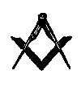
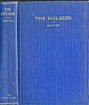
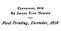

  
[Intangible Textual Heritage](../../index)  [Freemasonry](../index.md) 
[Index](index)  [Next](bui01.md) 

------------------------------------------------------------------------

[Buy this Book on
Kindle](https://www.amazon.com/exec/obidos/ASIN/B002J9HH0G/internetsacredte.md)

------------------------------------------------------------------------

*The Builders*, by Joseph Fort Newton, \[1914\], at Intangible Textual
Heritage

------------------------------------------------------------------------

p. iii

# THE BUILDERS

##### A STORY AND STUDY

##### OF MASONRY

###### BY

## JOSEPH FORT NEWTON, LITT. D.

##### GRAND LODGE OF IOWA

<table data-border="0">
<colgroup>
<col style="width: 100%" />
</colgroup>
<tbody>
<tr class="odd">
<td data-valign="top">
<em>When I was a King and a Mason— 
  A master Proved and skilled, 
I cleared me ground for a palace 
  Such as a King should build. 
I decreed and cut down to my levels, 
  Presently, under the silt, 
I came on the wreck of a Palace 
  Such as a King had built!</em> 
                       —KIPLING
</td>
</tr>
</tbody>
</table>

 

#### CEDAR RAPIDS IOWA

#### THE TORCH PRESS

#### NINETEEN FIFTEEN

#### \[1914\]

Scanned, proofed, and formatted at Intangible Textual Heritage, January
2005, by John Bruno Hare. This text is in the public domain in the US
because it was published prior to 1923.

 
[  
Click to enlarge](img/cover.jpg.md)  
Cover  

  [  
Click to enlarge](img/title.jpg.md)  
Title Page  

 
[  
Click to enlarge](img/verso.jpg.md)  
Verso  

p. iv

COPYRIGHT, 1914

BY JOSEPH FORT NEWTON

First Printing, December, 1914

p. v

To

The Memory of

THEODORE SUTTON PARVIN

Founder of the Library of the Grand Lodge of Iowa, with Reverence and
Gratitude; to

LOUIS BLOCK

Past Grand Master of Masons in Iowa, dear Friend

and Fellow-worker, who initiated and inspired

this study, with Love and Goodwill; and

to the

YOUNG MASONS

Our Hope and Pride, for whom

this book was written

With

Fraternal Greeting

------------------------------------------------------------------------

[Next: The Anteroom](bui01.md)
