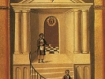

  
[Intangible Textual Heritage](../../index)  [Freemasonry](../index.md) 
[Index](index)  [Next](dun01.md) 

------------------------------------------------------------------------

[Buy this Book at
Amazon.com](https://www.amazon.com/exec/obidos/ASIN/B0021YV4ZS/internetsacredte.md)

------------------------------------------------------------------------

  
*Duncan's Masoic Ritual and Monitor*, by Malcom C. Duncan, \[1866\], at
Intangible Textual Heritage

------------------------------------------------------------------------

# DUNCAN'S

## Masonic Ritual and Monitor

###### OR

##### GUIDE TO THE THREE SYMBOLIC DEGREES OF THE ANCIENT YORK RITE

###### AND

###### TO THE DEGREES OF MARK MASTER, PAST MASTER, MOST EXCELLENT MASTER, AND THE ROYAL ARCH

###### BY

## MALCOLM C. DUNCAN

##### EXPLAINED AND INTERPRETED BY COPIOUS NOTES AND NUMEROUS ENGRAVINGS

###### THIRD EDITION

###### WITH ADDITIONS AND CORRECTIONS

#### New York: Dick & Fitzgerald

#### \[1866\]

 

Scanned, proofed and formatted January, 2005, at Intangible Textual
Heritage, by John Bruno Hare. This text is in the public domain because
it was published prior to 1923.

 

------------------------------------------------------------------------

[Next: Preface](dun01.md)
