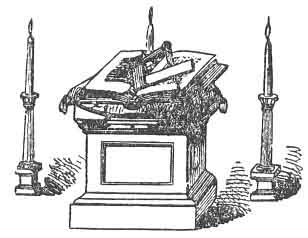
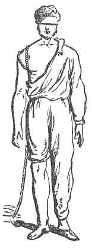
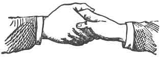
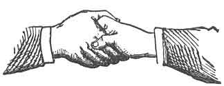
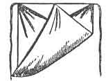
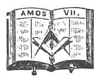

  
[Intangible Textual Heritage](../../index)  [Freemasonry](../index.md) 
[Index](index)  [Previous](dun02)  [Next](dun04.md) 

------------------------------------------------------------------------

[Buy this Book at
Amazon.com](https://www.amazon.com/exec/obidos/ASIN/B0021YV4ZS/internetsacredte.md)

------------------------------------------------------------------------

  
*Duncan's Masoic Ritual and Monitor*, by Malcom C. Duncan, \[1866\], at
Intangible Textual Heritage

------------------------------------------------------------------------

p. 58

 

# FELLOW CRAFT, OR SECOND DEGREE.

I SHALL omit the ceremonies incident to opening a Lodge of Fellow
Crafts, as they are very similar to those employed in opening the First
Degree, and will be explained hereafter more 

<table data-align="LEFT">
<colgroup>
<col style="width: 100%" />
</colgroup>
<tbody>
<tr class="odd">
<td data-valign="CENTER"> 
COMPASSES PLACED IN A LODGE OF FELLOW CRAFT MASONS, ''ONE POINT ELEVATED ABOVE THE SQUARE.'' (See Note B.)</td>
</tr>
</tbody>
</table>

clearly to the reader. Five are required by Masonic law to make a legal
Lodge of Fellow Crafts, viz.: Worshipful Master, Senior and Junior
Wardens, Senior and .Junior Deacons; yet seven, besides the Tyler,
generally officiate, and take their seats as in the Entered Apprentice
Degree. (See [Plate](dun02.htm#img_00800), page [8](dun02.htm#page_8)..md)

When the Lodge is opened on the Fellow Craft Degree, the altar is
arranged as represented in the accompanying engraving.

We will suppose the Lodge to be opened on the Fellow Craft Degree, and
Mr. Gabe, who has previously taken the degree of Entered Apprentice, and
been elected to that of Fellow Craft, is in the ante-room in waiting.
The Master, being aware of this fact, will say:

p. 59

W. M.--Brother Junior Deacon, you will take with you the necessary
assistance and repair to the ante-room, where there is a candidate in
waiting for the second degree in Masonry; and when you have him
prepared, make it known by the usual sign.

The Junior Deacon, with the two Stewards accompanying him, steps to the
centre of the Lodge, makes the duegard and sign of a Fellow Craft, and
passes out of the Lodge into the ante-room. (For duegard and sign see
Figs. [3](dun02.htm#img_01701) and [4](dun02.htm#img_01702.md), page
[17](dun02.htm#page_17)..md)

J. D.--Well, Brother Gabe, you will have to be prepared for this Degree
as all have been before you. You, of course, can have no serious
objection?

Brother Gabe.--I have not.

J. D.--Then you will take off your boots, coat, pants, vest-necktie, and
collar; and here is a pair of drawers, unless you have a pair of your
own. Now you will slip 

|                    |
|--------------------|
|  |

your right arm out of your shirtsleeve, and put it through the bosom of
your shirt, that your right arm and breast may he naked.

The Deacon here ties a hoodwink, or hand-kerchief, over both eyes. (In
the time of Morgan, it was the usage to cover only one eye.) The Junior
Deacon then ties a rope, by Masons called a cable-tow, twice around his
arm. (Formerly, the rope was put twice round the candidate's neck.) Some
Lodges follow the old custom now, but this is rather a rare thing. The
reader will, however, do well to recollect these hints, as they are
particular points.

The right foot and knee of the candidate are made bare by rolling up the
drawers, and a slipper should be put on his left foot. This being
accomplished, the candidate is duly and truly prepared. (See
[engraving](#img_05900)..md)

The Deacon now takes the candidate by the arm, and leads him forward to
the door of the Lodge; and upon arriving there he gives three raps, when
the Senior Deacon, who has taken his station on the inside door of the
Lodge, reports to the Master as follows:

S. D.--Worshipful Master (making the sign of a Fellow Craft), there is
an alarm at the inner door of our Lodge.

W. M.--You will attend to the alarm, and ascertain the cause.

p. 60

The Deacon gives three raps, which are responded to by the Junior
Deacon, and answered to by one rap from the Senior Deacon inside, who
opens the door, and says:

S. D.--Who comes here?

J. D. (conductor.)--Brother Gabe, who has been regularly initiated as
Entered Apprentice, and now wishes to receive more light in Masonry by
being passed to the degree of Fellow Craft.

S. D. (turning to candidate.)--Brother Gabe, is it of your own free-will
and accord?

Candidate--It is.

S. D.--Brother Junior Deacon, is he duly and truly prepared, worthy and
well qualified?

J. D.--He is.

S. D.--Has he made suitable proficiency in the preceding degree?

J. D.--He has.

S. D.--And properly vouched for?

J. D.--He is.

S. D.--Who vouches for him?

J. D--A brother.

S. D.--By what further right, or benefit, does he expect to gain
admission?

J. D.--By the benefit of a pass.

S. D.--Has he that pass?

J. D.--He has it not, but I have it for him.

S. D.--Advance, and give me the pass. (Some say, advance the pass.)

Junior Deacon whispers in the Senior Deacon's ear the pass-word,
"Shibboleth."

S. D.--The pass is right. You will wait with patience until the
Worshipful Master is informed of your request, and his answer returned.

The Senior Deacon then closes the door, and repairs to the centre of the
Lodge, before the Worshipful Master in the east, and sounds his rod
twice on the floor, which is responded to by the Master with his gavel,
when the same interrogations and answers are repeated by the Master and
Deacon as at the door. The Master then says:

W. M--Let him enter, in the name of the Lord, and be received in due
form.

The Senior Deacon then takes the square from the altar, and, repairing
to the door, he opens it, and says:

S. D.--Let him enter in the name of the Lord, and be received in due
form.

The Junior Deacon advances through the door, followed by the

p. 61

two Stewards, when the Senior Deacon stops them by placing the angle of
the square against the candidate's right breast.

S. D. (pressing square against candidate's breast.)--Brother Gabe, on
entering this Lodge the first time you were received on the points of
the compass: I now receive you on the angle of the square, which is to
teach you that the square of virtue should be the rule and guide of your
conscience in all future transactions with mankind.

The Senior Deacon now takes the candidate by the right arm, followed by
the Stewards, and conducts him twice around the Lodge, counting from the
Junior Warden's station in the south, during which time the Master reads
the following passage of Scripture:

"Thus he showed me: and behold, the Lord stood upon a wall made by a
plumb-line, with a plumb-line in his hand. And the Lord said unto me,
Amos, what seest thou? And I said, A plumb-line. Then said the Lord,
Behold, I will set a plumb-line in the midst of my people Israel; I will
not again pass by them any more."--*Amos* vii. 7, 8.

While going around the Lodge, as the conductor and candidate pass the
officers' stations in the south, west, and east, they (the officers)
sound the gavel as follows: the first time going round, one rap each;
the second time, two raps each. By the time the Master has finished
reading the above passage of Scripture, the candidate and conductor have
passed around the room twice, and arrived at the Junior Warden's station
in the south.

J. W. (giving two raps, which are responded to by the deacon.)--Who
comes here?

S. D. (conductor.)--Brother Gabe, who has been regularly initiated
Apprentice, and now wishes to receive more light in Masonry, by being
passed to the Degree of Fellow Craft.

J. W. (turning to candidate.)--Brother Gabe, is it of your own free-will
and accord?

Candidate--It is.

J. W.--Brother Senior Deacon, is he duly and truly prepared, worthy, and
well qualified?

S D.--He is.

J. W.--Has he made suitable proficiency in the preceding Degree?

S. D.--He has.

J. W.--And properly vouched for?

S. D.--He is.

J. W.--Who vouches for him?

S. D.--A brother.

p. 62

J. W.--By what further right, or benefit does he expect to gain
admission?

S. D.--By the benefit of the pass.

J. W.--Has he that pass?

S. D.--He has it not, but I have it for him.

J. W.--Advance, and give me the pass.

Senior Deacon advances, and whispers in the Junior Warden's ear,
"Shibboleth."

J. W.--The pass is right; I will suffer you to pass on to the Senior
Warden's station in the west.

S. W.--Who comes here?

S. D.--Brother Gabe, who has been regularly initiated Apprentice, and
now wishes to receive more light in Masonry, by being passed to the
Degree of Fellow Craft.

S. W. (turning to candidate.)--Brother Gabe, is it of your own free-will
and accord?

Candidate--It is, &c., &c.

Precisely the same questions and answers transpire as at the Junior
Warden's station and at the door, and the candidate and conductor are
permitted by the Warden to pass to the Worshipful Master's station in
the east.

W. M.--Who comes here?

S. D. (for candidate.)--Brother Gabe, who has been regularly initiated
Apprentice, and now wishes to receive more light in Masonry, by being
passed to the Degree of Fellow Craft.

W. M.--(turning to candidate.)--Brother Gabe, is it of your own
free-will and accord?

Brother Gabe.--It is.

W. M.--Brother Senior Deacon (the Master speaking in a very deep tone of
voice), is he duly and truly prepared, worthy, and well qualified?

S. D.--He is.

W. M.--Has he made suitable proficiency in the preceding Degree?

S. D--He has.

W. M.--And properly vouched for?

S. D.--He is.

W. M.--Who vouches for him?

S. D.--A brother.

W. M.--By what further right or benefit does he expect to gain
admission?

S. D.--By the benefit of the pass.

W. M.--Has he that pass?

S. D.--He has it not. but I have it for him.

W. M.--Advance and give me the pass.

p. 63

Senior Deacon advances, and whispers in the Master's ear, "Shibboleth."

W. M.--The pass is right; from whence came you, and whither are you
travelling?

S. D.--From the west, travelling toward the east.

W. M.--Why leave you the west, and travel toward the east?

S. D.--In search of more light.

W. M.--Since that appears to be the object of the candidate's search, it
is my orders that he be reconducted to the Senior Warden in the west,
who will teach him how to approach the east, by two upright regular
steps, his feet forming an angle of a square, his body erect at the
altar before the Worshipful Master in the east.

Senior Deacon conducts the candidate back to the. Senior Warden in the
west, and says:

S. D.--Brother Senior Warden, it is the orders of the Worshipful Master,
that you teach this candidate to approach the east, by two upright
regular steps, his feet forming an angle of a square, his body erect at
the altar before the Worshipful Master in the east.

Senior Warden leaves his seat, and, approaching the candidate, he leads
him toward the altar, and within two steps of it, and says:

Brother, you will first step off one full step with your left foot,
bringing the heel of your right in the hollow of your left foot, now you
will step off with your right foot, bringing the heel of your left in
the hollow of your right. ([Steps 1 and 2, Fig. 14, p.
93](dun04.htm#img_09300)..md)

The candidate is now within kneeling distance of the altar, and the
Senior Warden makes the following report to the Master:--

Worshipful Master, the candidate is now in order, and awaits your
further will and pleasure.

W. M.--Brother Senior Warden, you will place him in due form for taking
upon himself the solemn oath or obligation of a Fellow Craft.

The Senior Warden, with the assistance of the Senior Deacon, now causes
the candidate to kneel on his naked right knee, before the altar, making
his left knee form a square. His left arm, as far as the elbow, should
be held in a horizontal position, and the rest of the arm in a
[vertical](errata.htm#1.md) position, forming another square--his arm
supported by the square, held under his elbow, and his right hand
resting on the open Bible. (See [Fig. 10](#img_06400)..md)

W. M.--Brother Gabe, you are kneeling for the second time at the sacred
altar of Masonry, to take upon yourself the solemn

p. 64

oath or obligation of a Fellow Craft; and I take pleasure, as Master of
this Lodge, to say to you (as on a former occasion), there is nothing in
this oath that will interfere with the duty that you owe to your God,
your family, country, neighbor, or self. Are you willing to take it?

 

   
FIG. 10. CANDIDATE TAKING THE OATH OF A FELLOW CRAFT.

(left to right: Master. Altar and Lights. Candidate. Conductor.)

"Kneeling on my naked right knee, my left forming a
square; my right hand on the Holy Bible, square, and compasses, my left
arm forming an angle, supported by the square, and my hand in a vertical
position."

 

Candidate--I am.

W. M.--Then, if you have no objections, you will say, I, and repeat your
name after me (here the Master gives two raps with his gavel (• •),
which is the signal for all the brethren to assemble around the altar).

### OATH.

I, Peter Gabe, of my own free-will and accord, in the presence of
Almighty God, and this worshipful Lodge, erected to Him, and

p. 65

dedicated to the holy STS. JOHN, [1](#fn_23.md) do
hereby and hereon (Master presses candidate's hand with the gavel), most
solemnly and sincerely promise and swear that I will always hail, and
ever conceal, and never reveal any of the secret arts, parts, or points
of the Fellow Craft Degree to any person whomsoever, except it be to a
true and lawful brother of this degree, or in a regularly constituted
Lodge of Fellow Crafts; nor unto him or them until, by strict trial, due
examination, or lawful information, I shall find him, or them, as
lawfully entitled to the same as I am myself.

I furthermore promise and swear that I will stand to, and abide by, all
the laws, rules, and regulations of the Fellow Craft Degree, as far as
the same shall come to my knowledge.

Further. I will acknowledge and obey all due signs and summons sent to
me from a Lodge of Fellow Crafts, or given me by a brother of that
degree, if within the length of my cable-tow.

Further, that I will aid and assist all poor, distressed, worthy Fellow
Crafts, knowing them to be such, as far as their necessities may
require, and my ability permit, without any injury to myself.

Further, that I will not cheat, wrong, nor defraud a brother of this
degree, knowingly, nor supplant him in any of his laudable undertakings.

All this I most solemnly promise and swear with a firm and steadfast
resolution to perform the same, without any hesitation, mental
reservation, or self-evasion of mind whatever, binding myself under no
less penalty than of having my breast torn open [2](#fn_24.md) ( see sign of Fellow Craft, [Fig. 4, p.
17](dun02.htm#img_01702)) my heart [3](#fn_25.md)
plucked out, and placed on the highest pinnacle of the temple (some say,
My heart and vitals taken from thence, and thrown over my left shoulder,
and carried into the valley of Jehoshaphat, &c., &c.), there to be
devoured by the vultures of the air, should I

p. 66

ever knowingly violate the Fellow Craft obligation. So help me God, and
keep me steadfast in the due performance of the same.

W. M.--Brother Gabe, you will detach your hand, and kiss the book on
which your hand rests, which is the Holy Bible.

Candidate kisses the book once (some Lodges say twice).

W. M.--In your present condition, what do you most desire?

The candidate, prompted by his conductor, answers--More light in
Masonry.

W. M.--Brethren, you will stretch forth your hands, and assist me in
bringing our brother to light.

Here all the brethren place their hands in the form of the duegard of a
Fellow Craft. (See [Fig. 3, p. 17](dun02.htm#img_01701)..md)

W. M.--Let the brother receive light.

At this point the conductor unties the hoodwink, and lets it fall from
the candidate's eyes. The Master then gives one rap on the altar with
his gavel, when all the brethren but himself and the conductor (S. D.)
take their seats. The Master then says to the candidate:

W. M.--My brother, on being brought to light in this Degree, you behold
one point of the compasses elevated above the square (see [altar and
compasses in this Degree, p. 58](#img_05800).md), which is to signify that
you have received light in Masonry by points.

Then, stepping back a few feet from the altar, the Worshipful Master
continues:

W. M.--Brother, you discover me approaching you from the east, under the
duegard (here he makes the duegard) and sign (here he makes the sign of
a Fellow Craft, see Figs. [3](dun02.htm#img_01701.md),
[4](dun02.htm#img_01702), [p. 17](dun02.htm#page_17).md); and In token of
the continuance of brotherly love and favor, I present you with my right
hand (takes candidate by the right hand), and with it the pass, token,
token of the pass, grip, and word of a Fellow Craft. As you are yet
uninformed, your conductor will answer for you.

The Worshipful Master now takes the candidate by the Entered
Apprentice's grip (see Entered Apprentice's grip, [Fig.
9](dun02.htm#img_03600), [p. 36](dun02.htm#page_36).md), and says to his
conductor, the S. .D., while holding the candidate by this grip:

<table data-align="LEFT">
<colgroup>
<col style="width: 100%" />
</colgroup>
<tbody>
<tr class="odd">
<td data-valign="CENTER"> 
FIG. 11: PASS GRIP OF A FELLOW CRAFT</td>
</tr>
</tbody>
</table>

W. M.--Here I left you. and here I find you. Will you be off or from?

S. D. (for candidate.) From.

W. M.--From what, and to what?

S. D.--From the real grip of an Entered Apprentice to the pass grip of a
Fellow Craft.

p. 67

W. M.--Pass.

Here the candidate is requested to pass his thumb from the first joint
to the space between the first and second joints, which is the pass grip
of a Fellow Craft. (See [Fig. 11](#img_06600)..md)

W. M.--What is that?

Conductor--The pass grip of a Fellow Craft?

W. M.--Has it a name?

Conductor--It has.

W. M.--Will you give it me?

Conductor--" Shibboleth." (Some letter it, Shib-bo-leth.)

W. M.--Will you be off or from?

<table data-align="RIGHT">
<colgroup>
<col style="width: 100%" />
</colgroup>
<tbody>
<tr class="odd">
<td data-valign="CENTER"> 
FIG. 12. REAL GRIP OF A FELLOW CRAFT</td>
</tr>
</tbody>
</table>

Conductor--From. W. M.--From what, and to what?

Conductor--From the pass grip of a Fellow Craft to the real grip of the
same.

W. M. (moving his thumb to the second joint.)--Pass.

W. M.--What is that?

Conductor--The real grip of a Fellow Craft.

W. M.--Has it a name?

Conductor--It has.

W. M.--Will you give it me?

Conductor--I did not so receive it, neither can I so impart it.

W. M.--How will you dispose of it?

Conductor--I will letter it or halve it.

W. M.--Halve it, and begin.

Conductor.--No, you begin.

W. M.--Begin you.

Conductor.--Ja. (Some say "Jachin," without halving.)

W. M.--Chin.

Conductor.--Jachin.

Some say it this way, viz.:

S. D.--Chin.

W. M.--Ja.

S. D.--Jachin.

The first is considered to be the most correct.

W. M.--The pass is right. (At the words, "is right," lifting candidate
from his knees at the altar.) You will arise, and salute the Junior and
Senior Wardens as a Fellow Craft.

The conductor having previously removed the cable-tow from

p. 68

the candidate's arm, he conducts him to the Junior Warden's station in
the south, halts before that officer, and gives two raps on the floor
with his rod, or stamps twice on the floor with his foot, which is
responded to by the Junior Warden, in like manner, with his gavel.

J. W.--Who comes here?

Conductor--Brother Gabe, an obligated Fellow Craft.

J. W.--How shall I know him to be such?

Conductor--By signs and tokens.

J. W.--Give me a sign.

Conductor gives the duegard of a Fellow Craft (see [Fig.
3](dun02.htm#img_01701), [p. 17](dun02.htm#page_17).md), and makes the
candidate or candidates--if there are more than one--do likewise.

J. W.--What is that?

Conductor--Duegard of a Fellow Craft Mason.

J. W.--Has it an allusion?

Conductor--It has; it alludes to the manner in which my hands were
placed when I took upon myself the solemn oath of a Fellow Craft.

J. W.--Have you any other sign?

Conductor--I have. (At the same time he makes the sign of a Fellow
Craft, see [Fig. 4](dun02.htm#img_01702), [p. 17](dun02.htm#page_17.md),
and the candidate does the same.)

J. W.--What is that?

Conductor--The sign of a Fellow Craft Mason.

J. W.--Has it an allusion?

Conductor--It has; it alludes to the penalty of my obligation.

J. W.--Have you any further signs?

Conductor--I have not; but I have a pass, token, token of the pass,
grip, and word.

J. W.--Advance, and give me the pass.

Warden takes hold of candidate by the right hand, and places his thumb
on the first joint of candidate's hand (see Entered Apprentice grip,
[Fig. 9](dun02.htm#img_03600), [p. 36](dun02.htm#page_36).md), and says to
the conductor:

J. W.--Will you be off or from?

Conductor--From.

J. W.--From what, and to what?

Conductor--From the real grip of an Entered Apprentice to the pass grip
of a Fellow Craft. (See [Fig. 11](#img_06600), [p. 66](#page_66)..md)

J. W.--Pass. (They move their thumbs, as already described.)

J. W.--What is that?

Conductor--The pass grip of a Fellow Craft.

J. W.--Has it a name?

Conductor--It has.

p. 69

J. W.--Will you give it me?

Conductor--"Shibboleth."

J. W.--Will you be off or from?

Conductor--From.

J. W.--From what, and to what?

Conductor--From the pass grip of a Fellow Craft, to the real grip of the
same.

J. W.--Pass. (They pass the thumbs, as before described. See [Fig.
12](#img_06700), [p. 67](#page_67)..md)

J. W.--What is that?

Conductor--The real grip of a Fellow Craft.

J. W.--Has it a name?

Conductor--It has.

J. W.--Will you give it me?

Conductor--I did not so receive it, neither can I so impart it.

J. W.--How will you dispose of it?

Conductor--I will letter it or halve it.

J. W.--Halve it, and begin.

Conductor--No, you begin.

J. W.--Begin you.

Conductor--Ja.

J. W.--Chin.

Conductor--Jachin.

J. W.--The pass is right, and the word is right. I will suffer you to
pass on to the Senior Warden's station in the west.

The conductor and candidate now pass on to the Senior Warden in the
west, where they pass precisely the same examination as that just
described with the Junior Warden. The Senior Warden then permits them to
pass on to the Worshipful Master in the east for his examination. As
they (the candidate and conductor) approach the Master's station in the
east, and when nearly there, he (the Master) says:

W. M.--Brother Senior Deacon, you will reconduct the candidate to the
Senior Warden in the west, with my orders that he teach him how to wear
his apron as a Fellow Craft.

It should be here remarked, that when a candidate is prepared in the
ante-room for the Fellow Craft's degree, he has an apron tied on him,
with the flap up, as worn by an Entered Apprentice, which he wears until
he arrives at this part of the ceremony.

The Deacon now conducts the candidate to the Senior Warden's station.
This officer leaves his seat, and, approaching candidate, turns the flap
of his apron down, at the same time saying--Brother, at the building of
King Solomon's Temple, the Fellow

p. 70

\[paragraph continues\] Crafts wore their
aprons with the flap turned down and the corner turned up, and thus you
will wear yours, until further advanced. (Tucks a corner under the
string.)

<table data-align="LEFT">
<colgroup>
<col style="width: 100%" />
</colgroup>
<tbody>
<tr class="odd">
<td data-valign="CENTER"> 
FELLOW CRAFT'S APRON</td>
</tr>
</tbody>
</table>

The conductor now reconducts the candidate to the Worshipful Master in
the east.

W. M.--I now present you with the working tools of a Fellow Craft Mason,
which are the plumb, square, and level.

The Master here shows the candidate these tools, which are generally
made of rosewood .or ebony, and kept for these occasions on the Master's
desk.

   
WORKING TOOLS OF A FELLOW CRAFT.

W. M.--The plumb is an instrument made use of by operative masons to
raise perpendiculars, &c.

This is monitorial, and is generally read to candidates by the Master.
The reader will see the Masonic Monitors. After reading this, the Master
says:

W. M.--Brother Senior Deacon, it is my orders that you reconduct this
candidate to the place from whence he came (ante-room), and invest him
of what he has been divested of, preparatory to making an ascent through
a porch, by a flight of winding stairs, consisting of three, five, and
seven steps, to a place representing the Middle Chamber of King
Solomon's Temple, there to receive instructions relative to the wages
and jewels of a Fellow Craft.

The conductor then leads the candidate to the centre of the Lodge,
before the altar, and makes the duegard and sign of a Fellow Craft,
which is responded to by the Master. They then retire from the Lodge to
the ante-room. After the candidate is out of the room, the Lodge is
arranged for his second reception and the completion of the Degree. Two
large pillars, each from six and a half to seven feet high, are placed
near the door, about five feet apart, and fifteen pieces of painted
board, of a rectangular

p. 71

  [  
Click to enlarge](img/07100.jpg.md)  
REPRESENTATION OF THE CRAFTSMAN'S ROAD TO THE MIDDLE CHAMBER OF KING
SOLOMON'S TEMPLE.  

1. Treasurer 2. Worshipful Master. 3. Secretary. 4,
4. Conductor. 5, 5. Candidate. 6. Junior Warden.

p. 72

form, are arranged upon the carpet so as to represent three, five, and
seven steps, or stairs. Some Lodges, especially those in the large
cities, employ real steps, but in most country Lodges the painted boards
are used. For a more definite idea of this arrangement, the reader is
referred to [Fig. 13](#img_07100.md).

After the candidate is dressed, the conductor ties upon him a white
apron, with the flap turned down, as worn by Fellow Crafts. The
conductor then opens the Lodge-door, and, taking the candidate by the
left arm, he leads him forward through the door in front of the pillars.
For the first position of the parties see [Fig. 13](#img_07100.md), the two
stars representing the conductor (*i.e.* S. D.) and the candidate.

Conductor--Brother Gabe, we are now about to make an ascent through a
porch, by a flight of winding stairs, consisting of three, five, and
seven steps, to a place representing the Middle Chamber of King
Solomon's Temple, there to receive instructions relative to the wages
due, and jewels of a Fellow Craft.

Masonry is considered under two denominations--namely, Operative and
Speculative. By Operative Masonry, we allude to the proper application
of the useful rules of architecture, whence a structure will derive
figure, strength, and beauty; and whence will result a due proportion
and a just correspondence in all its parts. It furnishes us with
dwellings, and convenient shelters from the vicissitudes and
inclemencies of the seasons; and while it displays the effects of human
wisdom, as well in the choice as in the arrangement of the sundry
materials of which an edifice is composed, it demonstrates that a fund
of science and industry is implanted in man, for the best, most
salutary, and beneficent purposes.

By Speculative Masonry, we learn to subdue the passions, act upon the
square, keep a tongue of good report, maintain secrecy, and practise
charity. It is so far interwoven with religion as to lay us under
obligations to pay that rational homage to the Deity, which at once
constitutes our duty and our happiness. It leads the contemplative to
view with reverence and admiration the glorious works of creation, and
inspires him with the most exalted ideas of the perfections of his
Divine Creator.

Our ancient brethren worked at both Operative and Speculative Masonry;
they worked at the building of King Solomon's Temple, besides numerous
other Masonic edifices. They wrought six days, but did not work on the
seventh (7th), for in six days God created the heavens and the earth,
and rested on the seventh day; therefore our ancient brethren
consecrated this day as a day of rest from their labors; thereby
enjoying frequent opportunities

p. 73

to contemplate the glorious works of creation, and to adore their great
Creator.

Brother, the first thing that particularly attracts our attention are
(here the conductor steps forward) two large brazen pillars (pointing at
them with his rod), one on the right and one on the left hand. The name
of the one on the left hand is Boaz, and signifies strength; the name of
the one on the right is Jachin, and denotes establishment; they,
collectively, denote establishment and strength, and allude to a passage
in Scripture: "In strength shall this house be established." [1](#fn_26.md) These are representations of the two
pillars erected at the outer porch of King Solomon's Temple. They are
said to have been in height thirty-five (35) (Morgan, Richardson,
Bernard, and Allyn say only eighteen) cubits, twelve in circumference,
and four in diameter; they are said to have been adorned with two large
chapiters of five cubits each, making their entire height forty (40)
cubits. These chapiters were ornamented with a representation of
net-work, lily-work, and pomegranates, and are said to denote Unity,
Peace, and Plenty The network, from its connection, denotes unity; the
lily-work, from its whiteness, and the retired place in which it grows,
purity and peace; the pomegranates, from the exuberance of their seed,
denote plenty. These chapiters have on the top of each a globe, or ball;
these globes are two artificial spherical bodies; on the convex surfaces
of which are represented the countries, seas, and various parts of the
earth, the face of the heavens, the planetary revolutions; and are said
to be thus extensive, to denote the universality of Masonry, and that a
Mason's charity ought to be equally extensive. The principal use of
these globes, besides serving as maps, to distinguish the outward parts
of the earth, and the situation of the fixed stars, is to illustrate and
explain the phenomena arising from the annual revolution and the diurnal
rotation of the earth around its own axis. They are the noblest
instruments for improving the mind, and giving it the most distinct idea
of any problem or proposition, as well as enabling it to solve the same.

p. 74

Contemplating these bodies, we are inspired with a due reverence for the
Deity and his works and are induced to encourage the studies of
astronomy, geography, navigation, and the arts dependent on them, by
which society has been so much benefited.

The composition of these pillars is molten or cast brass; they were cast
whole, on the banks of the river Jordan, in the clay grounds between
SUCCOTH and ZAREDATHA, where King Solomon ordered these and all holy
vessels to be cast.

They were cast hollow, and were four inches or a hand's breadth thick.
They were cast hollow the better to withstand inundation and
conflagrations, and are said to have contained the archives of Masonry.

Conductor--Brother, we will pursue our journey. (Stepping to the three
steps on the floor or carpet.) The next thing that attracts our
attention are the winding stairs which lead to the Middle Chamber of
King Solomon's Temple, consisting of three, five, and seven steps.

The first three allude to the three principal stages of human life,
namely, youth, manhood, and old age. In youth, as Entered Apprentices,
we ought industriously to occupy our minds in the attainment of useful
knowledge; in manhood, as Fellow Crafts, we should apply our knowledge
to the discharge of our respective duties to God, our neighbors, and
ourselves; so that in old age, as Master Masons, we may enjoy the happy
reflections consequent on a well-spent life, and die in the hope of a
glorious immortality.

They also allude to the three principal supports in Masonry, namely,
Wisdom, Strength. and Beauty; for it is necessary that there should be
wisdom to contrive, strength to support, and beauty to adorn all great
and important undertakings.

They further allude to the three principal officers of the Lodge, viz.:
Master, and Senior and Junior Wardens.

Stepping forward to the five steps, he continues:

The five steps allude to the five orders of architecture and the five
human senses.

The five orders of architecture are Tuscan, Doric, Ionic, Corinthian,
and Composite. (Reads from *Monitor* respecting the orders of
architecture.)

The five human senses are hearing, seeing, feeling, smelling, and
tasting, the first three of which have ever been highly es-teemed among
Masons: hearing, to hear the word; seeing, to see the sign; feeling, to
feel the grip, whereby one Mason may know another in the dark as well as
in the light. (Steps forward to the seven steps.)

The seven steps allude to the seven Sabbatical years, seven

p. 75

years of famine, seven years in building the Temple, seven golden
candlesticks, seven wonders of the world, seven wise men of the east,
seven planets; but, more especially, the seven liberal arts and
sciences, which are grammar, rhetoric, logic, arithmetic, geometry,
music, and astronomy. For this and many other reasons the number seven
has ever been held in high estimation among Masons. (Reads from
*Monitor* respecting grammar, rhetoric, &., &c.)

By this time the Senior Deacon has passed the entire representation of
the flight of stairs, and is now at the Junior Warden's station in the
south. Upon arriving here, he (the Senior Deacon) says to the candidate:

Brother, we are now approaching the outer door of King Solomon's Temple,
which appears to be tyled or guarded by the Junior Warden. (Some
say--our Junior Warden.)

As they approach the Junior Warden's desk, he (the Junior Warden)
exclaims:

J. W.--Who comes here?

S. D.--A Craftsman, on his way to the Middle Chamber of King Solomon's
Temple.

J. W.--How do you expect to gain admission?

S. D.--By the pass, and token of the pass of a Fellow Craft.

J. W.--Give me the pass.

S. D.--Shibboleth.

J. W.--What does that denote?

S. D.--Plenty.

T. W.--How is it represented?

S. D.--By ears of corn hanging near a water-ford. [1](#fn_27.md)

J. W.--Why originated this word as a pass?

S. D.--In consequence of a quarrel which long existed between Jephthah,
judge of Israel, and the Ephraimites: the latter had been a stubborn,
rebellious people, whom Jephthah had endeavored to subdue by lenient
measures, but to no effect. The Ephraimites, being highly incensed for
not being called to fight, and share in the rich spoils of the
Ammonitish war, assembled a mighty army, and passed over the river
Jordan to give Jephthah battle; but he, being apprised of their
approach, called together the men of *Gilead*, and gave them battle, and
put them to flight; and, to make his victory more complete, he ordered
guards to be placed on the different passes on the banks of the river
Jordan,

p. 76

and commanded, if the Ephraimites passed that way, Say ye *Shibboleth*;
but they, being of a different tribe, could not frame to pronounce it
aright, and pronounced it *Sibboleth*; [1](#fn_28.md) which trifling defect proved them to be
spies, and cost them their lives; and there fell at that time, at the
different passes on the banks of the river Jordan, forty and two
thousand. This word was also used by our ancient brethren to distinguish
a friend from a foe, and has since been adopted as a password, to be
given before entering every regulated and well-governed Lodge of Fellow
Crafts.

J. W.--Give me the token (here give the pass grip of a Fellow Craft).

J. W.--The pass is right, and the token is right; pass on.

They now pass around the Junior Warden's station, and go to the Senior
Warden's Station in the west, and as they approach the Senior Warden's
station the Senior Deacon remarks:

Brother, we are now coming to the inner door of the Middle Chamber of
King Solomon's Temple, which appears to be guarded by the Senior Warden
in the west.

S. W.--Who comes here?

S. D.--A Craftsman, on his way to the Middle Chamber.

S. W.--How do you expect to gain admission?

S. D.--By the grip and word of a Fellow Craft.

S. W.--Give me the grip (here give the real grip of a Fellow
Craft--[Fig. 12](#img_06700), [p. 67](#page_67).md).

S. W.--What is that?

S. D.--The real grip of a Fellow Craft.

S. W.--Has it a name?

S. D.--It has.

S. W.--Will you give it me?

S. D.--I did not so receive it, neither can I so impart it.

S. W.--How will you dispose of it?

S. D.--I will letter it, or halve it with you.

S. W.--Halve it, and begin.

S. D.--No, you begin.

S. W.--Begin you.

vol. i. pp. 508--9.

p. 77

S. D.--Ja.

S. W.--Chin.

S. D.--Jachin.

S. W.--The word is right, and the grip is right; pass on, brother.

They pass on to the Worshipful Master in the east, and on their arrival
at his desk, the Master rises from his seat, and says:

W. M.--Brother Gabe, you have now arrived at the place representing the
Middle Chamber of King Solomon's Temple, where you will be received and
recorded as a Fellow Craft. Turning to the Secretary's desk, he
continues.

W. M.--Brother Secretary, you will make the record.

Sec.--It is so recorded.

W. M.--The first thing that particularly attracted your attention on
your passage here, was a representation of two brazen pillars, one on
the left hand and the other on the right, which was explained to you by
your conductor; after passing the pillars you passed a flight of winding
stairs, consisting of three, five, and seven steps, which was likewise
explained to you; after passing the stairs, you arrived at the outer
door of the Middle Chamber, which you found closely guarded by the
Junior Warden, who demanded of you the pass and token of the pass of a
Fellow Craft; you next arrived at the inner door of the Middle Chamber,
which you found guarded by the Senior Warden, who demanded of you the
grip and word of a Fellow Craft. You have now arrived at the Middle
Chamber where you are received and recorded a Fellow Craft. You are now
entitled to wages, as such; which are, the *Corn* of nourishment, the
*Wine* of refreshment, and the *Oil* of joy, which denote peace,
harmony, and strength. You are also entitled to the jewels of a Fellow
Craft; which are, an attentive ear, an instructive tongue, and faithful
breast. The attentive ear receives the sound from the instructive
tongue, and the mysteries of Masonry are safely lodged in the repository
of faithful breasts.

W. M.--I shall now direct your attention to the letter "**G**" (here the
Master turns and points to a large gilded letter "**G**," which is
generally placed on the wall back of the Master's seat and above his
head; some Lodges suspend it in front of the Master, by a cord or wire),
which is the initial of geometry, the fifth science, it being that on
which this Degree was principally founded.

Geometry, the first and noblest of sciences, is the basis upon which the
superstructure of Masonry is erected. By geometry, we may curiously
trace nature through her various windings

p. 78

to her most concealed recesses. By it we discover the power, the wisdom,
and the goodness of the Grand Artificer of the Universe, and view with
delight the proportions which connect this vast machine. By it we
discover how the planets move in their different orbits, and demonstrate
their various revolutions. By it we account for the return of the
seasons, and the variety of scenes which each season displays to the
discerning eye. Numerous worlds are around us, all formed by the same
Divine Artist, and which roll through the vast expanse, and are all
conducted by the same unerring law of nature. A survey of nature, and
the observation of her beautiful proportions, first determined man to
imitate the Divine plan, and study symmetry and order. This gave rise to
societies, and birth to every useful art. The architect began to design,
and the plans which he laid down, being improved by experience and time,
have produced works which are the admiration of every age.

The lapse of time, the ruthless hand of ignorance, and the devastations
of war have laid waste and destroyed many valuable monuments of
antiquity on which the utmost exertions of human genius have been
employed. Even the Temple of Solomon, so spacious and magnificent, and
constructed by so many celebrated artists, escaped not the unsparing
ravages of barbarous force. Freemasonry, notwithstanding, has still
survived. The *attentive ear* receives the sound from the *instructive
tongue*, and the mysteries of Masonry are safely lodged in the
repository of faithful breasts. Tools and implements of architecture are
selected by the fraternity, to imprint on the memory wise and serious
truths; and thus, through a succession of ages, are transmitted
unimpaired the excellent tenets of our institution.

W. M.--Brother Gabe, this letter has a higher signification; it alludes
to the sacred name of Deity (here he gives three raps with his gavel
(• • •), when all in the Lodge rise to their feet), to whom we should
all, from the youngest Entered Apprentice, who stands in the northeast
corner, to the Worshipful Master, who presides in the east, with all
sincerity humbly bow (here all bow their heads), with reverence most
humbly bow. (Master gives one rap, when all the brethren take their
seats again.)

W. M.--Brother Gabe, this ends this degree, with the exception of a
charge, which I will now give to you.

### CHARGE.

Brother: Being passed to the second degree of Masonry, we congratulate
you on your preferment. The internal. and not the external
qualifications of a man, are what Masonry regards.

p. 79

\[paragraph continues\] As you increase in
knowledge you will improve in social intercourse.

It is unnecessary to recapitulate the duties which, as a Mason, you are
bound to discharge, or to enlarge on the necessity of a strict adherence
to them, as your own experience must have established their value.

Our laws and regulations you are strenuously to support, and be always
ready to assist in seeing them duly executed. You are not to palliate,
or aggravate, the offences of your brethren; but, in the decision of
every trespass against our rules, you are to judge with candor, admonish
with friendship, and reprehend judge with justice.

The study of the liberal arts, that valuable branch of education, which
tends so effectually to polish and adorn the mind, is earnestly
recommended to your consideration--especially the science of geometry,
which is established as the basis of our art. Geometry, or Masonry,
originally synonymous terms, being of a divine and moral nature, is
enriched with the most useful knowledge: while it proves the wonderful
properties of nature, it demonstrates the more important truths of
morality.

Your past behavior and regular deportment have merited the honor which
we have now conferred; and in your new character it is expected that you
will conform to the principles of the Order, by steadily persevering in
the practice of every commendable virtue.

Such is the nature of your engagements as a Fellow Craft; and to these
duties you are bound by the most sacred ties.

### LECTURE ON THE FELLOW CRAFT DEGREE.

### SECTION FIRST.

Q. Are you a Fellow Craft?

A. I am. Try me.

Q. How will you be tried?

A. By the square.

Q. Why by the square?

A. Because it is an emblem of morality, and one of the working-tools of
my profession.

Q. What is a square?

A. An angle of ninety degrees, or a fourth part of a circle.

Q. Where were you made a Fellow Craft?

A. In a regularly constituted Lodge of Fellow Crafts.

Q. How were you prepared?

p. 80

A. By being divested of all metals, neither naked nor clothed, barefoot
nor shod, hoodwinked, with a cable-tow twice about my right arm, in
which condition I was conducted to the door of a Lodge by a brother.

Q. Why had you a cable-tow twice about your right arm?

A. To signify, as a Fellow Craft, that I was under a double tie to the
fraternity.

Q. How gained you admission?

A. By three distinct knocks.

Q. To what do they allude?

A. To the three jewels of a Fellow Craft--an attentive ear an
instructive tongue, and a faithful breast.

Q. What was said to you from within?

A. Who comes there.

Q. Your answer?

A. Brother A. B., who has been regularly initiated Entered Apprentice,
and now wishes to receive more light in Masonry, by being passed to the
degree of Fellow Craft.

Q. What were you then asked?

A. If it was of my own free-will and accord, if I was worthy and well
qualified, duly and truly prepared, had made suitable proficiency in the
preceding degree, and was properly vouched for; all of which being
answered in the affirmative, I was asked by what further right or
benefit I expected to gain admission.

Q. Your answer?

A. By the benefit of the pass.

Q. Did you give the pass?

A. I did not; but my conductor gave it for me,

Q. What followed?

A. I was bid to wait with patience until the Worshipful Master should be
informed of my request and his answer returned.

Q. What answer did he return?

A. Let him enter, in the name of the Lord, and be received in due form.

Q. How were you received?

A. On the angle of the square presented to my naked right breast, which
was to teach me that the square of virtue should be the rule and guide
of my conduct, in all my future transactions with mankind.

Q. How were you then disposed of?

A. I was conducted twice around the Lodge to the Junior Warden in the
south, where the same questions were asked and like answers returned as
at the door.

p. 81

Q. How did the Junior Warden dispose of you?

A. He directed me to pass on to the Senior Warden in the west, and he to
the Worshipful Master in the east, where the same questions were asked
and like answers returned as before.

Q. How did the Worshipful Master dispose of you?

A. He ordered me to be returned to the Senior Warden in the west, who
taught me to approach the east by two upright regular steps, my feet
forming an angle of a square, my body erect at the altar before the
Worshipful Master in the east.

Q. What did the Worshipful Master then do with you?

A. He made me a Fellow Craft in due form.

Q. What was that due form?

A. Kneeling on my naked right knee, my left forming a square, my right
hand on the Holy Bible, square, and compasses, my left arm forming a
right angle supported by the square in which due form I took the oath of
a Fellow Craft. (Some repeat the oath.)

Q. After the obligation, what were you then asked?

A. What I most desired.

Q. Your answer?

A. More light in Masonry.

Q. Did you receive light?

A. I did, by the order of the Worshipful Master, and the assistance of
the brethren.

Q. On being brought to light, what did you first discover, more than you
had heretofore discovered?

A. One point of the compasses elevated above the square, which was to
signify that I had received light in Masonry by points. Q. What did you
then discover?

A. The Worshipful Master approaching me from the east, under the duegard
and sign of a Fellow Craft; who, in token of the continuance of his
brotherly love and favor, presented me with his right hand, and with it
the pass, token, token of the pass, grip and word of a Fellow Craft, and
ordered me to arise and salute the Junior and Senior Warden as such.

Q. After saluting the Wardens, what did you then discover?

A. The Worshipful Master ordered me to the Senior Warden in the west,
who taught me to wear my apron as a Fellow Craft.

Q. How should a Fellow Craft wear his apron?

A. With the flap turned down, and the corner turned up.

Q. After being taught to wear your apron as a Fellow Craft, how were you
then disposed of?

p. 82

A. I was conducted to the Worshipful Master in the east, who presented
me with the working-tools of a Fellow Craft (the plumb, square, and
level), and taught me their use.

Q. What is their use?

A. The plumb is an instrument made use of, by operative masons, to raise
perpendiculars; the square, to square their work; and the level, to lay
horizontals. But we, as Free and Accepted Masons are taught to make use
of them for more noble and glorious purposes: the plumb admonishes us to
walk upright, in our several stations, before God and man; squaring our
actions by the square of virtue; and remembering that we are travelling,
upon the level of time, to "that undiscovered country from whose bourne
no traveller returns."

Q. How were you then disposed of?

A. I was ordered to be returned to the place from whence I came, and
invested of what I had been divested of, and was informed that,
agreeably to an ancient custom in every well-governed Lodge, it
therefore became necessary that I should make a regular ascent, by a
flight of winding stairs, consisting of three, five, and seven steps, to
a place representing the Middle Chamber of King Solomon's Temple, there
to receive instructions relative to the wages and jewels of a Fellow
Craft.

### SECOND SECTION.

Q. Have you ever worked as a Fellow Craft?

A. I have, in speculative; but our forefathers wrought in both
speculative and operative Masonry.

Q. Where did they work?

A. At the building of King Solomon's Temple, and of many other Masonic
edifices.

Q. How long did they work?

A. Six days.

Q. Did they work on the seventh?

A. They did not.

Q. Why so?

A. Because in six days God created the heavens and the earth, and rested
on the seventh day; the seventh day, therefore, our ancient brethren
consecrated as a day of rest from their labors, thereby enjoying more
frequent opportunities to contemplate the glorious works of creation,
and adore their great Creator.

Q. Did you ever return to the *sanctum sanctorum*, or holy of holies, or
King Solomon's Temple?

p. 83

A. I did.

Q. By what way?

A. Through a long porch or alley.

Q. Did any thing in particular strike your attention on your return?

A. There did, viz.: two large columns, or pillars, one on the left hand,
and the other on the right.

Q. What was the name of the one on the left hand?

A. Boaz, which denotes strength.

Q. What was the name of the one on the right hand?

A. Jachin, denoting establishment.

Q. What do they collectively allude to?

A. A passage in Scripture, wherein God has declared in his word, "In
strength shall this house be established."

Q. What were their dimensions?

A. Thirty-five cubits in height, twelve in circumference, and four in
diameter.

Q. Were they adorned with any thing?

A. They were; with two large chapiters, one on each.

Q. What was the height of these chapiters?

A. Five cubits.

Q. Were they adorned with any thing?

A. They were; with wreaths of net-work, lily-work, and pomegranates.

Q. What do they denote?

A. Unity, Peace, and Plenty.

Q. Why so?

A. Net-work, from its connection, denotes union; lily-work, from its
whiteness and purity, denotes peace; and pomegranates, from the
exuberance of their seed, denote plenty.

Q. Were those columns adorned with any thing further?

A. They were, viz.: with two large globes or balls, one on each.

Q. What was the entire height of these pillars?

A. Forty cubits.

Q. Did they contain any thing?

A. They did, viz.: all the maps and charts of the celestial and
terrestrial bodies.

Q. Why are they said to be so extensive?

A. To denote the universality of Masonry, and that a Mason's y ought to
be equally extensive.

Q. What was their composition?

A. Molten or cast brass.

Q. Who cast them?

p. 84

A. Our Grand Master, Hiram Abiff.

Q. Where were they cast?

A. On the banks of the river Jordan, in the clay ground between Succoth
and Zaredatha, where King Solomon ordered these and all other holy
vessels to be cast.

Q. Were they cast solid or hollow?

A. Hollow.

Q. What was their thickness?

A. Four inches, or a hand's breadth.

Q. Why were they cast hollow?

A. The better to withstand inundations or conflagrations; they were said
to contain all the archives of Masonry.

Q. What did you next come to?

A. A long, winding staircase, or flight of winding stairs, consisting of
three, five, and seven steps.

Q. To what do the three steps allude?

A. The three principal supports in Masonry, namely: wisdom, strength,
and beauty; they also allude to the three stages in human life: youth,
manhood, and age; they further allude to the three degrees in Masonry:
Entered Apprentice, Fellow Craft, and Master Mason.

Q. What do the five steps allude to?

A. The five orders in architecture, and the five human sensed.

Q. What are the five orders in architecture?

A. The Tuscan, Doric, Ionic, Corinthian, and Composite.

Q. What are the five human senses?

A. Hearing, seeing, feeling, smelling, and tasting; the first three of
which have ever been deemed highly essential among Masons: hearing, to
hear the word; seeing, to see the sign; and feeling, to feel the grip,
whereby one Mason may know another in the dark as well as in the light.

Q. What do the seven steps allude to?

A. The seven Sabbatical years, seven years of famine, seven years of
war, seven years in building the Temple, seven golden candlesticks,
seven wonders of the world, seven planets; but, more especially, the
seven liberal arts and sciences, which are grammar, rhetoric, logic,
arithmetic, geometry, music, and astronomy. For these and many other
reasons the number seven has ever been held in high estimation among
Masons.

Q. What did you next come to?

A. The outer door of the Middle Chamber of King Solomon's Temple, which
I found partly open, but closely tyled by the Junior Warden in the
south.

Q. How did you gain admission?

p. 85

A. By the pass, and token of the pass of a Fellow Craft.

Q. What was the name of the pass?

A. SHIBBOLETH.

Q. What does it denote?

A. Plenty.

Q. How is it represented?

A. By ears of corn hanging near a water-ford.

Q. Why originated this word as a pass?

A. In consequence of a quarrel which had long existed between Jephthah,
Judge of Israel, and the Ephraimites, &c., &c. (for the balance, see
page [75](#page_75).md).

Q. What did you next discover?

A. The inner door of the Middle Chamber of King Solomon's Temple.

Q. How did you gain admission?

A. By the grip and word of a Fellow Craft--Jachin.

Q. How did the Senior Warden dispose of you?

A. He ordered me to be conducted to the Worshipful Master in the east,
who informed me that I had arrived at a place rep-resenting the Middle
Chamber of King Solomon's Temple, where I would be received and recorded
as such; which record was then made by the Secretary (by the orders of
the Worshipful Master), and I was presented with the wages of a Fellow
Craft, and also the jewels of a Fellow Craft.

Q. What are the wages of a Fellow Craft?

A. The corn of nourishment, the wine of refreshment, and the oil of joy.

Q. What do they denote?

A. Peace, harmony, and strength.

Q. What are the jewels of a Fellow Craft?

A. An attentive ear, an instructive tongue, and a faithful breast.

Q. How explained?

A. The attentive ear receives the sound from the instructive tongue, and
the mysteries of Masonry are lodged in the repository of a faithful
breast.

Q. What were you next shown?

A. The letter **G**.

Q. To what does it allude?

A. Geometry, the fifth science; but more particularly to the sacred name
of the Deity, to whom we should all, from the Youngest Entered
Apprentice who stands in the northeast corner, to the Worshipful Master
who presides in the east, with reverence most devoutly and humbly bow.

p. 86

This is the end of the Fellow Craft Degree, or Second Degree in
Masonry. [1](#fn_29.md)

 

------------------------------------------------------------------------

### Footnotes

[65:1](dun03.htm#fr_23.md) We are challenged by our
opponents to prove that St. John was a Freemason. The thing is incapable
of direct proof. Calmet positively asserts that he was an Essene, which
was the secret society of the day, that conveyed moral truths under
symbolical figures, and may. therefore, be termed Freemasonry, retaining
the same form, but practised under another name.--*Historical
Landmarks*, vol. i. p. 167.

[65:2](dun03.htm#fr_24.md) Gives candidate a rake
across his breast with the hand; this is to draw candidate's attention
to the penalty.

[65:3](dun03.htm#fr_25.md) The *breast* being the
abode of fortitude, we are taught by the second sign to *suppress the
risings* of apprehension and discontent; and to endure with patience the
attacks of adversity, or distress, pain, or disappointment, rather than
induce, by a weak and temporizing compliance with the persuasion of
friends, or the denunciations of enemies, the bitter stings of remorse
which must inevitably result from a *betrayal of secrets* with which we
have been intrusted on the faith of a *solemn obligation*.--*Theo.
Phil*., p. 289

[73:1](dun03.htm#fr_26.md) One of the rules of the
Jewish Cabala is called Transposition, and is used by finding an
appropriate meaning to a word formed anagrammatically from any other
word. Acting on this rule. Brother Rosenberg, an eminent Jewish Mason,
residing in Paris, thus improves the names of these pillars: "In the
First Degree, the candidate receives in his preparation the elements of
the sciences; it remains for him to instruct or to *fortify* himself by
means of the higher sciences; the word *fortify* in Hebrew is ZAOB. At
the moment when the young neophyte is about to receive the physical
light, he should also prepare himself to receive the moral light. he
word *prepared* in Hebrew is NIKAJ."--*Historical Landmarks*, vol. i.

[75:1](dun03.htm#fr_27.md) SHIBBOLETH. The word in
Hebrew has two signification: 1. An ear of grain, and, 2. A stream of
water.--*Lexicon*.

The symbolical interpretation of each floor cloth increases in interest
as we gradually advance through *the field of corn by the
river-side*.--*Theo.* p. 174.

[76:1](dun03.htm#fr_28.md) Shibboleth signifies
*waters*. Thus, when the Ephraimites. prayed the men of Gilead to allow
them to pass over, and were asked, in return--To pass over what? they
could not answer Shibboleth, or *the waters*, without betraying
themselves to the enemy. . The word chosen by the Gileadites, meaning a
stream of waters, being the object immediately before them, was well
calculated to put the Ephraimites off their guard. . . We can easily
understand the peculiarity of comformation in the organs of speech which
produced this defect. A native of the continent of Europe experiences
great difficulty in articulating the English *th*. In countries adjacent
to Palestine the same defect prevails.--*Historical Landmarks*.

[86:1](dun03.htm#fr_29.md) LECTURE. In the Fellow
Crafts' Degree, the first section recapitulates the ceremonies of
passing a candidate. The second section gives an account of the ancient
division of our institution into operative and speculative Masons, and
by striking emblems directs the candidate to an attentive study of the
liberal arts and sciences.--*Lexicon*.

During the preparation, according to the legends of Freemasonry, the
workmen's wages were paid daily, weekly, monthly, and quarterly, in
their respective Lodges; and, when the Temple was nearly completed,
*they were paid in the Middle Chamber*. This celebrated apartment was
accessible by a winding staircase of stone; the foot of which was
guarded by the Junior Warden, and the summit by the Senior Warden of a
Fellow Crafts' Lodge. And how were these wages paid? Without fear or
scruple, says the legend, because their employers were entitled to their
unlimited confidence.--*Theo. Phil.*, p. 199.

------------------------------------------------------------------------

[Next: Master Mason, or Third Degree](dun04.md)
