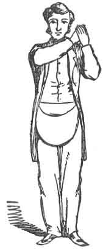
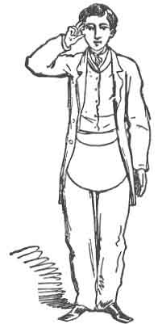
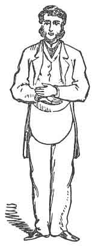
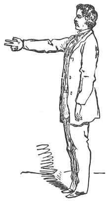
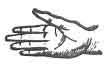

  
[Intangible Textual Heritage](../../index)  [Freemasonry](../index.md) 
[Index](index)  [Previous](dun04)  [Next](dun06.md) 

------------------------------------------------------------------------

[Buy this Book at
Amazon.com](https://www.amazon.com/exec/obidos/ASIN/B0021YV4ZS/internetsacredte.md)

------------------------------------------------------------------------

  
*Duncan's Masoic Ritual and Monitor*, by Malcom C. Duncan, \[1866\], at
Intangible Textual Heritage

------------------------------------------------------------------------

p. 150

 

# MARK MASTER, OR FOURTH DEGREE.

THE Degree of Mark Master, which is the Fourth in the Masonic series,
is, historically considered, of the utmost importance, since we are
informed that, by its influence, each operative Mason, at the building
of King Solomon's Temple, was known and distinguished, and the disorder
and confusion which might otherwise have attended so immense an
undertaking was completely prevented, and not only the craftsmen
themselves, but every part of their workmanship was discriminated with
the greatest nicety and the utmost facility.

It is claimed by Masonic writers, [1](#fn_53.md)
that this Degree in Masonry was instituted by King Solomon, at the
building of the Temple, for the purpose of detecting impostors, while
paying wages to the craftsmen. Each operative was required to put his
mark upon the product of his labor, and these distinctive marks were all
known to the Senior Grand Warden. If any of the workman-ship was found
to be defective, it was a matter of no difficulty for the overseers to
ascertain at once who was the imperfect craftsman, and remedy the
defect. Thus the faulty workman was punished, without diminishing the
wages of the diligent and faithful craftsmen. A candidate upon whom this
Degree has been conferred is said to have been "advanced to the honorary
Degree of Mark Master."

Eight officers are necessary to open a Lodge in this Degree. viz.:

1\. R. W. Master; 2. S. G. Warden; 3. J. G. Warden; 4. Senior Deacon; 5.
Junior Deacon; 6. Master Overseer; 7. Senior Overseer; S. Junior
Overseer.

p. 151

The officers of a Chapter rank as follows, viz.: the High Priest, as R.
W. Master; King, as Senior Grand Warden; Scribe, as Junior Grand Warden;
Captain of the Host, as Master of Ceremonies; Principal Sojourner, as
Senior Deacon; Royal Arch Captain, as Junior Deacon; Master of the Third
Veil, as Master Overseer; Master of the Second Veil, as Senior Overseer;
Master of the First Veil, as .Junior Overseer. The Treasurer, Secretary,
and Tyler, corresponding in rank with the same officers in other
Degrees. These officers are filled by the officers of the Chapter under
whose warrant the Lodge is held.

The symbolic color of the Mark Degree is purple. The apron is of white
lambskin, edged with purple, and the collar of purple, edged with gold.
But as Mark Lodges are no longer independent bodies, but always held
under the warrant of a Royal Arch Chapter, the collars, aprons, and
jewels of the Chapter are generally made use of in conferring the Mark
Degree.

Lodges of Mark Masters are "dedicated to Hiram, the Builder."

The interior arrangements of the Lodge, and the positions of the Master,
Wardens, Deacons, Secretary, and Treasurer, are the same as those in the
Entered Apprentices' Degree ([p. 8](dun02.htm#page_8).md). The Master
Overseer takes his seat on the right of the Right Worshipful Master in
the east. The Senior Overseer sits on the right of the Senior Grand
Warden in the west, and his Junior on the right of the Junior Grand
Warden in the south.

Right Worshipful Master (giving a rap with his gavel.)--Brethren, I am
about to open a Lodge of Mark Master Masons in this place, for the
dispatch of business. I will thank you for your attention and
assistance. If there is any person present who has not taken this
Degree, he is requested to retire.

To Senior Grand Warden:

Brother Senior, are you satisfied that all present are Mark Masters?

S. G. W.--Right Worshipful, I wish the pass-word might be given by the
brethren.

The two Deacons thereupon go round and receive the word, which is JOPPA,
in the same manner as in the Master Mason's Degree ([p.
20](dun02.htm#page_20).md).

R. W M. (giving one rap.)--Brother Junior Deacon, the first care of
congregated Masons?

J. D. (rising on his feet, and, at the same time, giving a sign--see
Fig. [20](#img_15401), [p. 154](#page_154)..md)--To see the Lodge tyled,
Right Worshipful.

R. W. M.--Perform that part of your duty, and inform the Tyler that we
are about to open a Lodge of Mark Master Masons

p. 152

in this place, for the dispatch of business; and direct him to tyle
accordingly.

The Junior Deacon then walks rapidly to the door, and gives four raps
(• • • •), which are answered by four without from the Tyler; the Junior
Deacon gives one, which is answered by the Tyler with (•); the door is
then partly opened, when the Junior Deacon delivers his message. He then
returns, gives the sign (see Fig. [20](#img_15400), [p. 154](#page_154).md)
again, and says:

The door is tyled, Right Worshipful.

H. W. M.--How tyled?

J. D.--Within the outer door, by a brother of this Degree, with a drawn
sword in his hand.

R. W. M.--His duty there?

J. D.--To keep off all cowans and eavesdroppers, see that none pass or
repass without due qualification, or permission from the Right
Worshipful Master.

R. W. M.--Let us be clothed, brethren.

Here the officers and members put on their aprons and jewels. The Master
gives two raps with his gavel, which brings all the subordinate officers
on their feet; and each, standing in his place, recites his duty on
being questioned.

R. W. M.--The Junior Overseer's station in the Lodge?

J. O.--At the south gate.

R. W. M.--Your duty there, Brother Junior Overseer?

J. O.--To inspect all materials brought up for the building of the
Temple; and, if approved, pass them on to the Senior Overseer, at the
west gate, for further inspection.

R. W. M.--The Senior Overseer's place in the Lodge?

S. O.--At the west gate.

R. W. M.--Your business there, Brother Senior Overseer?

S. O.--To inspect all materials brought up for the building of the
Temple, and, if approved, pass them on to the Master Overseer, at the
east gate, for further inspection.

R. W. M.--The Master Overseer's place in the Lodge?

M. O.--At the east gate.

R. W. M.--Your business there, Brother Master Overseer?

M. O.--To preside at the inspection of all materials brought up for the
building of the Temple; and, if disapproved, to call a council of my
brother Overseers.

R. W. M.--The Junior Deacon's place in the Lodge?

J. D.--At the right, in front of the Senior Grand Warden.

R. W. M.--Your duty there, Brother Junior?

J. D.--To carry messages from the Senior Grand Warden in

p. 153

the west to the Junior Grand Warden in the south, and elsewhere about
the Lodge, as he may direct.

R. W. M.--The Senior Deacon's place in the Lodge?

S. D.--At the right, in front of the Right Worshipful Master in the
east.

R. W. M.--Your duty there, Brother Senior?

S. D.--To carry messages from the Right Worshipful Master in the east to
the Senior Grand Warden in the west, and elsewhere about the Lodge, as
he may direct; to assist in the preparation and initiation of
candidates; and to welcome and clothe all visiting brethren.

R. W. M.--The Secretary's station in the Lodge?

Sec.--At the left hand of the Right Worshipful Master in the east.

R. W. M.--Your duty there, Brother Secretary?

Sec.--To record the doings of the Lodge, collect all money, pay it over
to the Treasurer, and keep a true and correct account of the same.

R. W. M.--The Treasurer's station in the Lodge?

Treas.--At the right hand of the Worshipful Master in the east.

R. W. M.--Your duty there, Brother Treasurer?

Treas.--To receive all money from the hands of the Secretary, to keep a
true and correct account of the same, and pay it out by order of the
Right Worshipful Master, with the consent of the brethren.

R. W. M.--The Junior Grand Warden's place in the Lodge?

J. G. W.--In the south, Right Worshipful.

R. W. M.--Your duty there, Brother Junior?

J. G. W.--As the sun is in the south at high twelve, which is the glory
and beauty of the day, so stands the Junior Grand warden in the south,
to call the crafts from labor to refreshment, and from refreshment to
labor, that the Right Worshipful Master may have profit and pleasure
thereby.

R. W. M.--The Senior Grand Warden's place in the Lodge?

S. G. W.--In the west, Right Worshipful.

R. W. M.--Your duty there, Brother Senior?

S. G. W.--As the sun sets in the west, to close the day, so stands the
Senior Grand Warden in the west, to assist the Right Worshipful Master
in opening and closing his Lodge, pay the crafts their wages, if any be
due, and see that none go away dissatisfied; harmony being the strength
and support of all institutions, but more especially of ours.

p. 154

R. W. M.--The Right Worshipful Master's Station in the Lodge?

S. G. W.--In the east, Right Worshipful.

R. W. M.--His duty there, Brother Senior?

S. G. W.--As the sun rises in the east, to open and adorn the day, so
rises the Right Worshipful Master in the east to open and adorn his
Lodge, and set the craft to work, with proper instructions for their
labor.

R. W. M. (rising.)--After that manner so do I. It is my will and
pleasure that a Lodge of Mark Master Masons be opened in this place, for
the dispatch of business. Brother Senior, you will please communicate
the same to the Junior Grand Warden

<table data-border="0">
<colgroup>
<col style="width: 50%" />
<col style="width: 50%" />
</colgroup>
<tbody>
<tr class="odd">
<td data-valign="top" width="327">
  
FIG. 19. THE ''HEAVE-OVER.''
</td>
<td data-valign="top" width="327">
  
FIG. 20. SIGN OF A MARK MASTER.
</td>
</tr>
</tbody>
</table>

in the south, that the brethren may have due and timely notice thereof.

S. G. W. (to Junior.)--Brother Junior, it is the Right Worshipful
Master's order that a Lodge of Mark Master Masons be opened in this
place, for the dispatch of business. You will please inform the brethren
thereof.

p. 155

J. G. W. (giving three raps with the gavel (• • •).--Brethren, it is the
Right Worshipful Master's order that a Lodge of Mark Master Masons be
opened in this place, for the dispatch of business. You are ordered to
take due notice thereof, and govern yourselves accordingly.

R. W. M.--Attend to the signs, brethren.

Here the Right Worshipful Master gives all the signs, in their regular
order, from the Entered Apprentice to Mark Master, the brethren all
imitating him. (For signs of the Entered Apprentice, or First Degree,
see Figs. [1](dun02.htm#img_01600) and [2](dun02.htm#img_01700.md); for
signs of the Fellow Craft, or Second Degree, see Figs.
[3](dun02.htm#img_01701) and [4](dun02.htm#img_01702.md); and for signs of
Master Mason, or Third Degree, see Figs. [5](dun02.htm#img_01703.md),
[6](dun02.htm#img_01800), and [7](dun02.htm#img_01801.md), pp.
[16](dun02.htm#page_16), [17](dun02.htm#page_17.md), and
[18](dun02.htm#page_18)..md)

After the duegard and sign of the Entered Apprentice, the duegard and
sign of the Fellow Craft, and the duegard, sign, and grand hailing sign
of the Master Mason are given in their regular order, then the Mark
Master's signs are given. First, the HEAVE-OVER, which is given as
follows:--

Place the flat back of the *right* hand in the flat palm of the *left*
hand, and hold them down in front opposite to the *right* hip, then
bring them up to the left shoulder with a quick motion, as though you
were throwing something over your left shoulder. In putting your hands
together, do so with a sharp slap, the palms facing your shoulder. In
old times this sign was made by interlacing the fingers. (See
Richardson's *Monitor*.) This sign is called the Heave-over, and alludes
to the rejection of the keystone in this Degree. (See [Fig.
19](#img_15400)..md)

The second sign is made as follows:

After having made the first sign, drop the arms to each side of the
body, and clinch the last two fingers of the right hand, leaving the
first two and thumb open, parallel with each other, and about one inch
apart. This alludes to the manner in which the candidate is directed to
carry the keystone. You then raise the right hand rapidly to the right
ear, still holding the thumb and first two fingers open, and with a
circular motion of the hand pass the fingers around the ear, as thought
you were combing back your earlock, the ear passing between the two
fingers and thumb. (See [Fig. 20](#img_15401)..md) This sign alludes to a
penalty of the obligation, to have the ear smitten off.

After having completed the sign, as just described, drop the right hand
a little to the right side, about as high up as the waist, the palm open
and horizontal, and, at the same time, lift up the left hand and bring
it down edgewise and vertically upon the wrist of the right. (See [Fig.
21](#img_15600)..md) These motions must all

p. 156

be made distinctly but rapidly. This sign alludes to the penalty of the
obligation, and also to that of an impostor, which is to have his right
hand cut off.

The sign of receiving wages is made by extending in front the right arm
at full length, the thumb and two first fingers open, about one inch
apart, the third and little fingers clinched, palm of the hand up. (See
[Fig. 22](#img_15601)..md) It alludes to the peculiar manner in which the
Mark Master is taught to receive wages, so that impostors may be
detected.

Here it is proper to remark that in the opening of any Lodge of Masons,
they commence giving the signs of an Entered Apprentice, and go through
all the signs of the different Degrees,

<table data-border="0">
<colgroup>
<col style="width: 50%" />
<col style="width: 50%" />
</colgroup>
<tbody>
<tr class="odd">
<td data-valign="top" width="327">
  
FIG. 21. SECOND SIGN OF A MARK MASTER.
</td>
<td data-valign="top" width="327">
  
FIG. 22. SIGN OF RECEIVING WAGES.
</td>
</tr>
</tbody>
</table>

in regular gradation, until they arrive at the one which they are
opening, and commence at the sign of the Degree in which they are at
work, and descend to the last when closing.

The Master now reads from a text-book the following:

"Wherefore, my brethren, lay aside all malice, and guile, and
hypocrisies, and envies, and all evil speaking. If so be ye have tasted
that the Lord is gracious; to whom coming, as unto a

p. 157

living stone, disallowed indeed of men, but chosen of God, and precious;
ye also, as living stones, be ye built up a spiritual house, an holy
priesthood, to offer up sacrifices acceptable to God. Brethren, this is
the will of God, that with well-doing ye put to silence the ignorance of
foolish men. As free, and not as using your liberty for a cloak of
maliciousness, but as the servants of God. Honor all men, love the
brotherhood, fear God."

The Right Worshipful Master then gives two raps with his gavel, Senior
Grand Warden two, and Junior Grand Warden two, which raps are then
repeated.

R. W. M.--I now declare this Lodge of Mark Master Masons opened in due
and ancient form, and hereby forbid all improper conduct whereby this
Lodge may be disturbed, under no less penalty than the by-laws of a
majority of the Lodge may see fit to inflict.

R. W. M. (to Junior Deacon.)--Brother Junior, please to inform the Tyler
the Lodge is open.

Junior Deacon informs the Tyler, and returns to his seat.

No business is done in a Lodge of Mark Master Masons, except to initiate
a candidate in the Fourth Degree of Masonry. The Degree being under the
sanction of the Royal Arch Chapter, all business, such as balloting for
candidates, committee reports, &c., is done in the Seventh, or Royal
Arch Degree. The Lodge being opened, and ready for such business as it
has authority to transact, the Right Worshipful Master directs the
Senior Deacon to ascertain if there are any candidates desiring to be
advanced to the honorary Degree of Mark Master Mason. The Senior Deacon
then retires to the ante-room, and if he finds any candidates in
waiting, he returns to the Lodge and informs the Right Worshipful
Master. It is the duty of the Senior Deacon to prepare and conduct the
candidate (or candidates, as the case may be), during the first part of
the ceremony of initiation, and if there are any candidates for
advancement, the Right Worshipful Master directs this officer to retire
to the ante-room and see them duly and truly prepared. The Junior
Deacon, with an assistant, then passes out of the Lodge into the
ante-room, where the candidate is in waiting (we will suppose that only
one is to be advanced), and requests him to divest himself of his coat
and roll up his shirt-sleeves to the shoulder. The Senior Deacon and his
associate do the same. When they are thus prepared, the Deacon takes in
his right hand a small block of marble or Painted wood, about the size
of a brick, weighing five or six Pounds. The Deacon's associate also
takes a similar block to carry. One of the blocks has a square engraved
upon it, the

p. 158

other, a plumb. (See [cut](#img_15800)..md) The candidate is then furnished
with a block representing a keystone, which he is requested to carry
between the thumb and two first fingers of the right hand, the other
fingers clinched with the nails tight against the palm, the arm extended
down perpendicularly at the side. The two officers carry their blocks in
the same manner. The three are styled "Workmen from the quarries." As we
have before said, the block which the candidate carries represents a
keystone, and has the initials H. T. W. S. S. T. K. S. engraved upon it
in a circle.

Sometimes this stone weighs twelve or fifteen pounds, and it is
considered a very nice job to carry a block of this weight plumb. The
blocks which the conductors carry are usually made of wood, and are,
therefore, comparatively light. The three "workmen" now form in a line
about three feet distant from each other, the candidate being last. The
door is then opened without ceremony, and the Junior Deacon, as
conductor, together with his associate and the candidate, enter the
Lodge, and march four times around the room, halting the last time at
the Junior Overseer's station, at the south gate, where the conductor
gives four raps (in couplets) on the floor with his heel (• • • •).

   
WORKMEN FROM THE QUARRIES.

Junior Overseer--Who comes here?

Senior Deacon--Workmen from the quarries, bringing up work.

Junior Overseer--Have you a specimen of your work? Senior Deacon--We
have.

Junior Overseer--Present your work.

The Senior Deacon presents his stone to the Junior Overseer, who applies
his small trying square to its different angles, and, they agreeing with
the angles of the square, he says:

Junior Overseer--This is good work--square work--just such work as we
are authorized to receive for the building (returning the block to the
Senior Deacon). You will pass on to the Senior Overseer at the west
gate, for further inspection.

p. 159

The second workman then presents his block, and it is tried and returned
the same as the conductor's.

The two workmen move on about six paces, in order to bring the candidate
before the Junior Overseer's station. The Junior Deacon then instructs
the candidate how to make the alarm and present his work.

Junior Overseer--Who comes here?

Candidate (prompted.)--A craftsman from the quarries, bringing you work.

Junior Overseer--Have you a specimen of your work? Candidate--I have.

Junior Overseer--Present it.

Candidate presents the keystone.

Junior Overseer (applying his square to it, and finding it does not
fit.)--This is a curiously wrought stone, indeed; it is neither oblong
nor square; good work, true work, square work is only such as we have
orders to receive; neither has it the mark of any of the craft upon it.
Is that your mark? (Pointing to the letters on the keystone.)

Candidate--It is not.

Junior Overseer--Owing to its singular form and beauty, I feel unwilling
to reject it; you will pass on to the Senior Overseer at the west gate
for his inspection.

The conductors and the candidate pass on to the Senior Overseer's
station in the west, when the same scene is repeated, and they are
directed to proceed to the Master Overseer at the east gate.

The Senior Deacon here first presents his block or stone to the Master
Overseer.

Master Overseer (applying his square.)--This is good work, true work,
and square work--just such work as I am authorized to receive and pass
for the building. You are entitled to your wages--pass on.

The conductors pass on, and take their seats. The candidate then
presents his keystone.

Master Overseer (applying his square.)--This is a curiously wrought
stone. It appears to be neither oblong nor square, and the mark upon it
is not that of a craftsman. (Looking sternly at candidate.) Is this your
work?

Candidate--It is not.

Master Overseer--Where did you get it?

Candidate--I picked it up in the quarry.

Master Overseer--Why do you bring another man's work to impose upon the
Overseers? You will stand aside.

p. 160

The Master Overseer now stamps on the floor four times with his foot,
which brings up the other two Overseers.

Master Overseer--Brother Junior Overseer, dial you suffer this work to
pass your inspection?

Junior Overseer--I did; I observed to the young craftsman, at the time,
that the stone was not such as we had orders to receive; but, owing to
its singular form and beauty, I felt unwilling to reject it, and
suffered it to pass to the Senior Overseer at the west gate.

Senior Overseer--I made the same observations to the young craftsman,
and for the same reason permitted it to pass to the Master Overseer at
the east gate.

R. W. M.--Why, you see the stone is neither oblong nor square, neither
has it the mark of any of the craft upon it. Do you know this mark that
is upon it?

Junior Overseer--I do not.

Senior Overseer--Neither do I.

Master Overseer--What shall I do with it?

Junior Overseer--I propose we heave it over among the rubbish. [1](#fn_54.md)

Master Overseer--Agreed.

The Master and Senior Overseers take up the keystone, and swinging it
four times back and forth between them, the fourth time the Junior
Overseer catches it over the left shoulder of the Master Overseer (in
imitation of the sign of "heave-over," see [Fig. 19](#img_15600).md), and
throws it aside. At this moment all the brethren begin to shuffle around
the room, leaving their seats.

R. W. M. (giving one rap with his gavel.)--What is the cause of this
disturbance among the workmen?

S. G. W.--It is the sixth hour of the sixth day of the week, and the
craft are impatient to receive their wages.

The whole Lodge here rise to their feet and sing the following:

"Another six days' work is done,  
Another Sabbath has begun;  
Return, my soul, enjoy thy rest,  
Improve the hours thy God hath blest."

R. W. M.--Brother Senior Grand Warden, it is my order that

p. 161

you assemble the craft, and march in procession to the office of the
Senior Grand Warden, to receive wages.

The members now form two and two (candidate behind), and march round the
Lodge, singing the song:

### MARK MASTER'S SONG.

TUNE--"America."

Mark Masters, all appear  
Before the Chief O’erseer:  
     In concert move;  
Let him your work inspect,  
For the Chief Architect,  
If there be no defect,  
     He will approve.

You who have passed the square,  
For your rewards prepare,  
     Join heart and hand;  
Each with his mark in view,  
March with the just and true,  
Wages to you are due,  
     At your command.

Hiram, the widow's son,  
Sent unto Solomon  
     Our great keystone:  
On it appears the name  
Which raises high the fame  
Of all to whom the same  
     Is truly known.

Now to the westward move,  
Where, full of strength and love,  
     Hiram doth stand;  
But if impostors are  
Mixed with the worthy there,  
Caution them to beware  
     Of the right hand.

Now to the praise of those  
Who triumphed o'er the foes  
     Of Masons' arts :  
To the praiseworthy three  
Who founded this Degree,  
May all their virtues be  
     Deep in our hearts.

p. 162

As they finish the second verse, each brother walks up in his turn to
the Senior Warden, who stands behind a lattice-window, and thrusts his
right hand, with the thumb and two first fingers open, and the third and
little fingers clinched, palm up (see [Fig. 22](#img_15601).md), through
the hole in the window, receives his penny, withdraws his hand, and
passes on, and so on until the candidate, who comes last, puts his hand
through for his penny in this manner (see [cut](#img_16200)..md) The Senior
Grand Warden seizes his hand, and, bracing his foot against the window,
draws the candidate's arm through to the shoulder, and exclaims 

|                    |
|--------------------|
|  |

vehemently, "An impostor! an impostor!" Another person exclaims, "Strike
off his hand! strike off his hand!" and at the same time runs up with a
drawn sword to give the blow. The Senior Deacon now intercedes for the
candidate, and says: "Spare him! spare him! he is not an impostor; I
know him to be a craftsman; I have wrought with him in the quarries."

S. G. W.--He is an impostor, for he has attempted to receive wages
without being able to give the token, and the penalty must be inflicted.

S. D.--If you will release him, I will take him to our Right Worshipful
Master, and state his case to him, and if the penalty must be inflicted,
I will see it duly executed.

S. G. W.--On those conditions I will release him, provided he can
satisfy me he is a Fellow Craft Mason.

The candidate now withdraws his arm, and gives the sign of a Fellow
Craft Mason. (See [Fig. 4](dun02.htm#img_01702.md), [p.
17](dun02.htm#page_17)..md)

The members of the Lodge then take their seats.

S. D. (taking candidate to Master.)--Right Worshipful, this young
craftsman has been detected as an impostor, at the office of the Senior
Grand Warden, in attempting to receive wages, which were not his due,
without being able to give the token.

R. W. M. (looking sternly at the candidate.)--Are you a Fellow Craft
Mason?

Candidate--I am. Try me.

R. W. M.--Give me the sign of a Fellow Craft Mason. Candidate gives the
sign of a Fellow Craft.

R. W. M. (to Senior Deacon.)--It is well. He is undoubtedly a Fellow
Craft. (Turning to candidate.) You have attempted to receive wages
without being able to give the token. I am astonished that so
intelligent-looking a young craftsman should thus attempt to impose upon
us. Such conduct requires severe punishment. The penalty you have
incurred is to have your right hand struck off. Have you ever been
taught how to receive wages?

Candidate (prompted.)--I have not.

p. 163

R. W. M.--Ah, this in a measure serves to mitigate your crime. If you
are instructed how to receive wages, will you do better for the future?

Candidate--I will.

R. W. M.--On account of your youth and inexperience, the penalty is
remitted. Brother Senior Deacon, you will take this young craftsman, and
give him a severe reprimand, and take him with you to the quarries, and
there teach him how to bring up a regularly wrought stone.

The reprimand thus ordered to be given to the candidate is omitted in
most Lodges at the present day, but, for the satisfaction of young
Masons, and the curious, we insert it here.

S. D. (taking candidate by the collar.)--Young man, it appears you have
come up here this evening to impose upon us; first, by presenting work
which was not fit for the building, and then by claiming wages when
there was not one farthing your due. Your work was not approved; you are
not entitled to any wages, and had it not been for my timely
interference, you would have lost your right hand, if not your life. Let
this he a striking lesson to you, never to attempt to impose upon the
craft hereafter. But go with me to the quarries, and there exhibit some
specimens of your skill and industry; and if your work is approved, you
shall be taught how to receive wages in a proper manner. Come, I say; go
with me. (Shakes the candidate severely, and hurries him off into the
preparation-room.)

The Senior Deacon returns to his seat in the Lodge, and the Junior
Deacon prepares the candidate for the Degree, by divesting him of his
outward apparel, and all money and valuables, his breast bare, and a
cable-tow four times around his body; he is also securely blindfolded,
with a hoodwink prepared for that Purpose. In this condition he is
conducted to the door by the Junior Deacon, who gives four distinct
knocks. (• • • •)

S. D.--Right Worshipful, while we are peaceably at work on the Fourth
Degree in Masonry, the door of our Lodge appears to be alarmed.

R. W. M.--Brother Senior, attend to the cause of that alarm.

The Senior Deacon then steps to the door, and answers the alarm by four
knocks. This is responded to from the outside by one knock, which is
returned by the Senior Deacon. The door is then partly opened.

S. D.--Who comes there?

J. D.--A worthy brother, who has been regularly initiated as an Entered
Apprentice Mason, served a proper time as such, Passed to the Degree of
a Fellow Craft, raised to the sublime Degree of a Master Mason, and now
wishes for further light in

p. 164

\[paragraph continues\] Masonry, by being
advanced to the honorary Degree of Mark Master Mason.

S. D.--Is it of his own free-will and accord he makes this request?

J. D.--It is.

S. D.--Is he duly and truly prepared?

J. D.--He is.

S. D.--Has he wrought in the quarries, [1](#fn_55.md) and exhibited specimens of his skill in
the preceding Degrees?

J. D.--He has.

S. D.--By what further right or benefit does he expect this favor?

J. D.--By the benefit of a pass-word.

S. D.--Has he a pass-word?

J. D.--He has not; but I have it for him.

S. D.--Give it me.

Junior Deacon whispers in his ear the word JOPPA.

S. D.--The pass-word is right. You will let him wait until the Right
Worshipful Master is made acquainted with his request, and his answer
returned.

Senior Deacon returns to the Right Worshipful Master, where the same
questions are asked, and answers returned, as at the door.

R. W. M.--Since he comes endowed with the necessary qualifications, let
him enter, in the name of the Lord, and take heed on what he enters.

The door is then opened--the candidate enters.

p. 165

S. D. (approaching candidate with a mallet and engraving chisel in his
hands.)--Brother, it becomes my duty to place a mark upon you which you
will probably carry to your grave. As an Entered Apprentice, you were
received upon one point of the compasses, pressing your naked left
breast; as a Fellow Craft Mason, you were received upon the angle of a
square, pressing your naked right breast; as a Master Mason, you were
received upon both points of the compasses, extending from your naked
left to the right breast. They were then explained to you. The chisel
and mallet (placing the edge of the chisel against his breast) are
instruments used by operative masons to hew, cut, carve, and indent
their work; but we, as Free and Accepted Masons, make use of them for a
more noble and glorious purpose. We use them to hew, cut, carve, and
indent the mind. And, as a Mark Master Mason, we receive you upon the
edge of the indenting chisel, and under the pressure of the mallet.

As he pronounces the last words, he braces his feet, raises his mallet,
makes two or three false motions, and gives a violent blow upon the head
of the chisel; throws down mallet and chisel, takes hold of the
candidate's left arm. [1](#fn_56.md)

"Follow me."

They walk four times round the Lodge, and each time, as he passes the
stations of the Master, and Senior and Junior Grand Wardens, they each
give one loud rap with their mallet. The Master, in the mean time, reads
from a text-book the following passages of Scripture: (•)

"The stone which the builders refused is become the head stone of the
corner."--*Psalm* cxviii. 22. (• •)

Did ye never read in the Scriptures, "The stone which the builders
rejected is become the head of the corner"?--*Gospel of St. Matthew*
xxi. 42. (• • •)

And have you not read this Scripture, "The stone which the builders
rejected is become the head of the corner"?--*Mark* xii. 10. (• • • •)

What is this, then, that is written, "The stone which the builders
rejected is become the head of the corner"?--*Luke* xx. 17.

The reading is so timed as to be completed just as the candidate arrives
at the Junior Warden's post, who gives an alarm of four knocks, and the
same questions are asked, and answers returned, as at the door.

The Junior Grand Warden directs him to his Senior, who, on

p. 166

his arrival, gives four raps, and the like questions are asked and
answered. From thence he is directed to the Right Worshipful Master in
the east, where the same questions are asked and the same answers are
given. The Master then orders that the candidate be conducted back to
the Senior Warden in the west, and be taught by him to approach the east
by four upright, regular steps, his feet forming a square, and body
erect at the altar. The candidate then kneels, and receives the
obligation, as follows:--

I, Peter Gabe, of my own free-will and accord, in the presence of
Almighty God, and this Right Worshipful Lodge of Mark Master Masons,
erected to him and dedicated to Hiram the Builder, do hereby and hereon,
in addition to my former obligations, most solemnly and sincerely
promise and swear, that I will not give the secrets of a Mark Master
Mason to any one of an inferior degree, nor to any other person in the
known world, except it be a true and lawful brother, or brethren, of
this degree; and not unto him nor unto them whom I shall hear so to be,
but unto him and them only whom I shall find so to be, after strict
trial and due examination, or lawful information given. Furthermore do I
promise and swear, that I will support the Constitution of the General
Grand Royal Arch Chapter of the United States of America, also the Grand
Royal Arch Chapter of this State, under which this Lodge is held, and
conform to all the by-laws, rules, and regulations of this or any other
Lodge of Mark Master Masons, of which I may at any time hereafter become
a member. Furthermore do I promise and swear, that I will obey all
regular signs and summonses given, handed, sent, or thrown to me from
the hand of a brother Mark Master Mason, or from the body of a just and
legally constituted Lodge of such, provided it be within the length of
my cable-tow. Furthermore do I promise and swear, that I will not wrong
this Lodge, or a brother of this Degree, to the value of his wages (or
one penny), myself, knowingly, nor suffer it to be done by others, if in
my power to prevent it. Furthermore do I promise and swear, that I will
not sell, swap, barter, or exchange my mark, which I shall hereafter
choose, after it has been recorded in the book of marks, for any other
one, unless it be a dead mark, or one of an older date, nor will I
pledge it a second time until it is lawfully redeemed from the first
pledge. Furthermore do I promise and swear, that I will receive a
brother's mark when offered to me requesting a favor, and grant him his
request if in my power; and if it is not in my power to grant his
request, I will return him his mark with the value thereof, which is
half a shekel of silver, or quarter of a dollar. To all of which I do

p. 167

most solemnly and sincerely promise and swear, with a fixed and steady
purpose of mind in me to keep and perform the same, binding myself under
no less penalty than to have my right ear smitten off, that I may
forever be unable to hear the word, and my right hand chopped off, as
the penalty of an impostor, if I should ever prove wilfully guilty of
violating any part of this my solemn oath, or obligation, of a Mark
Master Mason. So help me God, and make me steadfast to keep and perform
the same.

R. W. M.--Detach your hand and kiss the book four times.

As soon as the candidate has taken the obligation, some brother makes an
alarm on the outside of the door.

J. D. (rising.)--There is an alarm at the door, Right Worshipful.

R. W. M.--Attend to the alarm, brother, and see who comes there.

Junior Deacon inquires the cause of the alarm, and returns with a letter
for the Right Worshipful Master, who opens it and reads as follows, or
something to this effect:--

### TO THE RIGHT WORSHIPFUL MASTER ST. JOHN'S MARK LODGE:

DEAR BROTHER--I am at present in a position where the possession of
twenty-five dollars will greatly benefit me. Will you please see Brother
Gabe, and ask him if he will loan me that amount? I regret to say that
the only security I can offer for the loan is my *mark*, which I pledge
until I refund him the money. Please see that he gets it, and send the
money per the bearer.

Yours, fraternally,               
JOHN JAY.         

R. W. M. (to candidate, at the same time handing him the mark.)--Well,
can you accommodate Brother Jay with this money he asks the loan of?

Candidate receives the mark, says he has no money about him; he cannot
grant the request.

S. G. W.--Right Worshipful, I can accommodate Brother Jay with
twenty-five dollars, if he will leave his mark with me as a pledge.

R. W. M. (to candidate.)--Will you return the mark, then? Candidate
hands it back.

R. W. M.--How is this? Do you return it without the price, and thus
break your oath before you rise from the altar? Have you not sworn, that
where you could not grant a brother's request you would return his mark,
with the price thereof, viz.: half a Jewish shekel of silver, or the
fourth of a dollar?

p. 168

Candidate is generally embarrassed, and replies that all his money was
taken from him in the preparation-room.

R. W. M.--Are you sure that you have not even a quarter-dollar about
you?

Candidate--I am.

R. W. M.--Look further. Perhaps some good friend has, in pity to your
destitute situation, supplied you with that amount, unknown to yourself:
feel in all your pockets, and if you find, after a thorough search, that
you have really none, we shall have less reason to think that you meant
wilfully to violate your obligation.

The candidate feels in his pocket and finds a quarter of a dollar, which
some brother had slyly placed there. He protests he had no intention of
concealing it--really supposed he had none about him, and hands it to
the Master, with the mark.

R. W. M.--Brother, let this scene be a striking lesson to you: should
you ever hereafter have a mark presented you by a worthy brother, asking
a favor, before you deny him make diligent search, and be quite sure of
your inability to serve him; perhaps you will then find, as in the
present instance, that some unknown person has befriended you, and you
are really in a better situation than you thought yourself. [1](#fn_57.md)

The above is a true description of the manner in which the candidate was
formerly taught his duty as a Mark Master Mason. In these *latter days*,
however, very few Masters countenance this method of instruction, and it
is therefore almost entirely discarded. The plan now generally adopted
is as follows:--

After the candidate has taken the obligation, and while he is yet
kneeling at the altar, the Right Worshipful Master presents him with a
small metal mark (usually gold or silver), and requests the loan of a
small sum of money upon it. The candidate takes the mark, but upon
examination he finds that he has no money, all having been taken from
him in the ante-room. He then attempts to give it back to the Right
Worshipful Master, but the latter refuses to receive it, saying to the
candidate:

I cannot, brother Gabe (or as the case may be), take it back:

p. 169

were I to do so, I would violate my oath as a Mark Master, and so would
you.

Here the Right Worshipful Master calls the candidate's attention to that
part of the obligation.

The Right Worshipful Master now requests one of the brethren present to
let the newly made brother Mark Master have the price of the Mark
(usually twenty-five cents). Some brother here hands the candidate that
sum, and he in turn hands it, together with the Mark, to the Right
Worshipful Master. The Right Worshipful Master then administers the
caution to candidate, beginning as follows:--

Brother, let this scene, &c. (See line 16, page [168](#page_168)..md)

The Right Worshipful Master now takes the candidate by the hand, and
says:

Arise, brother, and I will invest you with the pass-grip and word, and
also the real grip and word of a Mark Master Mason.

The pass-grip of this Degree is made by extending the right arms and
clasping the fingers of the right hands, as one would naturally do to
assist another up a steep ascent. It is said to have originated from the
fact that the banks of the river at

   
FIG. 23. PASS-GRIP OF A MARK MASTER MASON.

\[paragraph continues\] Joppa were so
steep that the workmen on the Temple had to assist each other up them
while conveying the timber from the forests of Lebanon. The pass-word is
JOPPA. [1](#fn_58.md)

   
FIG. 24. REAL GRIP OF A MARK MASTER MASON.

p. 170

R. W. M. (to candidate.)--Will you be *off*, or *from*?

Candidate (prompted.)--From.

R. W. M.--From what?

Candidate--From the pass-grip to the true grip of a Mark Master Mason.

R. W. M.--Pass on.

The grip is made by locking the little fingers of the right hands,
turning the backs of them together, and placing the ends of the thumbs
against each other; its name is SIROC, or MARK WELL, and, when properly
made, forms the initials of those two words: Mark well.

The Right Worshipful Master, after admonishing the candidate never to
give the words in any way but that in which he received them, resumes
his seat, when the brethren shuffle about their feet.

R. W. M--What means this disturbance among the workmen, Brother Senior?

S. G. W. (rising.)--Right Worshipful, the workmen are at a stand for the
want of a certain keystone to one of the principal arches, which no one
has had orders to make.

R. W. M.--A keystone to one of the principal arches? I gave our Grand
Master, Hiram Abiff, strict orders to make that keystone, previous to
his assassination. (Gives two raps with his gavel, which brings the
three Overseers before him.) Brother Overseers, has there been a stone
of this description brought up for inspection? (Exhibiting the figure of
a keystone.)

Master Overseers--There was a stone of that description brought up for
inspection, but it being neither oblong nor square, nor having the mark
of any of the craft upon it, and we not knowing the mark that was upon
it, supposed it unfit for the building, and it was thrown over among the
rubbish.

R. W. M.--Let immediate search be made for it; the Temple cannot be
finished without it; it is one of the most valuable stones in the whole
building. (The brethren then shuffle about the Lodge again, and find the
keystone, and bring it up to the east.)

p. 171

The Senior Warden takes the stone from the hands of the brethren, and
then reports to the Right Worshipful Master as follows:--

Right Worshipful Master, the stone has been found; it was discovered
buried in the rubbish of the Temple, and I herewith transmit it to you,
by trusty brothers. (Two or three of the brethren carry it to the Right
Worshipful Master in the east.

The Right Worshipful Master receives the keystone and places it in front
of him, on the desk, upright and plumb, with the initials on it facing
the whole Lodge, but more especially the candidate, who is seated in a
chair in front of the Right Worshipful Master. [1](#fn_59.md)

The Right Worshipful Master gives four raps with the gavel (• • • •),
when all rise to their feet. (Some Lodges do not do so, but keep their
seats.) When he reads the following passages of Scripture, at the end of
each passage he strikes the keystone on the top with his gavel--first,
one rap; second, two raps; and so on to the fourth passage, viz.:

Right Worshipful Master strikes the keystone once. (•) "The stone which
the builders refused is become the head stone of the corner."--*Ps*.
cxviii. 22.

Right Worshipful Master strikes the keystone twice. (• •) Did ye never
read in the Scriptures, "The stone which the builders rejected is become
the head of the corner"?--*Matt*. xxi. 42.

Right Worshipful Master strikes the keystone thrice. (• • •) And have
you not read this Scripture, "The stone which the builders rejected is
become the head of the corner"?--*Mark* xii. 10.

Right Worshipful Master strikes the keystone four times. (• • • •)

What is this, then, that is written, "The stone which the builders
rejected is become the head of the corner"?--*Luke* xx. 17.

Master reads to candidate from text-book: "To him that overcometh will I
give to eat of the hidden manna, and I will give him a white stone, and
in the stone a new name written, which no man knoweth, saving him that
receiveth it." (*Rev*. xi. 17.) Come forward, and receive the new name.

Candidate steps forward.

Master--Brother, I will now invest you with the new name

p. 172

that none but a Mark Master can receive. It is a circle of letters which
are the general mark of this Degree.

Here the Right Worshipful Master calls the candidate's attention to the
keystone before him, by pointing out to him the initials on the stone,
which he is informed read as follows:--

   
HIRAM, TYRIAN, WIDOW'S SON, SENDETH TO KING SOLOMON.

The candidate is here instructed how to read the words when challenged
by any stranger, which is as follows:--

R. W. M.--Hiram.

Candidate--Tyrian.

R. W. M.--Widow's.

Candidate--Son.

R. W. M.--Sendeth.

Candidate--To.

R. W. M.--King.

Candidate--Solomon.

R. W. M. (pointing to the centre within the circle of these
letters.)--Within this circle of letters every Mark Master Mason must
place his own private mark, which may be any device he may choose to
select; and when you have selected your mark, and it is once regularly
recorded in the Book of Marks of this or any other Lodge of which you
may be chosen a member, you have no more right to change it than you
have to change your own name.

Marks are not generally recorded; this duty is very much neglected--it
should be done, and strictly enforced in every Lodge.

Master reads to candidate: "He that hath an ear to hear, let him
hear."--*Rev*. iii. 13.

The Master further instructs the candidate in the signs of the penalties
of this Degree (see Figs. [19](#img_15400), [20](#img_15401.md),
[21](#img_15600), and [22](#img_15601).md), and then presents, or points
out to him on the chart, the working-tools of a Mark Master Mason, viz.:
a *mallet* and *chisel*, the use of which he explains as follows:--

The *chisel* morally demonstrates the advantages of discipline and
education. The mind, like the diamond in its original state,

p. 173

is rude and unpolished, but as the effect of the chisel on the external
coat soon presents to view the latent beauties of the diamond, so
education discovers the latent beauties of the mind, and draws them
forth to range the large field of matter and space, to display the
summit of human knowledge, our duty to

   
TOOLS OF A MARK MASTER.

\[paragraph continues\] God and man. The
*mallet* morally teaches to correct irregularities, and to reduce man to
a proper level; so that by quiet deportment he may, in the school of
discipline, learn to be content. What the mallet is to the workman,
enlightened reason is to the passions: it curbs ambition, it depresses
envy, it moderates anger, and it encourages good dispositions, whence
arises among good Masons that comely order,

"Which nothing earthly gives, or can destroy,  
The soul's calm sunshine, and the heartfelt joy."

R. W. M. (to candidate.)--Brother, in taking this Degree, you have
represented one of the Fellow Craft Masons who wrought at the building
of King Solomon's Temple. It was their custom on the eve of the sixth
day of the week to carry up their work for inspection. This young
craftsman discovered in the quarries the keystone to one of the
principal arches that had been wrought by the Grand Master, Hiram Abiff,
and, throwing away his own work, he took it up to the Temple, where it
was inspected by the Overseers, rejected as of no account, and thrown
over among the rubbish. He then repaired to the office of the Senior
Grand Warden to receive his wages; but not being able to give the token,
he was detected as an impostor, which like to have cost him his right
hand; but King Solomon pardoned him, and after a severe reprimand he was
taken back to the quarries. Previous to the completion of the Temple,
the progress of the work was interrupted for want of the keystone, which
circumstance being communicated to King Solomon, he gave orders that
search should be made for it among the rubbish, where it was found, and
afterward applied to its intended use.

On the sixth hour of the sixth day of every week, the craft, being
eighty thousand in number, formed in procession, and re-paired to the
office of the Senior Grand Wardens, to receive their

p. 174

wages; and in order to prevent the craft being imposed upon by unskilful
workmen, each craftsman claiming wages was made to thrust his hand
through a lattice window, and at the same time give this token, holding
under the two last fingers of his hand a copy of his mark. (See [Fig.
22](#img_15601), [p. 156](#page_156)..md)

The Senior Grand Warden casts his eye upon the corresponding mark in the
book (where all the marks of the craft, eighty thousand in number, were
recorded), and, seeing how much money was due to that particular mark,
placed it between the thumb and two fore-fingers of the craftsman, who
withdrew his hand and passed on; and so on, each in his turn, until all
were paid off. If any person attempted to receive wages without being
able to give the token, the Senior Grand Warden seized him by the hand,
drew his arm through the window, held him fast, and exclaimed
immediately, "An impostor!" Upon this signal, an officer, who was
stationed there for that purpose, would immediately strike his arm off.

The following charge is then given to the candidate by the Right
Worshipful Master:

Brother, I congratulate you on having been thought worthy of being
advanced to this honorable Degree of Masonry. Permit me to impress it on
your mind, that your assiduity should ever be commensurate with your
duties, which become more and more extensive as you advance in Masonry.
In the honorable character of Mark Master Mason, it is more particularly
your duty to endeavor to let your conduct in the Lodge and among your
brethren be such as may stand the test of the Grand Overseer's square;
that you may not, like the unfinished and imperfect work of the
negligent and unfaithful of former times, be rejected and thrown aside,
as unfit for that spiritual building, that house not made with hands,
eternal in the heavens. While such is your conduct should misfortunes
assail you, should friends for-sake you, should envy traduce your good
name, and malice persecute you, yet may you have confidence that among
Mark Master Masons you will find friends who will administer to your
distresses, and comfort your afflictions: ever bearing in mind, as a
consolation under the frowns of fortune, and as an encouragement to hope
for better prospects, that the stone which the builders rejected,
possessing merits to them unknown, became the chief stone of the corner.

The brethren shuffle round the Lodge again, as before.

R. W. M. (giving one rap.)--Brother Senior, what is the cause of this
disturbance?

S. G. W.--Right Worshipful, it is the sixth hour of the sixth

p. 175

day of the week, and the crafts are impatient to receive their wages.

R. W. M.--You will form them in procession, and let them repair to the
office of the Senior Grand Warden and receive their wages.

Members form two and two and march around the Lodge against the sun, and
sing from the text-book the last three verses of the Mark Master's Song.
The Ceremony of paying the wages is gone through at the Master's seat in
the east, the Master acting as Senior Grand Warden, and paying "every
man a penny."

The members then inquire, each of the other, "How much have you?" The
answer is given, "A penny." Some one asks the candidate the question,
and he replies, "A penny." At this information, all the brethren pretend
to be in a great rage, and hurl their pennies on the floor with
violence, each protesting against the manner of paying the craft.

R. W. M. (giving one rap.)--Brethren, what is the cause of this
confusion?

S. D.--The craft are dissatisfied with the manner in which you pay them.
Here is a young craftsman, who has just passed the square, and has
received as much as we, who have borne the burden and fatigue of the
day; and we don't think it is right and just, and we will not put up
with it.

R. W. M.--This is the law, and it is perfectly right.

J. D.--I don't know of any law that will justify any such proceeding. If
there is any such law, I should be glad if you would show it.

R. W. M.--If you will be patient, you shall hear the law. (Reads.) "For
the kingdom of heaven is like unto a man that is an householder, which
went out early in the morning, to hire laborers into his vineyard. And
when he had agreed with the laborers for a penny a day, he sent them
into his vineyard. And he went out about the third hour, and saw others
standing idle in the market-place, and said unto them, Go ye also into
the vineyard; and whatsoever is right, I will give you. And they went
their way. And he again went out, about the sixth and ninth hour, and
did likewise; and about the eleventh hour, he went out and found others
standing idle, and saith unto them, Why stand ye here all the day idle?
They say unto him, Because no man hath hired us. He saith unto them, Go
ye also into the vineyard, and whatsoever is right, that shall ye
receive. So when even was come, the lord of the vineyard saith unto his
steward. Call the laborers, and give them their hire, beginning from the
last unto the first. And when they came

p. 176

that were hired about the eleventh hour, they received every man a
penny. But when the first came, they supposed that they should have
received more; and they likewise received every man a penny. And when
they had received it, they murmured against the good man of the house,
saying, These last have wrought but one hour, and thou hast made them
equal unto us, which have borne the burden and heat of the day. But he
answered one of them, and said, Friend, I do thee no wrong: didst thou
not agree with me for a penny? Take that thine is, and go thy way: I
will give unto this last, even as unto thee. Is it not lawful for me to
do what I will with my own? Is thine eye evil, because I am good? So the
last shall be first, and the first last; for many are called, but few
chosen."--*Matthew* xx. 1 to 16.

R. W. M.--Are you content?

Brethren (picking up their pennies.)--We are satisfied.

### LECTURE ON THE FOURTH, OR MARK MASTER'S DEGREE--SECTION FIRST.

*Question*. Are you a Mark Master Mason?

*Answer*. I am; try me.

Q. How will you be tried?

A. By the chisel and mallet.

Q. Why by the chisel and mallet?

A. Because they are the proper Masonic implements of this degree.

Q. Where were you advanced to the degree of Mark Master Mason?

A. In a regular and duly constituted Lodge of Mark Master Masons.

Q. What were the preparatory circumstances attending your advancement to
this degree?

A. I was caused to represent one of the fellow crafts employed at the
building of King Solomon's Temple, whose custom it was, on the eve of
the sixth day of each week, to carry up their work for inspection.

Q. By whom was it inspected?

A. By three Overseers appointed by King Solomon, and stationed at the
South, West, and East gates.

Q. How many fellow crafts were employed at the building of King
Solomon's Temple?

A. Eighty fellow crafts.

Q. Among so large a number was not our Grand Master liable to be imposed
upon by unskillful workmen presenting work unfit for use?

p. 177

A. They were not, for King Solomon took the precaution that each
craftsman should choose for himself a mark, and place it upon his work,
so it should be readily known and distinguished when brought up
promiscuously for inspection.

Q. What were the wages of a fellow craft whose work had been approved?

A. One penny a day.

Q. Among so large a number was not our Grand Master liable to be imposed
upon by unskillful workmen demanding wages not their due?

A. They were not, for King Solomon took the further precaution that each
craftsman demanding wages should thrust his right hand into the
apartments of the Senior Grand Warden, with a copy of his mark in the
palm thereof, at the same time giving this token (see page
[156](#page_156).md).

Q. To what does this token allude?

A. To the way and manner in which each fellow craft received his wages.

Q. Of what further use is it?

A. To distinguish a true craftsman from an impostor.

Q. When an impostor is discovered, what should be his penalty?

A. To have his right hand chopped off.

### SECOND SECTION.

Q. Where were you prepared to be advanced to the degree of Mark Master
Mason?

A. In a room adjoining a regularly and duly constituted Lodge of Mark
Master Masons.

Q. How were you prepared?

A. I was deprived of all metals, divested of my outward apparel, in a
working posture, with a cable-tow four times around my body, in which
situation I was conducted to the door of the Lodge, where a regular
demand was made by four (4) distinct knocks.

Q. To what do the four (4) distinct knocks allude?

A. To the fourth (4th). degree of Masonry, it being that upon which I
was about to enter.

Q. What was said to you from within?

A. Who comes here.

Q. Your answer?

A. A worthy brother who has been duly initiated, passed the degree of
Fellow Craft, raised to the sublime degree of Master Mason, and now
wishes for further promotion in Masonry by being advanced to the degree
of Mark Master Mason.

p. 178

Q. What were you then asked?

A. If it was an act of my own free will and accord, and if I was worthy
and well qualified, duly and truly prepared; if I had wrought in the
quarries and exhibited suitable specimens of skill in the preceding
degree, and was properly vouched for; all of which being answered in the
affirmative, I was then asked by what further right or benefit I
expected to gain this important privilege.

Q. Your answer?

A. By the benefit of the pass.

Q. Give the pass. (Joppa!)

Q. To what does it allude?

A. To the ancient city of Joppa, where the materials for the Temple were
landed when brought down from Mount Lebanon. Masonic tradition informs
us that the sea-coast at that place was so nearly perpendicular it was
difficult for workmen to ascend without the assistance from above, which
assistance was afforded them, given by guards stationed there for that
purpose. It has since been adopted as a proper pass to be given before
gaining admission to any regular and well-governed Lodge of Mark Master
Masons.

Q. What was then said to you?

A. I was directed to wait until the Right Worshipful Master could be
informed of my request, and his answer returned.

Q. What was his answer?

A. Let the candidate enter and be received in due and ancient form.

Q. How were you received?

A. On the edge of the engraver's chisel, applied to my naked left
breast, and under the impression of the mallet, which was to teach that
the moral precepts of this degree should make a deep and lasting
impression upon my mind and future conduct.

Q. How were you then disposed of?

A. I was conducted four (4) times regularly around the Lodge to the
Worshipful Junior Warden in the South, where the same questions were
asked and answers returned as at the door.

Q. How did the Worshipful Junior Warden dispose of you?

A. He directed me to be conducted to the Worshipful Senior Warden in the
West, where the same questions were asked and answers returned as
before.

Q. How did the Worshipful Senior Warden dispose of you"

A. He directed me to be conducted to the Right Worshipful Master in the
East, where the same questions were asked and answers returned as
before.

Q. How did the Right Worshipful Master dispose of you?

p. 179

A. He ordered me to be reconducted to the Worshipful Senior Warden in
the West, who taught me to approach to the East, advancing by four (4)
upright regular Masonic steps, my feet forming a square and my body
erect, to the Right Worshipful Master.

Q. How did the Right Worshipful Master dispose of you?

A. He made me a Mark Master Mason.

Q. How?

A. In due form?

Q. What is that due form?

A. Kneeling upon both knees, both hands covering the Holy Bible, square
and compasses, in which due form I took upon myself the solemn oath or
obligation of a Mark Master Mason.

Q. Have you that obligation?

A. I have.

Q. Will you give it?

A. I will, with your assistance.

Q. Proceed. I, A. B., &c., &c.

Q. Have you a sign in this degree?

A. I have several.

Q. Show me a sign? (Chopping off the right ear.)

Q. What is that called?

A. The [duegard](errata.htm#4.md).

Q. To what does it allude?

A. To the penalty of my obligation, that I should suffer my right ear to
be smote off sooner than divulge any of the secrets of this degree
unlawfully.

Q. Show me another sign? (Chopping off right hand.)

Q. What is that called?

A. The sign.

Q. To what does it allude?

A. To the additional portion of the penalty of my obligation, that I
would sooner have my right hand [stricken](errata.htm#5.md) off as the
penalty of an imposter than divulge any of the secrets of this degree
unlawfully.

Q. Show me another sign? (Carrying the key-stone.)

Q. What is that called?

A. The grand hailing sign of distress of a Mark Master Mason.

Q. To what does it allude?

A. To the way and manner each brother is obliged to carry his Work while
being advanced to this degree.

Q. Show me another sign? (Heave over.)

Q. What is that called?

A. The principal sign.

Q. To what does it allude?

p. 180

A. To the principal words of this degree.

Q. What are they?

A. Heave over.

Q. To what does it further allude?

A. To the rejection of the "Key Stone" by the Overseers.

Q. How happened that circumstance?

A. Just before the completion of the Temple, our Grand Master, Hiram
Abiff, was slain, as we have had an account in the preceding degree. It
so happened on the eve of the sixth day of a certain week, when the
craftsmen were bringing up their work for inspection, a young fellow
craft seeing this piece of work, and concluding it designed for some
portion of the Temple, brought it up.

Q. What followed?

A. On presenting it to the Junior Overseer at the south gate, he
observed that it was neither a regular oblong nor a square, nor had it
the mark of any of the workmen upon it; but, from its singular form and
beauty, he was unwilling to reject it, and suffered it to pass to the
Senior Overseer at the west gate.

Q. What followed?

A. He, for similar reasons, suffered it to pass to the Master Overseer
at the east gate for his inspection.

Q. What followed?

A. The Master Overseer called together his brother Overseers and held a
consultation, observing that it was neither a regular oblong nor a
square; neither had it the mark of any of the workmen upon it; nor did
they know that which was upon it, and concluding it unfit for use,
agreed to heave it over among the rubbish.

Q. What followed?

A. The Senior Grand Warden informed King Solomon that the Temple was
nearly completed, but the workmen were nearly at a stand for the want of
a certain "key-stone," which none of them had had orders to furnish.

Q. What followed?

A. King Solomon observed that that particular piece of work had been
assigned to one Grand Master Hiram Abiff; and, from his known skill and
punctuality, he no doubt had completed it agreeable to the original
design; ordered inquiry to be made of the Overseers, to see if any piece
of work bearing a certain mark had been presented for inspection.

Q. What followed?

A. On inquiry being made it was found that there had; but it being
neither a regular oblong nor a square, nor had it the mark of any of the
workmen upon it; and they, not knowing that

p. 181

which was upon it, and concluding it unfit for use, agreed to heave it
over among the rubbish.

Q. What followed?

A. King Solomon ordered strict search to be made in and about the
several apartments of the Temple, and among the rubbish, to see if it
could be found.

Q. What followed?

A. Search was accordingly made, the stone found, and after-wards applied
to its intended use.

Q. Have you a grip to this degree?

A. I have several.

Q. Communicate it to me. (Give grip.)

Q. Has that a name?

A. It has.

Q. Give it? (Mark Well.)

Q. On what is this degree founded?

A. The key-stone to a certain arch in King Solomon's Temple.

Q. By whom was it wrought?

A. Our Grand Master, Hiram Abiff; but before he had given orders to have
it carried up, he was slain, as we have had an account of it in the
preceding degree.

Q. What was its color?

A. White; and to it alludes a certain passage of Scripture, which says:
"To him that overcometh will I give to eat of the hidden manna, and I
will give him a white stone, and in that stone a new name written, which
no man knoweth save him that receiveth (or [receives](errata.htm#6) it.md).

Q. What is that new name?

A. It is composed of the words of which the letters on the "key-stone"
are the initials.

Q. What are they?

A. "Hiram, Tyrian, Widow's, Son, Sendeth, To, King, Solomon."

Q. Of what use is this circle of letters?

A. It was the mark of our G. M., H. A.; it is now a general mark of this
degree, in the centre of which each brother places his own private mark,
to which the tie in the obligation particularly alludes.

Q. What is the price of a brother's mark?

A. A Jewish half shekel of silver, equal in value to one-quarter of a
dollar.

Q. Were you, at any time during your advancement to this degree, called
upon with this portion of your obligation? A. I was.

Q. At what time?

p. 182

A. While on my bended knees at the altar.

Q. Why at that particular time?

A. To impress upon my mind in the most solemn manner that I should never
hastily reject the application of a worthy brother, especially when
accompanied by so sacred a pledge as his mark, but grant him his request
if in my power; if not, return him his mark with the price thereof,
which will enable him to procure the common necessaries of life.

Q. By whom was this degree founded?

A. Our three Grand Masters--Solomon King of Israel, Hiram King of Tyre,
and Hiram Abiff.

Q. For what purpose was it founded?

A. To be conferred upon all those who should be found worthy and well
qualified, not only as an honorary reward for their zeal, fidelity and
attachment to Masonry, but to render it impossible that any brother who
should be found worthy of being advanced to this degree should ever be
reduced to such extreme indigence as to suffer for the common
necessities of life, when the price of his mark would procure the same.

Q. Who does a brother represent, presenting a mark and receiving
assistance?

A. Our Grand Master, Hiram Abiff, who was a poor man, but for his
regular and upright deportment, his great skill in architecture and the
sciences, became eminently distinguished among the craftsmen.

Q. Who does a brother represent, receiving a mark and granting
assistance?

A. Our Grand Master, Solomon, King of Israel, who was a rich man and
eminently distinguished for his great liberality.

Q. What are the working tools of a Mark Master Mason?

A. The chisel and mallet.

Q. What is the use of the chisel?

A. It is used by operative Masons to cut, carve, mark and engrave their
work.

Q. What does it Masonically teach?

A. The chisel morally demonstrates the advantage of discipline and
education. (See *Monitors*, *it is Monitorial*.)

Q. What is the use of the mallet?

A. It is used by operative Masons to knock off excrescences and smooth
surfaces.

Q. What does it Masonically teach?

A. The mallet morally teaches to correct irregularities and to reduce
man to a proper level, so that by quiet deportment he may, in the school
of discipline, learn to be content. (See *Monitor*, *it is Monitorial*.)

p. 183

### PRAYER AT THE CLOSING OF A MARK MASTER'S LODGE.

Supreme Grand Architect of the Universe, who sittest on the throne of
mercy, deign to view our labors in the cause of virtue and humanity with
the eye of compassion; purify our hearts, and cause us to know and serve
thee aright. Guide us in the paths of rectitude and honor; correct our
errors by the unerring square of thy wisdom, and enable us so to
practise the precepts of Masonry, that all our actions may be acceptable
in thy sight. So mote it be. Amen. [1](#fn_60.md)

   
MARK OF A MARK MASTER MASON.

------------------------------------------------------------------------

### Footnotes

[150:1](dun05.htm#fr_53.md) This Degree is said to
have been instituted to detect impostors, in paying the wages to the
craftsmen, as we have just seen. It is a well-known fact, that such a
system of distinction was practised in the Masonry of all ages. Mr.
Godwin, speaking of buildings of more modern construction than the
Temple of Solomon, says: "The marks, it can hardly be doubted, were made
to distinguish the work of different individuals. At the present time,
the man who works a atone (being different from the man who sets it)
makes his mark on the bed or other internal face of it, so that it may
be identified.--*Historical Landmarks*, vol. i., p. 427.

[160:1](dun05.htm#fr_54.md) By the influence of the
Mark Master's Degree, the work of every operative Mason was distinctly
known. The perfect stones were received with acclamations; while those
that were deficient were rejected with disdain. This arrangement proved
a superior stimulus to exertion, which accounts for the high finish
which the Temple subsequently acquired.--*Historical Landmarks*, vol. i.
p. 421.

[164:1](dun05.htm#fr_55.md) There can be no doubt
that the quarries from whence the Masons received their materials were
situated very near to the Temple. Mr. Prime visited one of these
quarries, situated beneath the City of Jerusalem, in 1856, and thus
speaks of it: "One thing to me is very manifest. There has been solid
stone taken from this excavation sufficient to build the walls of
Jerusalem and the Temple of Solomon. The size of many of the stones
taken from here appears to be very great. I know of no place to which
the stone can have been carried but to these works, and I know of no
other quarries in the neighborhood from which the great stone of the
walls would seem to have come. These two connected ideas impelled me
strongly toward the belief that this was the ancient quarry whence the
city was built; and when the magnitude of the excavation between the two
opposing hills and of this cavern is considered, it is, to say the least
of it, a difficult question to answer, what has become of the stone once
here, on any other theory than that I have suggested."--*Tent-Life in
the Holy Land*, p. 113.

Another modern traveller, speaking of this quarry, says: "I have
penetrated it for nearly half a mile, and seen there many large stones
already cut, which were prepared for work but never removed. This new
discovery is one of the greatest wonders of Jerusalem. It seems to
extend under the Temple itself, and the stones were all finished and
dressed there, and then raised up at the very spot for their
appropriation."--*Christian Witness*, September 11, 1857.

[165:1](dun05.htm#fr_56.md) The hoodwink is raised
from over the candidate's eyes while this scene is being then enacted,
it is replaced again, and he is marched around four times.

[168:1](dun05.htm#fr_57.md) MARK.--It is a plate of
gold or silver worn by Mark Masters. The form is generally that of a
Mark Master's keystone. within the circular inscription there being
engraved a device selected by the owner. This mark, on being adopted by
a Mark Master, is recorded in the Book of Marks, and it is not lawful
for him ever afterward to exchange it for any other. It is a peculiar
pledge of friendship, and *its presentation by a destitute brother to
another Mark Master, claims from the latter certain offices of
friendship and hospitality, which are of solemn obligation among the
brethren of this Degree*.--*Lexicon*.

[169:1](dun05.htm#fr_58.md) Yesterday morning at
daybreak, boats put off and surrounded the vessel to take us to the town
(JOPPA), *the access to which is difficult, on account of the numerous
rocks that present to view their bare flanks*. p.
170 The walls were covered with spectators, attracted by
curiosity. The boats being much lower than the bridge, *upon which one
is obliged to climb*, and having no ladder, *the landing is not effected
without danger*. More than once it has happened, that passengers in
springing out have broken their limbs, and we might have met with the
like accident *if several persons had not hastened to our
assistance*.--*Lexicon*.

There is an old tradition among Masons, that the banks of the river at
Joppa were so steep as to render it necessary for the workmen to assist
each other up by means of a *peculiar locking of the right hand*, which
is still preserved in the Mark Master's Degree.--*Historical Landmarks*,
vol. i. p. 425.

[171:1](dun05.htm#fr_59.md) Some Lodges here call
the candidate's attention to the indenting chisel and mallet, before
reading the Scripture relative to the stone.

[183:1](dun05.htm#fr_60.md) The legend of the
Degree is in substance as follows: "A young Craftsman found in the
quarries of Tyre a stone of peculiar form and beauty, which was *marked*
with a double circle, containing certain mysterious characters that
greatly excited his curiosity. He had the ambition to produce this stone
to the inspecting Mark Master as a work of his own. But as it was
neither a single nor a double cube, nor of any other prescribed form, it
was rejected, notwithstanding the beauty of its execution, and cast
forth among the rubbish. The young man then frankly told the Master that
the work was not his own, but that he was induced to bring it up on
account of its perfect workmanship, which he thought could not be
equalled. Some time afterward, when one of the arches in the foundations
of the Temple was nearly completed, the keystone was missing. It had
been wrought in the quarries by H. A. B. (*Hiram Abiff*) himself, *and
was marked with his mark*. Search was made for it in vain, when the
adventure of the young Fellow Craft was recollected, and among the
rubbish the identical stone was found, which completed the
work."--*Historical Landmarks*, vol. ii. p. 126.

------------------------------------------------------------------------

[Next: Past Master, or Fifth Degree](dun06.md)
