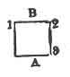

  
[Intangible Textual Heritage](../../index)  [Freemasonry](../index.md) 
[Index](index)  [Previous](dun09.md) 

------------------------------------------------------------------------

[Buy this Book at
Amazon.com](https://www.amazon.com/exec/obidos/ASIN/B0021YV4ZS/internetsacredte.md)

------------------------------------------------------------------------

  
*Duncan's Masoic Ritual and Monitor*, by Malcom C. Duncan, \[1866\], at
Intangible Textual Heritage

------------------------------------------------------------------------

p. 271

# APPENDIX.

NOTE A, page [12](dun02.htm#page_12.md).--In some
Lodges the Tyler takes the sword from the altar.

NOTE B, page [18](dun02.htm#page_18.md).--Some
Masters repeat the words, "O Lord my God," three times.

NOTE C, page [19](dun02.htm#page_19.md)--Masters
differ about the proper manner of placing the three lights around the
altar. In most Lodges they are placed as represented in the engraving,
[page 19](dun02.htm#img_01900.md); but many Masters have them placed thus:

 

\[paragraph continues\] The square
represents the altar; the figures 1, 2, and 3, the lights; the letter A,
the kneeling candidate, and the letter B, the Master.

NOTE D, page [21](dun02.htm#page_21.md).--Some
Masters say: "I now declare this Lodge opened in the Third Degree of
Masonry *for the dispatch of busines*s."

NOTE E, page [39](dun02.htm#page_39.md).--In
spelling this word, "Boaz," always begin with the letter "A," and follow
the alphabet down as the letters occur in the word.

NOTE F, page [42](dun02.htm#page_42.md).--In some
Lodges the reply is: "Try me, and disapprove of me if you can;" in
others, "I am willing to be tried."

NOTE G, page [43](dun02.htm#page_43.md).--Some
say, "In an anteroom adjacent to a Lodge of Entered Apprentice Masons."

NOTE H, page [44](dun02.htm#page_44.md).--Some
say, "Three times around the Lodge."

NOTE I, page [51](dun02.htm#page_51.md).--Some
say, "On the highest hills and lowest valleys."

NOTE J, [p. 89](dun04.htm#page_89.md).--In some
Lodges, the Deacon omits the single rap (•), and opens the door when the
three raps (• • •) are given.

NOTE K, page [205](dun07.htm#page_205.md).--In
most Lodges the candidate does not halt at the Junior Warden's station,
but passes on to the Senior Warden.

NOTE L, page [125](dun04.htm#page_125.md).--Master
says: "I shall now proceed to give and explain to you the several signs
and tokens belonging to the Degree." Here the Master places his hands as
the candidate's

p. 272

were when he took the oath of a Master (see [Fig.
5](dun02.htm#img_01703), page [17](dun02.htm#page_17).md), and explains.
Makes sign of a Master Mason, and explains. (See [Fig.
6](dun02.htm#img_01800), page [18](dun02.htm#page_18)..md) Makes the grand
hailing sign, and explains. (See [Fig. 7](dun02.htm#img_01801.md), page
[18](dun02.htm#page_18)..md) Gives grip of a Master Mason, and explains.
(See [Fig. 16](dun04.htm#img_09700), page [97](dun04.htm#page_97)..md)
Gives strong grip, and explains. (See [Fig. 17](dun04.htm#img_12000.md),
page [120](dun04.htm#page_120)..md)

NOTE M, page [235](dun08.htm#page_235.md).--The
Principal Sojourner should say: "We are of your own brethren and
kin--children of the captivity--descendants of those noble Giblemites,
we were received and acknowledged Most Excellent Masters at the
completion and dedication of the first temple--were present at the
destruction of that temple by Nebuchadnezzar, by whom we were carried
captives to Babylon, where we remained servants to him and his
successors until the reign of Cyrus, King of Persia, by whose order we
have been liberated, and have now come up to help, aid, and assist in
rebuilding the house of the Lord, without the hope of fee or reward."
(See lecture.)

NOTE N, page
[236](dun08.htm#page_236.md).--Instead of saying: "You surely could not
have come thus far unless you were three Most Excellent Masters," etc.,
the Master of the First Veil should say: "Good men and true you must
have been, to have come thus far to promote so noble and good an
undertaking, but further you cannot go without my word, sign, and word
of explanation" (See lecture.)

NOTE O, page [235](dun08.htm#page_235.md).--In
some Chapters they only stamp seven times.

NOTE P, page [140](dun04.htm#page_140.md).--In
some parts of the country the second section of the lecture is continued
as follows:

Q. What followed?

A. They travelled as before; and as those, who had pursued a due
westerly course from the temple, were returning, one (1) of them, being
more weary than the rest, sat down on the brow of a hill to rest and
refresh himself, and on rising up caught hold of a sprig of acacia,
which easily giving way excited his curiosity; and while they were
meditating over this singular circumstance they heard three frightful
exclamations from the cleft of an adjacent rock. The first was the voice
of Jubelo, exclaiming, "Oh! that my throat had been cut from ear to ear,
my tongue torn out by its roots and buried in the sands of the sea at
low water mark, where the tide ebbs and flows twice in twenty-four
hours, ere I had been accessory to the death of so great and good a man
as our Grand Master Hiram Abiff." The second was the voice of Jubela,
exclaiming: "Oh! that my left breast had been torn open, my heart.
plucked from thence and given to the beasts of the field and the birds
of the air as a prey, ere I

p. 273

had been accessory to the death of so great and good a man as our Grand
Master Hiram Abiff." The third was the voice of
[Jubelum](errata.htm#10.md), exclaiming more horridly than the rest, "It
was I that gave him the fatal blow! it was I that slew him! oh! that my
body had been severed in twain, my bowels taken from thence and burnt to
ashes, the ashes scattered before the four (4) winds of heavens, that no
more resemblance might be had, among men or masons, of so vile a wretch
as I am, ere I had been accessory to the death of so great and good a
man as our Grand Master Hiram Abiff." Upon which, they rushed in,
seized, bound, and brought them before King Solomon, who ordered them to
be taken without the gates of the city and executed according to their
imprecations. They were accordingly put to death.

Q. What followed?

A. King Solomon ordered the twelve fellow crafts to go in search of the
body, and if found, to observe whether the master's word, or a key to
it, was on or about it.

Q. Where was the body of our Grand Master Hiram Abiff found?

A. A due westerly course from the temple, on the brow of the hill, where
our weary brother sat down to rest and refresh himself.

Q. Was the master's word, or a key to it, on or about it?

A. It was not.

Q. What followed?

A. King Solomon then ordered them to go with him to endeavor to raise
the body, and ordered that as the master's word was then lost, that the
first sign given at the grave, and the first word spoken after the body
should be raised, should be adopted for the regulation of all Master
Masons' Lodges until future ages should find out the right.

Q. What followed?

A. They returned to the grave, when King Solomon ordered them to take
the body by the entered-apprentice grip and see if it could be raised;
but on taking the body so it was putrid, it having been dead fifteen
days, the skin slipped from the flesh. and it could not be raised.

Q. What followed?

A. King Solomon then ordered them to take it by the fellow-craft grip
and see if it could be so raised; but on taking the body by that grip
the flesh cleft from the bone, and it could not be so raised.

Q. What followed?

A. King Solomon then took it by the strong grip of a Master Mason, or
lion's paw, and raised it on the five (5) points of

p. 274

fellowship, which are foot to foot, knee to knee, breast to breast, hand
to back, cheek to cheek, or mouth to ear. Foot to foot, that we will
never hesitate to go on foot, and out of our way, to assist a suffering
and needy brother; knee to knee, that we will ever remember a brother's
welfare in all our adorations to Deity; breast to breast, that we will
ever keep in our own breasts a brother's secrets, when communicated to
us as such, murder and treason excepted;. hand to back, that we will
ever be ready to stretch forth our hand to aid and support a fallen
brother; cheek to cheek, or mouth to ear, that we will ever whisper good
counsel in the ear of a brother, and in the most tender manner remind
him of his faults, and endeavor to aid his reformation, and will give
him due and timely notice that he may ward off all approaching danger.

Q. What did they do with the body?

A. They carried it to the temple and buried it in due form. And masonic
tradition informs us that there was a marble column erected to his
memory, upon which was delineated a beautiful virgin weeping; before her
lay a book open, in her right hand a sprig of acacia, in her left an
urn, and behind her stood Time with his fingers unfolding the ringlets
of her hair.

Q. What do these hieroglyphical figures denote?

A. The broken column denotes the untimely death of our Grand Master
Hiram Abiff; the beautiful virgin weeping, the temple unfinished; the
book open before her, that his virtues lie on perpetual record; the
sprig of acacia in her right hand, the timely discovery of his body; the
urn in her left, that his ashes were then safely deposited to perpetuate
the remembrance of so distinguished a character; Time unfolding the
ringlets of her hair, that time, patience, and
[perseverance](errata.htm#11.md) accomplish all things.

Q. Have you a sign belonging to this Degree?

A. I have several.

Q. Give me a sign? (Penalty.)

Q. What is that called?

A. The duegard of a Master Mason.

Q. Has that an allusion?

A. It has, to the penalty of my obligation, and when our ancient
brethren returned to the grave of our Grand Master Hiram Abiff, they
found their hands placed in this position to guard their nostrils from
the disagreeable effluvia that arose there from the grave.

Q. Give me a token. (Pass grip.)

Q. What is that called?

A. The pass grip from a fellow craft to a Master Mason.

Q. What is its name?

p. 275

A. Tubal Cain.

Q. Who was Tubal Cain?

A. The first known artificer or cunning worker in metals.

Q. Pass that? (Strong grip.)

Q. What is that?

A. The strong grip of a Master Mason, or lion's paw.

Q. Has it a name?

A. It has.

Q. Give it me?

A. I cannot, nor can it be given except on the five (5) points of
fellowship, and heard then in a low breath.

Q. Advance and give it.

A. The word is right.

Q. How many grand masonic pillars are there?

A. Three.

Q. What are they called?

A. Wisdom, Strength and Beauty.

Q. Why are they so called?

A. Because it is necessary there should be wisdom to contrive, strength
to support, and beauty to adorn, all great and important undertakings.

Q. By whom are they represented?

A. By Solomon, King of Israel, Hiram, King of Tyre, and Hiram Abiff, who
were our first three Most Excellent Grand Masters.

Q. Why are they said to represent them?

A. Solomon, King of Israel, represents the pillars of wisdom, because by
his wisdom he contrived the superb model of excellence that immortalized
his name; Hiram, King of Tyre, represents the pillar of strength,
because he supported King Solomon in this great and important
undertaking; Hiram Abiff represents the pillar of beauty, because by his
cunning workmanship, the temple was beautified and adorned.

Q. What supported the temple?

A. It was supported by 1453 columns and 2906 pilasters, all hewn from
the finest Parian marble.

Q. How many were employed in building the temple?

A. Three Grand Masters, three thousand three hundred masters, or
overseers of the work, eighty thousand fellow crafts in the mountains
and in the quarries, and seventy (70) thousand entered
[apprentices](errata.htm#12.md), or bearers of burdens. All these were
classed and arranged in such a manner by the wisdom of King Solomon,
that neither envy, discord, nor confusion was suffered to interrupt that
universal peace and tranquillity which pervaded the world at this
important period.

p. 276

Q. What is meant by the three steps usually delineated on the Master's
carpet?

A. They are emblematical of the three principal stages of human life,
viz.: youth, manhood, and age, etc., etc. (Monitorial.)

Q. How many classes of Master's emblems are there?

A. Nine.

Q. What is the ninth (9th)?

A. The setting maul, spade, coffin, and sprig of acacia. The setting
maul was that by which our Grand Master Hiram Abiff was slain; the spade
was that which dug his grave; the coffin was that which received his
remains, and the sprig of acacia was that which bloomed at the head of
his grave. These are all striking emblems of morality, and afford
serious reflections to a thinking mind; but they would be still mere
repining were it not for the sprig of acacia that bloomed at the head of
the grave, which serves to remind us of that imperishable part of man
which survives the grave and bears the nearest affinity to the Supreme
Intelligence which pervades all nature, and which can never, never,
never die. Then, finally, my brethren, let us imitate our Grand Master
Hiram Abiff in his virtuous conduct, his unfeigned piety to his God, and
his inflexible fidelity to his trust, that like him we may welcome the
grim tyrant Death, and receive him as a kind messenger, sent by our
Supreme Grand Master to translate us from this imperfect to that all
perfect, glorious, and celestial lodge above, where the Supreme
Architect of the universe presides.

NOTE Q., page
[148](dun04.htm#page_148.md).--(*Extract from the Annual Address of M. W.
P. Al. Tucker, G. M. of Vermont*.)

In my address of last year I endeavored to condense what little
information I had about the Masonic lectures, and that attempt has been,
in general, quite favorably noticed by the Craft. In one distinguished
Masonic quarter, however, some parts of my address on this subject seem
to have met with marked disfavor. One particular thing found fault with
is, that I thought myself justified in saying that the lectures in use,
received through Webb and Gleason, were the *true* lectures of Preston.
I certainly did not mean to say that they were identical in *length*
with those of Preston. I had already said that Webb changed the
arrangement of Preston's sections, but that he had left the body of the
lectures as Preston had established them. Perhaps I should have said,
the *substance* instead of the "*body*" of those lectures. I now state,
what I supposed was well understood before by every tolerably
well-informed Mason in the United States, that Webb *abridged* as well
as *changed the arrangement* 

p. 277

of the lectures of Preston. I believed that I knew *then*, and I believe
I know *now*, that Webb learned and taught the Preston lectures *in
full*, as well as that he prepared and taught his own abridgment of
them. I have a copy in key, both of Webb's abridgment and of Preston in
full, which I have reasons, wholly satisfactory to myself, for believing
are true manuscripts of both those sets of lectures, as Gleason taught
them. But my reviewer has got the "very rare" book of a certain J.
Browne, published in London in 1802, called the "Master Key," containing
the *whole* course of lectures in an "abstruse cypher," and *presumes*
them to be the Prestonian lectures. Reviewers, it seems, tolerate
"presumption" in themselves, while nothing short of demonstration is
allowable with them as to others, who are required to speak from "their
own knowledge." I am ready to compare my copy of the Preston lectures in
*full* with J. Browne's "*Master Key*," if my reviewer understands
Browne's "abstruse cypher,"--a fact about which he has not yet informed
us. Again, I am criticized for saying that Gleason visited England and
exemplified the Preston lectures, as he had received them from Webb,
before the Grand Lodge of England, whose authorities pronounced them
correct, and I am charged with taking this from "hearsay," and my critic
places "no faith in it." I received that statement from the *highest*
authority--from one who *knew*--and I wrote it down at the time. There
are existing reasons why I do not choose to gratify my critic by naming
that authority at this time, and I leave the Craft to judge whether my
*statement* of that fact, upon undoubted authority, is not worthy of as
much credit as *any* reviewer's *doubt* about it. I do not possess
anything in writing or published of Gleason's, as to his lecturing
before the *Grand Lodge* of England, but that Masonry abroad did not
ignore the lectures, as Gleason taught them, we have his own published
letter to prove. In the 2d edition of the Masonic Trestleboard, under
the date of Nov. 26th, 1843, in a letter from him to Brother Charles W.
Moore, I find the following language:

"It was my privilege, while at Brown University,
Providence, R. I., (1801-2), to acquire a complete knowledge of the
lectures in the *three* first degrees of Masonry, *directly* from our
much esteemed Brother T. S. Webb. author of the Free Mason's Monitor;
and, in consequence, was appointed and commissioned by the Grand Lodge
of Massachusetts and Maine, Grand Lecturer, devoting the whole time to
the instruction of the Lodges under the jurisdiction.--and, for many
years subsequently (as Professor of Astronomy and Geography), visiting
all the different States in the Union, and (1829-30) many parts of
Europe--successfully communicating, to numerous Lodges and Associations
of Brethren, the same 'valuable lectures of the Craft,' according to the
ancient landmarks."

Here, then, we have the assertion of Gleason himself, that the

p. 278

lectures he received from Webb were, "in many parts of Europe," as well
as in the States at home, communicated by him to "numerous Lodges and
Associations of Brethren, according to the ancient landmarks," without
the slightest hint or intimation of any objection being made to them
abroad, as not being the true lectures of the Order. This is, at least,
*prima facie* evidence of their having been substantially what I claimed
them to be. But if I am still told that it carries no conclusive
evidence that Brother Gleason knew anything of the true Preston
lectures, I call that brother upon the stand again. On the 24th day of
June, 1812, "Brother Benjamin Gleason, A. M.," delivered an "Oration" at
"Montreal, Lower Canada," before St. Paul's Lodge No. 12, and Union
Lodge No. 8, by "special request" of the former Lodge. It was published
at Montreal, and a second edition of it was soon after published at
Boston. I copy from this second edition the following remarks of Brother
Gleason:

"On the subject of our Lectures, we notice with
pleasure, this day, the venerable Preston of England, whose
'Illustrations of Masonry' redound to the honor of the Craft, and whose
*estimable system of improvements*, while with precision and certainty
they define, with purity and eloquence, aggrandize, the immovable
*landmarks* of our ancient Society."

Brother Gleason then, *did*, upon his own statement, understand
Preston's "estimable system of improvements," their "precision and
certainty," their "purity and elegance," and their relation to our
"immovable landmarks." And with these and Webb's teachings fully in his
mind, was probably as good a judge as any modern critic, of the
relations they bore to each other. Can any reasonable man, in this state
of things, believe that if they had *conflicted* with each other he did
not know it, or that, if conflicting, he would have taught *both*; or
that he could have taught either "in Europe" without objection, had they
not been substantially the *same* teachings, differing only in their
*length*?

But my critic says:--"It is wrong to talk in this careless strain of the
Prestonian lectures as existing in the United States, while in all
probability they never did, and most certainly never will. It is time to
quit writing Masonic history in this loose and random style."

It is no part of my purpose to *convince* my reviewer that the
"Prestonian lectures" exist in the United States, or to *persuade* him,
that (though confessedly a strong Masonic writer), he does not quite
embody in his learning *all* the Masonry of this Western continent. His
liberality might perhaps concede that, *among* all who have made Masonry
a study, or with their *united* investigations, enough of Masonic
learning *might* have been preserved to

p. 279

make itself respected at least as against simple negation. But I do not
write to *convince* or satisfy *him*. I do so that the Craft may have an
opportunity to understand something of their own affairs, as they exist;
to examine and investigate them as matters of fact and principle; and
that they may have no apology for "pinning their faith" upon the mere
negations of any writer, whatever may be the strength of his masonic
reputation. In an account of the Installation of Mount Lebanon Lodge at
Boston, on the 29th of December, 1858, Brother Charles W. Moore, Editor
of the *Freemasons' Monthly Magazine*, has the following remarks: "Among
the Past Masters of this Lodge we notice the name of the late Benjamin
Gleason, Esq., who was the associate and co-laborer of the late Thomas
Smith Webb, in introducing into the Lodges of New England, and
subsequently into other sections of the country, what is known as the
Prestonian system of work and lectures. The labor of promulgating the
work mainly devolved on Brother Gleason, and it is not too much to say,
that as an accurate, consistent, and intelligent teacher, he had no
superior, if an equal, in this country. He was a thoroughly educated
man, and he understood the literary as well as the mental requirements
necessary to a faithful and creditable discharge of the important duty
he had assumed. In 1804, the Grand Lodge of Massachusetts adopted the
Preston ritual as its standard of work, and employed Brother Gleason to
communicate it to the Lodges under its jurisdiction, then including what
is now the State of Maine. In the performance of this duty, he was
exclusively employed during the whole of the year named, on account of
the Grand Lodge; and we think a large part of the following two or three
years, on his own private account. Indeed he never ceased his labors, as
a lecturer, until his death in 1847, and there are many brethren now
living--among them myself--who will ever take pride in remembering and
acknowledging him as their master and teacher, in the purest and most
perfect Masonic ritual of ancient Craft Masonry ever practised in this
country. It was the 'work' of Masonry, as revived by Preston, and
approved and sanctioned by the Grand Lodge of England, near the close of
the last century, and practised by authority of that body, until the
'union' in 1813, when, for the purpose of reconciliation, it was
subjugated to a revision, which, in some respects, proved to be an
unfortunate one, inasmuch as the revised system, though exceedingly
beautiful, has so many incongruities and departures from the original,
and is so elaborate withal, that it has never met with that cordial
approval, even among our English brethren, which is necessary to its
recognition and acceptance as a universal system. The verbal

p. 280

ritual, as revised by Preston, was brought to this country about the
year 1803--not by Webb, as we have seen it stated, for he never went
abroad--but by two English brethren, one of whom, we think, had been a
pupil of Preston, and both of whom had been members of one of the
principal Lodges of Instruction in London. It was first communicated to
Webb, and by him imparted to Gleason, who was at the time a student in
Brown University, at Providence, and being an intelligent and zealous
brother, became a favorite of Webb, who was his senior both in years and
in Masonry. On being submitted to the Grand Lodge of this Commonwealth
it was approved and adopted, and Brother Gleason was employed to impart
it to the Lodges, as before stated. From that time to the present it has
been the only recognized Masonic work of Massachusetts, and though we
are not unmindful that many unwarrantable liberties have been taken with
it, and that innovations have crept in, which would have been better
out--yet, as a whole, we are happy to know that it has been preserved in
the Lodges of this city--and in view of the recent instructions, by
authority of the Grand Lodge, we may add, the Lodges of this
Commonwealth--in a remarkable degree of purity; and that it is still
taught in the Lodge of which, in 1809, Brother Gleason was Master, with
so close a resemblance to the original, that if it were possible for him
to be present at the conferring of the degrees to-day, he would find
very little to object to in the work of his successors. The system
underwent some modifications (which were doubtless improvements) in its
general arrangement and adaptation--its mechanism--soon after its
introduction into this country; but in all other respects it was
received, and has been preserved, especially in the Lodges of the older
jurisdictions, essentially, as it came from the original source of all
our Craft Masonry. In many parts of the country it has hitherto had to
contend against the corrupting influences of ignorant itinerant
lecturers and spurious publications; but it is believed that an
effectual check has been put to this class of dangerous evils, and that
they will hereafter be treated as they deserve. If so. we may reasonably
hope to be able to pre-serve the ritual, and transmit it to our
successors, in something like its original purity, but not otherwise."
We have, then, added to Gleason's own assertion as to his knowledge of
Preston's "estimable system of improvements," the statement of one of
the most intelligent and reliable Masons in this country, that Webb had
"the Prestonian system of work and lectures," and that the labor of
promulgating them "mainly devolved on Brother Gleason." And I wholly
content to let that evidence stand as my authority and justification
against the remarks of

p. 281

a reviewer who accuses me of "talking in a careless strain" when I
maintain that these lectures exist in the United States.

Our Grand Lecturer has compared, with critical care, my copy of the
Preston with that of the Gleason Lectures. I have not had sufficient
leisure since the former has been in my possession, to compare them, as
fully as I design to do hereafter. The Preston Lectures are very
lengthy, and if written out in full the Grand Lecturer thinks they would
cover nearly one hundred pages of foolscap paper. He thinks them wholly
too long for ordinary use, and that if all Masons were required to
commit them *in extenso*, it would be a task which very few would
successfully accomplish; and so far as my own examination has gone, I
entertain the same opinion. The Grand Lecturer also entertains the
opinion that Webb has preserved, in the abridgment and new arrangement
of them, all that was substantially of practical value, and that the
language used by him is preferable to much that was used by Preston.

I regret to say that in the criticism of which I have spoken, there
appears a most palpable intention to undervalue *all* the lectures of
Masonry. The believers in the importance of preserving the lectures
intact are sneered at; called "parrot Masons," who, taken off the
"beaten path," know "nothing at all of Masonry, of its history, its
philosophy, or its symbolism." And we are dismissed with the cool
remark--"Let us talk more, therefore, of the philosophy of Masonry, and
something less of the Lectures of Webb," and as opposed to the idea of
the importance of the Lectures, we are called on, "in Heaven's name, to
inaugurate a new era."

This is, at least, sufficiently cool for a teacher of Freemasonry.

"Inaugurate a *new* era." That is the idea precisely. Some of us
ignorant Masons had supposed that, at least, some portion of our Masonic
"history, philosophy, and symbolism," was *suggested* in our Lectures.
Our "history"--written and unwritten--the "philosophy" of our system,
and something of our "symbolism," were imagined to be secure in the
past. But a "new era." About what? Can our "*history*" be changed; can
our "*philosophy*" be changed? Not a million of critics, however
distinguished, can brush the first particle of consecrated dust from
either. "There they stand, and there they will stand forever--unshaken
by the tests of human scrutiny, of talents and of time."
