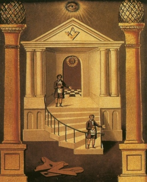

  
[Intangible Textual Heritage](../../index)  [Freemasonry](../index.md) 

------------------------------------------------------------------------

[Buy this Book at
Amazon.com](https://www.amazon.com/exec/obidos/ASIN/B0021YV4ZS/internetsacredte.md)

------------------------------------------------------------------------

<table width="75%">
<colgroup>
<col style="width: 50%" />
<col style="width: 50%" />
</colgroup>
<tbody>
<tr class="odd">
<td width="50%" data-valign="TOP"></td>
<td width="50%" data-valign="CENTER"><h1 id="duncans-masonic-ritual-and-monitor" data-align="CENTER">Duncan's Masonic Ritual and Monitor</h1>
<h2 id="by-malcolm-c.-duncan" data-align="CENTER">by Malcolm C. Duncan</h2>
<h4 id="section" data-align="CENTER">[1866]</h4></td>
</tr>
</tbody>
</table>

------------------------------------------------------------------------

[Contents](#contents)    [Start Reading](dun00.md)    [Page
Index](pageidx)    [Text \[Zipped\]](dun.txt.gz.md)

------------------------------------------------------------------------

|                                                                                                                           |
|---------------------------------------------------------------------------------------------------------------------------|
|  |

This book presents details of Masonic initiation rituals, along with
grips, passwords and regalia. Written in the 19th century, Duncan's
Ritual, as it is known, has been republished numerous times. It includes
the three basic degrees of the Ancient York Rite, and four additional
advanced degrees. There are over a hundred illustrations, all reproduced
here, which show important details of the rituals, including gestures
and symbolic pictures. Duncan's Ritual is careful to note known
variations where they exist. This book will be of interest to beginning
Masons who want a roadmap of the craft, as well as experienced Masons
who need a review.

------------------------------------------------------------------------

[Title Page](dun00.md)  
[Preface](dun01.md)  
[Entered Apprentice, or First Degrees](dun02.md)  
[Fellow Craft, or Second Degree](dun03.md)  
[Master Mason, or Third Degree](dun04.md)  
[Mark Master, or Fourth Degree](dun05.md)  
[Past Master, or Fifth Degree](dun06.md)  
[Most Excellent Master, or Sixth Degree](dun07.md)  
[Royal Arch, or Seventh Degree](dun08.md)  
[Extracts from a Dictionary of Masonry](dun09.md)  
[Appendix](dun10.md)  
