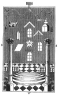

  
[Intangible Textual Heritage](../../index)  [Freemasonry](../index.md) 
[Index](index)  [Previous](gar01)  [Next](gar03.md) 

------------------------------------------------------------------------

[Buy this Book at
Amazon.com](https://www.amazon.com/exec/obidos/ASIN/B002AMUDMG/internetsacredte.md)

------------------------------------------------------------------------

  
*General Ahiman Rezon*, by Daniel Sickels, \[1868\], at Intangible
Textual Heritage

------------------------------------------------------------------------

p. 7

 
[  
Click to enlarge](img/front.jpg.md)  
Frontispiece  

### EXPLANATION OF THE FRONTISPIECE.

THE Tracing-Board, or Floor-Cloth of an Entered Apprentice, here
described, is a copy of a reproduction of Bro. GEORGE OLIVER, D. D., in
his *Historical Landmarks of Freemasonry*, as follows " This was used in
the early part of the last century. It varies considerably from our
improved system, although we observe with pleasure, that it contains the
Ancient Landmarks of the Order. It is an oblong square, between the
cardinal points; the Master is placed in the East, with en altar before
him, and the Wardens both in the West, as was the custom in many of our
Lodges up to the time of the union in 1813. The three lights are placed
in the N. E., S. E., and S. W. The two pillars, J. and B., are in the
West, inscribed 'Strength and Wisdom,' and are both of the Corinthian
Order; while the center of the Tracing-Board is occupied by a Blazing
Star of five points, inclosing the letter G, and inscribed Beauty.
Between the two pillars ascending from the west, are seven steps upon a
Mosaic Pavement; but the Tesselated Border, or Indented Tessel, as it
was called, is omitted. In the East, West, and South, are portrayed
three windows. The W. Master's Tracing-Board is near the Blazing Star,
while the corresponding Immovable Jewels are considerably higher up
toward the East—the one called the Brute Stone, [\*](#fn_0.md) the other the pointed Cubical Stone. [†](#fn_1.md) In the apex of the latter, an ax is
inserted. The East is distinguished by a square, the South by a level,
and the North by a plumb-rule, or perpendicular. The whole is surmounted
by a cable-tow, or towline, as then called, with a tassel at each end."

------------------------------------------------------------------------

### Footnotes

[7:\*](gar02.htm#fr_0.md) This was also called the
Broached Thurnel, one of the original immovable Jewels, (according to
the English system,) and was used as symbol for the Entered Apprentice
to learn to work upon. It was subsequently called the Brute Stone, or
Rough Ashlar.

[7:†](gar02.htm#fr_1.md) Now better known as the
Perfect Ashlar.

------------------------------------------------------------------------

[Next: Preface](gar03.md)
