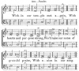
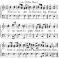

  
[Intangible Textual Heritage](../../index)  [Freemasonry](../index) 
[Index](index)  [Previous](gar10)  [Next](gar12) 

------------------------------------------------------------------------

[Buy this Book at
Amazon.com](https://www.amazon.com/exec/obidos/ASIN/B002AMUDMG/internetsacredte)

------------------------------------------------------------------------

  
*General Ahiman Rezon*, by Daniel Sickels, \[1868\], at Intangible
Textual Heritage

------------------------------------------------------------------------

p. 21

### OPENING AND CLOSING THE LODGE.

IN all regular assemblies of men who are convened for wise and useful
purposes, the commencement and conclusion of business are accompanied
with some form. In every country in the world the practice prevails, and
is deemed essential. From the most remote periods of antiquity, it may
be traced, and the refined improvements of modern times have not totally
abolished it.

Ceremonies, when simply considered, it is true, are little more than
visionary delusions; but their effects are sometimes important. When
they impress awe and reverence on the mind, and engage the attention by
external attraction to solemn rites, they are interesting objects. These
purposes are effected by judicious ceremonies, when regularly conducted
and properly arranged. On this ground, they have received the sanction
of the wisest men in all ages, and consequently could not escape the
notice of Masons. To begin well, is the most likely means to end well;
and it has been properly remarked, that when order and method are
neglected at the beginning, they will be seldom found to take place at
the end.

The ceremonies of OPENING and CLOSING a Lodge with solemnity and decorum
is, therefore, universally admitted among Masons, and which differ in
each of the degrees; but differ so slightly as not to affect their
general character. They must, therefore, be considered in reference to
the several purposes which they are designed to accomplish.

To conduct these ceremonies with propriety, ought to be the peculiar
study of every Mason, especially of those who have the honor to rule in
our assemblies. To persons who are dignified, every eye is naturally
directed for propriety of conduct and behavior; and from them other
brethren, who

p. 22

are less informed, will naturally expect to derive an example worthy of
imitation. From a share in these ceremonies no Mason can be exempted.
This is the first request of the Master, and the prelude to all
business. No sooner has it been signified that the Lodge is about to be
opened, than every officer repairs to his station, and the intent of the
meeting becomes the sole object of attention.

A Lodge must always be opened on the Third Degree, and in due form, for
the transaction of any business, except that of initiating or passing a
candidate into the mysteries of the first and second degrees. The first
business after opening, if it be a *regular* communication, is the
reading of the minutes of the preceding communication, for the
information of the brethren. The minutes of the proceedings of the
evening should, also, always be read before the Lodge is closed, that
the brethren may know that they have been properly recorded, and then
duly approved.

The Lodge should always be opened and closed with prayer.

### PRAYER,

#### TO BE USED AT OPENING.

MOST holy and glorious Lord God, the Great Architect of the Universe,
the Giver of all good gifts and graces! Thou hast promised that, "where
two or three are gathered together in thy name, thou wilt be in their
midst, and bless them." In thy name we have assembled, and in thy name
we desire to proceed in all our doings. Grant that the sublime
principles of Freemasonry may so subdue every discordant

p. 23

passion within us—so harmonize and enrich our hearts with thine own love
and goodness—that the Lodge at this time may humbly reflect that order
and beauty which reign for ever before thy throne.—Amen.

*Response by the brethren*.—So mote it be.

### ANOTHER PRAYER,

#### WHICH MAY BE USED AT OPENING.

GREAT Architect of the Universe! in thy name we have assembled, and in
thy name we desire to proceed in all our doings. Grant that the sublime
principles of Freemasonry may so subdue every discordant passion within
us—so harmonize and enrich our hearts with thine own love and
goodness—that the Lodge at this time may reflect that order and beauty
which reigns for ever before thy throne.—Amen.

*Response*.—So mote it be.

In addition to the Prayer, the following CHARGE may be given:

The ways of virtue are beautiful. Knowledge is attained by degrees.
Wisdom dwells with contemplation; there we must seek her. Let us then,
brethren, apply ourselves with becoming

p. 24

zeal to the practice of the excellent principles inculcated by our
Order. Let us ever remember that the great objects of our association
are, the restraint of improper desires and passions, the cultivation of
an active benevolence, and the promotion of a correct knowledge of the
duties we owe to God, our neighbor, and ourselves. Let us be united, and
practice with assiduity the sacred tenets of our Order. Let all private
animosities, if any unhappily exist, give place to affection and
brotherly love. It is useless parade to talk of the subjection of
irregular passions within the walls of the Lodge, if we permit them to
triumph in our intercourse with each other. Uniting in the grand design,
let us be happy ourselves, and endeavor to promote the happiness of
others. Let us cultivate the great moral virtues which are laid down on
our Masonic Trestle-board, and improve in every thing that is good,
amiable, and useful. Let the benign Genius of the Mystic Art preside
over our councils, and under her sway let us act with a dignity becoming
the high moral character of our venerable institution.

Or the following ODE may be sung:

p. 25

 
[  
Click to enlarge](img/02500.jpg)  
AIR—*Dundee*.  

Within our temple met again,  
  With hearts and purpose strong,  
We'll raise our notes of grateful praise,  
  With union in our song.

Around our altar's sacred shrine  
  May Love's pure incense rise,  
Bearing upon its mystic flame  
  Our music to the skies!

### PRAYER,

#### TO BE USED AT CLOSING.

SUPREME Architect of the Universe, accept our humble thanks for the many
mercies and blessings which thy bounty has conferred on us, and
especially for this friendly and social intercourse.

p. 26

\[paragraph continues\] Pardon, we beseech
thee, whatever thou hast seen amiss in us since we have been together;
and continue to us thy presence, protection, and blessing. Make us
sensible of the renewed obligations we are under to love thee, and as we
are about to separate, and return to our respective places of abode,
wilt thou be pleased so to influence our hearts and minds, that we may
each one of us practice, out of the Lodge, those great moral duties
which are inculcated in it, and with reverence study and obey the laws
which thou hast given us in thy Holy Word.—Amen.

*Response*.—So mote it be.

### CHARGE,

#### TO BE USED AT CLOSING.

BRETHREN: You are now to quit this sacred retreat of friendship and
virtue, to mix again with the world. Amidst its concerns and
employments, forget not the duties you have heard so frequently
inculcated and forcibly recommended in this Lodge. Be diligent, prudent,
temperate, discreet. Remember that around this altar you have promised
to befriend and relieve every

p. 27

brother who shall need your assistance. Remember that you have promised
to remind him, in the most tender manner, of his failings, and aid his
reformation; to vindicate his character, when wrongfully traduced;
suggest, in his behalf, the most candid and favorable circumstances. Is
he justly reprehended? Let the world observe how Masons love one
another.

These generous principles are to extend further. Every human being has a
claim upon your kind offices. Do good unto all. Recommend it more
especially to the household of the faithful.

By diligence in the duties of your respective callings; by liberal
benevolence and diffusive charity; by constancy and fidelity in your
friendships, discover the beneficial and happy effects of this ancient
and honorable institution. Let it not be supposed that you have here
labored in vain, and spent your strength for naught; for your work is
with the LORD and your recompense with your GOD.

Finally, brethren, be ye all of one mind; live in peace, and may the God
of love and peace delight to dwell with and bless you!

p. 28

The following ODE may be sung at closing:

 
[  
Click to enlarge](img/02800.jpg)  
AIR—*Sicilian Hymn*.  

Now our social labors closing,  
  Homage of the heart we pay;  
Each in confidence reposing,  
  Kindest thoughts that ne’er decay.

Let us each, in Time's commotion,  
  Heav’nly light and truth implore:  
Thus we'll pass life's stormy ocean,  
  Landing on a happier shore.

### CLOSING BENEDICTION.

MAY the blessing of Heaven rest upon us and all regular Masons! May
brotherly love prevail, and every moral and social virtue cement
us!—Amen.         *Res*.—So mote it be.

------------------------------------------------------------------------

[Next: Illustrations](gar12)
