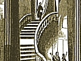
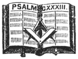

  
[Intangible Textual Heritage](../../index)  [Freemasonry](../index.md) 
[Index](index)  [Previous](gar17)  [Next](gar19.md) 

------------------------------------------------------------------------

[Buy this Book at
Amazon.com](https://www.amazon.com/exec/obidos/ASIN/B002AMUDMG/internetsacredte.md)

------------------------------------------------------------------------

  
*General Ahiman Rezon*, by Daniel Sickels, \[1868\], at Intangible
Textual Heritage

------------------------------------------------------------------------

p. 64

### THE RITE OF ILLUMINATION.

THE RITE OF ILLUMINATION is a very ancient ceremony, and constituted an
important feature in all the mysteries of the early ages. In the
Egyptian, Cabirian, Sidonian, Eleusinian, Scandinavian, and Druidical
Rituals, it held a prominent place, and in them all represented the same
ideas. It marked the termination of the mystic pilgrimage through gloom
and night, and was emblematical of that moral and intellectual light
which pours its divine radiance on the mind after it has conquered
prejudice, and passion, and ignorance, with which it has so long been
struggling.

The prevailing notion of all those Rites was, that man, society,
humanity could arrive at the Perfect only by the ministry of gloom and
suffering; that the soul's exaltation and highest enlightenment could be
approached only by the dark way of tears and sacrifice. The Rite of
Illumination indicates the triumphant conclusion of man's conflicts,
sacrifices, and trials; announces that he has found that LIGHT for which
he has so persistently sought—that Truth which alone can give dignity to
his life, freedom to his spirit, and repose to his soul, and which is
the grand recompense for all his journeyings, labors, and combats.

The particular act which now distinguishes this illumination is,
comparatively, modern, but is, nevertheless, deeply significant and
instructive. It refers to that point of time when "God said, 'Let there
be light,' and there was light." The loftiest imagination is utterly
powerless to paint a picture of the unspeakable glory of the scene, when
the sun, for the first time, poured down his light in a golden deluge on
the earth, hitherto a chaotic mass, plunged in eternal night!—when
ocean, lake, and river, hill and valley, smiled and sparkled in the
new-born splendor! Yet this Rite does not commemorate that event simply
as an historical, material fact, but rather because it symbolizes the
release of the soul from darkness, and ignorance, and sin—from the chaos
and confusion of a sensual and selfish life—and its establishment in the
light and glory of virtue and knowledge.

The emblems peculiar to this Rite are the Bible, Square, and Compasses,
the Burning Triangle, or the three lighted Tapers illuminating the
altar. These all have exclusive reference to the leading idea of the
ceremony, viz: *the release, from moral, spiritual, and intellectual
darkness*. Hence the first three of these emblems are called the Great
Lights of Masonry, and the latter the Lesser Lights.

p. 65

"Through Night to Light! and though, to mortal
eyes,  
   Creation's face a pall of horror wear,  
 Good cheer! good cheer! the *gloom of midnight flies*,  
   And then a sunrise follows, mild and fair."

These lines of the great German beautifully and forcibly illustrate the
sublime thought which underlies and shines through this Rite. We cannot,
of course, enter into any particular descriptions of it, or give any
special details thereof, but the above suggestions are all that the
intelligent brother will need to assist him to a thorough comprehension
of the whole.

—"*isasin* *oi ntemueménoi*."—"*The initiated know what is meant*."

 

The three \* \* \* \*  \* \* \* \* \* \* \* are the Holy Bible, Square,
and Compasses.

The Holy Bible is given us as the rule and guide of our faith and
practice; the Square, to square our actions; and the Compasses, to
circumscribe our desires, and keep our passions in due bounds with all
mankind, especially with the brethren.

The *Holy Writings*, that great light in Masonry, will guide us to all
truth; it will direct our paths to the temple of happiness, and point
out to us the whole duty of man.

The *Square* teaches us to regulate our actions by rule and line, and to
harmonize our conduct by the principles of morality and virtue.

The *Compasses* teach us to limit our desires in every station, that,
rising to eminence by merit, we may live respected and die regretted.

p. 66

The three \* \* \* \* \* \*  \* \* \* \* \* \* are the Sun, Moon, and
Master.

\*       \*       \*       \*       \*       \*       \*

The MASTER represents the sun at its rising, that he may open his Lodge,
and employ and instruct the brethren in Masonry; to whom it is his duty
to communicate light, forcibly impressing upon their minds the dignity
and high importance of Freemasonry, and zealously admonishing them never
to disgrace it.

The Senior Warden represents the sun at its setting, and his duty is not
only to assist the Master, but to look after certain properties of the
Lodge, to see that harmony prevails, and that the brethren have their
just dues before being dismissed from their labors.

The Junior Warden represents the sun at meridian, which is the most
beautiful part of the day, and his duty is to call the brethren from
labor to refreshment, and see that the means thereof are not perverted
by intemperance or excess, but so regulated that pleasure and profit may
be shared by all.

That ancient and spotless ensign of Masonry, the LAMBSKIN, or WHITE
APRON, [\*](#fn_6.md) is presented in behalf of the
Lodge and the Fraternity in general.

It is an emblem of innocence, and the badge of a Mason; more ancient
than the Golden Fleece [†](#fn_7.md) or Roman
Eagle; [‡](#fn_8.md) more honorable than

p. 67

the Star and Garter, [\*](gar19.htm#fn_9.md) or any
other Order that can be conferred upon the candidate at the time of his
initiation, or at any future period, by king, prince, potentate, or any
other person, except he be a Mason \* \* \* \* \*. It is hoped you will
wear it with pleasure to yourself and honor to the Fraternity.

The investiture of the candidate with the apron, among the primitive
Masons, formed an essential part of the ceremony of initiation, and was
attended with rites equally significant and impressive. This badge
received a characteristic distinction from its peculiar color and
material. With the Essenian Masons, it was accomplished by a process
bearing a similar tendency, and accompanied by illustrations not less
imposing and satisfactory to the newly-initiated neophyte. He was
clothed in a long white robe, which reached to the ground, bordered with
a fringe of blue ribbon, to incite personal holiness, and fastened
tightly round the waist with a girdle, to separate the upper from the
lower parts of the body. With feet bare and head uncovered, the
candidate was considered a personification of Modesty and Humility,
walking in the fear of God.

In the course of this section is exhibited a beautiful and impressive
illustration of one of the grand principles of the institution, and
concludes with a moral application.

------------------------------------------------------------------------

### Footnotes

[66:\*](gar18.htm#fr_6.md) An Entered Apprentice's
Apron should be a pure white lambskin, from fourteen to sixteen inches
wide, and from twelve to fourteen inches deep, with a fall about five
inches deep; square at the bottom, with sharp angular corners, and
without device or ornament of any kind.

[66:†](gar18.htm#fr_7.md) The Order of the Golden
Fleece has ever been ranked among the most illustrious and distinguished
Orders of Knighthood in Europe. It was instituted on the 10th of
January, 1429, at Bruges, by PHILIP III. Duke of Burgundy, the most
puissant prince of his age, on the occasion of his marriage with
ISABELLA, daughter of King JOHN I. of Portugal.

[66:‡](gar18.htm#fr_8.md) There is no such Order as
the Knights of the Roman Eagle. The expression (which is an unhappy one)
probably refers to the fact that the Eagle was the standard of the
ancient Roman empire.

------------------------------------------------------------------------

[Next: Charity the Chief Social Value](gar19.md)
