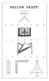
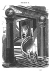
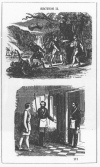
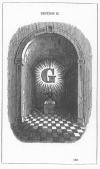

  
[Intangible Textual Heritage](../../index)  [Freemasonry](../index.md) 
[Index](index)  [Previous](gar34)  [Next](gar36.md) 

------------------------------------------------------------------------

[Buy this Book at
Amazon.com](https://www.amazon.com/exec/obidos/ASIN/B002AMUDMG/internetsacredte.md)

------------------------------------------------------------------------

  
*General Ahiman Rezon*, by Daniel Sickels, \[1868\], at Intangible
Textual Heritage

------------------------------------------------------------------------

p. 103

### SECOND DEGREE.

### FELLOW-CRAFT.

p. 104

"The Second, or Fellow-Craft's Degree is rendered interesting by those
scientific instructions and philosophical lectures which characterize
latter parts of the mysteries; though both of these Degrees were made to
tend to the glory of that God who had given such wonderful faculties to
them, and to the welfare of their fellow creatures."—ARCHDEACON MANT.

p. 105 p. 106

  [  
Click to enlarge](img/10300.jpg.md)

p. 107

  [  
Click to enlarge](img/10700.jpg.md)

p. 108 p. 109

  [  
Click to enlarge](img/10900.jpg.md)

p. 110 p. 111

  [  
Click to enlarge](img/11100.jpg.md)

p. 112 p. 113

  [  
Click to enlarge](img/11300.jpg.md)

------------------------------------------------------------------------

[Next: Symbolism of the Degree](gar36.md)
