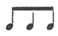

  
[Intangible Textual Heritage](../../index)  [Freemasonry](../index.md) 
[Index](index)  [Previous](gar45)  [Next](gar47.md) 

------------------------------------------------------------------------

[Buy this Book at
Amazon.com](https://www.amazon.com/exec/obidos/ASIN/B002AMUDMG/internetsacredte.md)

------------------------------------------------------------------------

  
*General Ahiman Rezon*, by Daniel Sickels, \[1868\], at Intangible
Textual Heritage

------------------------------------------------------------------------

#### An Emblem of PLENTY is introduced and explained. [†](#fn_26.md)

\*       \*       \*       \*       \*       \*       \*

p. 155

CORN.            WINE.             OIL.

\*       \*       \*       \*       \*       \*       \*

#### THE MORAL ADVANTAGES OF GEOMETRY.

Geometry, the first and noblest of sciences, is the basis on which the
superstructure of Freemasonry is erected. By Geometry, we may curiously
trace Nature through her various windings, to her most concealed
recesses. By it, we discover the power, wisdom, and goodness of the
GRAND ARTIFICER of the universe, and view with delight the proportions
which connect this vast machine. By it, we discover how the planets move
in their respective orbits, and demonstrate their various revolutions.
By it, we account for the return of the seasons, and the variety of
scenes which each season displays to the discerning eye. Numberless
worlds are around us, all framed by the same Divine Artist, which roll
through the vast expanse, and are all conducted by the same unerring law
of Nature.

A survey of Nature, and the observation of her

p. 156

beautiful proportions, first determined man to imitate the divine plan,
and study symmetry and order. This gave rise to societies, and birth to
every useful art. The architect began to design; and the plans which he
laid down, being improved by time and experience, have produced works
which are the admiration of every age.

The lapse of time, the ruthless hand of ignorance, and the devastations
of war, have laid waste and destroyed many valuable monuments of
antiquity, on which the utmost exertions of human genius have been
employed. Even the *Temple of Solomon*, so spacious and magnificent, and
constructed by so many celebrated artists, escaped not the unsparing
ravages of barbarous force. Freemasonry, notwithstanding, has still
survived. The *Attentive Ear* receives the sound from the *Instructive
Tongue*, and the mysteries of Masonry are safely lodged in the
repository of *Faithful Breasts*. Tools and implements of architecture
and symbolic emblems, most expressive are selected by the Fraternity, to
imprint on the mind wise and serious truths; and thus, through a
succession of ages, are transmitted unimpaired the most excellent tenets
of our institution.

p. 157

 

The lecture closes by paying profound homage to the sacred name of the
Grand Geometrician of the Universe, before whom all Masons, from the
youngest E. A., who stands in the north-east corner of the Lodge, to the
W. M., who presides in the East, humbly, reverently, and devoutly bow.

------------------------------------------------------------------------

### Footnotes

[154:\*](gar45.htm#fr_25.md) Astronomy stands
confessedly the most exalted and sublime science that has ever been
cultivated by man. By this divine science, the Grand Architect of the
Universe leas enabled the mind of man, not only to view his wonderful
omnipotency in a much stronger light than he could otherwise effect, but
also to demonstrate, even to the skeptic, if any such exist, that
nothing less than the Almighty power could establish such innumerable
systems of the heavenly bodies, and place them at their relative
distances, and finally keep the whole in universal order. To view the
starry firmament without this science, mankind are impressed with a
reverential awe of heavenly wisdom; but when we explore the science with
its demonstrative truths, we are lost in astonishment at the boundless
fields of ether, where those vast systems are placed. In short, it is by
the help of this sublime science that mankind are enabled to plough the
trackless ocean—to traverse the sandy waste of the immense desert; by
commerce to civilize rude and savage nations—to unite men of all
countries, sects, and opinions—and conciliate true friendship among
persons who would otherwise have remained at an immense distance
asunder.

[154:†](gar46.htm#fr_26.md) The passages of
Scripture which are referred to in this part of the section will be
found in JUDGES xii. 1-6. The Vulgate version gives a paraphrastic p. 155 translation of a part of the sixth verse, as
follows: "Say, therefore, Shibboleth, which, being interpreted, is an
*ear of corn*." The same word also in Hebrew signifies a rapid stream of
water, from the root *SHaBaL*, to flow copiously. The too common error
of speaking, in this part of the ritual, of a "*water-ford*," instead of
a "*water-fall*," which is the correct word, must be carefully avoided.
A *water-fall* is an emblem of plenty, because it indicates an abundance
of water. A *water-ford*, for the converse reason, is, if any symbol at
all, a symbol of scarcity.—MACKEY's *Manual of the Lodge*.

------------------------------------------------------------------------

[Next: Charge to the Candidate](gar47.md)
